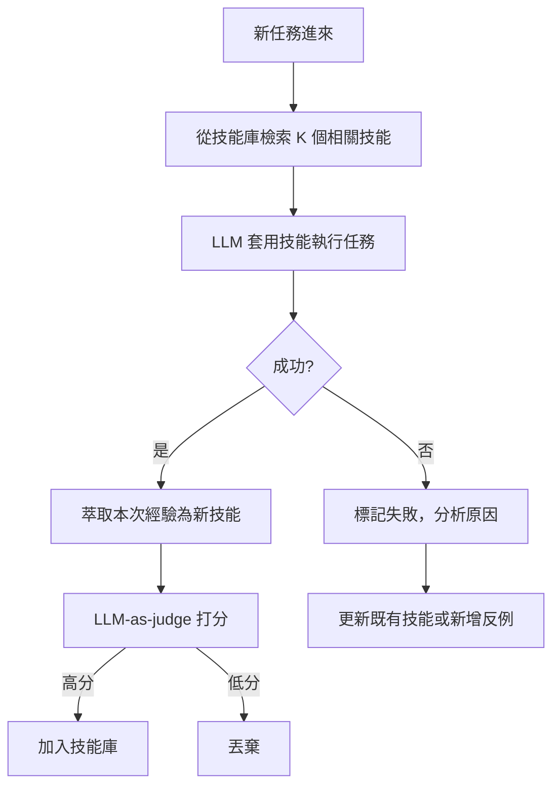

# LLM Agent 的技能演化框架（Evolving-RL / SkillOS）

> [!abstract] 一句話理解
> 這是一個用來**讓 LLM agent 像人類員工一樣從經驗中累積能力**的**學習機制**，特別之處在於**把成功經驗抽象成「可重用的文字技能」並儲存到技能庫**，而不是每次任務都從零開始。

## 🎯 為什麼重要

**它解決了什麼問題？**

目前主流的 LLM agent 有一個荒謬的特性：**它每次都重新出生**。
- 你今天叫它幫你查 5 家供應商價格、做成表格。
- 明天再叫它做一次「幫我查 5 家供應商價格、做成表格」。
- 它會把整個流程從頭再規劃一次——同樣的失敗陷阱會踩，同樣的優化想法不會記住。

對比人類員工：做過一次後就形成「程序記憶」，第二次更熟練、更快、更不容易出錯。

過去的解法有：
- **微調（fine-tuning）**：把成功的軌跡蒐集起來再訓模型——但週期長、要動模型權重、難以區分「該記住的」和「該忘掉的」。
- **長期 memory**：把過去對話存到向量資料庫——但只是「翻得到」，不會主動觸發。
- **手工 prompt 範本**：人類工程師把 SOP 寫進 prompt——維護成本高、難以遷移。

Evolving-RL 與 SkillOS 嘗試解的是：**讓 agent 自動從成功經驗中萃取「可重用、人類可讀的文字技能」，並在下次遇到類似任務時主動套用**。本質上是用 RL 讓 agent 學「如何當一個會累積經驗的人」。

## 🧠 入門解說（用類比理解）

把 LLM agent 想成一個新進員工。

- **舊式 agent**：每天早上都被擦掉記憶，重新上班。第 100 天和第 1 天表現一樣。
- **Skill 演化 agent**：第一天笨手笨腳完成任務後，他在筆記本寫下「我學到：客戶 X 的 invoice 都在 ERP 第 5 個選單；用 export.csv 比 print.pdf 更快」。第二天再做類似工作時，他會先翻筆記本，找到「客戶 invoice 處理」這頁，照著做——立刻熟練。久了之後，他的筆記本變成一本「個人化 SOP 大全」，能借給新同事看。

幾個關鍵：
- **筆記用自然語言寫**——這樣換一個新員工（換個 LLM 模型）也能讀。
- **不是所有事情都該記**——只記「常重複出現、學費高的技能」。
- **有人會審筆記**（LLM-as-judge）——錯誤的條目要刪掉，避免越學越歪。

## 🔑 重點原理

1. **技能（Textual Skill）**：成功完成某類任務的「步驟描述 + 工具序列 + 注意事項」，以自然語言儲存。範例：「處理客戶退款流程：1. 查訂單 / 2. 確認狀態 / 3. 在 Stripe 退款 / 4. 寄通知信⋯⋯」。
2. **技能庫（Skill Library / Skill OS）**：所有技能持久化存放的資料結構，可索引、可檢索、可版本化。
3. **技能檢索**：新任務進來時，先用嵌入相似度找出最相關的 K 個技能。
4. **雙重 RL 策略**（Evolving-RL）：同時學「技能萃取」與「技能應用」——前者決定「這次經驗值不值得記」，後者決定「這個技能能不能用在新任務」。
5. **品質策展**（SkillOS）：用 LLM-as-judge 對每個技能打分，低分淘汰。避免技能庫膨脹成垃圾堆。
6. **持續學習**：不需要重新預訓練——所有「進步」都發生在技能庫的更新，而非模型權重。
7. **跨模型可遷移**：因為技能是純文字，今天用 Claude 學到的，明天能直接餵給 GPT-5.5 套用——這是相對於微調的最大優勢。

## 📊 視覺化說明

### 流程圖

### 比較表
| 維度 | 傳統 LLM Agent | Evolving-RL / SkillOS |
|---|---|---|
| 學習單位 | 模型權重（不變） | **文字技能（持續累積）** |
| 樣本效率 | 低，每次重學 | **高，技能複用** |
| 跨模型遷移 | 難（embedding 綁定模型） | **容易（純文字）** |
| 可解釋性 | 低 | **高（技能人類可讀）** |
| 更新成本 | 重訓 vs 換 prompt | 寫入技能庫即可 |
| 風險 | 過擬合於最新提示 | **技能庫汙染**（需策展） |
| 與 anthropic Skills 的關係 | 無 | **本質相同**，學術版 |

## 🔍 與既有技術的差異

- **比起 RAG**：RAG 檢索的是「事實 / 資料」；技能庫檢索的是「做事的步驟」。前者餵知識，後者餵流程。
- **比起 fine-tuning**：微調動模型權重、需要 GPU、難以撤回；技能演化只動「文字檔」、零訓練成本、可隨時刪除。
- **比起 LangChain Memory**：LangChain memory 是被動回放歷史；技能演化是主動抽象成可組合的技能單元。
- **比起 Anthropic Skills / Custom GPTs**：Anthropic Skills 是人類工程師手工寫；本研究是 agent 自己學著寫——是 Skills 的「自動化版」。

## 📚 關鍵詞對照表

| 中文 | 英文 | 簡短解釋 |
|---|---|---|
| 文字技能 | Textual Skill | 自然語言描述的可重用步驟 |
| 技能庫 | Skill Library | 所有技能的儲存與索引結構 |
| 技能萃取 | Skill Extraction | 從成功軌跡中抽象出可重用步驟 |
| 技能應用 | Skill Application | 把既有技能套用到新任務 |
| LLM-as-judge | LLM-as-judge | 用 LLM 評分另一個 LLM 的輸出 |
| 經驗驅動 RL | Experience-driven RL | 用過往任務軌跡訓練 agent |
| 持續學習 | Continual Learning | 模型不重訓但能持續變強 |
| 災難性遺忘 | Catastrophic Forgetting | 學新任務時忘掉舊任務 |
| 元學習 | Meta-learning | 「學如何學」的策略 |
| Skill curation | Skill curation | 對技能庫做品質控管 |

## 🛠️ 可能的應用場景

1. **企業客服 agent**：累積「處理過 1,000 次的退款情境」的最佳 SOP。
2. **個人助理**：學會「使用者在每月初通常要處理請款單」這類個人習慣。
3. **程式碼 agent**（如 Claude Code）：把對某 codebase 的探索結果存成技能，下次更快定位檔案。
4. **科學研究 agent**：累積實驗設計模式，跨論文題目重用。
5. **法務 / 合規**：把過去案件處理流程沉澱為可審計的技能庫，符合監管要求。

## 📖 學習路徑建議

1. **先讀**：[Voyager (2023)](https://arxiv.org/abs/2305.16291)——讓 LLM agent 在 Minecraft 中累積技能的早期代表作。
2. **再讀**：[Reflexion (Shinn et al. 2023)](https://arxiv.org/abs/2303.11366)——agent 自我反思的基礎。
3. **這篇**：Evolving-RL（小紅書 + 北大）與 SkillOS（UIUC + Google Cloud AI Research），2026-05。
4. **進階**：Anthropic Skills 文件、OpenAI GPTs API 文件——商業實作對照。
5. **實作**：以 LangChain memory + 自製 skill JSON schema 拼一個簡化版玩玩。

## 🎮 互動式學習工具

➡️ **[開啟 Skill 演化技能庫 Demo](Interactive/skill-evolution-library-demo.html)**

按序執行 10 個任務，眼見技能庫從零慢慢長出：成功時「萃取技能」fade-in 入庫，遇到相似任務時亮起「💡 技能複用」、步數從 8–12 步驟降到 2–3 步；三條曲線（完成率、平均步數、技能庫大小）即時展示持續學習的累積效益。

## 🎬 推薦影片（依難度排序）

| 難度 | 影片標題 | 頻道 | 為什麼推薦 |
|---|---|---|---|
| 入門 | [What is an AI Agent?](https://www.youtube.com/results?search_query=IBM+Technology+AI+agent) | IBM Technology | 對 agent 概念零基礎者的最佳起點 |
| 入門 | [Voyager: LLM Agents in Minecraft](https://www.youtube.com/results?search_query=Voyager+Minecraft+LLM+agent) | NVIDIA / Jim Fan | 技能演化的「童年」案例，視覺化最直觀 |
| 中階 | [Reflexion: Self-Reflecting LLMs](https://www.youtube.com/results?search_query=Reflexion+self+reflection+LLM) | AI Coffee Break / Yannic | 理解 agent 如何從失敗中學習 |
| 中階 | [Building Agentic Workflows](https://www.youtube.com/@LangChain) | LangChain 官方 | 工程化角度看技能庫的實作 |
| 進階 | [Continual Learning Lectures](https://www.youtube.com/results?search_query=continual+learning+deep+learning+lecture) | DeepMind / Stanford | 理論基礎：避免災難性遺忘 |

## 📖 進階閱讀（依閱讀順序）

1. **童年案例**：[Voyager (Wang et al. 2023)](https://arxiv.org/abs/2305.16291) — LLM agent 在 Minecraft 中自我累積技能
2. **自我反思**：[Reflexion (Shinn et al. 2023)](https://arxiv.org/abs/2303.11366)
3. **核心論文**（2026-05）：
   - Evolving-RL（小紅書 + 北大）
   - SkillOS（UIUC + Google Cloud AI Research）
4. **商業實作對照**：
   - [Anthropic Skills 官方文件](https://docs.claude.com/en/docs/agents-and-tools/agent-skills)
   - [OpenAI Custom GPTs](https://platform.openai.com/docs/guides/custom-gpt)
   - [LangChain Memory 概覽](https://python.langchain.com/docs/modules/memory/)
5. **理論基礎**：
   - [Continual Learning 綜述](https://arxiv.org/abs/2302.00487)
   - [Meta-Learning Survey](https://arxiv.org/abs/2004.05439)
6. **動手實作**：[DSPy 框架](https://github.com/stanfordnlp/dspy) — 提供 LLM 程式可重用 module 化的思維

## 🧠 自我測驗 Quiz

> [!question] Q1（觀念）
> 為什麼「文字技能」比「微調權重」更適合作為 agent 累積經驗的載體？
>
> > [!success]- 解答
> > 三點：(1) **可遷移**——純文字可跨模型；(2) **可審閱**——人類可讀、可編輯、可審計；(3) **可撤回**——出錯時直接刪除，不用回滾模型權重。代價是技能檢索需消耗 tokens，與微調比有 inference-time 成本。

> [!question] Q2（風險）
> 技能庫長期演化下，最可能遇到什麼失敗模式？怎麼防範？
>
> > [!success]- 解答
> > **技能庫汙染**：累積太多低品質、過時、或互相矛盾的技能，導致檢索回傳一堆雜訊。防範：(1) LLM-as-judge 定期審視淘汰；(2) 技能版本化、過時技能自動退役；(3) 技能間建立衝突偵測，發現新舊技能矛盾時觸發人工審核。

> [!question] Q3（與 RAG 比較）
> 一個技能庫和一個 RAG 知識庫的根本差異是什麼？
>
> > [!success]- 解答
> > **內容性質不同**：RAG 存的是「事實、資料、條文」（What），技能庫存的是「做事的步驟與經驗」（How）。檢索時機也不同：RAG 通常在回答前一次性檢索；技能庫可能在規劃階段檢索（找出該怎麼做），也可能在執行中遇到困難時動態檢索（這類問題以前怎麼解過）。

> [!question] Q4（實務）
> 你要為一家保險公司導入「理賠處理 agent」，技能庫設計上最該注意的兩件事是什麼？
>
> > [!success]- 解答
> > **(1) 合規可審計**：每個技能附帶來源（哪份 SOP、哪位 expert 同意、版本日期），遇監管或客訴可追溯。**(2) 邊界明確**：技能必須限定適用情境（如「此技能僅適用於汽車險、保額 < 50 萬」），避免 agent 把醫療險的處理流程錯用到房屋險。

> [!question] Q5（未來）
> 如果技能庫真的成為「agent 的護城河」，企業應該如何看待技能庫的所有權？
>
> > [!success]- 解答
> > 技能庫是企業最有價值的內隱知識的顯性化——應視為**核心 IP**，不應放在 SaaS vendor 雲端而沒有資料主權條款。建議：(1) 合約明定技能庫的 export 權；(2) 對機敏行業（金融、醫療）採地端部署；(3) 技能庫的版本控管納入企業正式的 change management 流程；(4) 員工離職時與 IP 條款並列檢視「技能庫貢獻」。

## 🔗 延伸閱讀
- 原文：[arXiv cs.AI Recent](https://arxiv.org/list/cs.AI/recent)
- 對應新聞筆記：[[2026-05-13-Evolving-RL 與 SkillOS LLM Agent 技能演化框架]]
- 相關閱讀：Anthropic Skills 官方文件、Voyager 論文
- 學習中心：[[INDEX|查看所有學習筆記]]

---
*由 Claude 自動整理於 2026-05-13*
