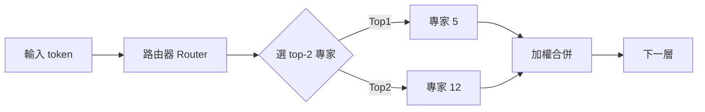

# Mixture of Experts（MoE，混合專家）

> [!abstract] 一句話理解
> 這是一個用來**讓模型容量變大但運算成本不變大**的**神經網路架構技巧**，特別之處在於**模型內部有很多「專家」，但每個輸入只動用其中少數幾個**。

## 🎯 為什麼重要

**它解決了什麼問題？**

訓練越大的模型，效果通常越好，但有兩個煩人的事實：
1. **參數越多，推論成本越高**：模型大兩倍，推論大致慢兩倍。
2. **訓練成本爆炸**：1T 參數的密集（dense）模型，訓練可能要燒幾億美元電費。

但其實，模型對「不同類型的輸入」需要的能力是不同的。「翻譯日文」用的腦區，跟「解微積分」用的腦區，可能根本是兩套。如果每次推論都把整顆模型的所有神經元都跑一次，是巨大的浪費——就像你出去買一個麵包卻發動了卡車。

MoE 的點子是：**讓模型分成很多「專家」，每次輸入由一個路由器決定該動用哪幾個專家**。這樣模型總容量可以做到很大（每個專家學會不同領域），但實際計算只用一小部分。

這次 Gemma 4 MoE 的例子：總參數 26B，每次推論只算 3.8B——好處是擁有 26B 的記憶與廣度，但運算只花 3.8B 的成本。

## 🧠 入門解說（用類比理解）

把 LLM 想成一家「綜合醫院」。

- **密集模型（Dense Model）**：每個病人來都要看所有科別的醫生——耳鼻喉、心臟、骨科、神經、皮膚⋯⋯不管什麼問題都要全部看一遍。當然會比較確診率高，但效率極差、病人累、醫院累。

- **MoE 模型**：醫院的入口有一個「分診台」（路由器），看到病人說「我手痛」就分到骨科；看到病人說「頭暈」就分到神經科。**每個病人只看 1–2 個專科**，但醫院本身有 16 個專科可選。

幾個關鍵：
- 各專科可以同時存在，互相獨立工作 → 模型總容量大。
- 病人只需要排 1–2 個科 → 個別推論成本低。
- 分診台要訓練得準 → 路由器（router）的學習很關鍵，分錯科就毀了。

## 🔑 重點原理

1. **專家（Expert）**：MoE 層裡有 N 個小型 FFN（feed-forward network），每個就是一個「專家」。Gemma 4 MoE 用 16 個。
2. **路由器（Router / Gate）**：每個 token 進來，路由器算出「該分給哪幾個專家」的權重，通常取最高的 top-K（Gemma 4 是 K=2）。
3. **稀疏激活（Sparse Activation）**：只有被選中的 K 個專家會運算，其他專家在這個 token 上不工作。
4. **參數計算的差異**：
   - **總參數**（total params）：所有專家加起來的權重數（26B）。模型容量。
   - **啟用參數**（active params）：每次推論實際用到的權重數（3.8B）。運算成本。
5. **負載平衡（Load Balancing Loss）**：為避免「所有 token 都跑去同一個明星專家」，訓練時加入一個 loss 強迫流量分散。
6. **路由不穩定問題**：MoE 訓練的最大挑戰——路由器可能在訓練中期崩潰，所有 token 都跑同一個專家。Gemma 4 用 router z-loss 緩解。
7. **記憶體 vs 計算的權衡**：MoE **省的是計算，不省記憶體**——所有專家權重都要常駐 GPU VRAM，因此 26B MoE 的 VRAM 需求和 26B 密集模型差不多。

## 📊 視覺化說明

### 流程圖

### 比較表
| 維度 | 密集模型 (Dense) | MoE 模型 |
|---|---|---|
| 總參數 | 例如 26B | 例如 26B |
| 啟用參數 | 26B（全用） | 3.8B（只用 2/16） |
| 推論速度 | 慢 | **快 ~4–5 倍** |
| VRAM 需求 | 高 | 一樣高（所有專家都要載入） |
| 訓練穩定度 | 較穩 | 路由器需小心調整 |
| 微調難度 | 標準 | **較高**（需考慮路由） |
| 開源生態 | 成熟 | 快速成熟中 |

## 🔍 與既有技術的差異

- **比起密集大模型**：相同推論成本下，MoE 提供更高的模型容量，benchmark 通常顯著更好。
- **比起小密集模型**：MoE 模型容量大，因此對冷門領域（少見語言、特定行業術語）的表現好得多。
- **比起 ensemble（模型集成）**：ensemble 是訓練好幾個獨立模型再投票；MoE 是「一個模型內部分工」，所有專家共享底層的注意力層。
- **比起 LoRA 適配器**：LoRA 是事後針對任務加掛小模組；MoE 是模型本身的內建架構。

## 📚 關鍵詞對照表

| 中文 | 英文 | 簡短解釋 |
|---|---|---|
| 混合專家 | Mixture of Experts (MoE) | 模型內部多個專家，每次激活少數 |
| 專家 | Expert | MoE 內的子網路，通常是 FFN |
| 路由器 | Router / Gate | 決定 token 分配給哪個專家的小網路 |
| 稀疏激活 | Sparse activation | 只激活少數專家而非全部 |
| 總參數 | Total parameters | 所有專家加起來的權重總和 |
| 啟用參數 | Active parameters | 每次推論實際用到的權重 |
| Top-K 路由 | Top-K routing | 每個 token 只送給分數最高的 K 個專家 |
| 負載平衡損失 | Load balancing loss | 避免少數專家被過度使用的 loss 項 |
| Upcycling | Upcycling | 從密集模型轉成 MoE 的訓練手法 |

## 🛠️ 可能的應用場景

1. **多語言模型**：每個專家負責一組相近的語言，路由器判斷語言後分發。
2. **多任務系統**：程式碼、數學、創作各派不同專家。
3. **企業專屬模型**：可微調某幾個專家給特定領域（如台灣法務文件），不必動全模型。
4. **資源受限的高品質推論**：邊緣裝置 + 桌上型 GPU 也能跑等同於 70B 密集模型的品質。
5. **長期持續學習**：增加新專家來吸收新領域知識，避免災難性遺忘。

## 📖 學習路徑建議

1. **先讀**：[Shazeer et al. 2017《Outrageously Large Neural Networks: Sparsely-Gated MoE》](https://arxiv.org/abs/1701.06538)——MoE 的開山之作。
2. **再讀**：[Switch Transformer (Fedus et al. 2021)](https://arxiv.org/abs/2101.03961)——把 K=1 推到極致的代表作。
3. **本篇**：[A Comprehensive Survey of MoE (2025)](https://arxiv.org/abs/2503.07137)——最完整綜述。
4. **進階**：[ST-MoE 與路由器設計](https://arxiv.org/abs/2202.08906)——理解 router z-loss 與其他穩定化技巧。
5. **實作**：Hugging Face Transformers 的 Mixtral 範例；DeepSeek-MoE 開源程式碼。

## 🎬 推薦影片（依難度排序）

| 難度 | 影片標題 | 頻道 | 為什麼推薦 |
|---|---|---|---|
| 入門 | [What are Mixture of Experts (MoE)?](https://www.youtube.com/results?search_query=IBM+Technology+Mixture+of+Experts) | IBM Technology | 短時長白板講解，沒有公式 |
| 入門 | [Mixture of Experts Explained](https://www.youtube.com/results?search_query=AI+Coffee+Break+Mixture+of+Experts) | AI Coffee Break with Letitia | 動畫清楚，特別解釋路由機制 |
| 中階 | [Stanford CS25: Mixture of Experts 講座](https://www.youtube.com/results?search_query=Stanford+CS25+Mixture+of+Experts) | Stanford Online | 大學課程級的 MoE 專題 |
| 中階 | [Mixtral / DeepSeek MoE 論文解讀](https://www.youtube.com/@YannicKilcher) | Yannic Kilcher | 著名論文解讀者對 MoE 論文的剖析 |
| 進階 | [LLM 系列影片中的 MoE 細節](https://www.youtube.com/@AndrejKarpathy) | Andrej Karpathy | Karpathy 的 LLM 課程系列常深入 MoE 內部 |

> 若連結失效，建議直接到對應頻道用「Mixture of Experts」或「MoE」搜尋。

## 📖 進階閱讀（依閱讀順序）

1. **入門部落格**：[Hugging Face — Mixture of Experts Explained](https://huggingface.co/blog/moe)（含視覺化、Mixtral 案例）
2. **必讀論文**：
   - [Outrageously Large Neural Networks: The Sparsely-Gated MoE Layer (Shazeer et al. 2017)](https://arxiv.org/abs/1701.06538) — 開山之作
   - [Switch Transformer (Fedus et al. 2021)](https://arxiv.org/abs/2101.03961) — K=1 的極致
   - [ST-MoE (Zoph et al. 2022)](https://arxiv.org/abs/2202.08906) — 路由穩定化技巧
   - [Mixtral of Experts (Jiang et al. 2024)](https://arxiv.org/abs/2401.04088) — 開源 MoE 的代表
3. **綜述**：[A Comprehensive Survey of Mixture-of-Experts (2025)](https://arxiv.org/abs/2503.07137)
4. **動手實作**：[Hugging Face — Fine-tuning Mixtral](https://huggingface.co/blog/mixtral)；或 fork [DeepSeek-MoE GitHub](https://github.com/deepseek-ai/DeepSeek-MoE) 程式碼跑跑看
5. **Karpathy 課程**：[Let's build GPT (從零理解 Transformer 再來看 MoE)](https://www.youtube.com/watch?v=kCc8FmEb1nY)

## 🎮 互動式學習工具

➡️ **[開啟 MoE 路由器互動模擬器](Interactive/moe-router-simulator.html)**

在 Obsidian 中可右鍵筆記中的 HTML 連結 → 「Open in default app」即可在瀏覽器中開啟。可手動輸入 token，即時觀察路由器如何把它分派給不同專家、總參數 vs 啟用參數的差異。

## 🧠 自我測驗 Quiz

> [!question] Q1（觀念）
> Gemma 4 MoE 「總參數 26B、啟用參數 3.8B」對 GPU VRAM 的需求約等同於 26B 還是 3.8B 的密集模型？為什麼？
>
> > [!success]- 解答
> > 約等同於 **26B** 密集模型。MoE 省的是「計算量」（每次推論只算 2 個專家），但所有專家權重都得常駐 VRAM。這也是為何 MoE 不適合記憶體吃緊的邊緣裝置。

> [!question] Q2（架構）
> 為什麼 MoE 訓練時需要 Load Balancing Loss？如果不加會發生什麼事？
>
> > [!success]- 解答
> > 為了避免所有 token 都被路由到同一個「明星專家」。沒有 load balancing loss 的話，路由器可能很快崩潰到 K=1 個專家、其他專家永遠用不到，浪費容量也破壞訓練穩定性。

> [!question] Q3（比較）
> MoE 跟 Ensemble（模型集成）有什麼根本差異？
>
> > [!success]- 解答
> > Ensemble 是訓練好幾個**獨立模型**再投票；MoE 是**一個模型內部分工**，所有專家共享底層的注意力層、word embeddings 等。MoE 的計算與記憶體成本遠低於同等容量的 ensemble。

> [!question] Q4（實務）
> 你是台灣某金融公司的 ML 工程師，想對 Gemma 4 MoE 做台灣金融術語的微調，PEFT（LoRA）的策略上要注意什麼？
>
> > [!success]- 解答
> > 因為各專家擅長領域不同，LoRA 必須加在「會被路由到的專家」上。若無差別在所有專家加 LoRA，效果會稀釋。實務上可先用金融術語 token 跑過 router 蒐集路由統計、再針對 top-K 的專家做適配；或考慮 router-aware fine-tuning。

> [!question] Q5（趨勢思考）
> 從 Mixtral、DeepSeek V3 到 Gemma 4 MoE 都採 MoE 架構，這代表 MoE 是 LLM 的「終局」嗎？有什麼仍未解決的問題？
>
> > [!success]- 解答
> > 不是終局。MoE 仍有：(1) 推論記憶體膨脹（所有專家都要常駐）；(2) 路由偏置（資料分佈漂移時專家分工會失衡）；(3) 跨節點通訊成本（多 GPU 上 expert parallelism 引入額外 all-to-all 通訊）；(4) 微調複雜度高。後續可能會出現 MoE + State Space Model（Mamba）混合架構、動態專家數量等新方向。

## 🔗 延伸閱讀
- 原文：[Gemma 4 釋出新聞](https://llm-stats.com/ai-news)
- 對應新聞筆記：[[2026-05-13-Google Gemma 4 MoE 26B 稀疏激活]]
- 必讀綜述：[MoE Survey arXiv:2503.07137](https://arxiv.org/abs/2503.07137)
- 學習中心：[[INDEX|查看所有學習筆記]]

---
*由 Claude 自動整理於 2026-05-13*
