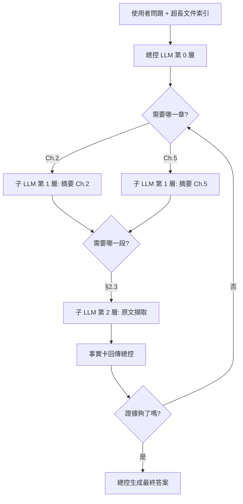

# 遞迴語言模型（Recursive Language Models, RLM）

> [!abstract] 一句話理解
> 這是一個用來**處理超長上下文**的**推論流程設計**，特別之處在於**讓 LLM 在執行時呼叫自己進行階層摘要**，而不是把所有資料一口氣塞進單一視窗。

## 🎯 為什麼重要

**它解決了什麼問題？**

在 RLM 出現之前，業界用兩條路徑處理長文件：

1. **更大的上下文視窗**——Gemini 把視窗推到 2M tokens、Claude 推到 1M。但模型對「中間段落」注意力會散失（lost-in-the-middle），且推理一次的延遲與成本暴漲。一份百萬 token 的文件處理一次，往往需要數十秒、數美元，難以規模化。

2. **檢索增強生成（RAG）**——先用向量檢索找出相關片段，再餵給 LLM。但向量檢索是「黑盒外掛」，LLM 沒辦法主動決定要找什麼、找到後再深挖。RAG 的品質高度仰賴檢索器，且常常切到一半語義就丟失。

RLM 把這兩條路徑的優點合在一起：**讓 LLM 自己當「研究員」，遞迴地深入長文件**，需要時才展開細節，不需要就維持高層摘要——既節省 token、也保留主動決策權。

## 🧠 入門解說（用類比理解）

想像你要回答一道「公司財報裡 Q3 的某項費用為什麼上升」的問題，但財報有 800 頁。

- **舊方法（百萬 token 視窗）**：你雇用一個讀完整本書才肯回答的同事——他要花一整天讀完，而且讀完中段就累了，記不太清楚。
- **舊方法（RAG）**：你雇用一個圖書管理員，先按關鍵字幫你找出 10 頁。但管理員不懂財務，找的頁可能根本不是 Q3 費用的真正原因。
- **新方法（RLM）**：你雇用一個聰明的初級分析師。他先翻目錄，問「這本書有哪些章節？」 → 找到「費用分析」章 → 問「這章有哪些小節？」 → 找到「Q3 變動」→ 問「列出實際數字」→ 找到關鍵段落 → 引用、回答。**每一步都由他自己決定要不要深入**。

RLM 就是把第三種模式變成一個程式化的流程：LLM 既是回答者，也是規劃者。

## 🔑 重點原理

1. **遞迴呼叫**：LLM 在執行過程中能呼叫一個「子 LLM」（同模型、不同上下文），由子 LLM 去處理一個更小的子問題並回傳結果。
2. **上下文位址協定**：每篇長文件被切成可定址的塊（doc_id, section_id, span_id）。LLM 用這些位址告訴子 LLM 該展開哪一段。
3. **記憶蒸餾**：子 LLM 回傳給上層的不是原始 token，而是一張「事實卡」——結構化、壓縮過的關鍵資訊。這是 RLM 比 RAG 更節省 token 的關鍵。
4. **規劃 + 執行雙策略**：上層 LLM 負責「下一步該展開誰」，子層 LLM 負責「忠實萃取與摘要」。兩個角色用 RL 各自訓練。
5. **退出條件**：當模型判斷已收集到足夠證據（後驗熵低於閾值），即停止遞迴。否則容易陷入無限展開。
6. **KV cache 重用**：相同子文件被多次呼叫時，KV cache 可被重用，比每次大窗呼叫節省 60–80% 計算。
7. **與 agent 工作流天然相容**：遞迴呼叫本身就是 tool use，可無縫嵌入 ReAct、LangGraph 等框架。

## 📊 視覺化說明

### 流程圖

### 比較表
| 維度 | 百萬 token 視窗 | RAG | RLM |
|---|---|---|---|
| 上下文上限 | 1–2M token | 無限（外掛） | 無限（遞迴展開） |
| 主動規劃 | 否 | 否 | **是** |
| 中段注意力衰減 | 嚴重 | 不適用 | 極輕（每層短上下文） |
| 推理成本 | 極高 | 中 | 中（典型減為 35%） |
| 工程複雜度 | 低 | 中 | 中高 |
| 對開源模型友善度 | 低（需大窗訓練） | 高 | **高** |

## 🔍 與既有技術的差異

- **比起 long-context LLM**：RLM 不需要訓練超長視窗就能處理超長文件，門檻低、成本可控；但對「需要全域一致性判斷」的任務（如全文校對）較弱。
- **比起 RAG**：RLM 把規劃權交給 LLM 自己，不依賴外部檢索器；但需要訓練規劃策略，否則容易無限展開或漏看關鍵段落。
- **比起 Agent + tools**：RLM 是 agent 模式的「文件特化版」——遞迴呼叫的內容是文件位址，而非搜尋引擎或 API。

## 📚 關鍵詞對照表

| 中文 | 英文 | 簡短解釋 |
|---|---|---|
| 遞迴語言模型 | Recursive Language Model (RLM) | LLM 在推論時呼叫自己處理子問題的架構 |
| 上下文位址 | Context address | 用 (doc_id, span) 指定要展開的片段 |
| 事實卡 | Fact card | 子層回傳給上層的結構化摘要 |
| 記憶蒸餾 | Memory distillation | 把原始 token 壓縮成結構化資訊 |
| 後驗熵 | Posterior entropy | 模型對答案不確定性的衡量 |
| KV 快取 | KV cache | Transformer 中已計算的鍵值快取 |
| Embodiment gap | (用於另一情境) | 模擬 vs 真實的差距，本筆記不涉及 |
| 規劃策略 | Planning policy | 決定下一步該展開哪個子文件的策略 |
| 中段注意力衰減 | Lost-in-the-middle | LLM 在長上下文中段容易遺失資訊 |

## 🛠️ 可能的應用場景

1. **法律 / 合規**：對數千頁合約、判決書做特定條款的查詢與比對。
2. **醫療**：對病患長期病歷做時間序列分析。
3. **企業知識庫**：對整個公司文件庫做即席問答，不需先做向量化。
4. **科研文獻回顧**：對某主題的全部論文做遞迴整合。
5. **程式碼理解**：對大型 codebase 進行符號追蹤、影響分析。

## 📖 學習路徑建議

1. **先讀**：[Lost in the Middle 論文](https://arxiv.org/abs/2307.03172)——理解長上下文的注意力問題。
2. **再讀**：[Attention is All You Need](https://arxiv.org/abs/1706.03762)——複習 Transformer 基礎。
3. **這篇**：Recursive Language Models（Prime Intellect，2026）。
4. **進階**：LangChain / LlamaIndex 的階層摘要範例，可動手實作簡化版。
5. **延伸**：Anthropic 的 Skills 與 Constitutional AI 文件——理解「結構化推論」的另一條路。

## 🎬 推薦影片（依難度排序）

| 難度 | 影片標題 | 頻道 | 為什麼推薦 |
|---|---|---|---|
| 入門 | [Long context vs RAG 對比講解](https://www.youtube.com/results?search_query=long+context+vs+RAG+explained) | AI Explained | 對比兩種長上下文策略，鋪好理解 RLM 的背景 |
| 入門 | [Lost in the Middle 論文解說](https://www.youtube.com/results?search_query=Lost+in+the+Middle+long+context) | AssemblyAI / Letitia | 為什麼大上下文模型在中段失憶——RLM 要解的痛點 |
| 中階 | [Building LLM Agents that Self-Plan](https://www.youtube.com/results?search_query=LLM+agents+self+plan+reasoning) | DeepLearning.AI 短課 | 理解 agent 自我規劃（RLM 屬於這一脈絡） |
| 中階 | [Hierarchical Retrieval for Long Documents](https://www.youtube.com/results?search_query=hierarchical+retrieval+long+document) | LangChain / LlamaIndex 官方頻道 | 階層式檢索的工程實作 |
| 進階 | [Andrej Karpathy: State of GPT](https://www.youtube.com/watch?v=bZQun8Y4L2A) | Microsoft Build | Karpathy 對 LLM 推論模式的全景講解 |

## 📖 進階閱讀（依閱讀順序）

1. **背景痛點**：[Lost in the Middle (Liu et al. 2023)](https://arxiv.org/abs/2307.03172) — 證明大窗模型對中段失憶
2. **競品路線**：
   - [RAG 原始論文 (Lewis et al. 2020)](https://arxiv.org/abs/2005.11401)
   - [Long-Context Survey 2024](https://arxiv.org/abs/2402.17463)
3. **RLM 直接前身**：
   - [ReAct (Yao et al. 2022)](https://arxiv.org/abs/2210.03629) — agent 自我規劃的雛形
   - [Tree of Thoughts (Yao et al. 2023)](https://arxiv.org/abs/2305.10601)
   - [Self-RAG (Asai et al. 2023)](https://arxiv.org/abs/2310.11511) — 動態決定何時檢索
4. **本文**：[Recursive Language Models — Prime Intellect (2026)](https://www.primeintellect.ai/blog/rlm)
5. **動手實作**：
   - [LlamaIndex Recursive Retriever 文件](https://docs.llamaindex.ai/en/stable/examples/retrievers/recursive_retriever_nodes/)
   - [LangChain Hierarchical Summarization 範例](https://python.langchain.com/docs/use_cases/summarization)
6. **延伸**：[Anthropic — Claude's approach to long-context](https://www.anthropic.com/news) （搜尋「long context」相關 blog post）

## 🎮 互動式學習工具

➡️ **[開啟 RLM 遞迴查詢視覺化](Interactive/rlm-recursive-explorer.html)**

可以看到 LLM 如何把一份「假裝有 800 頁的文件」分層展開，比較單次大窗呼叫 vs RLM 遞迴呼叫的 token 用量差異。

## 🧠 自我測驗 Quiz

> [!question] Q1（觀念）
> 「百萬 token 視窗模型」與「RLM」在處理長文件 QA 時，最根本的差異是什麼？
>
> > [!success]- 解答
> > 大窗模型把所有上下文一次塞入，**LLM 是被動接受者**；RLM 讓 LLM **主動規劃**要展開哪些片段、何時展開、何時停止——本質從「資料填鴨」變成「研究員模式」。

> [!question] Q2（成本）
> RLM 平均推理成本只有單次大窗呼叫的 35%，這個節省從哪裡來？
>
> > [!success]- 解答
> > 主要三處：(1) 每層只看到少量 tokens，避開了長序列 attention 的 $O(n^2)$ 成本；(2) 記憶蒸餾把原始 token 壓縮成事實卡，後續層處理的 token 量大幅減少；(3) KV cache 在跨呼叫重用。

> [!question] Q3（限制）
> RLM 不擅長處理哪種任務？為什麼？
>
> > [!success]- 解答
> > 「需要全域注意力」的任務，例如「找出整本書中互相矛盾的兩處陳述」、「跨章節風格一致性檢查」。因為 RLM 是分層摘要的，跨層之間的細節資訊已被蒸餾，難以做全局一致性判斷。

> [!question] Q4（實務）
> 如果用 LlamaIndex 動手實作一個簡化版 RLM，最關鍵的兩個元件是什麼？
>
> > [!success]- 解答
> > **(1) 文件位址化（Document indexing / hierarchical node parser）**：讓 LLM 能用 `(doc_id, section_id, span_id)` 引用片段。**(2) 規劃 LLM 的提示設計**：要明確要求模型輸出「下一步該展開哪個位址」的結構化決策，而不是讓它自由發揮。

> [!question] Q5（趨勢）
> RLM 與 RAG 是互斥的嗎？2026–2027 你預期它們會如何演化？
>
> > [!success]- 解答
> > 不互斥，反而會融合。RAG 仍是「在巨大語料庫中第一步定位」的有效工具；RLM 則是「定位到一本書後如何深入」的策略。預期看到「**RAG → RLM 兩階段**」架構：先用向量檢索找出可能相關的文件，再用 RLM 在這些文件中遞迴展開。Anthropic、LlamaIndex 已有類似實驗。

## 🔗 延伸閱讀
- 原文：[Recursive Language Models: the paradigm of 2026](https://www.primeintellect.ai/blog/rlm)
- 對應新聞筆記：[[2026-05-13-Recursive Language Models 2026 新典範]]
- 相關研究：Lost-in-the-Middle、ReAct、Reflexion、Tree-of-Thought
- 學習中心：[[INDEX|查看所有學習筆記]]

---
*由 Claude 自動整理於 2026-05-13*
