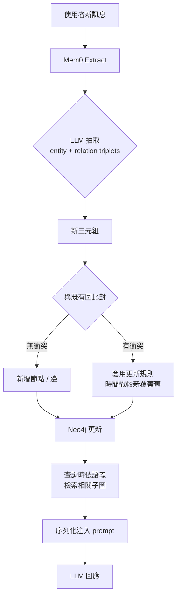

# Mem0 圖記憶架構：把 LLM 對話變成可成長的個人化知識圖

> [!abstract] 一句話理解
> 這是一個用來**讓 AI agent 跨 session 記住使用者偏好與重要事實**的**圖式長期記憶層**，特別之處在於**把對話自動抽取成「實體 + 關係」的有向圖，再依語義檢索回傳最相關的子圖**，token 使用相較把整段歷史塞進 context 降低約 90%。

## 🎯 為什麼重要

**它解決了什麼問題？**

LLM 上下文視窗就算擴到 100 萬、甚至 1,000 萬 token，仍解決不了三個本質問題：

1. **長期一致性**：今天告訴 ChatGPT「我太太對花生過敏」，三個月後它推薦你做花生雞丁。
2. **多 session 整合**：在手機開新對話，所有偏好得重新打一遍。
3. **成本爆炸**：把過去 6 個月對話全塞回 prompt，每次 query 花費爆增。

過去解法有兩種：

- **塞回 context（全 history）**：簡單但每次 token 用量直線上升。
- **單純向量資料庫 RAG**：能找回相似片段，但不知道「實體之間的關係」——找回「老婆」「過敏」「花生」三個片段，模型可能還是組不出「老婆對花生過敏」這個關鍵事實。

**Mem0 的賣點是「把對話抽象成圖」**——保留實體之間的明確關係，又能用語義 embedding 檢索。

## 🧠 入門解說（用類比理解）

想像你有一個非常認真的私人秘書 Mary：

- **沒有 Mary 的情況（純 context）**：每次見面你都要重新告訴她「我是誰、我喜歡什麼、上次聊到哪」——溝通成本龐大。
- **Mary 寫筆記本（純向量 RAG）**：她把每天的對話節錄抄在便條紙上塞進大盒子，需要時翻便條紙找。但便條紙之間沒有連結——當你問「我老婆對什麼過敏？」她可能翻到「老婆」、「過敏」、「花生」三張紙，卻不確定它們是不是講同一件事。
- **Mary 用心智圖（Mem0）**：她把所有事實畫成一張「人物 + 關係 + 事件」的網。每次新對話結束，她在心智圖上添加新節點與新邊。下次你問「我老婆對什麼過敏？」她直接從「你 → 老婆 → 對花生過敏」這條路徑取出答案。

**圖比便條紙好的地方在於「關係是第一級公民」**——你不只能找到節點，還能沿著邊推理。

## 🔑 重點原理

1. **抽取（Extract）**：每輪對話結束後，用 LLM 把訊息轉成 entity 與 relation triplets（如 `(user, has_spouse, Alice)`、`(Alice, allergic_to, peanut)`、`(meeting, happened_on, 2026-05-14)`）。

2. **整併（Consolidate）**：新三元組若與既有節點重疊則合併、衝突則套用更新規則（通常以時間戳較新者覆蓋；保留版本歷史）。

3. **檢索（Retrieve）**：query 時依語義 embedding 找最相關的子圖，把該子圖序列化（如格式化文字、JSON）注入 prompt。

4. **節點三要素**：每個 entity 節點包含 (a) **entity type** 分類、(b) **embedding vector** 語義表示、(c) **metadata** 時間戳與版本。

5. **底層用 Neo4j 圖資料庫**：提供成熟的圖查詢語言 Cypher，與既有資料工程棧相容。

6. **抽取與更新用 GPT-4o-mini + function calling**：function calling 結構化輸出避免自由文字解析錯誤。

7. **與 RAG、short-term memory 分層協作**：short-term 處理當前 session、RAG 處理外部知識、Mem0 處理跨 session 個人化記憶。

## 📊 視覺化說明

### Mem0 處理一輪對話的流程

### 三種記憶層的職責分工

| 記憶層 | 範圍 | 持續時間 | 典型實作 |
| --- | --- | --- | --- |
| Short-term Memory | 當前 session 的多步推理狀態 | 分鐘到小時 | LangGraph state |
| Retrieval (RAG) | 外部文件、知識庫 | 隨資料源 | 向量資料庫 |
| Long-term Memory（Mem0） | 使用者個人化的事實與偏好 | 跨 session 永久 | Neo4j + embedding |

### 圖記憶 vs 純向量 RAG

| 維度 | 純向量 RAG | Mem0 圖記憶 |
| --- | --- | --- |
| 儲存單位 | 對話片段 | 實體 + 關係 |
| 找回機制 | 相似 embedding | 語義 + 圖遍歷 |
| 多跳推理 | 困難 | 自然（沿邊走） |
| 對矛盾事實 | 兩份都會留下 | 可定義更新規則 |
| token 用量 | 一段段塞回 | 只送相關子圖 |

## 🔍 與既有技術的差異

- **vs. OpenAI 內建記憶**：OpenAI 用 user-level memory list（自然語句）；Mem0 用結構化圖、且實作開源。論文回報 +26% LLM-as-judge。
- **vs. 純向量 RAG**：RAG 不維護「事實衝突解決」與「關係推理」；Mem0 是 RAG 的補強，不是取代。
- **vs. LangGraph state**：LangGraph 處理 session 內 state；Mem0 處理跨 session 個人化。常見組合是「LangGraph + Mem0」。
- **vs. 自建 Postgres + JSON 偏好欄位**：自建方案 schema 死板，新類型實體要改 schema；Mem0 用圖能動態長新節點類型。

## 📚 關鍵詞對照表

| 中文 | 英文 | 簡短解釋 |
| --- | --- | --- |
| 圖記憶 | Graph Memory | 用節點與邊建模事實的記憶結構 |
| 三元組 | Triplet | (subject, relation, object) 三件式關係 |
| 實體 | Entity | 圖中的節點：人、物、事件、概念 |
| 關係 | Relation | 邊的標籤，如 `lives_in`、`prefers` |
| 語義嵌入 | Semantic Embedding | 把文字 / 實體映射為向量以計算相似度 |
| 知識圖譜 | Knowledge Graph | 結構化的「事實之網」 |
| 短期記憶 | Short-term Memory | 一個 session 內的暫存狀態 |
| 長期記憶 | Long-term Memory | 跨 session 持久保留的事實 |
| 整併 | Consolidation | 把新事實併入既有圖、處理衝突 |
| 函式呼叫 | Function Calling | LLM 以結構化 JSON 輸出，便於下游解析 |

## 🛠️ 可能的應用場景

1. **個人化 AI 助理**：跨 session 記得使用者習慣、偏好、家庭組成。
2. **企業客服**：記得每個客戶過去的問題、產品、合約版本。
3. **銷售 SDR**：跨 call 記得每位 prospect 的反對意見與決策鏈。
4. **教育輔助**：累積學生強弱點、學習進度，動態調整教學。
5. **健康追蹤**：記錄使用者長期飲食、睡眠、運動，產生個人化建議。

## 📖 學習路徑建議

1. **先讀**：RAG 基礎（Lewis et al. 2020）建立「外部記憶 + LLM」的世界觀
2. **再讀**：[Mem0 論文](https://arxiv.org/abs/2504.19413)（本主題）
3. **同期對照**：[[2026-05-13-Recursive Language Models 2026 新典範]]（另一條「結構化處理長 context」路線）
4. **進階**：Microsoft GraphRAG、LightRAG（其他圖式 RAG 變體）
5. **實作**：[Mem0 + LangGraph 教學](https://www.digitalocean.com/community/tutorials/langgraph-mem0-integration-long-term-ai-memory)

## 🎮 互動式學習工具

➡️ **[開啟 Mem0 圖記憶視覺化](Interactive/mem0-graph-memory-visualizer.html)**

逐輪注入 5 段對話，看實體 + 關係 + 物件三元組如何 fade-in 加入到知識圖；切到 Query 模擬器輸入問題，會把相關子圖高亮並對比 Mem0 vs 整段歷史的 token 使用量。

## 🧠 自我測驗 Quiz

1. Mem0 把每輪對話抽取成什麼格式？
2. 圖節點包含哪三個關鍵屬性？
3. Mem0 圖記憶版本相對 OpenAI 內建記憶的 LLM-as-Judge 提升是多少？
4. Mem0 相較「全 context」做法 token 使用量降低約多少？
5. 在「LangGraph + RAG + Mem0」三層架構中，Mem0 負責哪一塊？

答案

1. **Entity + relation triplets**——`(subject, relation, object)` 三元組。
2. **(1) Entity type、(2) Embedding vector、(3) Metadata（含時間戳）**
3. **+26%**（LLM-as-Judge 評測；圖記憶版本再 +2%）
4. **~90%**——只送相關子圖，不送完整 context。
5. **跨 session 的長期個人化記憶**——LangGraph 處理 session 內 state、RAG 處理外部知識、Mem0 處理使用者長期事實與偏好。

## 🔗 延伸閱讀

- 原文：[Mem0 paper (arXiv:2504.19413)](https://arxiv.org/abs/2504.19413)
- 對應新聞筆記：[[2026-05-14-Mem0 圖記憶生產級 AI Agent 記憶層]]
- [Mem0 官方文件](https://docs.mem0.ai/llms.txt)
- [State of AI Agent Memory 2026](https://mem0.ai/blog/state-of-ai-agent-memory-2026)
- [LangGraph + Mem0 tutorial](https://www.digitalocean.com/community/tutorials/langgraph-mem0-integration-long-term-ai-memory)

---
*由 Claude 自動整理於 2026-05-14*
