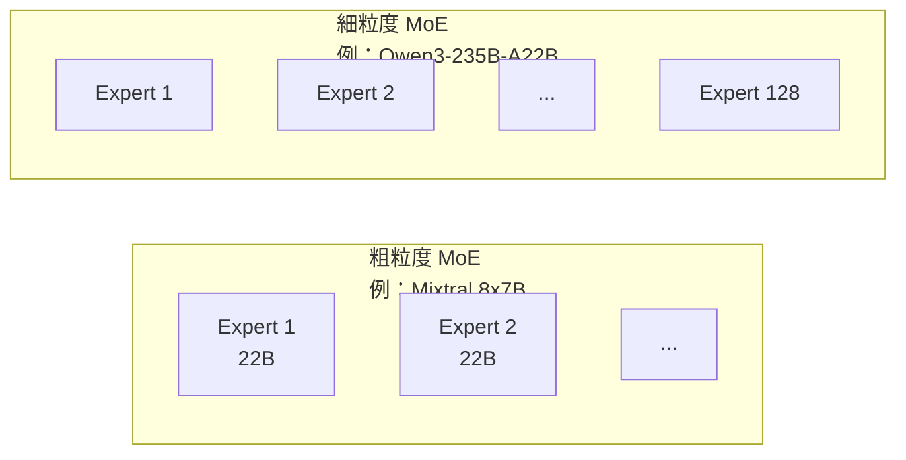

# Qwen3 雙模式統一推理：把「慢想」與「快答」變成同一個模型的兩種人格

> [!abstract] 一句話理解
> 這是一個用來**同時提供深度推理與快速回應**的 **LLM 統一架構設計**，特別之處在於 **不需要切換模型，由 chat template 或 query 動態啟用「thinking mode」或「non-thinking mode」**。

## 🎯 為什麼重要

**它解決了什麼問題？**

在 Qwen3 之前，主流推理模型（OpenAI o1/o3、DeepSeek-R1、QwQ）都採用「**另外發一個推理變體**」的路線：

- 一般 chat 用 GPT-4o，做數學 / 程式時切到 o3。
- 開發者需要在路由層自己判斷「這個 query 該丟給哪一個模型」。
- 部署層需要同時維護兩套權重、兩套硬體配置。

這帶來三個明確痛點：

1. **路由邏輯難寫**：判斷「這 query 是否需要 thinking」本身就需要一個小模型。
2. **記憶體成本翻倍**：兩個模型權重佔的 VRAM 是相加的。
3. **使用體驗割裂**：模型切換時對話上下文需要重新組裝。

Qwen3 的做法是「**把兩種人格塞進同一組權重**」，由 chat template 上的 `enable_thinking` 旗標、或對話中的 `/think`、`/no_think` 指令觸發切換。

## 🧠 入門解說（用類比理解）

想像你的同事 Alice 同時有兩種工作模式：

- **快速回應模式**：你問「今天禮拜幾」，她直接答「禮拜四」。
- **深度思考模式**：你問「這個合約該不該簽？」，她會說「**讓我先理一下思路**……」然後寫出一整段推理才給結論。

過去你要分別僱用兩個人——Bob 處理快回應、Carol 處理慢思考。每次轉交都要花時間交接背景。

Qwen3 的設計就是「**讓 Alice 一個人同時具備兩種模式**」，由你（或 Alice 自己）決定這次該用哪種人格。對你的公司而言，這代表：

- 只要簽一個薪資合約（一份權重檔）。
- 只要準備一張辦公桌（一套部署環境）。
- 上下文不會在轉交中遺失。

## 🔑 重點原理

1. **共享 backbone，不同 prompt 觸發**：thinking 與 non-thinking 共享所有 transformer 層權重；差別在於 chat template 是否注入 `<think>...</think>` 結構，以及訓練時是否包含「長鏈推理示範」。

2. **訓練資料雙軌混合**：訓練語料同時包含「快速問答對」與「帶 reasoning trace 的長鏈思考對話」，模型在 SFT 與 RLHF 階段學會根據 prompt 結構切換輸出風格。

3. **架構保留 dense 與 MoE 兩種變體**：dense 0.6B–32B 對應邊緣 / 中型部署；MoE 30B-A3B、235B-A22B 對應大型工作負載。

4. **MoE 用 fine-grained expert segmentation**：128 個專家、每 token 啟用 8 個，比 Qwen2.5-MoE 更細的切分；取消共享專家，鼓勵專家分化。

5. **架構小調整：移除 QKV-bias、新增 QK-Norm**：提升大規模訓練的數值穩定度。

6. **動態切換的兩種觸發**：
   - **顯式**：使用者或 system prompt 透過 `enable_thinking=True/False` 控制。
   - **隱式**：模型可以從 query 難度自動判斷（仍依賴明確 prompt template 配合）。

## 📊 視覺化說明

### 過去的「雙模型」與 Qwen3「單模型雙模式」對比

```mermaid
graph TB
    subgraph 過去："雙模型路由"
        Q1[用戶 Query] --> R1{路由器判斷}
        R1 -->|需要推理| M1[Reasoning Model<br/>o3 / R1]
        R1 -->|快回應| M2[Chat Model<br/>GPT-4o]
        M1 --> A1[長鏈輸出]
        M2 --> A2[短回應]
    end

    subgraph Qwen3："單模型雙模式"
        Q2[用戶 Query] --> Q3[Chat Template<br/>含 enable_thinking 旗標]
        Q3 --> M3[Qwen3 單一權重]
        M3 -->|thinking 模式| A3["&lt;think&gt;推理過程&lt;/think&gt;<br/>+ 最終答案"]
        M3 -->|non-thinking 模式| A4[直接答案]
    end
```

### 雙模式與雙模型差異對照

| 維度 | 過去：雙模型路由 | Qwen3：單模型雙模式 |
| --- | --- | --- |
| 權重數量 | 2 套 | 1 套 |
| 部署 VRAM | 相加 | 單一占用 |
| 切換成本 | 需重啟 context | 同對話內動態 |
| 路由邏輯 | 需另外實作 | 由 chat template / prompt 觸發 |
| 訓練成本 | 兩條 pipeline | 一條，但語料混合 |
| 推論延遲（快答） | 與單模型相同 | 與單模型相同（不觸發 thinking） |
| 推論延遲（深思） | 與單模型相同 | 與單模型相同（觸發 thinking） |

### MoE 設計：細粒度 vs 粗粒度



細粒度的優勢：每個專家更專業化、組合更豐富、激活仍能保持「同等運算量」但「資訊容量更大」。

## 🔍 與既有技術的差異

- **vs. OpenAI o3**：o3 是「另一個模型」、推理時間不可控；Qwen3 的 thinking 模式在同一權重中、可由 prompt 開關。
- **vs. DeepSeek-R1**：R1 走「distillation」路線把 reasoning trace 蒸餾到較小模型；Qwen3 直接在 base 模型中內建。
- **vs. Anthropic Claude extended thinking**：兩者方向相同（單模型內建可選 thinking），Qwen3 是首批在開源權重中釋出此設計的廠商。
- **vs. Qwen2.5**：移除 QKV-bias、新增 QK-Norm、MoE 取消共享專家、加入 thinking 模式——是大版本級更新。

## 📚 關鍵詞對照表

| 中文 | 英文 | 簡短解釋 |
| --- | --- | --- |
| 思考模式 | thinking mode | 模型輸出 `<think>...</think>` 內含長鏈推理 |
| 快速回應模式 | non-thinking mode | 模型直接輸出最終答案、不顯示推理過程 |
| 統一框架 | unified framework | 把兩種行為整合到單一模型 / 單一權重 |
| 細粒度專家切分 | fine-grained expert segmentation | MoE 中專家更多、每個更小、激活組合更豐富 |
| 共享專家 | shared experts | 對所有 token 都啟用的固定專家，Qwen3 已取消 |
| 全局批次負載均衡損失 | global-batch load balancing loss | 鼓勵專家分化、避免少數專家壟斷 |
| 分組查詢注意力 | Grouped Query Attention（GQA） | 多個 Q head 共用一組 K/V，省 KV cache |
| 旋轉位置編碼 | Rotary Positional Embedding（RoPE） | 用旋轉矩陣編碼相對位置 |
| QK 正規化 | QK-Norm | 對 Query/Key 做歸一化以穩定訓練 |
| 預歸一化 | Pre-Norm | 在子層輸入處做 RMSNorm（取代 Post-Norm） |

## 🛠️ 可能的應用場景

1. **企業 AI 助理**：同一個模型同時處理 FAQ（快答）與合約分析（深思）。
2. **客服機器人**：簡單問題低延遲、複雜投訴啟動深思模式。
3. **編程助手**：補全 / 重命名等用 non-thinking；除錯 / 架構設計用 thinking。
4. **教育產品**：快速回題用 non-thinking；解題教學用 thinking 展示推理步驟。
5. **邊緣裝置**：以 Qwen3-0.6B 或 1.7B 部署，按需求動態啟用 thinking。

## 📖 學習路徑建議

1. **先讀**：[Attention Is All You Need](https://arxiv.org/abs/1706.03762)（建立 transformer 基底）
2. **再讀**：[Qwen2 / Qwen2.5 Technical Reports](https://qwenlm.github.io/blog/)（理解前代設計）
3. **再讀**：Qwen3 本篇報告（arXiv 2505.09388）
4. **進階**：DeepSeek-R1 / OpenAI o3 system card（比較不同推理模型路線）
5. **延伸**：MoE 經典——Mixtral 8x7B paper、DeepSeek-V3 paper

## 🎮 互動式學習工具

➡️ **[開啟 Qwen3 雙模式 Demo](Interactive/qwen3-dual-mode-toggle.html)**

選一個範例 query，左右並排同時看 non-thinking 與 thinking 模式如何回應，調整 thinking budget 滑桿即時觀察 token 用量、延遲、成本倍率的變化，體會「同一權重、兩種人格」的設計取捨。

## 🧠 自我測驗 Quiz

1. Qwen3 「thinking」與「non-thinking」共用幾組權重？
2. Qwen3-MoE 每個 token 啟用幾位專家？相較 Qwen2.5-MoE 是更粗還是更細？
3. Qwen3 移除了 Qwen2 的什麼結構，並新增了什麼？
4. 「thinking mode」由什麼機制觸發？
5. 與 OpenAI o3 比起來，Qwen3 思考模式的「同一權重」設計帶來什麼工程優勢？

<details>
<summary>答案</summary>

1. **1 組**——thinking 與 non-thinking 共享所有 transformer 權重，差別只在 chat template 與訓練語料。
2. **8 位**（128 個專家中）；**更細**——Qwen2.5-MoE 切得較粗、Qwen3 採 fine-grained segmentation。
3. 移除 **QKV-bias**；新增 **QK-Norm**。
4. 由 **chat template / system prompt** 顯式控制（如 `enable_thinking=True`），或由對話中 `/think`、`/no_think` 指令觸發。
5. **部署 VRAM 不需要翻倍**、**對話上下文不需切換**、**路由邏輯簡化**——一張卡可同時服務兩種使用情境。
</details>

## 🔗 延伸閱讀

- 原文：[Qwen3 Technical Report (arXiv:2505.09388)](https://arxiv.org/abs/2505.09388)
- 對應新聞筆記：[[2026-05-14-Qwen3 統一推理與快速回應雙模式技術報告]]
- 相關學習：[[2026-05-13-學習-Mixture of Experts MoE 入門]]
- [Hugging Face Paper Page](https://huggingface.co/papers/2505.09388)

---
*由 Claude 自動整理於 2026-05-14*
