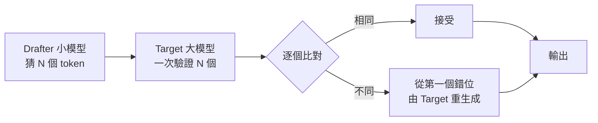
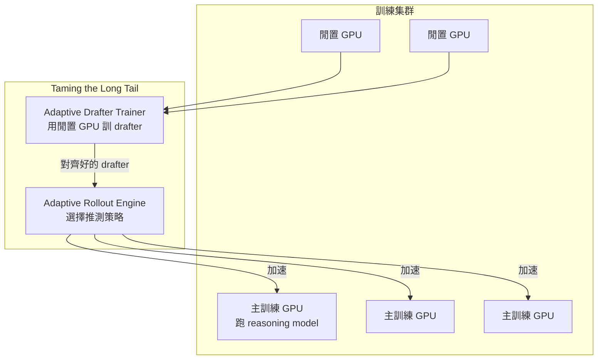

# 推測解碼 + TLT：用閒置 GPU 自動訓練 drafter，把推理模型訓練加速 70–210%

> [!abstract] 一句話理解
> 這是一個用來**加速推理模型（reasoning LLM）訓練**的**動態推測解碼系統**，特別之處在於 **把訓練集群的閒置 GPU 自動拿來訓練一個小模型（drafter），讓它預先猜大模型輸出，大模型只負責驗證關鍵步驟**，總訓練速度提升 70–210%。

## 🎯 為什麼重要

**它解決了什麼問題？**

OpenAI o3、DeepSeek-R1 這類「推理模型」會輸出 `<think>...</think>` 內含長鏈思考——動輒幾千 token。在訓練階段需要做 **rollout**（讓模型自己生成完整 trace 作為 RL 訓練樣本），於是出現一個尷尬的工程問題：

1. **長尾分布**：大部分 token 是常見、容易預測的鋪陳；少數 token 是真正關鍵的推理步驟。
2. **集群等最慢**：rollout 階段所有 GPU 必須等最長那一條 trace 跑完才能進到下一個 batch。
3. **GPU 平均使用率低**：很多卡其實在等待，動不動 30–40% 閒置。

過去業界的解法不外乎：堆更多卡（昂貴）、優化通訊（邊際遞減）、提早終止生成（影響品質）。**沒有人從「閒置算力本身能不能做點別的事」這個角度切入**。

TLT 的回答是：**把閒置卡拿去訓練一個 drafter，再用這個 drafter 加速主模型的 rollout**——同樣的硬體預算內塞進兩件工作。

## 🧠 入門解說（用類比理解）

想像一間鼎泰豐廚房裡有一位主廚 Master 和一個學徒 Apprentice：

- **過去的做法**：每一顆小籠包都由 Master 從頭做。Master 是天才但動作慢，每天只能做 100 顆。
- **TLT 的做法**：
  1. Apprentice 平時跟在 Master 旁邊偷學（用閒置時間）。
  2. 訂單來了，Apprentice 先把皮擀好、餡包好（推測一段輸出）。
  3. Master 只需要檢查、修正最後幾道關鍵步驟（驗證關鍵 token）。
  4. 不對的 Apprentice 把皮重擀，對的就放蒸籠。

**結果**：產量翻倍，但 Master 的菜品標準完全不變。**而且 Apprentice 學成出師後，自己也能獨立接小單（drafter 部署副產品）**。

## 🔑 重點原理

1. **推測解碼（Speculative Decoding）原來是推論技巧**：先用一個小 drafter 猜 N 個 token，大模型一次性 forward 對 N 個都驗證，能驗證通過的就採用、第一個失敗的點開始重猜。推論吞吐量可以 2–4 倍提升。

2. **TLT 的洞察：移到訓練側**：reasoning 模型的訓練需要大量 rollout 樣本，rollout 過程本身就是「自我回歸生成」——同樣可以用推測解碼加速。

3. **Adaptive Drafter Trainer**：訓練集群中有閒置卡時，自動把這些卡分配給「持續訓練 drafter」的任務。drafter 隨主模型一起進步、保持對齊，不影響主訓練的 batch。

4. **Adaptive Rollout Engine**：每個 batch 動態選擇推測解碼策略——對「容易預測」的鋪陳 token 用大 lookahead（一次猜很多）；對「關鍵推理」token 收緊驗證頻率。

5. **「免費」副產品**：訓練結束後，drafter 已是一個與主模型對齊的小模型，可以直接拿去部署用於推論加速，無需再花成本訓練它。

6. **效能數字**：訓練速度提升 70–210%；準確率持平；drafter 副產品可選擇性使用。

## 📊 視覺化說明

### Speculative Decoding 基本概念

### TLT 在訓練集群中的運作

### TLT 帶來的「兩面收益」

| 維度 | 傳統 reasoning model 訓練 | 加上 TLT 後 |
| --- | --- | --- |
| 訓練時間 | 100% | 32–59% |
| GPU 使用率 | 60–70% | >90% |
| 訓練成本 | $X | $X（同硬體預算） |
| 訓練完成產出 | 1 個大模型 | 1 個大模型 + 1 個對齊的 drafter |
| 推論時可選 | 只能用大模型 | 大模型 / drafter / 混合 |

## 🔍 與既有技術的差異

- **vs. 純推論用的 Speculative Decoding**（Leviathan et al. 2023）：原版只用在推論；TLT 把它帶進訓練。
- **vs. Distillation**：Distillation 是訓練完後另起一個 pipeline 蒸出小模型；TLT 把這個過程**內建到主訓練的閒置時間**，幾乎零額外成本。
- **vs. 提早終止 rollout**：提早終止會犧牲長鏈品質；TLT 不犧牲任何品質，只加速。
- **vs. 增加批次大小**：更大 batch 會撞記憶體上限；TLT 用閒置 GPU 補上時間。

## 📚 關鍵詞對照表

| 中文 | 英文 | 簡短解釋 |
| --- | --- | --- |
| 推測解碼 | Speculative Decoding | 小模型先猜、大模型驗證的推論加速 |
| 草稿模型 | Drafter Model | 用於先生成候選 token 的小模型 |
| 目標模型 | Target Model | 真正要服務的大模型 |
| 推理模型 | Reasoning Model | 輸出長鏈思考的 LLM，如 o3、R1 |
| Rollout | Rollout | RL 訓練中讓模型自主生成軌跡的階段 |
| 長尾 | Long Tail | 樣本分布中極長 trace 拖慢整體訓練 |
| 自適應 | Adaptive | 隨輸入特性動態調整策略 |
| 看頭 | Lookahead | 一次推測幾個 token 的視窗大小 |
| 蒸餾 | Distillation | 用大模型教小模型，產生輕量版本 |
| 對齊 | Alignment | drafter 行為與 target 模型相符 |

## 🛠️ 可能的應用場景

1. **Frontier lab 自用**：OpenAI、Anthropic、Google 等訓練推理模型時直接套用。
2. **企業自訓推理模型**：金融、醫療等需要 domain-specific reasoning 模型的企業。
3. **學術界復現實驗**：學術預算下能更快迭代 reasoning 變體。
4. **drafter 副產品商業化**：訓練完的 drafter 直接賣作邊緣裝置推論版本。
5. **混合精度部署**：drafter 用 FP8、target 用 BF16，達成精度與成本最佳平衡。

## 📖 學習路徑建議

1. **先讀**：[Speculative Decoding 原論文（Leviathan et al. 2023）](https://arxiv.org/abs/2211.17192)（推論加速基礎）
2. **再讀**：DeepSeek-R1 / OpenAI o1 system card（理解 reasoning 模型的 rollout 痛點）
3. **再讀**：MIT News 報導與 TLT 論文（本主題）
4. **進階**：論文中引用的 Medusa、EAGLE、Lookahead Decoding 等推測解碼變體
5. **實作**：HuggingFace `assistant_model` API 是 speculative decoding 的最簡入口

## 🎮 互動式學習工具

➡️ **[開啟 TLT 推測解碼模擬器](Interactive/tlt-speculative-decoding-simulator.html)**

上半看 drafter 在 20-token grid 上逐輪預測、target 驗證並重生失敗點，可拖 lookahead 滑桿觀察接受率變化；下半切換「TLT 啟用」開關，看原本閒置的 6 張 GPU 如何被復用去訓練 drafter，集群利用率從 25% 跳到 80%+。

## 🧠 自我測驗 Quiz

1. TLT 系統的兩個核心元件是什麼？
2. drafter 是用什麼算力來訓練的？
3. TLT 把訓練速度提升多少？
4. drafter 訓練好之後還能拿來做什麼？
5. 推測解碼為什麼能「加速但不犧牲品質」？

答案

1. **Adaptive Drafter Trainer**（自適應 drafter 訓練器）與 **Adaptive Rollout Engine**（自適應 rollout 引擎）。
2. **訓練集群中閒置（idle）的 GPU**——不另外採購硬體，把原本浪費的算力轉用。
3. **70–210%**（部分組態甚至翻倍），同時準確率持平。
4. **直接拿去部署，作為推論加速的副產品**——無需再花成本另訓小模型。
5. 因為 drafter 只負責「猜」、target 大模型負責「驗證」。**驗證通過的 token 與大模型自己生成的完全相同**，所以最終輸出分布與單獨大模型一致。

## 🔗 延伸閱讀

- 原文：[MIT News: New method could increase LLM training efficiency](https://news.mit.edu/2026/new-method-could-increase-llm-training-efficiency-0226)
- 對應新聞筆記：[[2026-05-14-MIT TLT 推測解碼加速推理模型訓練]]
- [Speculative Decoding 原論文（Leviathan et al. 2023）](https://arxiv.org/abs/2211.17192)
- [AI Business 報導](https://aibusiness.com/generative-ai/mit-method-cuts-llm-computation)
- 對照學習：[[2026-05-13-學習-Recursive Language Models 遞迴語言模型]]（另一條「異質協同」路線）

---
*由 Claude 自動整理於 2026-05-14*
