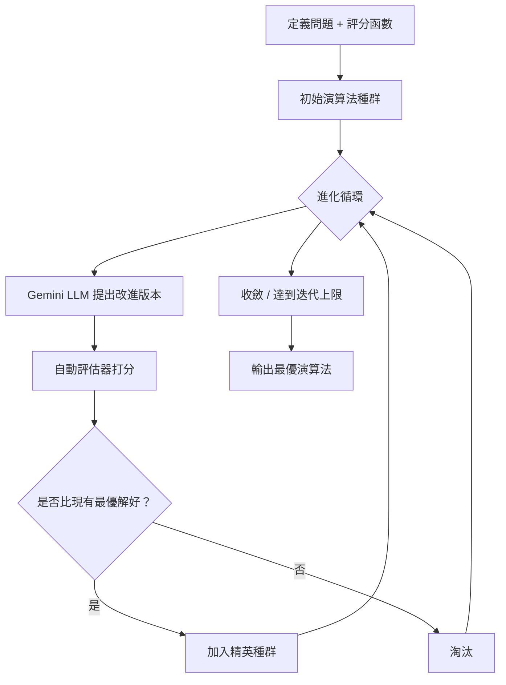

# AlphaEvolve：用 LLM 加速的進化演算法，讓 AI 自己發明演算法

> [!abstract] 一句話理解
> 這是一個用來自動發現更好演算法的 AI 系統，特別之處在於它把大型語言模型（Gemini）的創意和進化算法的系統性搜尋結合起來，讓 AI 不斷提出新演算法、測試效果、保留好的、改進壞的，最終找到人類可能想不到的解法。

## 🎯 為什麼重要

**它解決了什麼問題？**

在此之前，發現一個更好的演算法通常需要：
- 數學家或工程師花費數年研究
- 具備深厚的領域知識
- 難以在多個不同領域同時突破

傳統的自動演算法搜尋（Auto-ML、Neural Architecture Search）雖然能在有限空間內搜尋，但缺乏創意——它們只能在預設的搜尋空間內探索，無法提出真正新穎的想法。

AlphaEvolve 的突破在於：它將 LLM 的「創意提案」能力和進化框架的「系統評估與篩選」能力結合，形成一個能夠在廣泛問題域上自動發現突破性演算法的通用系統。

## 🧠 入門解說（用類比理解）

**科學競賽加速版**

想像一個不停舉辦的科學競賽：

1. **出題**：給定一個明確的問題（如「如何讓 DNA 定序更準確？」）和一個評分標準（錯誤率越低越好）。

2. **提案**：成千上萬的研究生（LLM）提出各種解法，每個人都有不同的靈感和背景知識。

3. **評分**：電腦自動執行每個提案並評分（這一步是關鍵——必須是可自動化評估的問題）。

4. **進化**：拿表現最好的前 10% 提案，讓這些研究生再繼續改進它們（突變和交叉），而不是從零開始。

5. **迭代**：不斷重複，幾千代之後，演算法遠遠超過人工設計的水準。

AlphaEvolve 就是這個流程的自動化版本，而 Gemini 就是那個「提出各種靈感」的角色。

## 🔑 重點原理

1. **進化框架（Evolutionary Framework）**：借鑒生物進化的思想——「適者生存」。系統維護一個「演算法種群」，對高分演算法進行「複製 + 變異」，對低分演算法淘汰，模擬自然選擇的過程。

2. **LLM 作為變異算子**：傳統進化算法的「變異」是隨機改動，效率很低。AlphaEvolve 用 LLM 作為智慧的變異算子——它理解演算法的語義，能提出有意義的改進建議，而不是隨機亂改。

3. **自動評估器（Automated Evaluator）是核心前提**：系統能運作的前提是「有可自動化的評估函數」。DNA 定序錯誤率、路由總距離、矩陣乘法次數——這些都可以用程式自動計算。沒有明確量化目標的問題（如「寫一首好詩」），AlphaEvolve 無法直接應用。

4. **精英保留（Elitism）**：每一代都保留歷史最優解，防止進化過程中「遺忘」好的方案，確保整體趨勢向上。

5. **多輪迭代的累積效應**：單輪 LLM 提案可能只有些微改進，但經過數千輪迭代，累積效果可以超越任何單一的人類努力。AlphaEvolve 發現改進 TPU 設計的電路，就是在 Jeff Dean 都沒有預期的方向上找到的。

## 📊 視覺化說明

### AlphaEvolve 運作流程

### 應用領域 × 改善幅度

| 領域 | 具體問題 | 改善幅度 |
|------|---------|---------|
| 基因組學 | DNA 定序錯誤校正 | 錯誤率降低 30% |
| 電網 | AC 最優潮流可行解 | 14% → 88% |
| 量子物理 | 量子電路設計 | 誤差降低 10× |
| 物流 | 路由優化 | 效率提升 10.4% |
| AI 訓練 | Transformer 訓練速度 | 速度翻倍（Klarna） |
| TPU 設計 | 晶片電路 | 集成至下一代 TPU |

## 🔍 與既有技術的差異

**vs. 傳統進化算法（Genetic Algorithm / CMA-ES）**
傳統進化算法的「突變」是隨機改動（如隨機交換兩個操作），沒有語義理解。AlphaEvolve 用 LLM 作為智慧突變算子，能提出有意義的修改，大幅提高每次突變的「成功率」。

**vs. Neural Architecture Search（NAS）**
NAS 的搜尋空間由人類預定義（如選擇哪種 layer 組合），AlphaEvolve 的搜尋空間由 LLM 開放式生成，理論上不受預設搜尋空間的限制。

**vs. 直接用 LLM 解問題**
直接詢問 LLM「給我一個更好的演算法」只能依賴模型的訓練知識，而 AlphaEvolve 透過自動評估的反饋信號進行迭代改進，能超越 LLM 本身的知識邊界。

## 📚 關鍵詞對照表

| 中文 | 英文 | 簡短解釋 |
|------|------|---------|
| 進化演算法 | Evolutionary Algorithm | 模擬生物進化（變異、選擇、複製）的搜尋算法 |
| 自動評估器 | Automated Evaluator | 可程式化執行以計算方案分數的函數 |
| 零日漏洞 | Zero-day Vulnerability | 軟體開發者尚未知曉的安全漏洞 |
| 精英保留 | Elitism | 進化算法中保留每代最優解的策略 |
| 突變算子 | Mutation Operator | 在進化框架中對候選解進行修改的機制 |
| 演算法發現 | Algorithm Discovery | 自動化地找到比現有演算法更優的新方法 |
| LLM 驅動搜尋 | LLM-driven Search | 以大型語言模型引導搜尋方向的優化方法 |

## 🛠️ 可能的應用場景

1. **企業 AI 模型訓練優化**：如 Klarna 案例，尋找更高效的模型訓練算法，在不增加硬體的前提下加速迭代。

2. **工廠生產排程**：製造業的複雜排程問題（job shop scheduling）有明確的量化目標（最小化完工時間、最大化設備利用率），是 AlphaEvolve 的天然適用場景。

3. **供應鏈路由優化**：類似 FM Logistic 案例，優化配送路徑、倉庫佈局等複雜組合優化問題。

4. **廣告競價策略**：廣告投放的出價策略優化，有清晰的 ROI 評估函數。

5. **資料庫查詢優化**：資料庫引擎的查詢計畫選擇是一個高度結構化的優化問題，潛力巨大。

## 📖 學習路徑建議

1. **先讀**：了解基本的遺傳演算法（Genetic Algorithm）——可用 Khan Academy 或 YouTube 的入門教學
2. **再讀**：AlphaEvolve 原始論文（2025 年發表）：[arXiv: AlphaEvolve: A coding agent for scientific and algorithmic discovery](https://arxiv.org/abs/2506.13131)
3. **再讀**：本文（AlphaEvolve 一週年成果更新）
4. **進階**：OpenEvolve（開源實現）：[Hugging Face Blog](https://huggingface.co/blog/codelion/openevolve)

## 🔗 延伸閱讀
- 原文連結：[AlphaEvolve: Scaling Impact Across Fields](https://deepmind.google/blog/alphaevolve-impact/)
- 對應新聞筆記：[[2026-05-15-AlphaEvolve 進化演算法代理跨領域落地]]
- 商業應用案例：[[2026-05-15-AlphaEvolve 商業落地 Klarna FM Logistic WPP]]
- AlphaEvolve 原始論文（2025）：[deepmind.google/blog/alphaevolve-a-gemini-powered-coding-agent](https://deepmind.google/blog/alphaevolve-a-gemini-powered-coding-agent-for-designing-advanced-algorithms/)

---
*由 Claude 自動整理於 2026-05-15*
