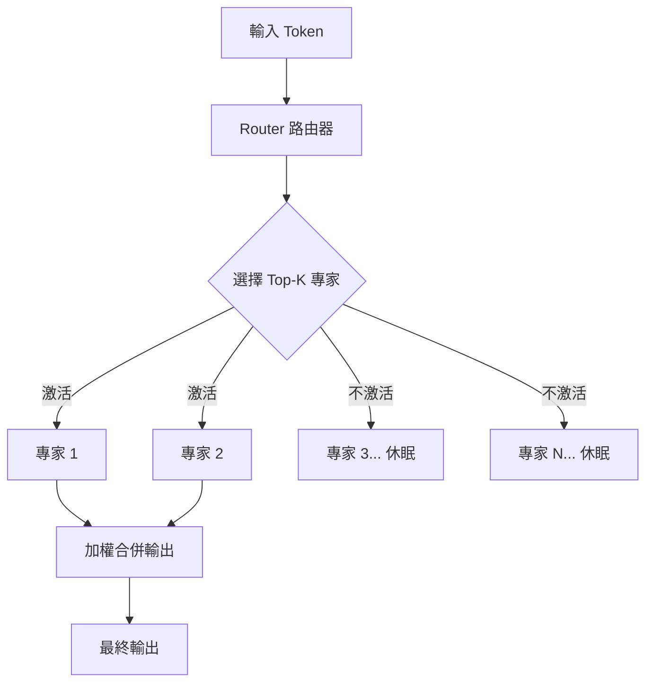

# 混合專家架構（MoE）：為什麼最強的開放模型都選擇它？

> [!abstract] 一句話理解
> 這是一個用來建構大型 AI 模型的架構設計，特別之處在於它把模型分成許多「專科醫生」（專家網路），每次回答問題時只啟動其中幾位最相關的專家，讓模型在擁有龐大知識的同時，每次推理的計算量遠低於等效的密集模型。

## 🎯 為什麼重要

**它解決了什麼問題？**

AI 模型有一個根本的矛盾：

- **知識廣度**需要大量參數（更多神經元 = 能記住更多東西）
- **推理效率**需要少量計算（每次回答只用少量計算）

傳統密集（Dense）模型無法同時滿足兩者——參數多，每次推理就慢且貴。MoE 架構是目前最成熟的解法：讓模型「有很多知識」但「每次只用少部分知識」。

2026 年，中國四大 AI Lab（GLM、MiniMax、Kimi、DeepSeek）全部採用 MoE 架構，Google 的 Gemma 4 也是 MoE。這幾乎已成為前沿開放模型的標準選擇。

## 🧠 入門解說（用類比理解）

**醫院的分診制度**

想像一家有 1000 名醫生的醫院：

- **密集模型的做法**：每個病人進來，全部 1000 名醫生都要看一遍病歷，然後集體會診。效果很好（充分利用所有知識），但非常耗時且昂貴。

- **MoE 的做法**：設一個「分診台」（Gate/Router），病人進來先分診，然後只叫 2-4 名最相關的專科醫生（Experts）來處理。其他 996 名醫生繼續休息。

結果：
- 醫院仍然擁有 1000 名醫生的總知識
- 但每個病人的服務成本只需 2-4 名醫生的工作量
- 服務速度大幅提升

這就是 MoE 的核心邏輯：**「存在但不激活」的參數不消耗計算，但貢獻能力的廣度**。

## 🔑 重點原理

1. **專家網路（Expert Networks）**：MoE 模型將部分網路層（通常是 Feed-Forward Layer）替換為多個並行的「專家」網路，每個專家是一個獨立的 FFN（前饋網路）子模組。

2. **路由器（Router / Gate）**：一個輕量級的路由機制，對每個輸入 Token 計算「應該送給哪些專家」的概率分佈，選擇 Top-K 個專家（通常 K=2 或 K=8）。

3. **稀疏激活（Sparse Activation）**：關鍵在於：雖然模型有 N 個專家，但每次推理只激活 K 個。如果 N = 64、K = 2，那麼每次推理只用了 2/64 ≈ 3% 的專家參數。這直接降低了推理的 FLOPs（浮點運算量）。

4. **總參數 vs. 活躍參數**：這就是為什麼 MoE 模型常有兩個數字——例如 Kimi K2.6 是「1T 總參數，32B 活躍參數」。總參數決定知識上限，活躍參數決定推理成本。

5. **負載均衡（Load Balancing）**：如果路由器永遠只送給少數幾個「熱門」專家，其他專家就浪費了。訓練時需要加入負載均衡損失函數，確保流量均勻分配。

## 📊 視覺化說明

### MoE 運作示意

### 2026 年主要 MoE 模型比較

| 模型 | 總參數 | 活躍參數 | 活躍比例 | 授權 |
|------|--------|---------|---------|------|
| Kimi K2.6 | 1T | 32B | ~3.2% | 開放權重 |
| DeepSeek V4 Pro | 1.6T | 49B | ~3.1% | 開放權重 |
| DeepSeek V4 Flash | 284B | 13B | ~4.6% | 開放權重 |
| GLM-5.1 | 754B | 未公開 | — | MIT |
| Google Gemma 4 MoE 26B | ~160B（推估） | 26B | ~16% | 開放 |

## 🔍 與既有技術的差異

**vs. 密集模型（Dense Model，如早期 GPT）**

密集模型的所有參數在每次前向傳播時都被激活。MoE 只激活一小部分。對比：同等推理成本下，MoE 可以擁有多得多的總參數，因而具備更廣的知識廣度。

**vs. 蒸餾小模型（Distilled Small Model）**

蒸餾通過壓縮大模型的知識到小模型，犧牲了部分能力。MoE 不壓縮，而是「選擇性激活」，在低推理成本的同時保留全部能力上限。

**vs. Mixture of Agents（多代理系統）**

MoE 是單一模型內部的架構，所有專家共享同一個訓練過程；Mixture of Agents 是在推理時協調多個獨立模型。前者效率更高但靈活性較低。

## 📚 關鍵詞對照表

| 中文 | 英文 | 簡短解釋 |
|------|------|---------|
| 混合專家 | Mixture of Experts (MoE) | 模型中包含多個專家網路，每次只激活部分 |
| 稀疏激活 | Sparse Activation | 大量參數存在但每次推理只激活少數 |
| 路由器 | Router / Gating Network | 決定哪些專家接受輸入的機制 |
| 活躍參數 | Active Parameters | 每次推理時實際參與計算的參數量 |
| 總參數 | Total Parameters | 模型所有參數的總數量 |
| 負載均衡 | Load Balancing | 確保各專家接收流量均衡的訓練技巧 |
| FLOPs | Floating Point Operations | 浮點運算次數，衡量推理計算量的指標 |
| 開放權重 | Open Weights | 模型的參數值公開，可以下載和自托管 |

## 🛠️ 可能的應用場景

1. **自托管前沿模型**：GLM-5.1 採用 MIT 授權，DeepSeek V4 可自托管，讓企業在自己的伺服器上運行接近 GPT-5 水準的模型，完全控制數據主權。

2. **低成本大規模推理**：需要大量 AI 請求的應用（如客服、文件處理），MoE 模型可在相同硬體上服務更多請求。

3. **多語言多領域任務**：不同的「專家」自然地分工負責不同語言或領域，MoE 架構在混合任務場景下特別有優勢。

4. **邊緣設備部署**：未來更小的 MoE 模型（如 Flash 變體）可能部署在算力有限的邊緣設備上，活躍參數少意味著記憶體需求也更低。

## 📖 學習路徑建議

1. **先讀**：Shazeer et al., "Outrageously Large Neural Networks: The Sparsely-Gated Mixture-of-Experts Layer"（2017 年 MoE 現代研究的奠基論文）
2. **再讀**：關於 Mixtral（Mistral AI 的 MoE 模型）的技術報告，這是 MoE 在開源社群普及的里程碑
3. **再讀**：DeepSeek V2 技術報告（2024），中國 AI 實驗室如何優化 MoE 訓練效率
4. **進階**：比較 Kimi K2.6、GLM-5.1 的技術報告（如有公開），了解各家的路由器設計差異

## 🔗 延伸閱讀
- 原文連結：[4 Chinese Open-Weights Models in 12 Days](https://www.abhs.in/blog/chinese-open-weights-models-4-in-12-days-glm-minimax-kimi-deepseek-cost-war-2026)
- 對應新聞筆記：[[2026-05-15-中國四大 AI Lab 12天開放權重編碼模型競賽]]
- BenchLM 中國模型排行：[benchlm.ai](https://benchlm.ai/blog/posts/best-chinese-llm)
- 相關學習筆記：[[2026-05-13-學習-Google Gemma 4 MoE 26B 稀疏激活]]

---
*由 Claude 自動整理於 2026-05-15*
