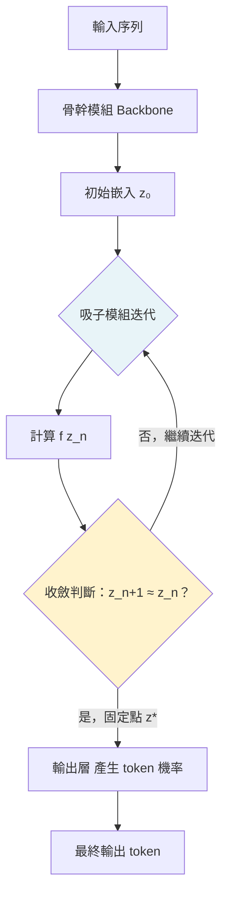

# Attractor Models：讓語言模型「想夠了再說」的架構創新

> [!abstract] 一句話理解
> 這是一個用來讓語言模型對每個 token 進行深度反覆思考的架構，特別之處在於它把「找到穩定答案」這件事轉化為一個固定點數學問題，用隱式微分避免記憶體爆炸，讓模型可以動態分配思考深度而不需要在訓練時固定層數。

## 🎯 為什麼重要

**它解決了什麼問題？**

標準 Transformer 有一個結構性限制：模型的計算深度（層數）在訓練時固定，推理時每個 token 都使用完全相同的計算路徑——無論這個 token 需要深度推理還是只是個簡單停用詞。

兩個問題由此而來：

**問題一：計算資源浪費**
簡單 token 和困難 token 使用同等算力，整體效率低下。Chain-of-Thought（CoT）讓模型在輸出層「多想幾步」，但這需要額外生成 token（佔輸出空間）且不能直接作用於潛在表示（latent space）。

**問題二：深度擴展的邊際收益遞減**
增加 Transformer 層數雖然提升能力，但訓練成本線性上升，且邊際收益遞減。迴圈模型（Looped Models）嘗試多次重複同一層，但訓練不穩定問題嚴重（梯度爆炸）。

Attractor Models 的突破：透過「固定點求解 + 隱式微分」的數學框架，讓模型在潛在空間中對每個 token 進行動態深度迭代精煉，記憶體消耗恆定，訓練穩定，並在大規模預訓練和小型推理模型兩個場景都實現 Pareto 改善。

## 🧠 入門解說（用類比理解）

**雕塑家與調音師的類比**

**傳統 Transformer** 就像一個固定工序的工廠：原料進入後，依序經過 N 道固定工序（N 層），成品出來。無論是大理石還是橡皮泥，都走同樣的工序數。

**Attractor Models** 更像一個雕塑家：
1. 先用標準手法雕出初稿（骨幹模組）。
2. 然後進入一個「反覆審視-修改」的循環（吸子模組）：
   - 看看現在的模樣，覺得哪裡不對，就調整。
   - 直到看了一眼發現「不需要再改了，這就是最終答案」——即「固定點」。

重要的是：簡單的形狀（如正方體）很快就收斂到固定點；複雜的形狀（如人臉）需要更多輪修改。Attractor Models 讓不同 token 自適應地決定「需要修改幾次」，而非固定次數。

「隱式微分」則解決了「如何訓練這個反覆修改的過程」的數學難題——不需要把所有修改步驟都展開記憶（那會爆掉記憶體），而是利用固定點的數學性質直接計算梯度。

## 🔑 重點原理

1. **骨幹模組（Backbone Module）**：標準 Transformer，對輸入序列執行一次前向傳遞，產生初始輸出嵌入 $z_0$。這個模組提供「粗稿」，後續由吸子模組精煉。

2. **吸子模組（Attractor Module）**：接收初始嵌入 $z_0$，求解固定點方程式 $z^* = f(z^*)$，其中 $f$ 是吸子模組的計算函數。固定點 $z^*$ 就是在「自我一致」狀態下的最終輸出嵌入。

3. **固定點求解（Fixed-Point Solving）**：使用不動點迭代（fixed-point iteration）或 Anderson Mixing 等數值方法求解固定點，迭代次數根據收斂條件動態決定（簡單 token 快速收斂，困難 token 多迭代幾次）。

4. **隱式微分（Implicit Differentiation）的關鍵**：直接展開所有迭代步驟計算梯度，記憶體消耗隨迭代次數線性增加，訓練深層次迭代會造成記憶體爆炸。隱式微分利用固定點的數學性質：在固定點處 $\nabla z^* = \nabla f(z^*) / (1 - \nabla f(z^*))$，無需展開整個迭代歷史即可計算準確梯度，記憶體消耗與迭代次數解耦，保持恆定。

5. **Pareto 改善的意義**：Attractor Models 在計算量相同的前提下，所有評估指標均優於基線，沒有任何退步——這是比「某些指標提升但其他退步」更強的宣稱，代表這個架構改動是純粹的改善。

## 📊 視覺化說明

### Attractor Model 的計算流程

### 與相關架構的比較

| 維度 | 標準 Transformer | 迴圈模型（Looped） | Attractor Models |
|---|---|---|---|
| 計算深度 | 固定（N 層） | 固定（重複 N 次） | 自適應（收斂即止） |
| 訓練穩定性 | 高 | 低（梯度爆炸） | 高（隱式微分） |
| 記憶體（梯度計算） | O(N) | O(N×K) | O(1)（與迭代次數無關） |
| 困惑度改善（vs 基線） | — | 接近基線 | 最高 46.6% |
| 下游任務準確率 | — | 略低或持平 | 最高 +19.7% |

## 🔍 與既有技術的差異

**vs. 迴圈模型（Looped Models / Universal Transformers）**
迴圈模型多次重複同一層的計算，但梯度展開導致訓練不穩定和記憶體爆炸。Attractor Models 以隱式微分繞過這個問題，訓練穩定且記憶體效率高。

**vs. Deep Equilibrium Models（DEQ）**
DEQ 是 Attractor Models 的直系前輩，也使用固定點求解和隱式微分。但 DEQ 主要在小型模型（如文字分類）驗證，Attractor Models 是首次在大規模語言模型預訓練規模上成功驗證，且同時覆蓋大型與小型兩個場景。

**vs. Chain-of-Thought（CoT）**
CoT 讓模型在輸出 token 序列中「顯性思考」，增加輸出長度。Attractor Models 的反覆精煉發生在潛在空間中，不產生額外輸出 token，計算效率更高，且可以與 CoT 結合使用。

## 📚 關鍵詞對照表

| 中文 | 英文 | 簡短解釋 |
|---|---|---|
| 固定點 | Fixed Point | 滿足 f(x)=x 的點，即函數對自身的不動點 |
| 隱式微分 | Implicit Differentiation | 利用固定點方程式的隱式關係計算梯度，無需展開計算歷史 |
| 吸子 | Attractor | 動態系統中其他狀態最終被吸引收斂的穩定狀態 |
| 困惑度 | Perplexity | 語言模型預測測試集的指數化交叉熵，越低越好 |
| 潛在表示 | Latent Representation | Transformer 中間層的隱藏狀態向量，含語義資訊 |
| 不動點迭代 | Fixed-Point Iteration | 反覆對函數求值直到輸出收斂的數值方法 |
| Pareto 改善 | Pareto Improvement | 所有維度的指標均改善，沒有任何退步的改進 |

## 🛠️ 可能的應用場景

1. **數學與邏輯推理模型**：固定點迭代允許模型在難題上自動分配更多計算深度，特別適合需要多步推理的數學問題。

2. **低延遲推理模型**：對於簡單問題快速收斂，對複雜問題深度迭代，比固定深度模型在平均延遲上更優。

3. **嵌入生成（Embeddings）**：從固定點狀態 $z^*$ 提取嵌入，理論上包含更豐富的自洽語義資訊，可能改善 RAG、語義搜索等應用的表示品質。

4. **科學問題求解**：配合自動評估器（如 AlphaEvolve 的框架），固定點精煉可用於找到更精確的科學假設表示。

## 📖 學習路徑建議

1. **先讀**：了解 Transformer 基礎架構，特別是注意力機制（Self-Attention）和殘差連接（Residual Connection）——Andrej Karpathy 的「Let's build GPT」是很好的入門。
2. **再讀**：Deep Equilibrium Models（DEQ）——[Bai et al. 2019](https://arxiv.org/abs/1909.01240)——理解固定點求解和隱式微分在神經網路中的應用。
3. **再讀**：Attractor Models 論文（[OpenReview ICLR 2026](https://openreview.net/forum?id=qnLj1BEHQj)）——了解如何在 LLM 規模上驗證。
4. **進階**：隱式微分的數學基礎——可參考 Stanford CS 329D 或相關課程材料。

## 🎮 互動式學習工具

➡️ **[開啟 Attractor 固定點探索器](Interactive/attractor-fixed-point-explorer.html)**

拖動「Token 難度」滑桿即可實時看到潛在向量 $z$ 如何沿著迭代軌跡逼近固定點 $z^*$——簡單 token 幾步就收斂、困難 token 軌跡更曲折。也能切換「隱式微分」開關，對比梯度記憶體在 ON 時保持 $O(d)$ 恆定、OFF 時隨步數線性爆炸的差異，直觀感受 Deep Equilibrium 技巧為何重要。

## 🔗 延伸閱讀
- 原文連結：[Attractor Models（ICLR 2026 OpenReview）](https://openreview.net/forum?id=qnLj1BEHQj)
- 對應新聞筆記：[[2026-05-16-Attractor Models 固定點潛在精煉 LLM 架構]]
- 相關論文：[Concept Attractors in LLMs（ICLR 2026）](https://arxiv.org/html/2601.11575v1)
- 先驅工作：[Deep Equilibrium Models（DEQ）, Bai et al. 2019](https://arxiv.org/abs/1909.01240)

---
*由 Claude 自動整理於 2026-05-16*
