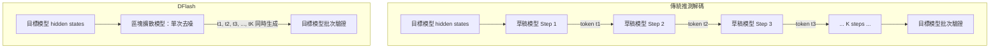

# DFlash：用「區塊擴散」讓推測解碼快上 6 倍

> [!abstract] 一句話理解
> 這是一個用來加速 LLM 生成速度的技術，特別之處在於它把傳統「逐字猜」的草稿模型，換成了「整批並行猜」的擴散模型，讓草稿生成從 K 次串行前向傳遞縮短為 1 次，實現最高 6 倍無損加速。

## 🎯 為什麼重要

**它解決了什麼問題？**

大型語言模型（LLM）的生成是「自回歸」的：每個 token 必須等前一個 token 生成完畢才能開始計算。這個串行瓶頸使得即使模型算力充足，每秒生成的 token 數（throughput）仍然有上限。

「推測解碼（Speculative Decoding）」是目前最主流的推理加速技術：用一個小的草稿模型（draft model）先快速生成多個候選 token，再讓大型目標模型一次批次驗證。但傳統草稿模型本身也是自回歸的——生成 K 個草稿 token，仍需 K 次串行前向傳遞，成為新的瓶頸。

DFlash 的突破在於：用「區塊擴散模型（Block Diffusion Model）」替換自回歸草稿模型，將草稿生成從「K 步串行」改為「1 步並行」，在不影響輸出品質的前提下大幅提升效率。

## 🧠 入門解說（用類比理解）

**快遞預測配送的類比**

想像一個快遞系統：

- **傳統方式**：每次只預測「下一站」，等確認收到才預測「再下一站」（逐步串行）。
- **推測解碼的基礎版**：先由一個「初級預測員」連猜 10 站路徑，再由「主管」一次批改所有猜測。猜對的直接採用，猜錯的重新算。
- **問題**：「初級預測員」自己猜 10 站也是逐一猜的，一樣費時。
- **DFlash 的改進**：換一個可以「一次寫出 10 站猜測」的預測員——這就是擴散模型，它在一次操作中同時填入所有空白位置，不需要串行。

這樣一來，草稿生成的時間從「10 步」縮短到「1 步」，整體速度大幅提升。

## 🔑 重點原理

1. **推測解碼的基本架構**：草稿模型快速生成 K 個候選 token → 目標模型一次批次驗證（接受或拒絕各個 token）→ 被接受的 token 直接採用，節省了對應的自回歸計算步驟。關鍵是目標模型的驗證成本幾乎等同於一次前向傳遞，因此只要草稿接受率夠高，整體就能加速。

2. **區塊擴散模型（Block Diffusion Model）的並行生成**：DFlash 的草稿模型在接收目標模型的隱藏狀態（hidden states）作為條件後，對 K 個「遮蔽位置（masked positions）」執行**一次**去噪步驟（denoising step），同時填入 K 個候選 token。這個「一步出 K 個」的特性來自擴散模型的非自回歸本質。

3. **條件輸入的關鍵作用**：草稿模型以目標模型的隱藏狀態作為語義條件，確保生成的候選 token 與目標模型的輸出分佈高度對齊，維持高接受率。這是 DFlash 能實現高品質加速（無損）而非犧牲輸出品質換速度的技術基礎。

4. **無損保證**：DFlash 採用投機採樣（speculative sampling）的數學框架，可以嚴格證明其輸出分佈與原始目標模型完全相同——加速是純粹的計算效率提升，而非近似。

5. **跨平台相容性**：DFlash 設計為即插即用（plug-and-play），可以無縫整合進 vLLM、SGLang、Transformers 等主流推理框架，無需修改目標模型本身，降低工程整合成本。

## 📊 視覺化說明

### 推測解碼 vs. DFlash 草稿生成對比

### 加速倍數比較

| 方法 | 相對原始推理的加速倍數 |
|---|---|
| 原始自回歸推理 | 1× |
| 傳統推測解碼 | ~2–3× |
| EAGLE-3（前 SOTA） | ~2.5–3.5× |
| **DFlash** | **最高 6×** |

## 🔍 與既有技術的差異

**vs. 傳統自回歸草稿模型（EAGLE、Medusa 等）**
傳統方法的草稿模型仍是自回歸的，生成 K 個草稿 token 需 K 步串行計算。DFlash 用區塊擴散模型，一步並行生成全部 K 個，消除了草稿端的串行瓶頸。

**vs. Speculative Streaming / Lookahead Decoding**
這些方法嘗試用不同的採樣策略或前瞻方式加速，但都受限於自回歸的計算形式。DFlash 從架構上改變了草稿生成的計算方式，加速上限更高。

**vs. 純擴散語言模型（如 MDLM、PLAID）**
這些方法試圖完全用擴散取代自回歸生成，但輸出品質尚不及主流 LLM。DFlash 只在草稿環節用擴散模型，目標模型仍是成熟的自回歸 LLM，兼顧了速度與品質。

## 📚 關鍵詞對照表

| 中文 | 英文 | 簡短解釋 |
|---|---|---|
| 推測解碼 | Speculative Decoding | 以草稿模型預生成候選 token，目標模型批次驗證的加速技術 |
| 草稿模型 | Draft Model | 較小的模型，負責快速生成候選 token |
| 目標模型 | Target Model | 正式使用的大型語言模型，驗證草稿 token |
| 區塊擴散模型 | Block Diffusion Model | 在單次前向傳遞中並行生成 K 個 token 的非自回歸模型 |
| 去噪步驟 | Denoising Step | 擴散模型中將遮蔽位置填入具體值的操作 |
| 隱藏狀態 | Hidden States | Transformer 中每層輸出的中間表示向量，含語義資訊 |
| 無損加速 | Lossless Speedup | 輸出分佈與原始模型完全相同的加速方法 |

## 🛠️ 可能的應用場景

1. **API 服務降本**：對外提供 LLM API 的企業，在同等算力下可服務更多請求，直接降低單次呼叫成本。

2. **即時對話體驗提升**：客服、語音助手等對延遲敏感的場景，6 倍加速可將回應時間從數秒壓縮到亞秒級。

3. **邊緣設備部署**：在 Apple Silicon（MLX）支援下，MacBook 等設備可以以更快速度本地運行 LLM，無需雲端。

4. **Batch Inference 吞吐量提升**：文件處理、大批量摘要等批量任務，在固定算力下可處理更多工作量。

5. **多 Agent 系統加速**：在需要多個 LLM 協作的 Agentic AI 系統中，每個 Agent 的推理加速可以乘數效應疊加整體效能。

## 📖 學習路徑建議

1. **先讀**：了解什麼是推測解碼（Speculative Decoding）——推薦 Google DeepMind 2023 年的原始論文（"Fast Inference from Transformers via Speculative Decoding"）或相關的 YouTube 教學。
2. **再讀**：EAGLE 系列（EAGLE、EAGLE-2、EAGLE-3），了解現有最佳草稿模型的設計思路。
3. **再讀**：DFlash 論文本身（[arXiv:2602.06036](https://arxiv.org/abs/2602.06036)）——理解區塊擴散如何與推測解碼結合。
4. **進階實作**：嘗試在 vLLM 或 SGLang 中部署 DFlash，從 HuggingFace 取得對應模型的草稿模型。

## 🎮 互動式學習工具

➡️ **[開啟 DFlash 區塊擴散模擬器](Interactive/block-diffusion-speculative-decoder.html)**

拖動「區塊長度 K」與「擴散去噪步數」滑桿，即可在上下兩條時間軸跑道上實時對比自回歸 drafter 串行逐 token 點亮 vs DFlash 區塊擴散 drafter 並行同時定型的時序差異，也能切換不同 K 預設來觀察加速倍率與接受率如何隨並行度變化，直觀感受「為什麼把草稿模型換成擴散就能快 6 倍」。

## 🔗 延伸閱讀
- 原文連結：[DFlash: Block Diffusion for Flash Speculative Decoding（arXiv）](https://arxiv.org/abs/2602.06036)
- 對應新聞筆記：[[2026-05-16-DFlash 區塊擴散閃速推理加速]]
- Z Lab 專案頁：[z-lab.ai/projects/dflash](https://z-lab.ai/projects/dflash/)
- GitHub 程式碼：[github.com/z-lab/dflash](https://github.com/z-lab/dflash)
- Google TPU 上的相關技術（3× 加速）：[Google Developers Blog](https://developers.googleblog.com/supercharging-llm-inference-on-google-tpus-achieving-3x-speedups-with-diffusion-style-speculative-decoding/)

---
*由 Claude 自動整理於 2026-05-16*
