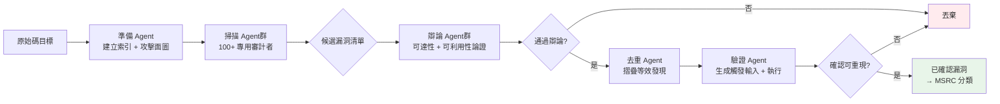

# 多模型代理安全掃描系統（MDASH 框架）

> [!abstract] 一句話理解
> MDASH 是微軟用來自動發現自身程式碼漏洞的 AI 系統——它不依賴單一模型，而是讓 100 多個專用 Agent 分工合作，像真人資安團隊一樣協作：有人找漏洞、有人辯論可信度、有人動手驗證。

## 🎯 為什麼重要

軟體漏洞發現是資安領域最耗時、最昂貴的工作之一。傳統的漏洞發現依賴：
1. **模糊測試（Fuzzing）**：自動發送隨機輸入，但難以發現複雜的邏輯漏洞
2. **人工代碼審查**：精準但極度耗時，且受限於審查員的個人知識和注意力
3. **商業靜態分析工具**：誤報率高，嚴重消耗工程師精力

MDASH 的重要性在於它**首次讓 AI 漏洞發現從研究概念跨越到生產級防禦**：在本月的 Patch Tuesday 中，MDASH 貢獻了 16 個真實 CVE，包含 4 個嚴重遠端程式碼執行漏洞——這些漏洞存在於 Windows 私有程式碼庫，任何商用語言模型的訓練資料都未曾見過這些程式碼。

此外，MDASH 的設計哲學「**模型是輸入，系統才是產品**」對整個 AI 應用開發領域都有深遠啟發。

## 🔑 入門解說（用類比理解）

想像 MDASH 是一個「AI 驅動的漏洞賞金獵人團隊」，但這個團隊的每個成員都是 AI Agent：

**第一步：偵察員（準備階段 Agent）**
進入目標程式碼庫，建立地圖——哪些函數接收外部輸入？哪些功能在過去五年出過問題？這是攻擊面地圖。

**第二步：審計員（掃描階段 Agent）**
根據地圖，100+ 個專業審計員同時對不同的程式碼路徑進行深度分析，找出潛在漏洞候選清單。不同的審計員使用不同的模型，因為沒有哪個模型在所有類型的漏洞上都最強。

**第三步：辯論者（驗證階段 Agent）**
對每個候選漏洞，辯論者的任務是反駁：「這個漏洞真的可以被利用嗎？攻擊路徑是否可達？」只有能通過辯論的漏洞才能晉級。

**第四步：去重員（去重階段）**
多個審計員可能發現同一個漏洞的不同表述，去重員負責識別語義上等效的發現。

**第五步：實驗員（驗證階段）**
最終通過的候選漏洞，由 AI 自動生成觸發性的測試輸入，在實際編譯的程式碼上執行，確認漏洞真實存在。

## 📐 重點原理

### 五階段流水線

```
原始碼 → 準備 → 掃描 → 驗證（辯論）→ 去重 → 驗證（執行）→ 已確認漏洞
```

每個階段都是可插拔的，這意味著：
- 更好的模型上線時，只需替換配置，不需重寫整個系統
- 可以為特定程式語言或漏洞類型客製化特定 Agent

### 三大核心屬性

**1. 多模型集成（Multi-Model Ensemble）**

MDASH 同時運行多個模型組合：
- **頂尖推理模型**：負責複雜、跨檔案的漏洞分析（高計算成本，低數量）
- **蒸餾模型**：作為高吞吐量的辯論者（低成本，高數量）
- **獨立第二頂尖模型**：作為反例提供者，避免集成模型的同質性偏誤

**2. 專用 Agent 分工**

每個 Agent 只做一件事，而且做到最好：
- 審計 Agent ≠ 辯論 Agent ≠ 驗證 Agent
- 專用化讓每個 Agent 的提示詞和工具選擇都可以針對特定任務優化

**3. 可擴展插件架構**

插件解決了大型語言模型的根本限制：基礎模型無法了解私有、未公開的程式碼庫。插件由領域專家編寫，注入：
- 特定函數的歷史漏洞模式
- 內部 API 的使用規範和安全假設
- 程式碼庫特定的攻擊面知識

### 關鍵技術細節：如何處理私有程式碼庫

Windows、Hyper-V、Azure 的程式碼從未出現在任何公開訓練資料中。MDASH 透過以下方式克服這個限制：
- **語言感知索引**：在準備階段建立程式碼結構的語意索引，讓 Agent 能高效定位相關程式碼
- **歷史提交分析**：分析過去的安全修補 commit，識別「這類改動通常修復什麼類型的問題」
- **插件注入上下文**：讓專家知識補充模型的通用能力

## 📊 視覺化說明



### MDASH 基準測試成績

| 測試集 | 測試範圍 | 成績 |
|---|---|---|
| clfs.sys 歷史案例 | 過去 5 年 28 個 MSRC 案例 | **96% 召回率** |
| tcpip.sys 歷史案例 | 過去 5 年 7 個 MSRC 案例 | **100% 召回率** |
| CyberGym 公開基準 | 1,507 個真實漏洞重現任務 | **88.45%（排名第一）** |
| 排行榜第二名 | — | 83.1%（差距 ~5 個百分點） |

## 🔄 與既有技術的差異

| 方法 | 優點 | 缺點 | MDASH 的改進 |
|---|---|---|---|
| 模糊測試（Fuzzing） | 自動化，規模大 | 難發現邏輯漏洞，需要程式執行 | MDASH 能進行靜態語意分析 |
| 人工代碼審查 | 精準，有上下文理解 | 極慢，人力成本高 | 100x 規模化 |
| 靜態分析工具（SAST） | 快速，可自動化 | 誤報率高，缺乏語意理解 | 多層驗證大幅降低誤報 |
| 單一 LLM 代碼分析 | 有語意理解 | 上下文視窗有限，無法跨文件推理 | 分散式 Agent 協作克服此限制 |

## 📚 關鍵詞對照表

| 中文術語 | 英文術語 | 說明 |
|---|---|---|
| 多模型代理掃描框架 | Multi-model Agentic Scanning Harness (MDASH) | 微軟的 AI 漏洞發現系統 |
| 使用後釋放漏洞 | Use-After-Free (UAF) | 記憶體已被釋放後仍被訪問的安全漏洞 |
| 遠端程式碼執行 | Remote Code Execution (RCE) | 攻擊者能遠端在目標系統執行任意程式碼 |
| 模糊測試 | Fuzzing | 自動發送隨機/畸形輸入以觸發程式崩潰 |
| 攻擊面 | Attack Surface | 系統中可能被攻擊者利用的所有輸入點 |
| 靜態分析 | Static Analysis | 不執行程式碼，直接分析原始碼的安全方法 |
| 動態分析 | Dynamic Analysis | 執行程式碼以觀察其行為的安全方法 |
| 召回率 | Recall | 在所有實際漏洞中，系統找到的比例 |
| CVE | Common Vulnerabilities and Exposures | 公開已知安全漏洞的標準編號系統 |
| MSRC | Microsoft Security Response Center | 微軟安全回應中心 |

## 🌐 可能的應用場景

**企業內部程式碼安全審計**：任何有大規模私有程式碼庫的企業（銀行、電信、製造業）都可以借鑒 MDASH 的架構，建立針對自身程式碼特性的 AI 漏洞掃描系統。

**開源專案安全維護**：CyberGym 基準顯示 MDASH 在開源項目（OSS-Fuzz 覆蓋範圍）同樣表現優異，可應用於大型開源基礎設施的安全維護。

**資安服務供應商（MSSP）**：可建立「AI 增強的滲透測試服務」，使用 MDASH 類框架自動化初步漏洞發現，讓人類專家聚焦在高複雜度的漏洞利用分析。

**DevSecOps 整合**：在 CI/CD 流水線中嵌入精簡版的多 Agent 安全掃描，在每次程式碼提交時自動觸發。

## 🗺️ 學習路徑建議

**入門準備（1-2 週）**
- 了解常見漏洞類型：UAF、Buffer Overflow、SQL Injection 的基本概念
- 了解什麼是 CVE 和 CVSS 評分系統
- 閱讀 OWASP Top 10 了解 Web 安全常見問題

**核心理解（2-3 週）**
- 學習靜態分析工具（如 CodeQL、Semgrep）的工作原理
- 了解 AI Agent 和多 Agent 系統的基本架構
- 學習什麼是模糊測試（Fuzzing）及其工具（AFL、libFuzzer）

**進階應用（3-4 週）**
- 閱讀 DARPA AI Cyber Challenge (AIxCC) 相關技術文章
- 研究 CodeQL 和 LLM 結合的現有工作
- 嘗試使用 LLM API 建立簡單的代碼審計 Agent 原型

## 🎬 推薦影片

- [DARPA AIxCC 介紹](https://www.youtube.com/results?search_query=DARPA+AI+Cyber+Challenge) — 了解 MDASH 前身 Team Atlanta 的競賽背景
- [Fuzzing Explained](https://www.youtube.com/results?search_query=fuzzing+security+explained) — 理解 MDASH 要解決的傳統方法限制
- [Use After Free Vulnerability Explained](https://www.youtube.com/results?search_query=use+after+free+vulnerability+explained) — 理解 MDASH 發現的核心漏洞類型

## 📖 進階閱讀

- [Microsoft Security Blog 原文](https://www.microsoft.com/en-us/security/blog/2026/05/12/defense-at-ai-speed-microsofts-new-multi-model-agentic-security-system-tops-leading-industry-benchmark/) — MDASH 完整技術介紹
- [CyberGym 基準測試](https://github.com/cybergym-project/cybergym) — 了解行業基準的設計
- [CodeQL 官方文件](https://codeql.github.com/) — 靜態分析工具，可作為 MDASH 插件的補充工具

## 🧠 自我測驗 Quiz

> [!question] Q1：MDASH 的五個流水線階段依序是什麼？
> 試著從「拿到程式碼」到「確認漏洞」的順序重建流水線。

> [!success] 答案
> 準備（建立索引）→ 掃描（找候選漏洞）→ 驗證（辯論可利用性）→ 去重（摺疊等效發現）→ 驗證（執行觸發輸入）

> [!question] Q2：為什麼 MDASH 要使用多個不同的模型，而不是用最強的單一模型？
> 提示：想想「高計算成本」和「高吞吐量」的取捨。

> [!success] 答案
> 沒有單一模型在所有階段都最優。頂尖推理模型成本高，不適合作為高數量的辯論者；蒸餾模型吞吐量高，適合快速過濾大量候選。多模型集成讓系統能在每個階段選擇最合適的工具，並透過獨立第二模型作為反例，避免集成模型的同質性偏誤。

> [!question] Q3：MDASH 如何處理「私有程式碼庫不在任何訓練資料中」的問題？
> 核心挑戰：AI 模型的知識截止於訓練資料，但 Windows 程式碼是私有的。

> [!success] 答案
> 透過三個機制：(1) 準備階段建立語言感知索引，讓 Agent 能定位相關程式碼；(2) 分析歷史安全提交，識別漏洞模式；(3) 插件架構讓人類專家注入基礎模型無法自行獲取的上下文知識。

## 🔗 延伸閱讀

- 來源文章：[[Articles/2026-05-16-Microsoft MDASH AI安全漏洞掃描系統]]
- 相關筆記：[[2026-05-16-學習-多模態強化學習代理驗證]]（同為微軟代理系統研究）

---
*由 Claude 自動整理於 2026-05-16*
