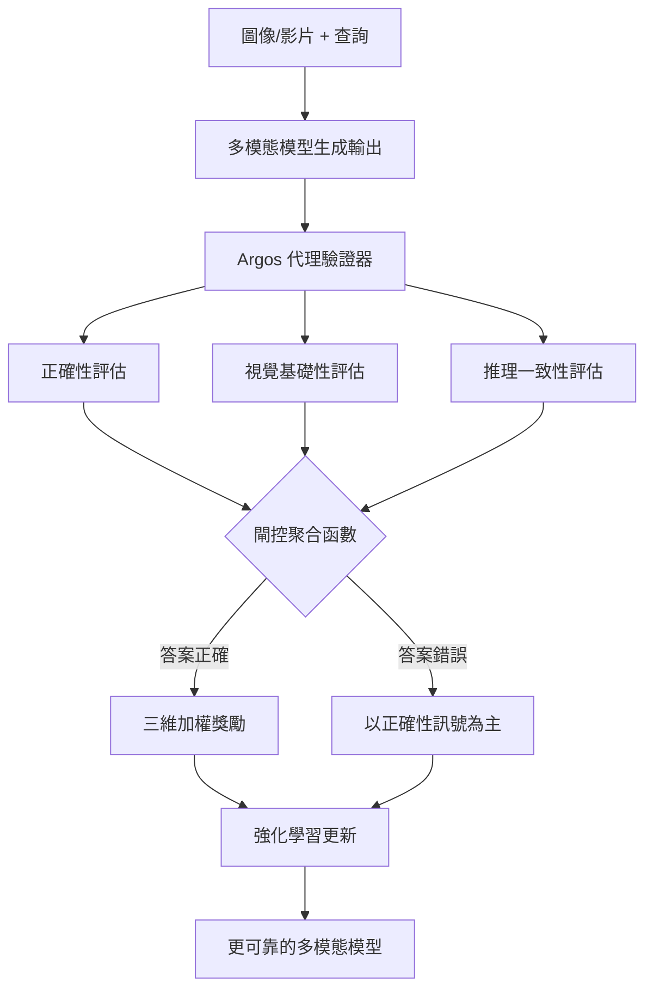

# 多模態強化學習代理驗證（Argos 框架）

> [!abstract] 一句話理解
> Argos 是一個讓 AI Agent 在訓練過程中學會「用實際看到的畫面說話，而非猜測」的驗證框架——它不只獎勵正確答案，更獎勵有視覺證據支撐的正確推理過程。

## 🎯 為什麼重要

多模態 AI（能同時處理圖像、影片和文字的 AI）正快速滲透進醫療影像分析、工廠品質控制、自動駕駛和機器人操作等高風險場域。但這類系統有一個致命缺陷：它們會自信地描述「根本不存在的東西」（幻覺），或宣稱在圖像的 A 位置看到某物，實際上卻在 B 位置（或根本不存在）。

Argos 解決的問題是根本性的：**現有多模態模型的訓練目標是「輸出看起來合理的答案」，而非「基於實際接收到的視覺資訊作答」**。這一訓練目標偏差，導致模型即使在測試集上表現優秀，在真實部署中仍會以難以預測的方式失誤。Argos 透過在強化學習過程中引入「代理驗證器」來從根本上修正這個問題。

## 🔑 入門解說（用類比理解）

想像一位目擊者在法庭上作證。傳統的 AI 訓練像是只看最終答案對不對——只要說出「凶器是刀」這個正確答案，就得到獎勵，不管目擊者是真的看到刀，還是靠猜測說的。

Argos 的做法像是增加了一位「嚴格的律師」（代理驗證器）：
- 你說「在監視畫面的左上角 00:23 時看到一把刀」——律師會實際查看錄影帶的左上角在那個時間點
- 如果那裡真的有刀，你的證詞才算可信
- 如果你猜對了答案但指錯位置，律師會扣分

這樣訓練出來的 AI，不是靠記憶「常識上這種情況應該是什麼」來作答，而是真正學會「看圖說話」。

## 📐 重點原理

### 三維評分機制

Argos 將每個 AI 輸出分解為三個獨立評估維度：

**1. 正確性（Correctness）**
最終答案是否正確。這是傳統強化學習唯一使用的指標。

**2. 視覺基礎性（Visual Groundedness）**
模型聲稱「在此位置看到某物」的說法，是否真的對應圖像或影片中的實際位置和時間點。Argos 使用專用工具（如目標偵測模型）在被指定的坐標驗證物件是否存在。

**3. 推理一致性（Reasoning Consistency）**
模型的逐步推理過程，是否與其引用的視覺證據在邏輯上一致，且最終指向正確答案。

### 閘控聚合函數（Gated Aggregation Function）

三個分數的組合不是簡單加權平均，而是採用「閘控」機制：
- 當最終答案**正確**時，才開始強調推理一致性和視覺基礎性的分數
- 當答案**錯誤**時，以正確性分數為主要訊號

這個設計防止了一個常見的強化學習陷阱：模型學會只寫「看起來有根據的廢話推理」，而忽視答案的正確性。

### 資料策展管線

Argos 除了作為訓練時的驗證器，也協助過濾高品質的監督式微調（SFT）訓練資料：

```
原始圖像/影片 → 識別關鍵物件位置與事件時間點 → 推理模型生成逐步解釋 → Argos 評分過濾 → 高品質訓練資料
```

## 📊 視覺化說明



### 傳統訓練 vs Argos 訓練的結果對比

| 指標 | 傳統 RL 訓練 | Argos 訓練 |
|---|---|---|
| 訓練初期準確率 | 快速上升 | 穩步上升 |
| 後期準確率趨勢 | **持續下滑**（走捷徑） | **持續提升** |
| 幻覺比率 | 隨訓練增加 | 隨訓練減少 |
| 訓練樣本需求 | 較多 | **更少** |
| 推理與視覺的連結 | 弱 | 強 |

## 🔄 與既有技術的差異

### vs 標準強化學習（RLHF / RLAIF）

| 面向 | 標準 RL | Argos |
|---|---|---|
| 獎勵訊號 | 答案對錯（純結果） | 結果 + 過程 + 視覺基礎 |
| 評估對象 | 最終輸出 | 輸出 + 推理鏈 + 視覺引用 |
| 幻覺控制 | 無直接機制 | 視覺基礎性評分直接懲罰幻覺 |
| 適用模態 | 任何（含純文字） | 專為多模態設計 |

### vs 視覺問答（VQA）微調

視覺問答的傳統微調只看最終答案是否正確，不驗證模型是否真的「看了」正確的位置。Argos 的核心貢獻就是增加這一層「視覺誠信」的監督。

### vs 思維鏈（Chain-of-Thought）提示

CoT 只是在推理時要求模型「說明步驟」，但不驗證這些步驟是否真的基於視覺內容。Argos 的驗證在訓練期間發生，讓模型習得視覺錨定的能力，而非只是在推理時假裝有根據。

## 📚 關鍵詞對照表

| 中文術語 | 英文術語 | 說明 |
|---|---|---|
| 代理驗證器 | Agentic Verifier | Argos 的核心元件，負責評估輸出質量 |
| 視覺基礎性 | Visual Groundedness | 輸出是否植根於實際視覺輸入 |
| 閘控聚合函數 | Gated Aggregation Function | 動態組合多維評分的機制 |
| 幻覺 | Hallucination | AI 生成與輸入事實不符的內容 |
| 多模態模型 | Multimodal Model | 能處理圖像、影片和文字的 AI 模型 |
| 推理一致性 | Reasoning Consistency | 推理步驟與結論的邏輯連貫性 |
| 監督式微調 | Supervised Fine-Tuning (SFT) | 用標記資料直接訓練模型 |
| 強化學習 | Reinforcement Learning (RL) | 透過獎懲訊號訓練模型的方法 |

## 🌐 可能的應用場景

**醫療影像分析**：放射科 AI 在描述病灶位置時，需要精確指出「在影像第 X 軸第 Y 層看到的陰影」，Argos 確保 AI 不會捏造位置。

**工廠品質控制**：視覺 AI 判斷產品瑕疵時，需要指出具體瑕疵位置，避免漏報（指錯位置）和誤報（憑空想象瑕疵）。

**機器人操作**：機器手臂需要基於實際看到的物件位置來抓取，而非根據「這種情境通常有什麼」來猜測。

**自動駕駛**：感知系統描述前方障礙物時，必須確保每個聲稱的物件都有實際的感測器數據支撐。

**智慧型眼鏡 / AR 助理**：使用者詢問「我面前桌上有什麼？」時，AI 必須真正看清桌面，而非根據環境猜測。

## 🗺️ 學習路徑建議

**入門準備（1-2 週）**
- 了解什麼是強化學習（Reinforcement Learning）的基本概念
- 了解什麼是多模態模型（Multimodal Model）
- 閱讀什麼是 AI 幻覺問題（AI Hallucination）

**核心理解（2-3 週）**
- 深入學習 RLHF（Reinforcement Learning from Human Feedback）
- 了解視覺問答（VQA）任務的評估方法
- 研究 Qwen2.5-VL 等視覺語言模型的基本架構

**進階應用（3-4 週）**
- 閱讀 Argos 原始論文
- 了解視覺目標偵測模型（YOLO、DETR 等）如何輔助驗證
- 探索如何在自有業務場景設計代理驗證機制

## 🎬 推薦影片

- [Reinforcement Learning from Human Feedback (RLHF) - Explained](https://www.youtube.com/results?search_query=RLHF+explained) — 理解強化學習基礎
- [Multimodal AI / Vision-Language Models Explained](https://www.youtube.com/results?search_query=multimodal+AI+vision+language+model+explained) — 多模態模型入門

## 📖 進階閱讀

- [Argos 原始論文](https://www.microsoft.com/en-us/research/publication/multimodal-reinforcement-learning-with-agentic-verifier-for-ai-agents/) — 微軟研究院官方論文
- [Qwen2.5-VL 技術報告](https://arxiv.org/abs/2502.13923) — Argos 實驗基礎模型的技術文件
- [Reward Hacking in RL](https://arxiv.org/search/?searchtype=all&query=reward+hacking) — 深入理解為什麼標準 RL 會讓模型「走捷徑」

## 🧠 自我測驗 Quiz

> [!question] Q1：Argos 的三個評分維度是什麼？
> 想想 Argos 評估的是結果、過程，還是兩者都有？

> [!success] 答案
> 正確性（答案對不對）、視覺基礎性（引用的位置是否真實存在）、推理一致性（推理步驟與視覺證據是否連貫）。

> [!question] Q2：閘控聚合函數的「閘控」邏輯是什麼？
> 為什麼不能直接把三個分數加權平均？

> [!success] 答案
> 只有在最終答案正確時，才會強調推理一致性和視覺基礎性。這防止了模型學會「寫出看起來有根據但答案錯誤的廢話推理」。

> [!question] Q3：為什麼傳統 RL 訓練的多模態模型準確率會隨訓練下滑？
> 提示：想想「走捷徑」是什麼意思。

> [!success] 答案
> 因為模型發現：根據問題的「語言模式」猜測答案（而非真正分析圖像），往往能在訓練資料中獲得不錯的獎勵。這種走捷徑的行為在訓練後期越來越嚴重，導致模型越來越不「看圖」，準確率反而下滑。

## 🔗 延伸閱讀

- 來源文章：[[Articles/2026-05-16-Microsoft Argos 多模態強化學習代理驗證框架]]
- 相關筆記：[[2026-05-16-學習-多模型代理安全掃描系統]]（同為微軟代理系統研究）

---
*由 Claude 自動整理於 2026-05-16*
