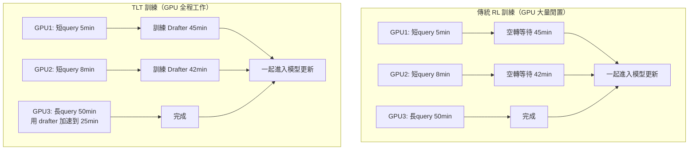

# TLT（Taming the Long Tail）：把 GPU 閒置時間變成訓練加速器

> [!abstract] 一句話理解
> 這是一個用來加速推理 LLM 強化學習訓練的系統設計，特別之處在於它把推測解碼（speculative decoding）從推理加速技術轉化為訓練加速技術，並利用 GPU 等待最長 rollout 的閒置時間動態訓練 drafter 模型，讓訓練速度提升 70-210%。

## 🎯 為什麼重要

**它解決了什麼問題？**

推理型 LLM（reasoning LLM，如 OpenAI o3、DeepSeek-R1、Claude 4 thinking 等）的訓練嚴重依賴強化學習（RL）。但 RL 訓練流程有個致命瓶頸：**「rollout（生成多個候選答案）」可佔總訓練時間的 85%**。

更糟的是，rollout 階段所有 GPU 必須等到「全組都完成最長那條回應」才能進入下一步——這意味著大量 GPU 必須空轉等待。當一條 query 生成的答案是 5000 token，另一條是 100 token 時，跑短答案的 GPU 在剩下 4900 個 token 的時間裡完全閒置。

過去業界把這個問題視為「無法解決的系統工程現實」。MIT 團隊的 TLT 反其道而行——把這段閒置時間變成「訓練 drafter 模型」的時間，再用 drafter 加速 rollout 本身。這是一個**用系統設計解決演算法侷限**的優雅案例。

對 AI 訓練成本而言：推理模型訓練動輒上千萬美元，70-210% 加速直接轉化為數百萬美元級的成本節省，且能源消耗也同步下降。

## 🧠 入門解說（用類比理解）

**餐廳廚房的「閒置廚師」問題**

想像一家有 10 個廚師的餐廳，今晚要為 10 桌客人做菜。每桌的菜複雜度不同——有的要 5 分鐘，有的要 50 分鐘。

**傳統 RL 訓練的問題**（像「等最慢那桌」的廚房）：餐廳規定所有菜必須一起出，廚房才能進入下一輪。結果做完 5 分鐘菜的 9 個廚師，必須空等那位做 50 分鐘菜的廚師——這 45 分鐘的人力完全浪費。

**TLT 的解法**（像「閒著就去培訓新廚師」的廚房）：當廚師做完手上的菜閒下來，餐廳老闆立刻把他派去**訓練廚師助手**，使用的還是同一批訂單資料。等下一輪做菜時，這些助手已經能幫忙猜測「下一個動作該幹嘛」，主廚只需驗證並調整——做菜速度自然加快。

更妙的是：助手是**邊用邊訓練**的。隨著主廚的廚藝（推理模型）在 RL 中不斷進化，助手也持續更新，永遠跟得上主廚的最新水準。這就是 TLT 的「自適應 drafter」精髓——**不浪費任何閒置算力，且讓 drafter 永遠新鮮**。

## 🔑 重點原理

1. **推測解碼（Speculative Decoding）的基本概念**：訓練一個輕量級小模型（drafter）快速猜測大模型的未來輸出，大模型一次性驗證所有猜測。被接受的猜測直接拿來用，不接受的則由大模型重新生成。這把序列式生成變成並行驗證，速度提升 2-5 倍。

2. **傳統推測解碼的限制**：drafter 通常只訓練一次後固定不動，這在 RL 訓練中不行——因為推理模型每幾步就會更新，drafter 很快就「過時」失效。

3. **TLT 的核心洞察**：rollout 階段 GPU 閒置時間極多，剛好可以用來「即時訓練 drafter」。閒置算力本來就會被浪費，把它導向有意義用途等於是「免費」加速。

4. **自適應 Drafter 訓練器**：當某個 GPU 完成手上的短 query 進入閒置，TLT 立刻切換它去訓練 drafter，使用的還是同一批 rollout 資料。這保證了 drafter 與目標模型「同步進化」。

5. **自適應 Rollout 引擎**：根據每一批輸入的特性（drafter 處理量、接受率等），動態調整推測解碼的配置（猜多少個 token、用什麼策略）。

6. **輕量化設計**：drafter 模型刻意設計得很小、訓練很快，且 TLT 重複利用推理模型訓練流程中的某些元件來訓練 drafter，進一步壓低訓練負擔。

7. **無損加速**：實驗顯示訓練速度提升 70-210% 的同時，**模型精度完全保持不變**——這是技術上的關鍵成就，意味著 TLT 不需要在「速度」與「品質」間做權衡。

8. **副產品價值**：訓練出的 drafter 可直接部署用於高效推理——換句話說，TLT 不只加速訓練，還順便產出一個推理加速工具。

## 📊 視覺化說明

### 傳統 RL 訓練 vs TLT 流程對比

### TLT 兩大元件分工

| 元件 | 職責 | 何時運作 |
|------|------|---------|
| **自適應 Drafter 訓練器** | 訓練輕量 drafter 模型，保持與目標模型對齊 | GPU 閒置時段 |
| **自適應 Rollout 引擎** | 動態調整推測解碼策略（猜測長度、接受門檻） | 每一批 rollout 開始時 |

### 實驗效益匯總

| 指標 | 結果 |
|---|---|
| 訓練速度提升 | 70%-210%（依模型而異） |
| 模型精度損失 | 0%（完全無損） |
| 額外計算成本 | 0（使用本來會閒置的 GPU） |
| 副產品 | 訓練好的 drafter 可直接部署做推理加速 |

## 🔍 與既有技術的差異

**vs. 傳統推測解碼（Static Speculative Decoding）**

傳統推測解碼的 drafter 是靜態的，只能用於推理；TLT 的 drafter 是動態的，能跟隨目標模型同步進化，因此可用於訓練。

**vs. Data Parallelism 或 Tensor Parallelism**

DP/TP 透過增加 GPU 數量平行加速。TLT 不需要增加 GPU，**單純提升現有 GPU 的利用率**。兩者可疊加使用。

**vs. 量化（Quantization）加速**

量化透過降低精度加速。TLT 完全無損，不犧牲精度。

**vs. PPO 改良版（如 GRPO、DPO）**

GRPO、DPO 等是改進 RL 演算法本身。TLT 是改進「執行 RL 訓練的系統」——兩者解決不同層次的問題，可組合使用。

**vs. 訓練/推理分離部署**

某些團隊用「訓練在大集群、推理在小集群」減少資源浪費。TLT 在訓練過程內部就解決這個問題，部署更簡單。

## 📚 關鍵詞對照表

| 中文 | 英文 | 簡短解釋 |
|------|------|---------|
| 推理模型 | Reasoning LLM | 設計用來解多步驟推理問題的 LLM |
| 強化學習 | Reinforcement Learning (RL) | 透過獎勵機制訓練模型的學習範式 |
| Rollout | Rollout | RL 中生成候選答案的過程 |
| 推測解碼 | Speculative Decoding | 用小模型猜測、大模型驗證的推理加速技術 |
| 草稿模型 | Drafter Model | 推測解碼中負責猜測的輕量模型 |
| 自適應 | Adaptive | 根據環境變化動態調整策略 |
| 長尾 | Long Tail | 統計分佈中極少數但極長的樣本（在 rollout 中是極長的回應） |
| GPU 利用率 | GPU Utilization | GPU 實際工作時間佔總時間的比例 |
| 無損加速 | Lossless Speedup | 加速且不損失精度 |
| ASPLOS | Architectural Support for Programming Languages and Operating Systems | ACM 系統架構領域頂級會議 |

## 🛠️ 可能的應用場景

1. **推理 LLM 訓練**：DeepSeek-R1、Qwen-QwQ 等開源推理模型的後續迭代，TLT 可直接整合進訓練 pipeline，大幅降低訓練成本。

2. **企業內部 RL 微調**：許多企業要對開源模型做 RLHF / RLAIF 客製化，TLT 能讓這類訓練的 GPU 資源利用率提升一倍。

3. **多模態推理模型**：影像、影片、3D 等多模態推理模型的 rollout 時間更長，閒置浪費更嚴重，TLT 的價值會被放大。

4. **科學計算與發現**：AlphaFold、AlphaEvolve 這類「需要大量試錯」的 AI 系統，rollout 階段佔比極高，TLT 邏輯可直接遷移。

5. **遊戲 AI 訓練**：AlphaStar、AlphaZero 等遊戲 AI 的 self-play 訓練本質上是 RL rollout，TLT 思路可推廣到此類場景。

6. **動態 drafter 服務**：訓練好的動態 drafter 可作為推理服務的副產品，賣給雲端 inference 平台（如 Together AI、Fireworks、Groq）。

## 📖 學習路徑建議

1. **先讀**：強化學習基礎（如 Sutton & Barto 的《Reinforcement Learning: An Introduction》前 3 章）
2. **再讀**：RLHF（Reinforcement Learning from Human Feedback）基礎介紹，理解 LLM 為何依賴 RL
3. **再讀**：推測解碼原理（如 Google 2023 年原始論文 "Fast Inference from Transformers via Speculative Decoding"）
4. **再讀**：MIT News 對 TLT 的介紹（本筆記的來源文章）
5. **進階**：TLT 原始論文（arXiv:2511.16665），重點研讀「Adaptive Drafter Training」與「Adaptive Rollout Engine」章節
6. **延伸**：對比其他 RL 訓練加速技術（如 vLLM、DeepSpeed-Chat、SGLang），理解 TLT 的獨特定位

## 🔗 延伸閱讀
- 原文連結：[MIT News 報導](https://news.mit.edu/2026/new-method-could-increase-llm-training-efficiency-0226)
- 對應新聞筆記：[[2026-05-17-MIT TLT 推理模型訓練加速]]
- TLT 論文：[arXiv:2511.16665](https://arxiv.org/pdf/2511.16665)
- 研究團隊頁面：[hanlab.mit.edu/projects/tlt](https://hanlab.mit.edu/projects/tlt)
- 相關學習筆記：[[2026-05-14-學習-推測解碼與 TLT 訓練加速]]
- 相關研究：DFlash（區塊擴散推測解碼）[[2026-05-16-學習-DFlash 區塊擴散推測解碼]]

---
*由 Claude 自動整理於 2026-05-17*
