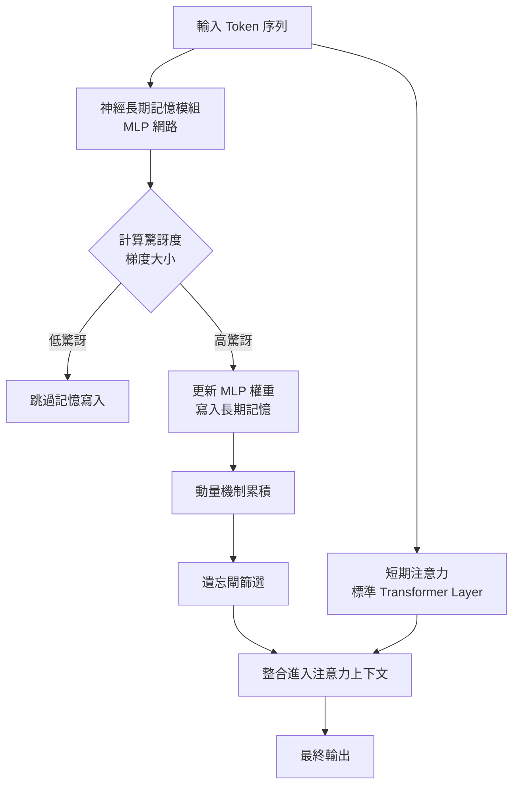

# Titans 神經長期記憶架構：AI 如何在執行中學會「記住」？

> [!abstract] 一句話理解
> 這是一個用來為 AI 增加長期記憶的架構設計，特別之處在於它把記憶模組做成一個會在執行中即時學習的小型神經網路，只記憶「打破預期」的關鍵資訊，讓模型能在不重新訓練的前提下，處理 200 萬 token 以上的超長上下文。

## 🎯 為什麼重要

**它解決了什麼問題？**

過去 LLM 處理長上下文有兩條路線，各有重大缺陷：
- **Transformer 路線**：用注意力機制精準回顧過去，但計算成本隨上下文長度二次方爆炸，10 萬 token 就難以負擔
- **線性 RNN / SSM 路線**（如 Mamba）：把上下文壓縮成固定大小的狀態向量，速度快但「壓縮太狠」，極長序列下會遺失關鍵資訊

Titans 提供第三條路：**讓模型有一個會學習的小型神經網路作為「長期記憶模組」**，這個模組會在執行（不是訓練）時即時學習要記住什麼。這讓 LLM 第一次有了「執行中持續學習」的能力，且能擴展到 200 萬 token 以上。

更重要的是，Titans 與同期 Google 提出的 MIRAS 框架，把過去看似不同的架構（Transformer、Mamba-2、Gated DeltaNet）統一在「聯想記憶」框架下，為未來架構設計提供了第一性原理。

## 🧠 入門解說（用類比理解）

**圖書館員的工作方式**

想像你是一位圖書館員，每天有讀者來問問題，你需要記住他們之前的對話。傳統做法有兩種：

- **Transformer 做法**（像「翻完所有檔案才回答」的圖書館員）：每次有人問問題，你都把過去所有對話記錄重新翻一遍。準確但慢，當記錄超過 10 萬條時你根本翻不完。

- **線性 RNN 做法**（像「只記得當前印象」的圖書館員）：你不翻檔案，只記得「最近的印象」——這個印象是一個固定大小的小紙條。速度快，但細節都被壓縮掉了。

- **Titans 的做法**（像「會做筆記的圖書館員」）：你有一本小筆記本，每次新對話發生時，你會問自己「**這件事讓我意外嗎？**」
  - 如果不意外（例如讀者又借了一本他常借的書）→ 不寫進筆記本
  - 如果很意外（例如讀者突然要借一本完全不同領域的書）→ 立刻寫下來，這可能是重要訊號
  - 對於長期不會用到的筆記，定期撕掉（遺忘機制）

這就是 Titans 的核心：**主動篩選資訊、只記重要的、會自動遺忘**。記憶不是被動容器，而是會學習的小腦。

## 🔑 重點原理

1. **雙系統設計**：Titans 由「短期注意力」與「神經長期記憶模組」組成。注意力負責當下精準回顧，長期記憶負責跨越上下文視窗的資訊保留。這個設計呼應了人腦的「短期記憶 + 長期記憶」分工。

2. **神經 MLP 作為記憶模組**：與傳統 RNN 把記憶儲存成固定向量不同，Titans 的長期記憶是一個多層感知器（MLP）神經網路。它的權重就是記憶內容——能儲存遠比向量更豐富的關聯結構。

3. **驚訝度（Surprise Metric）**：模型用「當前輸入對記憶模組產生的梯度」作為驚訝度的數學定義。低梯度 = 已預期 = 不需特別記憶；高梯度 = 出乎意料 = 必須寫入長期記憶。這把心理學概念轉化成了可計算的訊號。

4. **動量機制（Momentum）**：除了當下驚訝度，Titans 還考量「近期累積驚訝度」——避免單一 token 因為偶然性被誤判為重要，也避免錯過「漸進變化」的長期模式。

5. **遺忘閘（Forgetting Gate / Weight Decay）**：自適應的權重衰減機制決定哪些記憶該被丟棄。這對處理極長序列至關重要——沒有遺忘，記憶會被舊資訊填滿而失去新學習能力。

6. **執行時學習（Test-Time Learning）**：Titans 的長期記憶模組會在「執行階段」也更新權重——這意味著它在使用時還在持續學習。這與傳統「訓練完成後權重凍結」的範式完全不同。

7. **與 MIRAS 框架的關係**：MIRAS 把所有序列模型抽象為四個設計選擇——記憶架構、注意力偏好、保留閘、記憶演算法。Titans 是 MIRAS 設計空間中的一個具體選擇。

## 📊 視覺化說明

### Titans 雙系統架構

### Titans vs Transformer vs Mamba 對比表

| 維度 | Transformer | Mamba / Linear RNN | Titans |
|------|-------------|---------------------|--------|
| 計算複雜度 | O(N²) | O(N) | O(N) 平均 |
| 記憶形式 | KV-cache（向量集合） | 固定大小狀態向量 | **MLP 神經網路權重** |
| 上下文上限 | 數十萬 token | 理論無限但精度遞減 | **200 萬 token+** |
| 記憶寫入策略 | 全寫（保留所有 KV） | 全壓縮（覆蓋舊狀態） | **驚訝度篩選** |
| 執行時更新 | ❌（推理時凍結） | ❌ | ✅（會即時學習） |
| 適合場景 | 中等長度、需精確回顧 | 長序列、邊緣推理 | 極長序列、個人化記憶 |

## 🔍 與既有技術的差異

**vs. 傳統 RNN（LSTM、GRU）**

傳統 RNN 把記憶壓縮進固定向量或矩陣，表達力受限。Titans 用整個 MLP 作為記憶——表達力高了幾個數量級。

**vs. Transformer + 長上下文窗口**

Transformer 處理長上下文靠擴大 KV-cache 與稀疏注意力，但本質上還是「儲存所有歷史」。Titans 則「主動篩選」——只記重要的，避免無用資訊佔據算力。

**vs. RAG（檢索增強生成）**

RAG 把外部記憶放在 vector database，每次查詢時動態檢索。Titans 把記憶內化到模型本身，不需外部基礎設施。兩者並非互斥——可以同時使用 Titans（短期記憶）+ RAG（長期知識）。

**vs. Mamba 系列**

Mamba-2 用 SSD 框架統一注意力與 SSM；Titans 用 MIRAS 框架統一所有序列模型為聯想記憶。前者強調「計算等價性」，後者強調「設計空間」。

**vs. LoRA / 微調**

LoRA 在訓練時加入低秩矩陣調整模型；Titans 在執行時即時更新長期記憶。前者是「離線客製化」，後者是「線上自適應」。

## 📚 關鍵詞對照表

| 中文 | 英文 | 簡短解釋 |
|------|------|---------|
| 神經長期記憶模組 | Neural Long-Term Memory Module | Titans 用 MLP 神經網路儲存長期記憶 |
| 驚訝度 | Surprise Metric | 當前輸入相對於記憶狀態的梯度大小，量化「打破預期」程度 |
| 執行時學習 | Test-Time Learning | 模型在推理階段持續更新權重，不需重新訓練 |
| 聯想記憶 | Associative Memory | 把輸入 key 映射到 value 的記憶機制 |
| 注意力偏好 | Attentional Bias | 模型決定優先注意什麼的內部目標函數 |
| 保留閘 | Retention Gate | 平衡新學習與保留舊知識的正則化機制 |
| 遺忘閘 | Forgetting Gate | 自適應權重衰減，丟棄不再需要的記憶 |
| 動量 | Momentum | 累積近期驚訝度，避免單一 token 誤判 |
| 結構半可分矩陣 | Structured Semiseparable Matrix | Mamba-2 SSD 框架的核心數學物件 |
| 上下文窗口 | Context Window | 模型一次能處理的 token 數量上限 |

## 🛠️ 可能的應用場景

1. **個人化 AI 助手**：Titans 在對話中即時學習使用者偏好，不需 fine-tune 也能記住「使用者喜歡簡潔回答」「使用者用台灣繁中」等長期模式。

2. **超長文件理解**：法律合約、財報全文、技術文件、整本書籍——200 萬 token 的上下文足以一次處理一整本書，且保持精度。

3. **長時對話與遊戲 NPC**：MMO 遊戲 NPC、長期陪伴 AI 助手——需要記住數百小時對話中的關鍵互動。

4. **基因組分析**：Google 已驗證 Titans 在 DNA 序列建模上有效——這類超長序列（人類基因組約 30 億 bp）正是 Titans 的主場。

5. **時間序列預測**：金融、氣象、能源負載——這類長期模式 + 偶發異常的場景，與 Titans 的「驚訝度記憶」設計高度契合。

6. **代理人持續學習**：AI Agent 在執行任務時遇到的新工具、新環境、新使用者偏好——Titans 可以把這些經驗即時內化，不需重新訓練。

## 📖 學習路徑建議

1. **先讀**：Transformer 與 Attention 機制的基礎介紹（如 The Illustrated Transformer）
2. **再讀**：Mamba 與 SSM 的入門（如 Princeton PLI 的 Mamba 系列文章），理解線性序列模型的核心思想
3. **再讀**：Google Research Blog 的 Titans + MIRAS 介紹（本筆記的來源文章）
4. **進階**：Titans 原始論文（arXiv:2501.00663），重點研讀「Memory Module」與「Surprise Metric」章節
5. **進階**：MIRAS 論文（arXiv:2504.13173），理解「四個設計選擇」框架
6. **延伸**：比較 Titans 與 Attractor Models（ICLR 2026）兩種「動態系統視角」的 LLM 架構

## 🔗 延伸閱讀
- 原文連結：[Titans + MIRAS Google Research Blog](https://research.google/blog/titans-miras-helping-ai-have-long-term-memory/)
- 對應新聞筆記：[[2026-05-17-Titans MIRAS Google 長期記憶架構]]
- Titans 論文：[arXiv:2501.00663](https://arxiv.org/abs/2501.00663)
- MIRAS 論文：[arXiv:2504.13173](https://arxiv.org/pdf/2504.13173)
- 相關學習筆記：[[2026-05-17-學習-狀態空間模型 SSM 與 Mamba 系列]]
- 相關架構：[[2026-05-16-學習-Attractor Models 固定點潛在精煉架構]]（同期 ICLR 2026 的動態系統視角架構）

---
*由 Claude 自動整理於 2026-05-17*
