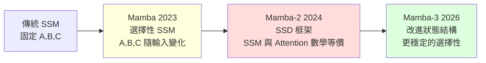

# 狀態空間模型（SSM）：從 Mamba 到 Mamba-3 的線性序列建模之路

> [!abstract] 一句話理解
> 這是一種用來建構大型語言模型的架構家族，特別之處在於它把處理序列的計算複雜度從 Transformer 的 O(N²) 降到 O(N)，同時透過「選擇性機制」與「狀態空間二元對偶（SSD）」框架兼顧效率與表達力，讓 LLM 能在百萬級 token 上下文中以線性速度推理。

## 🎯 為什麼重要

**它解決了什麼問題？**

Transformer 自 2017 年以來主導了 LLM，但其注意力機制有個無法迴避的限制——**計算成本與序列長度成二次方關係**。處理 10 萬 token 已經很吃力，處理 100 萬 token 幾乎不可能；即使能跑，每個 token 的推理時間也會隨上下文增長而拉長。

對需要極長上下文的應用（全本書理解、整套程式碼倉庫分析、基因組建模、長期對話），Transformer 的計算負擔成為硬性瓶頸。

SSM（State Space Model）家族提供了第二條路線：**用一個「狀態向量」壓縮過去資訊**，每個新 token 只需更新狀態，不需回顧整段歷史。這讓 SSM 在訓練時可線性，在推理時每個 token 是常數時間——理論上可以處理無限長序列。

Mamba（2023）、Mamba-2（2024）、Mamba-3（2026）是這條路線上連續三代的突破，每一代都讓 SSM 更接近 Transformer 的精度，同時保持線性效率。2026 年，這條路線已被 AI21 Labs、Princeton、CMU 等多家機構商業化或學術應用，**「後 Transformer」不再是空談，而是真實的工程選項**。

## 🧠 入門解說（用類比理解）

**會議記錄員的記憶策略**

想像你是一位會議記錄員，要記錄一場 10 小時的長會議。有兩種記法：

- **Transformer 做法（全文記錄員）**：每次有人發言，你就把過去所有發言重看一遍，挑出最相關的拿出來引用。10 小時下來，你要看的歷史記錄越來越長，越記越慢。

- **Mamba 做法（摘要記錄員）**：你不記全文，只在腦中維持一份「**會議當前狀態摘要**」——這是一個固定大小的「心智模型」，包含會議的關鍵走向、未解問題、重要決定。每次有人新發言，你只要根據當下發言更新這份摘要即可。

**Mamba 系列的進化**：
- **Mamba（2023）**：摘要記錄員「**選擇性聽**」——根據當下發言決定哪些細節要納入摘要，哪些可以略過。這是「選擇性 SSM」的本質。
- **Mamba-2（2024）**：發現摘要記錄員的工作其實**和全文記錄員是同一回事的不同視角**——只是看待同一份資料的兩種方法。這就是 SSD 框架。
- **Mamba-3（2026）**：摘要的內部結構被重新設計，能容納更豐富的會議脈絡，記得更準。

關鍵的是：摘要記錄員的速度不會隨會議長度變慢——這就是 O(N) 線性推理的優勢。

## 🔑 重點原理

1. **狀態空間模型（State Space Model, SSM）的數學基礎**：SSM 把序列建模描述為一個動態系統——「狀態 h_t」隨輸入「x_t」演化，輸出 「y_t」由狀態決定。數學上是 h_t = A·h_{t-1} + B·x_t，y_t = C·h_t（A、B、C 是模型參數矩陣）。這是控制理論中常見的形式。

2. **選擇性 SSM（Selective SSM）**：原始 SSM 的 A、B、C 是固定的；Mamba 讓 A、B、C **隨輸入 x_t 動態變化**。這給了模型「根據當下 token 決定要記什麼、要忘什麼」的能力——這是 Mamba 與 Transformer 注意力機制的精神對應。

3. **狀態空間二元對偶（State Space Duality, SSD）**：Mamba-2 發現的關鍵數學結構——SSM 可以從兩個角度看：
   - **遞迴視角**（線性 RNN）：適合推理，O(N) 計算
   - **矩陣視角**（類似注意力）：適合訓練，可用 GPU tensor core 平行加速
   兩個視角在結構半可分矩陣（structured semiseparable matrix）的框架下完全等價。

4. **訓練快、推理快兩全其美**：透過 SSD，Mamba-2 訓練時用矩陣乘法（像 Transformer 一樣快），推理時切換為遞迴模式（像 RNN 一樣每 token 常數時間）。

5. **Mamba-3 的改進**：對狀態結構與選擇性機制做更細緻設計，在不增加狀態大小的前提下提升表達能力，並改善大模型訓練穩定性。

6. **線性推理的真正意義**：每個新 token 的處理時間不隨上下文長度增加——這對極長序列場景（百萬級 token、串流式應用）是壓倒性優勢。

7. **與 Transformer 的關係**：SSM 並非要取代 Transformer，而是**互補**。Hybrid 架構（如 AI21 Labs 的 Jamba 系列、NVIDIA 的 Hymba）會把 SSM 與注意力層交錯使用，取兩家之長。

## 📊 視覺化說明

### Mamba 系列三代演進

### Transformer vs SSM 計算複雜度

| 操作 | Transformer | SSM (Mamba 系列) |
|------|-------------|------------------|
| 訓練（序列長度 N） | O(N²) | O(N) |
| 推理（每 token） | O(N) | **O(1)** 常數 |
| KV-cache 記憶體 | O(N) 線性增長 | O(1) 固定 |
| 長序列極限 | 數十萬 token | 理論無限 |
| 精度（短序列） | 較高 | Mamba-3 已接近 |
| 精度（極長序列） | 受 KV-cache 限制 | 受狀態壓縮限制 |

### 2026 年「後 Transformer」架構地圖

| 路線 | 代表 | 核心思想 |
|------|------|---------|
| **狀態空間模型** | Mamba-3, S5, Hyena | 用固定大小狀態壓縮序列 |
| **線性注意力** | RWKV-7, RetNet, Gated DeltaNet | 注意力的核函數近似 |
| **記憶模組架構** | Google Titans, MIRAS | 神經 MLP 作為長期記憶 |
| **固定點迭代** | Attractor Models (ICLR 2026) | 隱式微分求解固定點 |
| **Hybrid 架構** | AI21 Jamba, NVIDIA Hymba | SSM + Attention 交錯 |

## 🔍 與既有技術的差異

**vs. 傳統 RNN（LSTM、GRU）**

傳統 RNN 也是 O(N) 推理，但訓練必須序列式（無法平行），且容易遇到梯度消失/爆炸。SSM 透過數學設計避免這些問題，訓練可平行、訓練穩定性遠優於傳統 RNN。

**vs. Transformer**

Transformer 訓練平行、表達力強，但 O(N²) 注意力是硬瓶頸。SSM 在保留訓練平行性的同時，把推理降到 O(1) 每 token。短上下文上 Transformer 仍略勝一籌，但隨上下文增長，SSM 的優勢迅速擴大。

**vs. 稀疏注意力（Sparse Attention）**

稀疏注意力（如 Longformer、BigBird）試圖透過注意力模式的稀疏化降低成本，但仍是「Transformer 系列」。SSM 是徹底的範式轉變——根本不用注意力。

**vs. Titans 的神經長期記憶**

Titans 用 MLP 神經網路儲存記憶；Mamba 用矩陣狀態。前者記憶容量更大但更複雜；後者更精簡但表達力受狀態大小限制。兩者可組合使用。

**vs. 檢索增強生成（RAG）**

RAG 用外部 vector database 做長期記憶；SSM 把記憶內化到模型。RAG 更靈活但需要額外基礎設施；SSM 更簡潔但記憶容量受限。

## 📚 關鍵詞對照表

| 中文 | 英文 | 簡短解釋 |
|------|------|---------|
| 狀態空間模型 | State Space Model (SSM) | 用狀態向量演化建模序列的架構 |
| 選擇性 SSM | Selective SSM | 狀態轉換隨輸入動態變化的 SSM |
| 狀態空間二元對偶 | State Space Duality (SSD) | SSM 與注意力的數學等價關係 |
| 結構半可分矩陣 | Structured Semiseparable Matrix | SSD 框架的核心數學物件 |
| 線性 RNN | Linear RNN | 計算複雜度線性於序列長度的 RNN 變體 |
| 注意力機制 | Attention Mechanism | Transformer 的核心，計算 token 間相關性 |
| Tensor Core | NVIDIA Tensor Core | GPU 上加速矩陣運算的專用單元 |
| 上下文窗口 | Context Window | 模型一次能處理的 token 數量 |
| Hybrid 架構 | Hybrid Architecture | SSM 與 Transformer 混合的架構 |
| Jamba | Jamba (AI21 Labs) | 商業化的 SSM + Transformer 混合模型 |

## 🛠️ 可能的應用場景

1. **超長文件處理**：法律合約、學術論文、財報全文、整本書籍——SSM 的線性推理讓百萬 token 處理變得可行且經濟。

2. **基因組與蛋白質序列**：人類基因組約 30 億 bp，蛋白質序列也很長——這類超長生物序列正是 SSM 的主場（也是 AlphaFold 之後的下一個前沿）。

3. **長時音訊與影片建模**：演講錄音、長片電影、監視影像——這類「時間長、token 多」的序列任務，SSM 的常數推理時間是巨大優勢。

4. **邊緣裝置推理**：固定大小的狀態意味著記憶體需求可預測且小——SSM 比 Transformer 更適合手機、車載、IoT 等記憶體受限環境。

5. **串流式服務**：客服機器人、即時翻譯、直播字幕——這些服務的 token 是「逐個來、無止盡」，SSM 的常數時間推理是理想架構。

6. **強化學習與 Agent**：Agent 在環境中累積經驗，序列只會越來越長——SSM 讓 Agent 能在不重啟記憶的前提下持續工作。

## 📖 學習路徑建議

1. **先讀**：理解 RNN 與 LSTM 的基礎（如 Christopher Olah 的「Understanding LSTM Networks」）
2. **再讀**：了解控制理論中的狀態空間模型基礎（即使是工程觀念入門也夠）
3. **再讀**：Mamba 原始論文（arXiv:2312.00752），重點研讀「Selective State Space Model」章節
4. **再讀**：Mamba-2 論文（arXiv:2405.21060），重點研讀 SSD 框架
5. **再讀**：Princeton PLI 的 Mamba-3 部落格（本筆記的來源文章）
6. **進階**：閱讀 Hyena、RWKV-7 等其他線性架構論文，比較不同設計選擇
7. **延伸**：對比 SSM 與 Titans（Google 的神經長期記憶）兩條「後 Transformer」路徑

## 🔗 延伸閱讀
- 原文連結：[Princeton PLI Mamba-3 部落格](https://pli.princeton.edu/blog/2026/mamba-3-improved-sequence-modeling-using-state-space-principles)
- 對應新聞筆記：[[2026-05-17-Mamba-3 SSM 線性序列建模]]
- Mamba 原始論文：[arXiv:2312.00752](https://arxiv.org/pdf/2312.00752)
- Mamba-2 論文：[arXiv:2405.21060](https://arxiv.org/abs/2405.21060)
- Mamba GitHub：[github.com/state-spaces/mamba](https://github.com/state-spaces/mamba)
- 相關學習筆記：[[2026-05-17-學習-Titans 神經長期記憶架構]]（另一條後 Transformer 路徑）
- 相關學習筆記：[[2026-05-15-學習-Subquadratic 稀疏注意力架構]]（稀疏注意力路線）

---
*由 Claude 自動整理於 2026-05-17*
