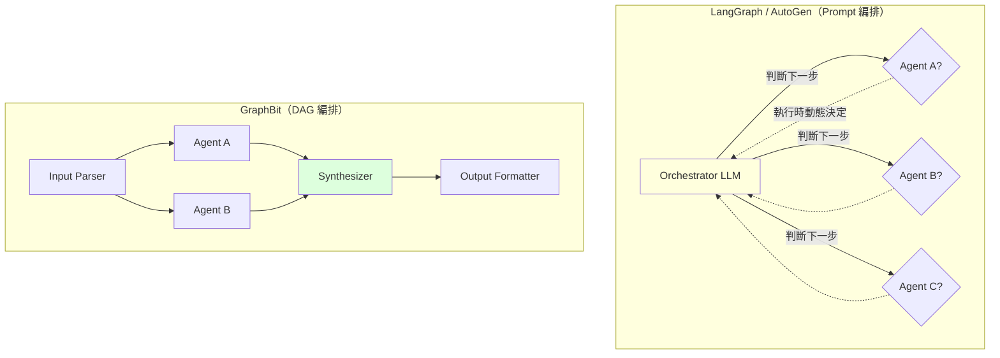

# GraphBit 與 DAG Agent 編排：從「prompt 編排」進入「編譯式編排」

> [!abstract] 一句話理解
> 這是一種把 multi-agent 工作流寫成「有向無環圖（DAG）」並由 Rust 引擎管理執行的編排框架，特別之處在於把 agent 視為「型別化函式」而非「自由 prompt」，整個流程在啟動前就完整定義、編譯期可驗證，讓 LLM agent 系統獲得傳統軟體工程的確定性、可觀測性與可審計性。

## 🎯 為什麼重要

**它解決了什麼問題？**

2024-2025 年的 multi-agent 框架（LangGraph、AutoGen、CrewAI、MetaGPT）讓打造 agent 系統變得容易，但企業導入時普遍遇到三大致命痛點：

1. **不可重現性**：相同輸入跑兩次可能走完全不同的路徑——對審計、合規、debug 都是惡夢。當 LLM 在執行時決定下一步該叫哪個 agent，整個流程的決定性就消失了。

2. **Context 污染（Context Bloat）**：跨 step 的 context 無限累積，導致長流程後段的推理品質崩潰。傳統框架往往「把所有歷史 context 都打包傳給下一個 agent」，最終 prompt 長到模型開始胡言亂語。

3. **效能瓶頸**：Python 編排層自身的延遲與記憶體開銷，在高並發場景中是瓶頸——當每次決策都要過 LLM、每次 LLM 呼叫都要序列化巨大 context，吞吐量上不去。

GraphBit 的設計目標就是同時解決這三個問題。它的解法是把 agent 編排「軟體工程化」——用 DAG 替代 prompt、用 Rust 替代 Python、用型別系統替代自由文字。這代表 Agent 框架從「能跑」進入「可生產」階段。

## 🧠 入門解說（用類比理解）

**用「自由發揮的菜單」vs「工廠生產線」理解 Agent 編排**

想像一家餐廳要做一道複雜的菜：

- **LangGraph / AutoGen 做法（自由發揮）**：你雇一群廚師，給每個廚師一張菜單，告訴他們「自己看著辦」。第一個廚師可能說「我先做湯，需要的話傳給第二個廚師」，第二個廚師可能說「我覺得這湯該加醬油」⋯⋯每次做同樣的菜，廚師們可能做出略微不同的版本。如果客人投訴，你也很難說清楚到底哪一步出問題。

- **GraphBit 做法（工廠生產線）**：你把這道菜的流程畫成**一張明確的圖**——切菜 → 炒菜 → 調味 → 擺盤，每一步要做什麼、需要什麼輸入、輸出什麼結果，全部寫死。每個工位（agent）只負責一個明確的任務，不能自由發揮。一條生產線跑 100 次都是同樣的結果，且每一步都有監控錄影可審計。

**關鍵差別**：
- LangGraph 的 LLM 在「執行時」決定流程 → 不可預測但靈活
- GraphBit 的流程在「設計時」就固定 → 可預測但需要設計者多動腦

**為什麼餐廳要選工廠生產線？**

當你開的是麥當勞（規模化、合規要求高），不是星級餐廳（個人化、創意優先），生產線的優勢遠超過自由發揮——一致性、可審計、可量產。GraphBit 就是為「企業 AI 麥當勞」設計的編排層。

## 🔑 重點原理

1. **DAG（有向無環圖）作為工作流定義**：開發者用 DAG 明確定義 agent 之間的依賴關係。節點是 agent function、邊是資料流。圖在啟動時完整定義，不能在執行時改變結構。這是「宣告式（declarative）」編排，對應於 Terraform 之於基礎設施。

2. **Agent 即型別化函式（Typed Functions）**：每個 agent 有明確的輸入型別與輸出型別。型別不符在編譯期就被攔截——這比 prompt 中「我希望它輸出 JSON」這種模糊約定強得多。

3. **Rust-based Engine**：路由、狀態轉換、工具調用由 Rust 處理。Python 只用來實作 agent 內的 LLM 邏輯（透過 PyO3 bindings）。這個分工讓編排層獲得 Rust 的性能（11.9 ms 延遲開銷 vs LangGraph 的 87 ms），同時保留 Python 的 LLM 生態。

4. **三層記憶體架構**：明確分離三種 context——
   - **Ephemeral scratch space**：單一節點內的暫時運算
   - **Structured state**：節點間明確傳遞的結構化資料
   - **External connectors**：外部資料庫、API 等持久化資源
   這個分層強制開發者明確宣告「下一步要拿什麼」，避免 context bloat。

5. **並行分支執行**：DAG 中無依賴的節點自動並行執行——這在 prompt-based 框架是 LLM 必須意識並協調的事，在 GraphBit 是框架自動處理。

6. **條件式控制流**：基於結構化 state 的 predicate 決定路徑（如 if-else、switch）。整個條件邏輯是 Rust 程式碼，不是 LLM 推理——確定性、零延遲、零幻覺。

7. **可配置錯誤恢復**：每個節點可定義 retry 策略、fallback 路徑、circuit-breaker 規則。生產系統必備的容錯機制被一級支援，不是 hack 出來的。

## 📊 視覺化說明

### Prompt 編排 vs DAG 編排

### GraphBit 三層記憶體架構

| 層級 | 範圍 | 生命週期 | 範例 |
|------|------|---------|------|
| **Ephemeral scratch** | 單一 agent 內部 | 該 agent 執行期間 | 中間推理草稿、LLM 多輪對話歷史 |
| **Structured state** | 節點間明確傳遞 | DAG 執行期間 | 上游 agent 輸出的查詢結果、結構化資料 |
| **External connectors** | 跨執行 | 持久化 | 資料庫、API、RAG 索引 |

### Agent 框架世代對比

| 維度 | Gen 1：AutoGPT | Gen 2：LangGraph、CrewAI | Gen 3：GraphBit |
|------|---------------|------------------------|----------------|
| **編排方式** | LLM 自由規劃 | 半結構化（圖 + prompt） | 編譯期可驗證 DAG |
| **可重現性** | 低 | 中 | **高** |
| **效能** | 低 | 中 | **高（Rust 引擎）** |
| **可審計性** | 弱 | 中 | **完整可序列化軌跡** |
| **適用場景** | Demo、實驗 | 中等複雜度工作流 | **企業級生產部署** |
| **學習曲線** | 低 | 中 | 中（需了解 DAG 概念） |

### GAIA Benchmark 對比

| 框架 | GAIA 精度 | 框架幻覺 | 延遲開銷 | 吞吐量 |
|------|----------|---------|---------|--------|
| LangGraph | 58.2% | 中 | 87.4 ms | 中 |
| AutoGen | 54.1% | 高 | 142.3 ms | 低 |
| CrewAI | 52.8% | 中 | 95.6 ms | 中 |
| LlamaIndex Agents | 56.9% | 中 | 78.2 ms | 中 |
| MetaGPT | 51.3% | 高 | 156.8 ms | 低 |
| **GraphBit** | **67.6%** | **0** | **11.9 ms** | **最高** |

## 🔍 與既有技術的差異

**vs. LangGraph**

LangGraph 也用圖，但圖中很多節點仍是「LLM 自由決定」。GraphBit 把「決定」也明確化——只有少數明確設計的決策節點才用 LLM，其餘是純程式碼條件邏輯。

**vs. CrewAI / AutoGen**

CrewAI 與 AutoGen 強調「multi-agent 對話」——多個 LLM agent 互相討論。GraphBit 把這種對話替換為「明確的資料流」——agent 之間不對話，只傳結構化資料。

**vs. Temporal / Apache Airflow（傳統工作流引擎）**

Temporal、Airflow 是「傳統」工作流引擎，沒有 LLM 整合。GraphBit 可視為「為 LLM agent 設計的 Temporal」——保留工作流引擎的所有特性（可重現、可審計、容錯），但原生支援 LLM agent。

**vs. Microsoft Semantic Kernel**

Semantic Kernel 提供 LLM 與企業系統整合的 SDK，但編排層較弱。GraphBit 專注於編排，可與 Semantic Kernel 互補使用（Semantic Kernel 提供 connectors、GraphBit 提供流程引擎）。

**vs. Vertex AI Agent Engine（Google）**

Vertex Agent Engine 是 Google 推出的企業級 agent 編排服務，理念類似 GraphBit（強型別、可審計）但綁定 Google Cloud。GraphBit 是開源、跨雲方案。

## 📚 關鍵詞對照表

| 中文 | 英文 | 簡短解釋 |
|------|------|---------|
| 有向無環圖 | Directed Acyclic Graph (DAG) | 節點 + 有向邊、無循環的圖結構 |
| 型別化函式 | Typed Function | 輸入輸出型別明確定義的函式 |
| 宣告式編排 | Declarative Orchestration | 描述「要什麼」而非「怎麼做」的編排 |
| 命令式編排 | Imperative Orchestration | 描述「怎麼做」的編排（傳統做法） |
| PyO3 | PyO3 | Rust 與 Python 互操作的綁定函式庫 |
| Context Bloat | Context Bloat | 跨 step context 累積過大的問題 |
| Circuit Breaker | Circuit Breaker | 偵測下游失敗並暫停請求的容錯模式 |
| GAIA Benchmark | GAIA Benchmark | 評估 AI agent 解決真實任務能力的基準 |
| Workflow Engine | Workflow Engine | 管理長時運行流程的引擎 |
| MCP | Model Context Protocol | Anthropic 推出的 LLM 工具整合標準 |

## 🛠️ 可能的應用場景

1. **金融業合規工作流**：信貸審批、AML 監測等需要完整審計軌跡的場景——GraphBit 的「DAG 軌跡可序列化」是天然優勢。

2. **保險業核保自動化**：核保流程涉及多個專業 agent（醫療審查、財務審查、風險評估），需要確定性結果。

3. **客服自動化升級**：從 chatbot 升級到「真正能解決問題的客服 agent」——需要可預測的工作流與明確的升級路徑。

4. **企業內部 IT 服務管理**：工單分類、技術問題排查、知識庫查詢的自動化——需要對 IT 部門完全透明可控。

5. **法律盡調自動化**：M&A 盡調的合約審查、風險識別、報告生成——需要可追溯每一步的結論依據。

6. **製造業品管流程**：影像檢測、缺陷分類、根因分析的串聯——需要可重現的判斷流程。

## 📖 學習路徑建議

1. **先讀**：理解基本的 LLM agent 概念（什麼是 agent、tool use、function calling）
2. **再讀**：嘗試 LangGraph 或 CrewAI 寫一個簡單 multi-agent 系統，體會 prompt 編排的痛點
3. **再讀**：GraphBit 論文（本筆記來源）與 GitHub README
4. **動手**：用 GraphBit 重寫上一步的系統，對比可重現性、效能、可審計性
5. **進階**：閱讀 Vertex AI Agent Engine、Temporal、Apache Airflow 文件，理解編譯式工作流的歷史脈絡
6. **延伸**：研究 GraphBit 與 MCP 的整合方式——MCP 提供「工具」，GraphBit 提供「編排」，組合起來是企業級 agent 系統的完整堆疊

## 🔗 延伸閱讀
- 原文連結：[GraphBit 論文（arXiv 2605.13848）](https://arxiv.org/abs/2605.13848)
- 對應新聞筆記：[[2026-05-18-GraphBit Rust DAG Agent 框架]]
- GraphBit GitHub：[github.com/InfinitiBit/graphbit](https://github.com/InfinitiBit/graphbit)
- GraphBit PyPI：[pypi.org/project/graphbit](https://pypi.org/project/graphbit/)
- 相關概念：[Microsoft Agent 365 GA 公告](https://www.microsoft.com/en-us/security/blog/2026/05/01/microsoft-agent-365-now-generally-available-expands-capabilities-and-integrations/)（企業 agent 治理層）
- 相關學習筆記：[[2026-05-13-學習-Bayes-consistent Agent 編排]]（另一種編排理論）
- 相關學習筆記：[[2026-05-14-學習-Mem0 圖記憶架構]]（agent 記憶管理）

---
*由 Claude 自動整理於 2026-05-18*
