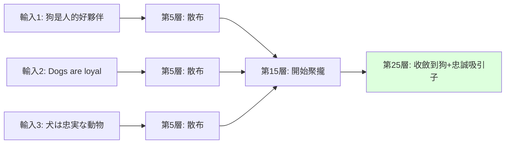

# 概念吸引子（Concept Attractors）：用迭代函數系統理解 LLM 內部表示

> [!abstract] 一句話理解
> 這是一種用來解釋 LLM 為什麼能把「不同說法但相同意思」的句子聚到一起的理論框架，特別之處在於它把 Transformer 的每一層視為「會把表示推向特定不變集」的收縮映射，整個前向過程等同於迭代函數系統（IFS）求解概念吸引子，並讓我們能在不重新訓練的情況下直接操作這些吸引子來做翻譯、抗幻覺、護欄與資料生成。

## 🎯 為什麼重要

**它解決了什麼問題？**

過去十年深度學習的可解釋性研究主要圍繞兩個方向——「探究單一神經元的功能」（如某個神經元偵測貓臉）與「探究注意力 head 的角色」（如某個 head 處理代詞回指）。這些研究很有價值，但都停留在「局部」層級，無法解釋「整個模型為什麼能把語意相近的句子在中層聚到一起」這個更基本的現象。

對應用面而言，缺少這個理論框架的代價是：每次想改變模型行為（減少幻覺、增加安全護欄、跨語言遷移），都得 fine-tune 一個新模型。這既昂貴（需要大量訓練資料與 GPU 時間）又有風險（可能引入新偏見、可能破壞其他能力）。

「概念吸引子」框架提供了一條完全不同的路徑——**先理解 LLM 內部的幾何結構，再直接在這個結構上做手術**。這把 LLM 從「黑盒模型」轉化為「可幾何操作的物件」，是可解釋性研究的範式轉移。對企業導入者而言，這意味著未來「客製 LLM 行為」可能不再需要昂貴的 fine-tune，而是用幾何運算直接調整。

## 🧠 入門解說（用類比理解）

**用山谷與河流理解吸引子**

想像 LLM 的內部表示空間是一片**起伏的山地**。當你給 LLM 一句話，它的「表示」就像在這片山地上的一個球。隨著訊息經過 Transformer 的每一層，這個球**沿著山勢滾動**——最終會掉進某個山谷的最低點。

關鍵是：**這片山地上有很多個山谷，每個山谷對應一個「概念」**。
- 「狗」這個概念對應一個山谷
- 「快樂」這個概念對應另一個山谷
- 「巴黎是法國的首都」對應另一個

**不管你怎麼說同一件事**，球都會滾進同一個山谷：
- 「狗是人類最好的朋友」、「Dogs are loyal companions」、「Le chien est fidèle」——這三句話的初始位置雖不同，但都會滾進「狗 + 忠誠」這個山谷。

這個「**山谷最低點**」就是**概念吸引子**。Transformer 的每一層就是「**讓球往谷底再滾一點**」的力——這就是「收縮映射」。

**為什麼這個觀察很有用？**

如果我們知道「狗 + 忠誠」這個山谷在哪裡，我們可以：
- **翻譯**：把法語版的球，移到英語版的同一個山谷
- **抗幻覺**：球如果掉到山谷外的奇怪地方，把它推回山谷
- **護欄**：如果球正要滾向「危險建議」的山谷，攔下來
- **資料生成**：從某個山谷周圍取樣，生成大量該概念的範例

而這一切**都不需要重新訓練模型**——只需要在隱藏層空間做幾何操作。

## 🔑 重點原理

1. **迭代函數系統（IFS）的數學定義**：IFS 是「有限個收縮映射的集合」+ 「重複套用這些映射」。給定任意初始集合，IFS 會收斂到一個獨特的吸引子（attractor），這是 IFS 理論的核心定理。經典例子是 Sierpinski 三角形——三個簡單映射反覆套用就能畫出複雜分形。

2. **Transformer 層即收縮映射**：論文核心主張——Transformer 的每一層（自注意力 + FFN + 殘差 + LayerNorm 的組合）在「語意空間」上表現得像收縮映射。雖然單一層的數學性質不嚴格滿足傳統收縮條件，但整體效果是「把語意相近的表示拉得更近」。

3. **概念吸引子**：對於每個「概念」（如「狗」、「快樂」、「巴黎」），存在一個不變集（invariant set）——任何包含該概念的句子表示，經過足夠多層運算後都會收斂到這個不變集附近。不變集就是該概念的「吸引子」。

4. **收斂深度**：不同概念在不同層深度收斂。**抽象概念**（情感、立場、意圖）通常在較深層收斂；**具體概念**（實體名稱、數字）在較淺層就收斂。這提供了一種「概念抽象度」的客觀指標。

5. **訓練自由的應用**：基於吸引子的位置，可開發直接在隱藏層操作的演算法：
   - **翻譯**：跨語言對齊同一吸引子
   - **抗幻覺**：把離吸引子太遠的表示拉回
   - **護欄**：偵測表示是否朝向「危險吸引子」
   - **資料生成**：從吸引子周圍取樣

6. **與量化、剪枝等壓縮技術正交**：這個框架不修改模型，只是「換一種看模型的方式」，因此可與任何模型壓縮技術組合。

7. **可組合性**：多個吸引子可組合——例如「狗 + 快樂」的句子會收斂到「狗吸引子」與「快樂吸引子」的某種交集區域。

## 📊 視覺化說明

### 概念吸引子的形成過程

### IFS 數學定義與 LLM 對應

| 元素 | 數學定義 | LLM 對應 |
|------|---------|---------|
| **度量空間** | 完備度量空間 (X, d) | 隱藏層表示空間 |
| **收縮映射** | f: X → X, 存在 r<1 使 d(f(x),f(y)) ≤ r·d(x,y) | Transformer 單一層 |
| **IFS** | 有限個收縮映射的集合 | Transformer 多層堆疊 |
| **吸引子** | 唯一非空緊集 A 滿足 A = ∪ fᵢ(A) | 概念對應的不變集 |
| **Hausdorff 收斂** | 任意非空緊集經迭代收斂到 A | 不同表述的句子收斂到同一概念 |

### 訓練自由方法 vs 傳統 Fine-tune

| 維度 | 傳統 Fine-tune | 吸引子方法 |
|------|---------------|-----------|
| 訓練資料 | 需要大量標註資料 | **不需要** |
| GPU 成本 | 訓練 + 推理都要 | **僅推理** |
| 開發時間 | 數週到數月 | **數小時到數天** |
| 風險 | 可能引入新偏見、破壞其他能力 | **不修改模型參數，無此風險** |
| 精度上限 | 可能很高 | 持平或略低於專門 fine-tune |
| 可組合性 | 多個 fine-tune 衝突 | **多個吸引子操作可組合** |

## 🔍 與既有技術的差異

**vs. Mechanistic Interpretability（機械可解釋性）**

機械可解釋性研究「個別神經元或 head 在做什麼」（如 Anthropic 的 Circuits 研究）——是「局部、由下而上」的方法。概念吸引子是「全局、由上而下」——關注整個模型的幾何結構，而非單一元件。兩者互補。

**vs. Sparse Autoencoders（稀疏自動編碼器，SAE）**

SAE 試圖把 LLM 的隱藏表示分解為可解釋的「特徵」。吸引子理論不分解為單一特徵，而是直接刻畫「整個概念對應的幾何區域」。SAE 看的是「組件」，吸引子看的是「整體形狀」。

**vs. RLHF（人類回饋強化學習）**

RLHF 透過 fine-tune 改變模型行為。吸引子方法主張「不必 fine-tune，直接在隱藏層操作」——成本低很多，但對深層偏好調整能力可能不如 RLHF。

**vs. Activation Steering（活化值操控）**

Activation Steering（如 Anthropic 的 Persona Vectors）已嘗試用單一向量加減操作改變模型行為。吸引子理論為這類做法提供了更完整的理論基礎——steering vector 其實就是「吸引子間的方向向量」。

**vs. Concept Bottleneck Models**

這類模型在訓練時就明確設計「概念瓶頸層」。吸引子理論在訓練好的標準 LLM 上**事後發現**概念結構——不需要重新設計模型架構。

## 📚 關鍵詞對照表

| 中文 | 英文 | 簡短解釋 |
|------|------|---------|
| 概念吸引子 | Concept Attractor | LLM 中對應某個概念的隱藏層幾何不變集 |
| 迭代函數系統 | Iterated Function System (IFS) | 一組收縮映射反覆迭代產生吸引子的數學框架 |
| 收縮映射 | Contractive Mapping | 把空間中兩點之間距離縮小的函數 |
| 不變集 | Invariant Set | 經函數作用後維持不變的集合 |
| Hausdorff 度量 | Hausdorff Metric | 衡量兩個集合距離的度量 |
| 隱藏層表示 | Hidden Representation | Transformer 中間層的向量輸出 |
| 訓練自由方法 | Training-free Method | 不需重新訓練模型即可改變行為的技術 |
| 護欄 | Guardrail | 防止模型輸出有害內容的安全機制 |
| 活化值操控 | Activation Steering | 在推理時修改隱藏層活化值以引導輸出 |
| 概念瓶頸 | Concept Bottleneck | 強制模型內部表示通過可解釋概念層的設計 |

## 🛠️ 可能的應用場景

1. **零樣本跨語言遷移**：訓練英語 LLM 後，透過吸引子對齊就能讓它做日語、繁中、阿拉伯文任務，不需要平行語料。對台灣與東南亞市場特別有價值。

2. **企業合規護欄**：金融、醫療等高合規產業可在 Claude/GPT 之上，套用吸引子層級的護欄——偵測表示是否朝向「投資建議」、「醫療診斷」等禁區並攔截。

3. **抗幻覺生產系統**：用吸引子距離作為「信心度」指標，當距離過大時觸發「拒答」或「降級到 RAG 模式」，可顯著降低 LLM 在生產環境的幻覺率。

4. **合成資料生成**：稀缺領域（如罕見疾病、小眾語言）可從吸引子周圍取樣生成大量訓練資料，補強原始資料不足。

5. **模型偵錯與安全審計**：可視化某個 prompt 的表示軌跡，看它走向哪個吸引子——如果走向不應該的吸引子（如「侮辱性回答」），就能在生產前發現問題。

6. **個人化客製**：透過微調某個吸引子的「拉力強度」，可個人化 LLM 的回答風格（更簡潔 / 更正式 / 更友善），不需 fine-tune。

## 📖 學習路徑建議

1. **先讀**：理解 Transformer 基礎架構（特別是殘差連接、LayerNorm 的角色）
2. **再讀**：補充動態系統理論基礎——固定點、吸引子、Banach 收縮映射定理
3. **再讀**：閱讀本論文《Concept Attractors in LLMs and their Applications》
4. **延伸 1**：Identity as Attractor in LLM Activation Space（arXiv 2604.12016）——將吸引子框架擴展到 agent 場景
5. **延伸 2**：Unveiling Attractor Cycles in Paraphrasing（arXiv 2502.15208）——研究反覆 paraphrase 形成的吸引子週期
6. **進階**：閱讀 Anthropic 的 Activation Steering 與 Persona Vectors 相關論文，理解工程實作
7. **實作**：用 TransformerLens 或類似工具，在 Llama 3.1 8B 上重現論文的吸引子可視化

## 🔗 延伸閱讀
- 原文連結：[Concept Attractors in LLMs and their Applications](https://arxiv.org/abs/2601.11575)
- 對應新聞筆記：[[2026-05-18-Concept Attractors LLM 概念吸引子]]
- 相關 ICLR 2026 論文：[Equilibrium Language Models](https://openreview.net/forum?id=lqJT6xmuH3)
- 相關論文：[Identity as Attractor](https://arxiv.org/abs/2604.12016)
- 相關論文：[Attractor Cycles in Paraphrasing](https://arxiv.org/html/2502.15208v1)
- 相關學習筆記：[[2026-05-17-學習-狀態空間模型 SSM 與 Mamba 系列]]（後 Transformer 架構視角）
- 相關學習筆記：[[2026-05-18-學習-深度等價模型與固定點 LLM]]（固定點理論的另一應用）

---
*由 Claude 自動整理於 2026-05-18*
