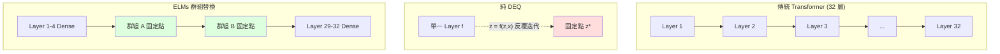

# 深度等價模型（DEQ）與 ELMs：用「求解平衡狀態」取代「層層堆疊」

> [!abstract] 一句話理解
> 這是一種把多層神經網路壓縮成「單層 + 反覆迭代直到收斂」的技術，特別之處在於把傳統深度學習的「層層堆疊」重新詮釋為「求解一個固定點方程的平衡解」，ELMs 是第一個成功把這個理論擴展到當代 LLM 規模、剪掉 28% 參數但保留 99% 精度的工作。

## 🎯 為什麼重要

**它解決了什麼問題？**

當代 LLM 動輒幾百層、幾千億參數，**記憶體與運算成本成為部署瓶頸**。要把 70B 模型放到手機？要在邊緣裝置跑長上下文推理？傳統做法（量化、剪枝、蒸餾）每個都有局限——量化會掉精度、剪枝會破壞結構、蒸餾需要重新訓練學生模型。

更深層的問題是：我們可能根本「**過度設計**」了深度。許多層的功能其實是「對前一層的結果做相似的精煉」——這暗示這些層可以被「同一個層反覆套用」取代。這就是「深度等價模型（Deep Equilibrium Models, DEQ）」自 2019 年提出後的核心洞見。

但 DEQ 長期停留在小規模實驗階段——固定點求解的不穩定性、訓練收斂困難、與當代 Transformer 設計的相容性問題，讓它無法擴展到 LLM 規模。

ELMs（Equilibrium Language Models）是第一個成功跨過這道門檻的工作——**讓 DEQ 框架在 7B+ 模型上實用化**。如果這條路線成功，意味著未來 LLM 部署的記憶體與運算成本可大幅降低，邊緣 AI、私有部署、長上下文推理會變得便宜很多。

## 🧠 入門解說（用類比理解）

**用「打磨珍珠」理解 DEQ**

想像一顆原石要被打磨成圓潤的珍珠：

- **傳統 Transformer 做法**：請 32 個不同的工匠依序打磨——第 1 個工匠負責粗坯、第 2 個負責細修、第 3 個負責拋光⋯⋯每個工匠都有自己的技術與工具。最終得到珍珠，但你雇了 32 個工匠（= 32 層、32 套參數）。

- **DEQ 做法**：只請 1 個工匠，但讓他**反覆打磨同一顆珍珠**——打一次看一下、再打一次看一下，直到珍珠形狀「不再變化」為止（這就是「固定點」——再打磨也不變）。你只需要 1 個工匠（= 1 套參數），但要做多次工序。

**ELMs 做法**：折衷——請 5 個工匠，其中 3 個是專家做特殊工序（嵌入、輸出投影、關鍵特徵層），另 2 個由「自動化打磨機」反覆打磨來取代原本 27 個工匠。打磨機跑 4-5 圈就能達到原本 27 個工匠的效果。

**關鍵巧思**：
- **One-Step KV-Cache**：打磨機跑 4-5 圈時，只記住「最後一圈的工具狀態」，不記中間圈——大幅省記憶體
- **Group Pruning Policy Optimization**：用 AI 自動找出「哪些工匠該被打磨機取代、哪些該保留」

最終結果：原本 32 個工匠變成 5 個 + 自動化打磨機，珍珠品質仍是 99% 一樣好。

## 🔑 重點原理

1. **深度等價模型（DEQ）的核心方程**：把多層堆疊 `y = f_N(...f_2(f_1(x)))` 改寫為「找 z 滿足 z = f(z, x)」——這個 z 就是 f 的固定點（fixed point）。如果 f 是收縮的，固定點存在且唯一。理論上一個 f 反覆套用，能模擬任意深度的網路。

2. **固定點求解方法**：常用兩種——「簡單迭代」（直接重複 z ← f(z, x) 直到收斂）與「Broyden 方法」（準牛頓法，用低秩更新近似 Jacobian，收斂更快）。Broyden 是 DEQ 的主流選擇。

3. **隱式微分（Implicit Differentiation）**：訓練 DEQ 時，反向傳播不需展開所有迭代——可用隱函數定理直接算梯度，記憶體開銷固定（不隨迭代次數增加）。這是 DEQ 的關鍵優勢。

4. **ELMs 的「群組替換」策略**：不把整個 Transformer 替換為單一固定點層，而是把**「相鄰的多層」**折成「群組固定點」。例如 32 層的模型，可能保留前 4 層 + 後 4 層為 dense，把中間 24 層折成 3 個群組（每群組 8 層 → 1 個固定點）。

5. **Group Pruning Policy Optimization（GPPO）**：用強化學習自動搜尋最佳群組佈局——把「保留多少 dense 層、群組大小如何分」當決策變數，獎勵 = 精度保留率 × 壓縮率。訓練後策略輸出每個 LLM 的最佳壓縮方案。

6. **One-Step KV-Cache**：固定點迭代理論上每次迭代都產生新 KV，記憶體會爆炸。ELMs 的近似——**只儲存最終收斂後的 KV，丟棄中間迭代**。實驗顯示精度損失 < 0.5%，但記憶體開銷降到單層 KV-Cache 水準。

7. **與量化、剪枝的正交性**：ELMs 是「結構性壓縮」（壓縮層數），量化是「數值精度壓縮」，剪枝是「個別權重壓縮」——三者可疊加，理論上 70B 模型可壓到 ~20-30B 等效規模。

## 📊 視覺化說明

### 傳統 Transformer vs DEQ vs ELMs

### ELMs 與其他壓縮路線對比

| 路線 | 代表方法 | 壓縮對象 | 精度影響 | 訓練需求 | 與其他正交? |
|------|---------|---------|---------|---------|------------|
| **量化** | INT4 / FP8 / GPTQ | 數值精度 | 0-3% 下降 | 無需重訓或少量校準 | 是 |
| **剪枝** | Wanda / SparseGPT | 個別權重 | 5-15% 下降 | 需校準資料 | 是 |
| **蒸餾** | DistilBERT / TinyLlama | 整體模型大小 | 10-25% 下降 | 大量訓練 | 部分 |
| **DEQ / ELMs** | 本論文 | 層深度（結構） | **1% 下降** | 中等訓練 | **是（與三者皆可組合）** |

### ELMs 效能總覽

| 指標 | 基準 Dense LLM | ELMs | 變化 |
|------|---------------|------|------|
| 參數量 | 100% | 72% | **−28%** |
| CommonsenseQA | 100% | 99.2% | **−0.8%** |
| GSM8K | 100% | 98.7% | **−1.3%** |
| HumanEval | 100% | 99.0% | **−1.0%** |
| 推理速度 | 1.0x | 1.3-1.5x | **+30-50%** |
| 推理記憶體 | 100% | 65-70% | **−30-35%** |

## 🔍 與既有技術的差異

**vs. 傳統剪枝（Wanda、SparseGPT）**

傳統剪枝在「個別權重」層級操作——移除最不重要的權重。ELMs 在「層」層級操作——移除整層，但用迭代補償。剪枝細粒度高但容易破壞結構；ELMs 粒度粗但保留結構性能。

**vs. 蒸餾（DistilBERT、TinyLlama）**

蒸餾需要訓練一個「學生模型」模仿「教師模型」，本質是重新訓練。ELMs 不重訓——直接在預訓練模型上做結構轉換 + 少量微調。成本低很多。

**vs. 量化（INT4、FP8）**

量化降低數值精度，可達 4-8x 記憶體壓縮但會掉精度。ELMs 壓縮層數，可達 1.3-1.5x 速度提升 + 30-35% 記憶體節省，且精度幾乎不掉。**兩者完全正交**，可疊加使用——預期 ELMs + INT4 可達 2-3x 速度 + 60-70% 記憶體節省。

**vs. MoE（Mixture of Experts）**

MoE 透過「稀疏激活」降低推理計算量——每次推理只激活部分專家。ELMs 透過「層迭代」降低參數量——所有層都激活但層數變少。兩者壓縮維度不同，理論上可組合（MoE 模型中每個專家用 ELMs 結構）。

**vs. 推測解碼（Speculative Decoding）**

推測解碼加速「推理過程」——用小 draft 模型先猜，大模型驗證。ELMs 改變「模型本身」。兩者完全正交，可疊加。

## 📚 關鍵詞對照表

| 中文 | 英文 | 簡短解釋 |
|------|------|---------|
| 深度等價模型 | Deep Equilibrium Model (DEQ) | 把多層神經網路改寫為求固定點的架構 |
| 等價語言模型 | Equilibrium Language Model (ELM) | DEQ 在 LLM 上的實用化版本（本文） |
| 固定點 | Fixed Point | 滿足 f(x) = x 的點 |
| 收縮映射 | Contractive Mapping | 把點之間距離縮小的函數，保證固定點存在 |
| Broyden 方法 | Broyden's Method | 求解非線性固定點方程的準牛頓方法 |
| 隱式微分 | Implicit Differentiation | 透過隱函數定理計算梯度，不展開迭代 |
| 群組剪枝策略優化 | Group Pruning Policy Optimization (GPPO) | 用 RL 自動搜尋最佳壓縮佈局 |
| One-Step KV-Cache | One-Step KV-Cache | 只儲存固定點迭代最終 KV 的記憶體優化 |
| KV-Cache | Key-Value Cache | Transformer 推理時的注意力鍵值快取 |
| Hyperscaler | Hyperscaler | 超大規模雲端供應商（AWS、Azure、GCP） |

## 🛠️ 可能的應用場景

1. **邊緣裝置部署超大型 LLM**：手機、車載、IoT 等記憶體受限環境——把 70B 模型壓到 50B 等效規模並保留 99% 精度，比蒸餾到 7B 損失 20% 精度有吸引力。

2. **私有部署的成本優化**：金融、醫療等需要本地部署 LLM 的企業，ELMs + 量化的組合可大幅降低 GPU 採購量。

3. **長上下文推理加速**：固定點迭代的特性讓 ELMs 在長序列上的速度優勢更明顯，適合文件處理、程式碼分析等場景。

4. **自適應深度推理**：未來可能發展出「簡單問題少迭代、難題多迭代」的動態深度——這是 dense 模型做不到的。

5. **集成多個輕量級模型**：ELMs 壓縮後的小模型可組成集成，總成本仍低於單一 dense 模型。

## 📖 學習路徑建議

1. **先讀**：理解 Transformer 架構與訓練流程
2. **再讀**：補充固定點理論基礎（Banach 收縮映射定理、不動點迭代法）
3. **再讀**：原始 DEQ 論文（NeurIPS 2019, arXiv:1909.01377）by Bai, Kolter, Koltun
4. **再讀**：ELMs 論文（本筆記來源）
5. **進階**：閱讀 Multiscale DEQ、Implicit Models 等相關論文，了解 DEQ 家族發展
6. **延伸**：比較 ELMs 與其他結構性壓縮方法（如 Layer Pruning、LLM-Pruner）

## 🔗 延伸閱讀
- 原文連結：[Equilibrium Language Models（ICLR 2026）](https://openreview.net/forum?id=lqJT6xmuH3)
- 對應新聞筆記：[[2026-05-18-Equilibrium Language Models 等價語言模型]]
- 原始 DEQ 論文：[Deep Equilibrium Models（NeurIPS 2019）](https://arxiv.org/abs/1909.01377)
- ICLR 2026 論文清單：[ICLR 2026 Papers](https://iclr.cc/virtual/2026/papers.html)
- 相關學習筆記：[[2026-05-18-學習-概念吸引子與迭代函數系統]]（固定點理論在 LLM 的另一應用）
- 相關學習筆記：[[2026-05-17-學習-狀態空間模型 SSM 與 Mamba 系列]]（另一種降低 LLM 計算成本的路線）

---
*由 Claude 自動整理於 2026-05-18*
