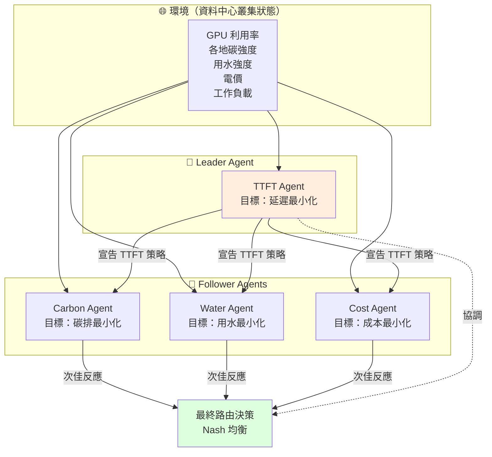
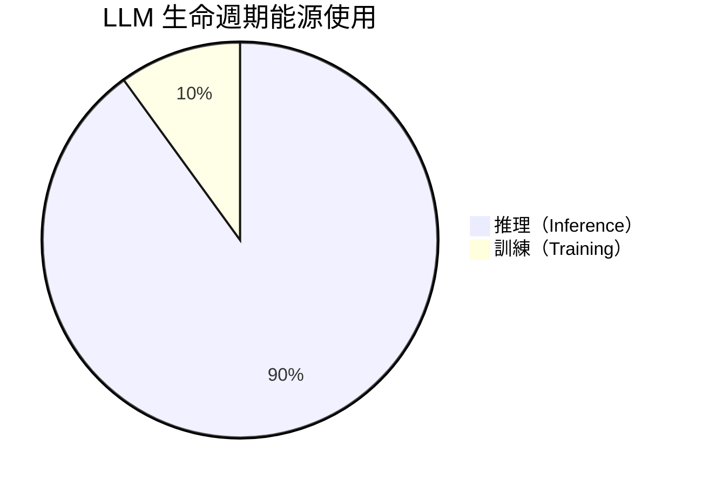

# 多代理賽局論 RL（MARLIN）：用 Stackelberg 賽局協調「快速、低碳、省水、便宜」四目標的 LLM 推理調度

> [!abstract] 一句話理解
> 這是一種讓資料中心 LLM 推理請求調度同時最佳化「**延遲、碳排、用水、能源成本**」四個衝突目標的方法，特別之處在於把每個目標當作一個「Agent」，用 Stackelberg 賽局結構協調它們的決策，透過 RL 收斂到 Nash 均衡，比 SOTA 同時降低 TTFT 18%、碳排 33%、用水 43%、能源成本 11%。

## 🎯 為什麼重要

**它解決了什麼問題？**

當代 LLM 推理面對一個被低估的事實：**推理佔 LLM 生命週期能源使用 90%、訓練只佔 10%**。隨著 ChatGPT、Claude、Gemini、Copilot 全面普及，全球資料中心 LLM 推理用電量已是訓練的 9 倍以上。

這帶來的環境負擔不只是電力——還有：
- **碳排**：依電網結構不同，每度電的 gCO₂ 從 50（核能/水力）到 800（煤炭）差距 16 倍
- **用水**：冷卻塔每度電用水 1-3 升，缺水地區資料中心面臨水資源衝突
- **電價**：不同地區電價從 USD 0.04 到 0.30/kWh 差 7 倍

關鍵挑戰是這四個目標**彼此衝突**：
- 「**最近、最閒的 GPU**」可能位於用煤電的地區（碳排高）
- 「**碳排低**」的地區可能水資源緊張（用水成本高）
- 「**用水少**」的地區可能電價高
- 「**電價低**」的地區可能延遲高

傳統做法只看單一目標（如 latency 最小化），留下大量未利用的優化空間。MARLIN 用賽局論把四個目標一起考量，**找出對所有目標都更好的均衡點**。

## 🧠 入門解說（用類比理解）

**用「家庭裝修決策」理解多目標賽局**

想像一家四口要決定如何裝修客廳，四個成員各有偏好：
- **爸爸**：想要「**功能最強**」（要有好音響、大電視）
- **媽媽**：想要「**最便宜**」（不要超預算）
- **大兒子**：想要「**最美觀**」（IG 拍照好看）
- **小女兒**：想要「**最環保**」（用再生材料）

**傳統做法**：聽老闆（爸爸）的——選最強功能的方案。結果：超預算、不好看、不環保。

**民主投票**：4 人各 1 票表決——可能某個方案得 3 票贏，但「輸的目標」完全沒被考量。

**賽局論做法（MARLIN 的精神）**：
1. 設定「**領導者（leader）**」——例如媽媽（預算最重要、最有否決權）
2. 其他三人是「**追隨者（follower）**」——在預算內，各自試圖優化自己的目標
3. 透過反覆協商，找到「**沒有人想再單方面改變**」的方案——這就是 **Nash 均衡**

**MARLIN 的對應**：
- **領導者**：TTFT Agent（使用者體驗最直接，是 leader）
- **追隨者**：Carbon Agent、Water Agent、Cost Agent（在 TTFT 約束下最佳化自己）
- **均衡**：所有 Agent 都不想再改變的調度策略

**為什麼這個架構好用？**

MARLIN 的關鍵發現：當你不只看延遲，而是同時考量碳/水/成本，會發現**有些調度決策可以讓四個目標都改善**——因為傳統系統只看延遲，留下了「碳/水/成本」三個維度的優化機會。

## 🔑 重點原理

1. **多代理（Multi-Agent）架構**：MARLIN 為每個目標設一個 RL Agent——TTFT Agent、Carbon Agent、Water Agent、Cost Agent。每個 Agent 觀察狀態、做動作、領取自己的 reward。

2. **Stackelberg 賽局結構**：四個 Agent 不是平等的——TTFT Agent 是 leader（最先決策），其他三個是 follower（在 leader 決策下做次佳反應）。這個層級結構模擬「**使用者體驗優先、永續其次**」的實際運營邏輯。

3. **狀態空間（環境觀察）**：包含全球資料中心叢集的即時狀態：
   - GPU 利用率、佇列長度
   - 各資料中心地理位置
   - 即時電網碳強度（gCO₂/kWh）
   - 即時用水強度（升/kWh）
   - 即時電價（USD/kWh）
   - 工作負載特性（請求長度分佈）

4. **動作空間**：對每個進入的 LLM 推理請求，決定路由到哪個資料中心 + 哪個 GPU 群組。

5. **Reward 設計**：
   - TTFT Agent：$r_1 = -\text{latency}$
   - Carbon Agent：$r_2 = -\text{gCO}_2$
   - Water Agent：$r_3 = -\text{liters}$
   - Cost Agent：$r_4 = -\text{USD}$

6. **Nash 均衡訓練**：用 multi-agent RL 演算法（基於 MADDPG 變體）讓四個 Agent 並行訓練，最終收斂到「**沒有 Agent 想單方面改變策略**」的 Nash 均衡點。

7. **動態適應性**：碳強度、用水強度、電價都隨時間變化（白天 vs 夜晚、夏天 vs 冬天、晴天 vs 陰天）——MARLIN 持續從環境中學習，自動切換策略。

## 📊 視覺化說明

### MARLIN 的 Stackelberg 多代理架構

### MARLIN vs SOTA 推理管理系統

| 指標 | SOTA 基準 | MARLIN | 改善 |
|------|---------|--------|------|
| **TTFT** | 100% | 82% | **−18%** |
| **碳排放** | 100% | 67% | **−33%** |
| **用水量** | 100% | 57% | **−43%** |
| **能源成本** | 100% | 89% | **−11%** |

### LLM 生命週期能源比例

## 🔍 與既有技術的差異

**vs. 傳統 LLM 服務調度（vLLM scheduler、Llumnix）**

傳統調度器只看延遲、吞吐量、GPU 利用率——這是「**單目標或加權單目標**」最佳化。MARLIN 用多代理賽局——這是「**多目標賽局均衡**」最佳化。後者能找到前者忽略的「**對所有目標都更好**」的解。

**vs. 加權多目標最佳化（Weighted Sum / Pareto Front）**

過去多目標問題通常用「**加權成本函數**」（$\alpha \cdot \text{latency} + \beta \cdot \text{cost}$）或「Pareto 前沿」處理。但這需要人工指定權重，且 Pareto 前沿是「靜態」的。MARLIN 用賽局論——權重透過 Nash 均衡**動態決定**，且每個 Agent 在策略空間有自由度。

**vs. 集中式 RL（Single-Agent RL）**

把多目標包成單一 Agent 的 reward function（如 $r = w_1 r_1 + w_2 r_2 + w_3 r_3 + w_4 r_4$）也是一種做法。但這要面對「**爆炸的狀態-動作空間**」 + 「**權重難以調整**」 + 「**獎勵函數脆弱**」等問題。MARLIN 用多代理分而治之，每個 Agent 只關心自己目標——更容易訓練、更模組化。

**vs. 純規則 / 啟發式調度（Carbon-Aware Scheduling）**

許多現有「**碳感知調度**」系統用簡單規則（如「當電網碳強度低時優先排程」）。這類規則容易理解但無法處理多目標衝突。MARLIN 用 RL 學出複雜策略——可同時權衡多目標、適應動態環境。

**vs. Carbon Tracker / Green Software（測量工具）**

Carbon Tracker、CodeCarbon 等工具只「**測量**」碳排，不主動「**減少**」。MARLIN 是「**主動調度**」工具——測量 + 決策 + 優化一體。

## 📚 關鍵詞對照表

| 中文 | 英文 | 簡短解釋 |
|------|------|---------|
| 多代理強化學習 | Multi-Agent RL (MARL) | 多個 RL Agent 並行學習 |
| 賽局論 | Game Theory | 多方策略互動的數學理論 |
| Stackelberg 賽局 | Stackelberg Game | 有 leader / follower 階層的賽局 |
| Nash 均衡 | Nash Equilibrium | 無人想單方面改變策略的狀態 |
| 首 token 時間 | TTFT (Time-To-First-Token) | LLM 推理的關鍵延遲指標 |
| 碳強度 | Carbon Intensity | 每度電的 gCO₂ 排放量 |
| 用水強度 | Water Intensity | 每度電的冷卻用水量 |
| Power Purchase Agreement | PPA | 與綠電發電方的長期購電合約 |
| MADDPG | Multi-Agent DDPG | 經典多代理 RL 演算法 |
| 永續 AI | Sustainable AI | 兼顧環境負擔的 AI 系統 |

## 🛠️ 可能的應用場景

1. **大型雲端供應商跨區調度**：AWS、Azure、GCP 等有全球佈局，MARLIN 可實時把推理請求導向「碳低 + 水低 + 價低 + 延遲可接受」的區域。

2. **碳中和承諾的兌現**：許多企業承諾 2030 / 2050 碳中和，AI 工作負載是大頭。MARLIN 可作為「**碳感知 AI 基礎設施**」的核心，量化展示減碳效果。

3. **缺水地區資料中心**：亞利桑那、智利、北非、中東等缺水地區資料中心，用水成本是嚴重議題。MARLIN 降用水 43% 直接緩解水資源壓力。

4. **綠電 PPA 整合**：雲端供應商已簽訂太陽能、風能 PPA。MARLIN 可在「綠電可用時段」自動把更多請求送過去，提高 PPA 利用率。

5. **ESG 報告與合規揭露**：歐盟 CSRD、SEC 氣候揭露規則要求大型企業報告 Scope 1-3 排放。MARLIN 可作為 AI 服務的「**精確碳計量工具**」。

6. **AI 永續性產品差異化**：對 ESG 敏感的客戶（歐洲企業、金融業、政府），「**永續 AI**」可作為產品差異化賣點。

## 📖 學習路徑建議

1. **先讀**：強化學習基礎（MDP、Q-learning、Policy Gradient）
2. **再讀**：賽局論基礎（Nash 均衡、Stackelberg 賽局、Cooperative vs Non-cooperative Game）
3. **再讀**：多代理 RL 經典演算法（MADDPG、QMIX、MAPPO）
4. **再讀**：本論文 MARLIN（arXiv 2605.13496）
5. **進階**：研究 Carbon-Aware Computing（Google 的 Carbon-intelligent compute platform）
6. **延伸**：探索其他「永續 AI」研究方向——綠色訓練、稀疏推理、量化、Edge 推理

## 🔗 延伸閱讀
- 原文連結：[MARLIN: Multi-Agent Game-Theoretic RL for Sustainable LLM Inference (arXiv 2605.13496)](https://arxiv.org/abs/2605.13496)
- 對應新聞筆記：[[2026-05-19-MARLIN 賽局 RL 永續 LLM 推理]]
- 經典 MADDPG 論文：[Multi-Agent Actor-Critic for Mixed Cooperative-Competitive Environments (2017)](https://arxiv.org/abs/1706.02275)
- Google Carbon-Intelligent Compute Platform：[blog](https://blog.google/inside-google/infrastructure/data-centers/carbon-intelligent-platform/)
- HPE Sustainable AI Infrastructure：[hpe.com/sustainability](https://www.hpe.com/us/en/sustainability.html)
- 相關學習筆記：[[2026-05-13-學習-Bayes-consistent Agent 編排]]（同樣是多 Agent 協調）
- 相關學習筆記：[[2026-05-19-學習-生成時專業化 Agent 合成系統]]（系統層級的 AI 優化）

---
*由 Claude 自動整理於 2026-05-19*
