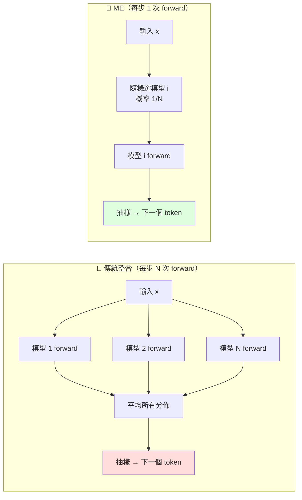

# 混合模型整合（ME）與 Token-Level Routing：把「N 模型平均」改成「每步隨機選 1 個」

> [!abstract] 一句話理解
> 這是一種讓 LLM 模型整合速度提升 1.78x-2.68x 而精度不變的技術，特別之處在於把傳統「**N 個模型各自 forward 後平均輸出分佈**」改寫為「**每生成一個 token 隨機選 1 個模型來算**」——數學上完全等價（從整合分佈抽樣），但計算成本只有 1/N，且這個視角揭示了 LLM 整合是 token-level routing（如 MoE）的特例。

## 🎯 為什麼重要

**它解決了什麼問題？**

模型整合（ensembling）是機器學習最古老的提升手段——讓多個模型各自預測、平均/投票，能顯著提升穩健度與精度。經典應用如 Random Forest、深度學習裡的 model averaging。

延伸到 LLM 後，整合的好處仍在（多模型混合能改善偏見、提升 robustness、整合不同訓練資料的優勢），但**計算成本變得無法接受**——每生成 1 個 token，要對 N 個模型各跑一次 forward pass。整合 3 個 7B 模型，推理成本等同跑一個 21B 模型。

**這在 2026 年特別關鍵**，因為：
1. 越來越多企業想「混合多家 LLM」——例如同時用 Claude、GPT、Gemini，互補彼此弱點
2. MoE 已成大模型主流架構，但「跨家 MoE 整合」仍是研究空白
3. Edge / 私有部署希望「**多個小模型混合 = 一個大模型效果**」，但傳統整合的成本不允許

ME（Mixture-model-like Ensemble）解決這個問題：**讓整合的計算成本回到單模型水準**，徹底打開「**多家模型混合服務**」的應用空間。

## 🧠 入門解說（用類比理解）

**用「民意調查」理解 ME**

想像你要做政策決策，想參考 3 位顧問的意見：
- **顧問 A**（保守、注重歷史）
- **顧問 B**（創新、注重未來）
- **顧問 C**（中道、注重平衡）

**傳統整合做法**：每個決策都要問 3 個顧問、各自寫一份報告、然後你綜合 3 份報告再決定。優點：考慮周全。缺點：時間是 3 倍、3 個顧問都得忙。

**ME 做法**：你建立一個規則——「**每個決策**隨機選 1 位顧問來問」——例如「**每次擲骰子，奇數問 A、偶數問 B**」。你做了 100 個決策，平均下來 33 個用 A、33 個用 B、34 個用 C。

**關鍵洞見**：長期來看，這 100 個決策的「集體分佈」與「每次都問 3 人並平均」是**統計上完全相同的**——但你只花了 1/3 的時間。

**ME 在 LLM 怎麼用？**

LLM 是「逐個 token 生成」——每個 token 都是一個小決策。
- 傳統：每個 token 問 3 個模型、平均
- ME：每個 token 隨機選 1 個模型

長序列（1000 tokens）跑下來，平均每個模型被選 333 次——統計上等價於整合，但計算只用 1 個模型。

**ME 巧妙的地方在於**：它不是「妥協」——它是**數學上嚴格等價的最佳化**。從統計角度，「**先從整合分佈抽樣**」與「**先選模型再抽樣**」是同一件事。

## 🔑 重點原理

1. **整合 = 平均分佈、ME = 混合模型抽樣**：
   - 傳統整合：$P_{\text{ensemble}}(t|x) = \frac{1}{N}\sum_i P_i(t|x)$，每步需算 N 次 forward
   - ME：先以機率 $\pi_i=1/N$ 選模型 $i$，從 $P_i(t|x)$ 抽樣，每步只算 1 次 forward
   - **兩者邊緣分佈完全相同**

2. **數學等價性證明**：對於任何 token $t$，
   $$P_{\text{ME}}(t|x) = \sum_i \pi_i \cdot P_i(t|x) = \frac{1}{N}\sum_i P_i(t|x) = P_{\text{ensemble}}(t|x)$$
   等號嚴格成立，所以 ME 抽樣 = 從整合分佈抽樣。

3. **長序列統計平均**：生成 $L$ 個 token，每步獨立抽模型，期望每個模型被選約 $L/N$ 次。當 $L$ 夠大（>100），實際分佈接近均勻——所有模型的「平均貢獻」與傳統整合一致。

4. **速度增益來源**：傳統整合每步需 N 次 forward；ME 每步只 1 次。所以速度比約 N:1，但實際上有些 KV-Cache 共享等優化，論文實測加速為 1.78x-2.68x（小於理論 N，因為有 sampling 開銷）。

5. **與 stochastic decoding 相容**：在 temperature sampling、top-p sampling、top-k sampling 等隨機解碼設定下，ME 仍然等價於傳統整合——因為「先選模型再抽 token」與「合併分佈再抽 token」的隨機性都是合法的。

6. **整合即路由（理論統一）**：ME 揭示 LLM 整合是 token-level routing 的特例：
   - **ME**：router 是均勻分佈 $\pi_i=1/N$
   - **MoE**：router 是 $\pi_i = \text{router}(x)$（依輸入決定）
   - **學習式 token routing**：router 是 $\pi_i = \text{router}_t(x, h)$（依輸入 + context）
   三者都是「混合模型」的不同實例。

7. **未來研究方向**：把「均勻 router」改為「**學習式 router**」，可能在保留 ME 速度優勢的前提下進一步提升精度——這是 ME 開啟的最有潛力研究路線。

## 📊 視覺化說明

### 傳統整合 vs ME 流程比較

### LLM 整合與 Routing 的統一視角

| 技術 | Router 形式 | 模型選擇 | 計算成本 |
|------|-----------|---------|--------|
| **傳統整合** | $\pi_i = 1/N$（均勻） | 每 token 用**所有** N 個模型 | **N x** 單模型 |
| **ME（本論文）** | $\pi_i = 1/N$（均勻） | 每 token **隨機選 1** | **1 x** 單模型 |
| **MoE（標準）** | $\pi_i = \text{router}(x)$ | 每 token 用 **top-k expert** | k x 單模型 |
| **學習式 token routing** | $\pi_i = \text{router}_t(x, h)$ | 每 token 動態決定 | 視 k 而定 |

### ME 實測效能

| 指標 | 傳統整合 | ME |
|------|---------|------|
| 推理速度 | 1.0x | **1.78x-2.68x** |
| MMLU | A | ≈A（差 < 0.5%） |
| GSM8K | B | ≈B（差 < 0.3%） |
| HumanEval | C | ≈C（差 < 0.4%） |
| 計算 cost | N x | 1x |

## 🔍 與既有技術的差異

**vs. 傳統 LLM Ensembling**

完全相同的數學結果，但計算成本從 N 倍降到 1 倍——可說是「**免費午餐**」型優化。

**vs. Mixture of Experts（MoE）**

MoE 是「**單模型內部多 expert**」（共享參數結構），ME 是「**多獨立模型整合**」（無共享）。但 ME 的視角告訴我們：兩者本質都是「混合模型」，只是 router 與 expert 的耦合程度不同。可以說 **MoE 是「結構化 ME」、ME 是「鬆耦合 MoE」**。

**vs. Speculative Decoding（推測解碼）**

推測解碼是「**用小模型先猜、大模型驗證**」——加速單模型推理。ME 是「**多模型輪流生成 token**」——加速整合推理。兩者目標不同但可組合：可以對 ME 中的每個模型套用 speculative decoding。

**vs. Self-Consistency / Multi-Sample**

Self-Consistency 是「**單模型多次抽樣再投票**」——不算整合（只用一個模型）。ME 是「**多模型整合**」。兩者也可組合：對 ME 結果做多次抽樣再投票。

**vs. Model Cascading**

Cascading 是「**先用便宜模型、不確定才升級到貴模型**」——條件式選擇模型。ME 是「**隨機選**」。Cascading 在「**容易任務省成本**」上更有效，但需要設計信心評估；ME 簡單、不需信心評估、保證統計等價。

## 📚 關鍵詞對照表

| 中文 | 英文 | 簡短解釋 |
|------|------|---------|
| 模型整合 | Model Ensembling | 多模型協作預測 |
| 混合模型 | Mixture Model | 多個分佈以權重組合 |
| Token 級路由 | Token-Level Routing | 每個 token 動態選模型/expert |
| 邊緣分佈 | Marginal Distribution | 對未選變數積分後的分佈 |
| 隨機解碼 | Stochastic Decoding | 用 temperature/top-p 等隨機抽樣 |
| 專家混合 | Mixture of Experts (MoE) | 神經網路內含多 expert + router |
| 路由器 | Router | 決定資料分流到哪個 expert/model |
| 等價抽樣 | Equivalent Sampling | 不同程序但抽樣分佈相同 |
| Spotlight 論文 | Spotlight Paper | 會議高分論文（前 5-10%） |
| Token-by-Token | Token-by-Token | LLM 逐 token 生成的特性 |

## 🛠️ 可能的應用場景

1. **異質 LLM 混合服務**：企業同時用 Claude + GPT + Gemini + Qwen 做客服回答的混合決策——過去計算成本太高無法做、ME 把成本降到單模型水準後變得可行。

2. **多家 API 整合應用**：應用層整合多個 LLM API（如 OpenRouter）的服務，可用 ME 把「呼叫 3 家 API 平均」變成「**輪流呼叫 1 家**」——API 成本直接降為 1/N。

3. **Edge 部署的「小模型 ensemble」**：手機/邊緣裝置記憶體有限，可用 ME 整合多個小模型（如 3 個 3B 模型 ME 整合 ≈ 8B 模型效果），且推理成本與單 3B 模型相同。

4. **A/B 測試與漸進式遷移**：模型升級時，可用 ME 在「舊模型 + 新模型」之間漸進切換——例如把新模型權重從 0% 慢慢調到 100%，平滑過渡。

5. **降低單模型偏見**：把多個不同訓練資料/角度的模型混合，可降低單一模型的偏見（如政治偏見、文化偏見）——ME 讓這個應用的成本變得可接受。

6. **可解釋性 / 不確定性量化**：通過追蹤「每個 token 是被哪個模型生成的」，可分析模型間的分歧——對 AI 安全與可解釋性有價值。

## 📖 學習路徑建議

1. **先讀**：機器學習的 Ensemble 經典理論（bagging、boosting、stacking）
2. **再讀**：Mixture Model 數學基礎（高斯混合模型、EM 演算法）
3. **再讀**：LLM 自迴歸生成原理（softmax、temperature、top-p sampling）
4. **再讀**：本論文 ME（arXiv 2605.00419）
5. **再讀**：MoE 經典論文 GShard、Switch Transformer、Mixtral
6. **進階**：探索「**學習式 token routing**」的最新研究方向

## 🔗 延伸閱讀
- 原文連結：[Rethinking LLM Ensembling from the Perspective of Mixture Models (arXiv 2605.00419)](https://arxiv.org/abs/2605.00419)
- 對應新聞筆記：[[2026-05-19-Mixture-Model-like Ensemble 重新定義 LLM 整合]]
- GitHub 程式碼：[jialefu/Mixture-model-like-Ensemble](https://github.com/jialefu/Mixture-model-like-Ensemble/)
- ICML 2026 官方：[icml.cc](https://icml.cc/)
- 經典 MoE 論文：[Outrageously Large Neural Networks: The Sparsely-Gated MoE Layer (2017)](https://arxiv.org/abs/1701.06538)
- GShard 論文：[GShard (2020)](https://arxiv.org/abs/2006.16668)
- 相關學習筆記：[[2026-05-13-學習-LLM Agent 技能演化框架]]
- 相關學習筆記：[[2026-05-19-學習-生成時專業化 Agent 合成系統]]（同樣是 LLM 推理優化）

---
*由 Claude 自動整理於 2026-05-19*
