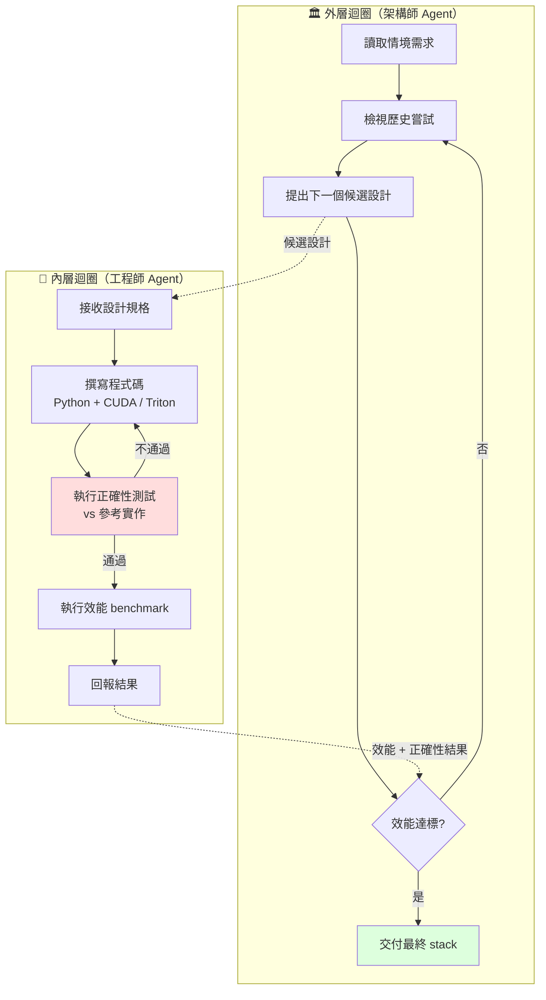

# 生成時專業化（Generation-Time Specialization）：用 AI Agent 即時合成「為這個情境量身做」的系統軟體

> [!abstract] 一句話理解
> 這是一種用 AI Agent 在「**部署當下**」自動產生整套系統軟體（如 LLM 服務系統）的方法，特別之處在於把過去由工程師耗費多年人力寫好的「通用 stack」，改為**為每個部署情境量身合成的「客製 stack」**——VibeServe 是業界第一個在 LLM Serving 這個工業級場景證明可行的工作。

## 🎯 為什麼重要

**它解決了什麼問題？**

LLM 服務系統（serving system）是當代 AI 應用最重要的後端基礎設施——負責批次調度、KV-Cache 管理、注意力核心優化、量化推理、多 GPU 並行、推測解碼等。過去三年最受歡迎的兩套是 vLLM 與 TensorRT-LLM——兩者都投入了**數十甚至上百人年**才把通用 stack 做到能高效跑各種模型。

但這條路線有兩個根本問題：

1. **通用性犧牲特異性**——當新模型架構（Mamba、ELMs、混合架構）、新工作負載（agent 多步推理）、新硬體（ASIC、TPU v6、Cerebras WSE-3）出現時，通用 stack 需要 6-12 個月才能跟上
2. **長尾情境被忽略**——通用 stack 為「最常見情境」優化，但每個企業的實際工作負載往往有特殊性（特定請求模式、特定硬體配置、特定模型混合），這些長尾情境的優化機會被埋沒

VibeServe 提出的解決方案：**讓 AI Agent 在部署時為每個情境合成客製系統**。如果這條路成功，意味著：
- 新硬體不用等社群支援，Agent 直接合成
- 新模型架構不用等大廠優化，Agent 直接合成
- 每個企業可以得到「為它的工作負載最佳化」的系統

這是「**軟體生產方式**」的根本轉移——從「人寫一套通用工具」轉向「**機器為每個情境合成專屬工具**」。

## 🧠 入門解說（用類比理解）

**用「西裝裁縫」理解生成時專業化**

想像買西裝有兩種模式：

- **傳統模式（通用 stack）**：你去 ZARA、UNIQLO 買標準尺寸——S、M、L、XL。它們的設計師花了多年時間，研究無數人的體型，做出一個「**對最多人都不錯**」的版本。優點是大規模生產很便宜，缺點是不可能完美貼合你的身材。

- **VibeServe 模式（生成時專業化）**：你走進一個有「**自動裁縫機 + AI 設計師**」的店，AI 用幾分鐘量你的體型、了解你的場合需求（商務 vs 婚禮 vs 休閒）、考量你的活動習慣，然後自動切版、自動縫製，產出一套「**只為你做的西裝**」。

**VibeServe 怎麼運作？**

1. **量體（外層 Agent 規劃）**：AI 設計師 Agent 先了解情境——什麼模型？什麼硬體？什麼工作負載？預算多少？
2. **試版（內層 Agent 實作）**：自動裁縫機 Agent 寫出一套候選 stack，跑 benchmark 看效能
3. **修改**：如果不夠好，外層 Agent 根據結果調整設計、內層 Agent 重做
4. **完成**：當效能達標、外層 Agent 滿意，就交付給客戶

**為什麼以前做不到？**

過去做「為情境量身合成系統」需要的條件：
- 需要能寫程式的 AI（過去做不到）
- 需要能跑大量 benchmark 的計算資源（過去太貴）
- 需要 reliable 的測試框架驗證程式正確性（現在 vLLM/SGLang 等提供了參考）

2026 年這三個條件都成熟了——所以 VibeServe 才能出現。

## 🔑 重點原理

1. **兩層 Agent 架構（Outer-Inner Loop）**：外層負責規劃與搜索整個系統設計空間（決定「該嘗試什麼設計」）、內層負責實作具體候選方案（寫程式、跑測試、回報結果）。這個架構類似於「**架構師 + 工程師**」的軟體開發團隊。

2. **持久化狀態與記憶**：外層 Agent 維護一個 git-history-like 的記憶——每次嘗試過的設計、效能結果、失敗原因都被記錄。這讓 Agent 可以「**從歷史學習**」，避免重複嘗試已知不好的方向，加速搜索。

3. **正確性保證**：內層 Agent 寫完程式碼後，必須通過「**參考實作比對測試**」——把候選 stack 的輸出與 vLLM 等已知正確的 stack 比對，確保語義一致。這是讓自動生成的程式碼「**不亂寫**」的關鍵保障。

4. **多目標 benchmark**：每個候選 stack 在多個指標上評估——throughput、TTFT（time-to-first-token）、TPOT（time-per-output-token）、記憶體使用、能耗等。外層 Agent 根據加權目標選擇下一步搜索方向。

5. **情境感知合成**：VibeServe 的核心優勢是「為情境量身做」。情境包含：（a）模型架構（Transformer、Mamba、MoE 等）、（b）工作負載特性（請求長度分佈、批次大小、上下文長度）、（c）硬體特性（GPU 型號、記憶體頻寬、互連拓樸）、（d）部署目標（最大化吞吐量 vs 最小化延遲 vs 最低能耗）。

6. **與通用 stack 競爭力相當**：在「**標準場景**」（如 LLaMA 跑在 NVIDIA A100/H100）下，VibeServe 自動生成的系統與 vLLM 達到 92-104% throughput——這個結果證明「自動合成不必犧牲效能」。

7. **非標準場景顯著勝出**：在 6 個 vLLM 沒針對性優化的場景（Mamba 模型、超長上下文、Agent 工作負載、Edge 硬體、ASIC、量化+推測解碼組合），VibeServe 平均快 1.4x-2.3x——這才是生成時專業化真正的價值。

## 📊 視覺化說明

### VibeServe 的兩層迴圈架構

### 傳統通用 stack vs 生成時專業化

| 維度 | 傳統通用 stack（vLLM、TensorRT-LLM） | 生成時專業化（VibeServe） |
|------|----------------------------------|------------------------|
| **開發方式** | 工程師人工編寫 + 持續優化 | Agent 自動合成 |
| **開發時間** | 幾十-上百人年 | 數小時-數天（每次合成） |
| **目標情境** | 「對最多情境都不錯」 | 「為這個情境最佳」 |
| **應對新模型/硬體** | 等社群跟上（6-12 個月） | Agent 立即合成 |
| **效能（標準情境）** | 高度優化、SOTA | 與 SOTA 相當 |
| **效能（非標準情境）** | 沒針對性、效能中等 | 顯著勝出（1.4x-2.3x） |
| **可維護性** | 巨大 codebase、難改 | 每次重新合成、不留技術債 |

### VibeServe vs vLLM 效能對比（6 場景）

| 場景 | 工作負載 | 加速 vs vLLM |
|------|---------|--------------|
| 非標準模型（Mamba） | 狀態空間模型 | **2.1x** |
| 超長上下文（>128K） | 文件處理 | **1.8x + 記憶體 −35%** |
| Agent 多步推理 | 反覆短查詢 + 工具調用 | **1.6x** |
| Edge 硬體（Apple M-series） | 統一記憶體 | **2.3x** |
| ASIC（Cerebras WSE） | 晶片內記憶體 | vLLM 不支援，VibeServe 可用 |
| 量化 + 推測解碼 | INT4 + draft 模型 | **1.4x** |

## 🔍 與既有技術的差異

**vs. 通用 LLM serving stack（vLLM、TensorRT-LLM、SGLang）**

通用 stack 是「**runtime generality**」典範——同一套程式碼支援所有情境，靠 runtime 配置或 JIT 編譯做局部優化。VibeServe 是「**generation-time specialization**」典範——每個情境合成不同程式碼，沒有 runtime 通用性負擔。兩者哲學完全相反。

**vs. AutoML / NAS（神經架構搜索）**

AutoML / NAS 是「**為模型架構自動搜索**」（找出比人工設計更好的網路）。VibeServe 是「**為系統軟體自動搜索**」（找出比人工寫的更好的服務 stack）。對象不同：前者是 ML 模型本身、後者是支援模型運行的基礎設施。

**vs. JIT 編譯 + Profile-Guided Optimization（PGO）**

JIT + PGO 是「**對既有程式碼做動態優化**」——程式碼框架由人寫好，編譯器/runtime 根據實際 profile 調整實作細節。VibeServe 更激進——**程式碼本身也是生成的**。可以說 VibeServe 是 JIT 的「終極形態」——連 source code 都不固定。

**vs. Copilot / Cursor 等 Code Agent**

Copilot 等是「**輔助人寫程式**」——人在主導、AI 在幫忙補全/重構。VibeServe 是「**AI 主導從零寫整套系統**」——人只提供情境描述與正確性驗證、AI 負責所有實作決策。

**vs. CompilerGym / 自動編譯器調優**

CompilerGym 等是「**用 RL 調整編譯器旗標**」——優化空間是「編譯器設定」。VibeServe 的優化空間是「**整套程式碼結構**」——大得多，但也更有自由度。

## 📚 關鍵詞對照表

| 中文 | 英文 | 簡短解釋 |
|------|------|---------|
| 生成時專業化 | Generation-Time Specialization | 部署時為情境量身合成程式碼 |
| 系統合成 | System Synthesis | 自動產生整套系統軟體 |
| 多代理迴圈 | Multi-Agent Loop | 多個 Agent 協作搜索與實作 |
| 外層迴圈 | Outer Loop | 規劃 + 搜索設計空間 |
| 內層迴圈 | Inner Loop | 實作 + 測試候選方案 |
| LLM 服務系統 | LLM Serving System | 處理 LLM 推理請求的後端 stack |
| 首 token 時間 | TTFT (Time-To-First-Token) | 收到請求到產出第一個 token 的延遲 |
| 連續批次調度 | Continuous Batching | vLLM 等系統的核心調度技術 |
| 參考實作 | Reference Implementation | 用來比對正確性的已知正確版本 |
| 工作負載 | Workload | 系統實際處理的請求模式 |

## 🛠️ 可能的應用場景

1. **新晶片廠商的軟體生態建構**：Cerebras、Groq、SambaNova、台廠新 AI ASIC 廠商可用 VibeServe 路線在幾天內合成出 LLM serving stack，不必等 vLLM 社群支援、不必招募 CUDA 工程師團隊。

2. **企業內部客製化推理服務**：大型企業可基於自家工作負載（如金融客戶 90% 是短對話 + 10% 是長文件分析），讓 VibeServe 合成「**為這個負載最佳化**」的 stack，比直接用 vLLM 提升 1.5-2x 效能。

3. **Edge LLM 部署**：手機、車載、IoT 等 Edge 環境工作負載特殊（小批次、低延遲、低能耗），VibeServe 為 Edge 硬體合成的 stack 可顯著超越通用 stack。

4. **多模型混合服務**：當企業需要同時服務 Claude / GPT / Gemini / Qwen 等多家模型，VibeServe 可合成統一 stack 同時最佳化所有模型——而通用 stack 通常只為某一家模型優化好。

5. **快速適應新架構**：新模型架構（Mamba、ELMs、Diffusion LLM 等）出現時，VibeServe 可在幾小時內合成支援該架構的 stack，不必等社群跟上。

## 📖 學習路徑建議

1. **先讀**：理解 Transformer 推理流程（KV-Cache、批次調度、注意力計算）
2. **再讀**：vLLM 與 PagedAttention 論文（理解通用 stack 的設計哲學）
3. **再讀**：本論文 VibeServe（arXiv 2605.06068）
4. **再讀**：相關 Code Agent 研究（如 SWE-agent、AutoGen、MetaGPT 等多代理框架）
5. **進階**：研究 RL for system optimization（如 CompilerGym、Park、Cilantro）
6. **延伸**：思考「生成時專業化」在其他系統軟體領域的應用（資料庫、編譯器、作業系統）

## 🔗 延伸閱讀
- 原文連結：[VibeServe: Can AI Agents Build Bespoke LLM Serving Systems? (arXiv 2605.06068)](https://arxiv.org/abs/2605.06068)
- 對應新聞筆記：[[2026-05-19-VibeServe Agent 自動合成 LLM 服務系統]]
- GitHub 程式碼：[uw-syfi/vibe-serve](https://github.com/uw-syfi/vibe-serve)
- vLLM 原始論文：[Efficient Memory Management for Large Language Model Serving with PagedAttention](https://arxiv.org/abs/2309.06180)
- 相關學習筆記：[[2026-05-18-學習-GraphBit DAG Agent 編排架構]]（同樣是把系統設計結構化）
- 相關學習筆記：[[2026-05-19-學習-多目標賽局論 RL 與永續 AI 調度]]（系統層級的多目標優化）

---
*由 Claude 自動整理於 2026-05-19*
