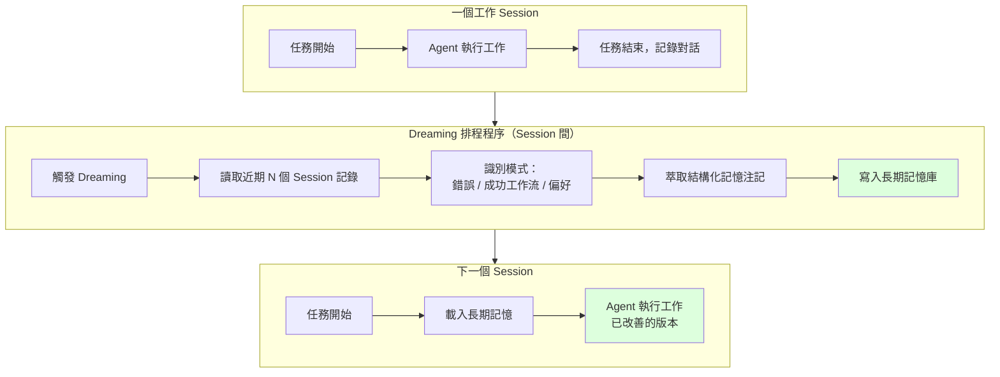

# Anthropic Dreaming：用「睡眠記憶鞏固」理解 AI Agent 自我改進機制

> [!abstract] 一句話理解
> 這是一個用來「讓 AI Agent 在任務間隙自動回顧過去表現並改善長期記憶」的排程機制，特別之處在於它模仿人腦海馬迴的記憶鞏固過程，不需要重新訓練模型，就能讓 Agent 從每次任務經驗中持續學習。

## 🎯 為什麼重要

**它解決了什麼問題？**

傳統 AI Agent 有一個根本性的「失憶症」問題：**每次啟動時都從零記憶開始**。

想象你雇了一個新助理，第一天工作他犯了一些錯誤，你給了回饋，他改進了。但第二天他來上班，完全不記得昨天的任何事——不記得犯了哪些錯誤，不記得什麼方法有效，不記得你的偏好。你每天都需要重新教他。

這正是 2026 年大多數企業 AI Agent 面臨的問題。即使 Agent 有「對話記憶」，也只是在同一個對話階段（session）內有效。Session 結束後，下次啟動又是一張白紙。

**既有解法的不足**：

- **模型微調（Fine-tuning）**：能讓模型「記住」特定知識，但成本高昂、速度慢，且會改變模型本身，風險高
- **RAG（檢索增強生成）**：可以外掛知識庫，但無法讓 Agent 自動更新「哪些工作方法有效」的學習
- **固定系統提示（System Prompt）**：人工維護一份「注意事項」，但需要人工持續更新，無法自動學習

**Dreaming 的改變**：

Dreaming 在不修改模型的前提下，讓 Agent 能夠**跨 Session 自動積累工作經驗**。通過定期「回顧記憶」，Agent 能夠識別自己的弱點和優點，並把這些洞察存入長期記憶——下次啟動時自動載入這些記憶，讓每次任務都基於過去所有任務的累積學習。

## 🧠 入門解說（用類比理解）

**用「醫學住院醫師的學習方式」理解 Dreaming**

想象一個住院醫師的一週：

**沒有 Dreaming 的 AI Agent（現在大多數 Agent）**：每天早上到病房，完全不記得昨天的病人、診斷和用藥決策。每天都重新從頭學同樣的錯誤。病人可能每次都會被問同樣的問題。

**有 Dreaming 的 AI Agent**：每天晚上，住院醫師「睡覺」——但在睡眠中，她的大腦（Dreaming 機制）在回顧今天的所有案例：「張先生的血壓藥方案有效，下次遇到類似症狀可以直接用」、「今天那個 CT 判讀思路有問題，下次需要先排除 X 可能性」。這些洞察被整合進她的長期記憶，明天早上她已經是一個比昨天更好的醫師。

**關鍵洞見**：Dreaming 把「從經驗中學習」的能力從「人類的生理機制」轉移到「AI Agent 的架構設計」。人腦海馬迴（hippocampus）在睡眠期間重播白天的記憶、強化重要學習——Anthropic 把這個機制工程化，做成了一個可以定期自動執行的排程程序。

## 🔑 重點原理

1. **Session 間記憶斷裂問題（Cross-Session Amnesia）**：現有 Agent 框架中，記憶通常只在一個 Session 內有效。Dreaming 通過引入「排程式長期記憶更新」，在架構層面解決了這個根本問題——無需改變模型，只需改變記憶管理策略。

2. **排程式後台程序（Scheduled Background Process）**：Dreaming 不是在任務執行中實時更新，而是在 Session 結束後，由系統排程在背景中自動執行。這避免了對任務執行的干擾，也讓「回顧」能夠有足夠的計算資源進行深度分析。

3. **三步驟記憶鞏固管道**：
   - **回顧（Review）**：掃描近期 N 個 Session 的完整對話記錄
   - **萃取（Extract）**：識別重複的錯誤模式、有效工作流、學到的偏好
   - **鞏固（Consolidate）**：把萃取的洞察整理成結構化記憶注記，寫入長期記憶庫

4. **非破壞性改善（Non-Destructive Improvement）**：Dreaming 不修改模型權重（model weights），只更新 Agent 的長期記憶庫（external memory store）。改善是可逆的，也不影響模型在其他場景的能力。

5. **海馬迴啟發（Hippocampal Inspiration）**：人腦在慢波睡眠（Slow-Wave Sleep）期間，海馬迴會重播白天的記憶片段，幫助把短期記憶（海馬迴）轉移到長期記憶（大腦皮質）。Dreaming 的架構直接受此啟發：短期記憶 = Session 內對話記錄；長期記憶 = 跨 Session 的持久記憶庫；鞏固過程 = Dreaming 排程程序。

## 📊 視覺化說明

### Dreaming 的記憶鞏固流程

### Dreaming vs. 傳統 Agent 記憶方案比較

| 維度 | 無記憶 Agent | RAG 知識庫 | 模型微調 | **Dreaming** |
|------|------------|-----------|---------|-------------|
| **跨 Session 學習** | ❌ 無 | ⚠️ 需人工更新 | ✅ 有，但一次性 | ✅ 持續自動 |
| **學習速度** | N/A | 慢（人工） | 很慢（訓練） | **快（每次 Session 後）** |
| **修改模型** | 否 | 否 | **是** | **否** |
| **可逆性** | N/A | 是 | ❌ 難以逆轉 | **是** |
| **成本** | 低 | 中 | 高 | **低-中** |
| **學習內容** | 無 | 預定義知識 | 訓練數據決定 | **任務中學到的一切** |

## 🔍 與既有技術的差異

**vs. 模型微調（Fine-tuning / RLHF）**

微調直接改變模型權重，Dreaming 只改變外部記憶庫。微調的學習是永久性的，Dreaming 的記憶可以被覆蓋或重置。微調需要大量標注數據和計算資源（可能需要數天/週），Dreaming 在每次 Session 後幾分鐘內就完成。但微調的學習更深層（在模型內部），Dreaming 的學習依賴記憶檢索的品質。

**vs. Memory-Augmented LLM（記憶增強型語言模型，如 MemGPT）**

MemGPT 等系統也試圖解決長期記憶問題，通常通過顯式的記憶讀寫機制，讓 Agent 在執行任務時主動「存記憶」和「查記憶」。Dreaming 的差異在於：記憶鞏固是異步的（Session 後），而不是同步的（任務執行中），這讓鞏固可以進行更深度的跨 Session 分析，而不只是存儲單次互動的記憶。

**vs. 簡單的對話歷史記錄**

對話歷史記錄是「把所有對話都存起來然後塞進 prompt」的暴力解法，在 context 變長後效率急劇下降，且不能識別跨多次對話的模式。Dreaming 的核心價值在於「萃取和整理」——把數百次對話的學習壓縮成簡潔、可用的記憶注記，而不是保存原始記錄。

## 📚 關鍵詞對照表

| 中文 | 英文 | 簡短解釋 |
|------|------|---------|
| 記憶鞏固 | Memory Consolidation | 把短期記憶轉化為長期記憶的過程，原指大腦機制 |
| 海馬迴 | Hippocampus | 大腦中負責短期記憶編碼和空間導航的區域 |
| 長期記憶庫 | Long-Term Memory Store | 跨 Session 持久保存的 Agent 記憶，通常存在外部資料庫 |
| 排程後台程序 | Scheduled Background Process | 在主任務外、定期自動執行的後台程序 |
| 模型微調 | Fine-tuning | 在預訓練模型的基礎上，用特定數據繼續訓練，更新模型權重 |
| 非破壞性改善 | Non-Destructive Improvement | 不修改模型本身，只改變外部狀態（記憶/提示）的改善方式 |
| Claude Managed Agents | Claude Managed Agents | Anthropic 提供的企業 Agent 管理框架，包含工具使用、多 Agent 協調等 |
| 工作流識別 | Workflow Identification | 識別 Agent 在多次任務中重複使用的成功操作序列 |
| Shadow AI | Shadow AI | 員工未經企業 IT 批准、私自使用的 AI 工具，常帶來安全風險 |
| 錯誤模式識別 | Error Pattern Detection | 在多次對話記錄中識別重複出現的失敗原因 |

## 🛠️ 可能的應用場景

1. **法律 AI Agent（如 Harvey 的案例）**：法律工作高度重複性——同一類型的合約審查、同一種訴狀模板。Dreaming 讓 Agent 記住每種法律文件的有效分析框架，下次遇到類似文件直接使用。Harvey 的 6x 任務完成率提升清晰展示了這個效果。

2. **醫療文件 AI（如 Wisedocs 的案例）**：醫療文件分類有大量行業特定模式。Dreaming 讓 Agent 從每批文件中學習，不斷細化分類標準，減少人工審查需求（Wisedocs 審查時間縮短 50%）。

3. **企業 IT Support Agent**：IT 支援問題高度重複性，Dreaming 讓 Agent 記住哪些解決方案對哪些問題有效，避免重複探索相同的解決路徑。

4. **個人化 AI 助理**：個人用戶使用習慣和偏好具有高度個性化，Dreaming 讓 Agent 隨時間越來越了解特定用戶，而不需要用戶每次重新說明偏好。

5. **金融分析 Agent**：金融分析模板和特定公司的分析框架有高度復用性，Dreaming 讓 Agent 在分析同一公司或同一行業的報告時，持續積累分析「肌肉記憶」。

## 📖 學習路徑建議

1. **先讀**：AI Agent 基礎概念（什麼是 Agent、工具使用、多步驟推理）
2. **先讀**：RAG（Retrieval-Augmented Generation）基礎——理解如何把外部知識注入 LLM
3. **再讀**：MemGPT 論文（Managing Memory in AI Agent Frameworks）——了解記憶管理的主流方案
4. **再讀**：Claude Managed Agents 技術文件——理解 Dreaming 的運作環境
5. **再讀**：Anthropic Dreaming 相關報導（VentureBeat, YourStory 等）
6. **進階**：Hippocampal Memory Consolidation 的神經科學研究——理解 Dreaming 的生物學靈感

## 🔗 延伸閱讀
- 原文連結：[VentureBeat：Anthropic Dreaming](https://venturebeat.com/technology/anthropic-introduces-dreaming-a-system-that-lets-ai-agents-learn-from-their-own-mistakes)
- 對應新聞筆記：[[2026-05-21-Anthropic Dreaming AI Agent 自我改進技術]]
- 延伸：[YourStory 技術解析](https://yourstory.com/ai-story/anthropic-claude-dreaming-self-improving-agents)
- 延伸：[AI Automation Global 深度分析](https://aiautomationglobal.com/blog/claude-managed-agents-dreaming-outcomes-multiagent-2026)
- 相關論文：MemGPT（記憶增強 Agent 框架）

---
*由 Claude 自動整理於 2026-05-21*
