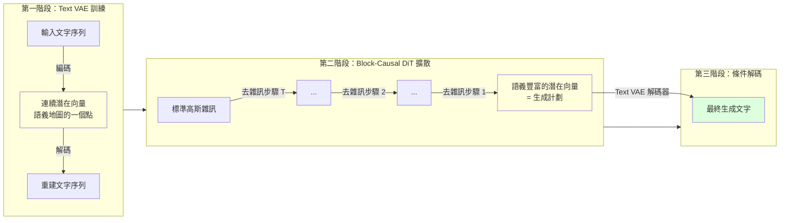

# Cola DLM：用「先在腦海中構思，再開口說話」理解連續潛在擴散語言模型

> [!abstract] 一句話理解
> 這是一個用來「先在連續語義空間規劃文章結構，再解碼成文字」的擴散語言模型，特別之處在於它把「說什麼（語義組織）」和「怎麼說（文字實現）」完全分開處理，讓語言生成擺脫逐 token 的自回歸瓶頸。

## 🎯 為什麼重要

**它解決了什麼問題？**

所有主流大型語言模型（GPT、Claude、Gemini、Llama）都基於「**自回歸生成（Autoregressive Generation）**」：一次預測一個 token，後面的 token 依賴前面的。這個方法有一個根本性的限制——**無法在開口說話前「全局規劃」要說什麼**。

人類寫作的真實過程其實不是這樣的。我們寫一篇報告時，腦海中先有「這篇報告的整體結構和核心論點」——這是在「語義空間」的規劃；然後才是落筆，把這個語義計劃轉化為具體的文字。自回歸模型跳過了「語義空間規劃」這個步驟，直接從第一個 token 開始，靠注意力機制（Attention）在局部捕捉長程依賴。

**既有解法的不足**：

之前也有人試過「擴散語言模型（Diffusion Language Models）」——比如 MDLM、LLaDA——但它們都在**離散 token 空間**做擴散：把 token 一個個「加雜訊然後去雜訊」。這等於還是在 token 層面思考，沒有真正的「語義空間」。

**Cola DLM 的改變**：

Cola DLM 在**連續潛在空間（Continuous Latent Space）**做擴散——這個空間是「語義的」，不是「詞彙的」。一個潛在向量代表一個「語義概念」，而不是一個 token。這讓 Cola DLM 能在真正的「意義層面」進行全局規劃，再翻譯成文字。

## 🧠 入門解說（用類比理解）

**用「演講準備」理解 Cola DLM**

想像你要發表一場 10 分鐘的演講：

**自回歸方式（一般 LLM）**：站上台，開口說第一個字，靠著機智和經驗，一個字接一個字把演講說完。能說得好，但很難有精心設計的整體結構。

**Cola DLM 的方式**：
1. **第一步（Text VAE 編碼）**：先把自己過去聽過的所有好演講，壓縮到「演講語義地圖」——這個地圖的每個點代表一種演講風格和主題，是連續的、可以插值的。
2. **第二步（Block-Causal DiT 擴散）**：在這個「演講語義地圖」上，從隨機的起點（標準高斯雜訊），慢慢「去雜訊」找到「我今天這場演講應該在哪裡」——這就是找到你的演講的全局語義計劃。
3. **第三步（條件解碼）**：把「語義地圖上的位置」翻譯回具體的文字，一句一句說出來。

**關鍵洞見**：步驟 2 的「在語義空間規劃」是可以並行處理的（不像自回歸必須串行）。而且語義空間是「連續的」——你可以做「50% 正式演講 + 50% 輕鬆演說」的語義插值，這在離散 token 空間裡是做不到的。

## 🔑 重點原理

1. **Text VAE（文字變分自編碼器）**：第一個訓練階段，把文字序列壓縮成連續潛在向量（Continuous Latent Vector），同時訓練解碼器把潛在向量還原成文字。目標是建立一個語義豐富、幾何性質良好的「語義地圖」——讓相近語義的文字對應相近的潛在向量。

2. **Block-Causal DiT（分塊因果擴散 Transformer）**：在連續潛在空間中做擴散過程的模型。「Block-Causal」的意思是：在潛在向量的塊（block）層次保持從左到右的因果結構（維持文章的時序連貫性），但在每個塊內部可以並行處理。這兼顧了「長程連貫性」和「並行效率」。

3. **潛在先驗傳輸（Latent Prior Transport）**：Cola DLM 對擴散過程的核心重新詮釋。不是「把 token 加雜訊再還原」，而是「從標準高斯先驗，透過去雜訊，傳輸到語義豐富的潛在向量分佈」。這個視角把「生成語義計劃」定義為一個物理傳輸問題。

4. **語義組織與文字實現分離**：全局語義計劃在潛在空間完成，文字的具體措辭在解碼階段完成。兩個過程解耦，讓模型可以分別最佳化「說什麼」和「怎麼說」。

5. **Scaling 行為驗證**：論文在約 2000 EFLOPs 的訓練計算量內驗證 Cola DLM 有良好的 scaling 曲線——隨計算量增加性能持續改善，這是一個技術是否值得繼續投資的關鍵指標。

## 📊 視覺化說明

### Cola DLM 三階段架構

### Cola DLM vs 傳統語言模型方法比較

| 維度 | 自回歸 LLM（GPT/Llama） | 離散擴散 LM（LLaDA） | **Cola DLM（連續潛在）** |
|------|------------------------|---------------------|------------------------|
| **生成方式** | 逐 token，串行 | 逐 token，部分並行 | 潛在向量規劃後解碼 |
| **語義空間** | 無（直接在 token 空間） | 無（在 token 空間加雜訊） | **有（連續語義地圖）** |
| **全局規劃** | 依賴注意力機制隱式學習 | 依賴注意力機制隱式學習 | **顯式語義先驗規劃** |
| **語義插值** | 困難（離散空間） | 困難（離散空間） | **自然支援（連續空間）** |
| **並行化** | 訓練可並行，生成串行 | 生成可部分並行 | **生成可高度並行（DiT）** |
| **跨模態擴展** | 需要特殊設計 | 需要特殊設計 | **自然（連續空間統一）** |

## 🔍 與既有技術的差異

**vs. 自回歸 LLM（GPT/Claude/Llama 系列）**

自回歸是在 token 空間串行生成，Cola DLM 是在語義潛在空間規劃後解碼。核心差異：Cola DLM 能在生成任何 token 前，先建立對整篇文章的全局語義計劃。自回歸模型的長程計劃能力完全依賴注意力機制，Cola DLM 把它顯式化。

**vs. 離散擴散語言模型（MDLM、LLaDA）**

同樣是擴散思路，但離散擴散仍在 token 空間操作（用 mask/replace 模擬加雜訊）。Cola DLM 轉移到連續潛在空間——這帶來幾何上的巨大優勢（可插值、可算術操作）和效率優勢（連續空間的去雜訊效率通常優於離散空間）。

**vs. 傳統 VAE 語言模型（OPTIMUS、CVAE）**

傳統 VAE 語言模型也在潛在空間操作，但沒有擴散過程——直接用單一潛在向量重建整篇文章，導致「後驗坍塌（Posterior Collapse）」問題（模型忽略潛在向量，直接靠解碼器自回歸）。Cola DLM 用擴散過程替代直接重建，有效避免了後驗坍塌。

## 📚 關鍵詞對照表

| 中文 | 英文 | 簡短解釋 |
|------|------|---------|
| 自回歸生成 | Autoregressive Generation | 逐 token 串行生成，後面依賴前面 |
| 連續潛在空間 | Continuous Latent Space | 連續的語義向量空間，支援插值和算術操作 |
| 變分自編碼器 | Variational Autoencoder (VAE) | 編碼器+解碼器架構，學習連續潛在表示 |
| 擴散模型 | Diffusion Model | 從雜訊逐步去雜訊生成目標分佈的生成模型 |
| 擴散 Transformer | Diffusion Transformer (DiT) | 以 Transformer 為主幹的擴散模型架構 |
| 潛在先驗傳輸 | Latent Prior Transport | Cola DLM 對擴散的重新詮釋：從先驗到語義分佈的傳輸 |
| 分塊因果注意力 | Block-Causal Attention | 在塊層次保持因果順序，塊內部並行處理 |
| 後驗坍塌 | Posterior Collapse | VAE 訓練中模型忽略潛在向量的常見問題 |
| 計算浮點數 | EFLOPs (Effective FLOPs) | 訓練計算量的統一衡量單位，用於 scaling law 分析 |
| 語義插值 | Semantic Interpolation | 在語義空間中對兩個語義向量做線性插值，生成中間語義的文字 |

## 🛠️ 可能的應用場景

1. **長文章生成**：新聞稿、報告、小說章節——需要全局結構連貫的場景，Cola DLM 的語義規劃能力比自回歸更有優勢。

2. **受控文字生成**：在語義潛在空間直接操作，比 prompt engineering 更精確地控制文章的主題、風格、情感傾向。

3. **跨模態生成**：連續潛在空間可自然擴展到圖像、音頻、視頻的聯合生成——潛在向量同時編碼文字語義和視覺語義，實現真正的跨模態理解和生成。

4. **語義搜尋與聚類**：訓練好的 Text VAE 潛在空間可作為強大的語義向量，用於文件搜尋、主題聚類、異常偵測。

5. **高效推理**：擴散生成的並行化特性，未來有潛力在推理速度上超越自回歸——特別是在長文本生成場景，自回歸的串行瓶頸最明顯。

## 📖 學習路徑建議

1. **先讀**：自回歸語言模型基礎（Transformer、GPT 工作原理）
2. **先讀**：VAE 基礎（編碼器-解碼器、KL 散度、後驗坍塌）
3. **再讀**：擴散模型基礎（DDPM、去雜訊分數匹配）
4. **再讀**：DiT（Diffusion Transformer）：Peebles & Xie 2023
5. **再讀**：離散擴散語言模型：LLaDA（arXiv 2502.09992）作為對比
6. **再讀**：Cola DLM 本論文（arXiv 2605.06548）
7. **進階**：連續擴散文字生成的理論基礎：Score-Based Generative Modeling Through SDEs

## 🔗 延伸閱讀
- 原文連結：[Cola DLM arXiv 2605.06548](https://arxiv.org/abs/2605.06548)
- 對應新聞筆記：[[2026-05-21-Cola-DLM 連續潛在擴散語言模型]]
- 論文主頁：[hongcanguo.github.io/Cola-DLM](https://hongcanguo.github.io/Cola-DLM/)
- GitHub 程式碼：[ByteDance-Seed/Cola-DLM](https://github.com/ByteDance-Seed/Cola-DLM)
- 對比學習：LLaDA（離散擴散語言模型）arXiv 2502.09992

---
*由 Claude 自動整理於 2026-05-21*
