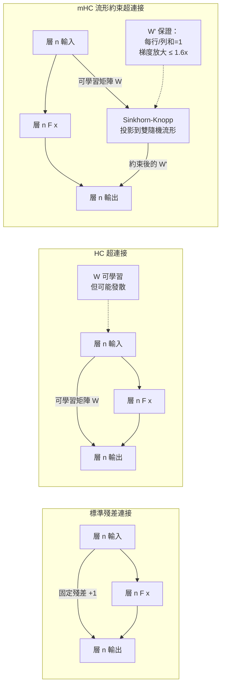

> [!abstract] 一句話理解
> 這是一個用來「穩定超大規模 Transformer 訓練中的梯度傳播」的殘差連接改良，特別之處在於它把可學習的連接矩陣強制約束在數學上合法的「雙隨機流形」上，讓梯度放大倍數從 3000x 降至 1.6x，只需 6.7% 的計算開銷。

## 🎯 為什麼重要

**它解決了什麼問題？**

訓練超大規模（百億至兆參數）的深度神經網路，有一個讓工程師頭疼的根本問題：**梯度不穩定**。

在深度 Transformer 中，梯度從輸出層反向傳播到輸入層時，會在每一層被放大或縮小。如果每一層的梯度都被放大一點點，那麼 100 層後梯度可能就被放大了億倍（梯度爆炸）；如果被縮小，就可能接近零（梯度消失）。這讓訓練要麼崩潰、要麼停滯。

**既有解法的不足**：

傳統 Transformer 用**殘差連接（Residual Connections / Skip Connections）**緩解這個問題——讓梯度可以「跳過」某些層直接傳播，繞開不穩定的路徑。但當模型達到 100B+ 參數時，標準殘差連接已不夠用。

ByteDance 2024 年提出 **Hyper-Connections（HC）**，用「可學習的多路徑殘差矩陣」替代固定的殘差連接——模型可以自己學習「哪些層之間需要更強的直連」。HC 在中小規模效果好，但放大到超大規模時，這個「可學習的矩陣」可能學到極端數值，反而導致梯度爆炸（最大梯度放大 3000x）。

**mHC 的改變**：

DeepSeek 的解法是：**不讓這個矩陣自由學習到任意數值**，而是把它「鎖定」在數學上保證穩定的區域——雙隨機矩陣流形（Birkhoff polytope）。就像給高速公路的每個路口裝上「流量控制閘門」，確保不管駕駛（梯度）多快，出口流量始終在可控範圍內。

## 🧠 入門解說（用類比理解）

**用「電路保險絲」理解 mHC**

想像一個超高樓建築（深度 Transformer 模型），裡面有 100 層，每層都有很多電線（梯度路徑）。

**舊方法（標準殘差連接）**：每隔幾層裝一條「直達電梯」，讓電流（梯度）可以繞過中間幾層直接到達頂樓。安全，但不靈活——電梯路徑是固定的。

**HC（Hyper-Connections）**：讓工程師（模型）自己決定哪裡接哪裡，哪條線用多粗。非常靈活，但有時工程師可能把某條線接得太粗，導致電流全部湧過去，其他線反而沒電，整個系統不穩定。

**mHC（Manifold-Constrained Hyper-Connections）**：保留 HC 的靈活性，但在每個電路板上強制安裝「智慧保險絲」（流形約束）。這個保險絲使用 **Sinkhorn-Knopp 算法**（一種讓矩陣每行每列都加總為 1 的數學操作）對連接矩陣進行正規化。效果：任何一條線都不能「過粗」，整體電流分佈始終在安全範圍內，梯度放大從 3000x 降到 1.6x。

**關鍵洞見**：雙隨機矩陣（doubly stochastic matrix）的數學性質保證了**特徵均值守恆（feature mean conservation）**和**有界信號傳播（bounded signal propagation）**——這兩個性質是梯度穩定的充分條件。DeepSeek 找到了一個數學上優雅、計算上高效的方法來強制保證它們。

## 🔑 重點原理

1. **Hyper-Connections（HC）的前提**：HC 把 Transformer 的殘差連接從固定的 `x + F(x)` 改為可學習的多路徑矩陣乘法，讓不同層之間的信息流動更靈活。問題是可學習矩陣在大規模訓練中可能發散，導致梯度爆炸。

2. **Birkhoff 多面體（Birkhoff Polytope）**：這是所有「雙隨機矩陣（doubly stochastic matrices）」的凸包（convex hull）。雙隨機矩陣的定義：非負矩陣，且每行和每列的元素之和都等於 1。這個集合在幾何上是一個「多面體」（有限頂點的凸集）——mHC 把 HC 矩陣強制投影到這個多面體上。

3. **Sinkhorn-Knopp 正規化**：把任意非負矩陣投影到最近的雙隨機矩陣的高效迭代算法——反覆交替對矩陣的行和列做歸一化，直到收斂。mHC 在每次訓練步驟中都執行 Sinkhorn-Knopp 投影，確保 HC 矩陣始終是雙隨機的。

4. **特徵均值守恆（Feature Mean Conservation）**：雙隨機矩陣的數學性質保證：信號通過連接矩陣後，其均值（mean）保持不變。這防止了「層數增加導致特徵分佈系統性漂移」的問題，是梯度穩定的關鍵。

5. **有界信號傳播（Bounded Signal Propagation）**：雙隨機矩陣的每個元素都在 [0,1] 範圍內，且行/列和為 1，這在理論上限制了信號在層間傳播時的最大放大倍數——從 3000x 降至 1.6x 的根本原因。

6. **Scaling Law 驗證**：mHC 在 27B 參數模型的多個評測上超越 HC（BBH：48.9 → 51.0），且額外計算開銷僅 6.7%。DeepSeek 將其用於 V4 兆參數模型，驗證其在前所未有的規模下的有效性。

## 📊 視覺化說明

### mHC 的工作原理

### mHC vs. 其他方法的梯度穩定性比較

| 方法 | 最大梯度放大倍數 | BBH（27B模型） | 額外訓練開銷 | 兆參數可用性 |
|------|----------------|--------------|------------|------------|
| 標準殘差連接 | 基準 | 43.8 | 0% | ✅ |
| HC（Hyper-Connections） | **3000x** | 48.9 | ~6% | ❌ 不穩定 |
| **mHC（本論文）** | **1.6x** | **51.0** | **6.7%** | **✅ 設計上支援** |
| Layer Norm + Careful LR | 中等 | 中等 | 高（需調參） | 部分 |

## 🔍 與既有技術的差異

**vs. 標準殘差連接（Skip Connections）**

標準殘差連接是固定的、預設的（每層加一條直達線），不可學習。mHC 的可學習矩陣讓模型能自適應地決定層間連接強度，但通過流形約束保證穩定性。核心差異：靈活性 + 穩定性的同時兼顧，而非二選一。

**vs. Gradient Clipping（梯度裁剪）**

Gradient Clipping 是一種訓練技巧——當梯度過大時，強制把它裁小。這是「症狀治療」，不是「病因治療」。mHC 是從架構設計層面從根本上預防梯度爆炸，不需要依賴訓練時的後處理。

**vs. 其他正規化技術（Layer Norm、RMS Norm）**

Layer Norm 在每一層的輸出上做正規化，防止特徵分佈偏移，但不直接處理殘差連接矩陣的梯度問題。mHC 直接約束「連接矩陣本身」的數學性質，作用在更根本的層次。

## 📚 關鍵詞對照表

| 中文 | 英文 | 簡短解釋 |
|------|------|---------|
| 殘差連接 | Residual Connection / Skip Connection | 神經網路層間的直接相加連接，幫助梯度傳播 |
| 超連接 | Hyper-Connections (HC) | 可學習的多路徑殘差矩陣，ByteDance 2024 年提出 |
| 流形約束 | Manifold-Constrained | 把矩陣限制在數學上定義的流形（有良好性質的子空間）內 |
| 雙隨機矩陣 | Doubly Stochastic Matrix | 非負矩陣且每行每列元素和等於 1，具有特徵均值守恆性 |
| Birkhoff 多面體 | Birkhoff Polytope | 所有雙隨機矩陣的凸包（最大有界集合） |
| Sinkhorn-Knopp 算法 | Sinkhorn-Knopp Algorithm | 把矩陣迭代投影到雙隨機矩陣的高效算法 |
| 梯度爆炸 | Gradient Explosion | 反向傳播中梯度呈指數增大，導致訓練崩潰 |
| 特徵均值守恆 | Feature Mean Conservation | 信號通過矩陣後其統計均值不變的性質 |
| 有界信號傳播 | Bounded Signal Propagation | 信號放大倍數有明確上界的傳播特性 |
| 計算浮點數 | EFLOPs | 訓練計算量的統一衡量單位，用於 scaling law 分析 |

## 🛠️ 可能的應用場景

1. **超大規模基礎模型訓練**：最直接的應用——讓訓練兆參數模型的工程師可以使用更深、更複雜的架構，而不需要花費大量精力調整梯度裁剪和學習率排程。

2. **多模態超大模型**：視覺-語言模型（VLM）通常需要比純語言模型更多的層間連接複雜性，mHC 的穩定性使這類架構更容易訓練到超大規模。

3. **持續學習（Continual Learning）**：mHC 的特徵均值守恆性質使模型在新數據上繼續訓練時，不容易「忘記」舊知識（catastrophic forgetting），是持續學習研究的有趣方向。

4. **架構搜索（Neural Architecture Search, NAS）**：mHC 的穩定性讓 NAS 算法可以更可靠地比較不同架構，而不需要擔心訓練不穩定性影響評估結果。

5. **研究加速**：在研究用途中，mHC 讓研究者可以用較小的計算量快速驗證大型架構的可行性，因為穩定的訓練意味著更少的超參數調整時間。

## 📖 學習路徑建議

1. **先讀**：Transformer 基礎架構（Attention Is All You Need，Vaswani et al. 2017）——理解 Transformer 的標準架構
2. **先讀**：殘差網路（ResNet，He et al. 2016）——理解殘差連接解決梯度問題的基本原理
3. **再讀**：Layer Normalization（Ba et al. 2016）——了解正規化在深度網路訓練中的作用
4. **再讀**：Hyper-Connections（HC，ByteDance 2024）——理解 mHC 的前置工作
5. **再讀**：mHC 本論文（arXiv 2512.24880）
6. **進階**：Birkhoff polytope 和雙隨機矩陣的數學性質（Linear Algebra 教材）
7. **進階**：Sinkhorn-Knopp 算法的收斂性分析

## 🔗 延伸閱讀
- 原文連結：[mHC arXiv 2512.24880](https://arxiv.org/abs/2512.24880)
- 對應新聞筆記：[[2026-05-21-DeepSeek mHC 流形約束超連接架構突破]]
- DeepSeek 官方部落格：[deepseek.ai/blog/deepseek-mhc](https://deepseek.ai/blog/deepseek-mhc-manifold-constrained-hyper-connections)
- Hugging Face Papers：[huggingface.co/papers/2512.24880](https://huggingface.co/papers/2512.24880)
- 前置閱讀：Hyper-Connections (HC) 論文 — ByteDance 2024

---
*由 Claude 自動整理於 2026-05-21*
