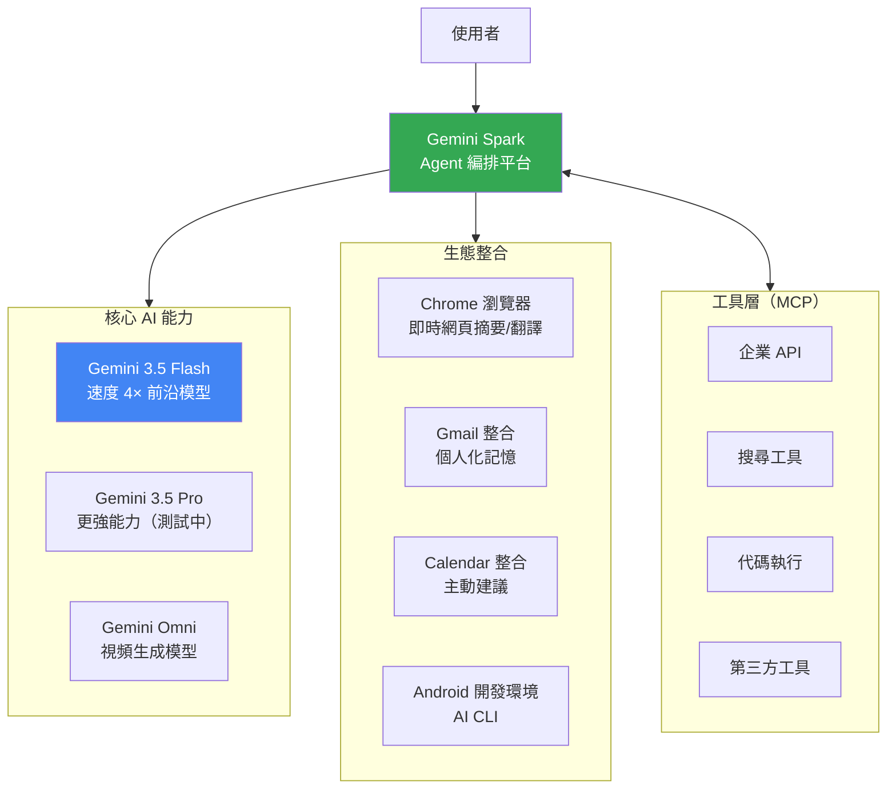

# Gemini 3.5 與 Agent 優先時代：為什麼「速度四倍」在 AI Agent 中意義遠超字面

> [!abstract] 一句話理解
> 這是一個為「AI Agent 任務優先設計」的多模態語言模型，特別之處在於它把生成速度提升到競爭對手四倍，同時在多項 Agent 基準上超越上一代 Pro 模型，搭配 Gemini Spark Agent 框架和 Chrome/Gmail 深度整合，讓 Google 建立起端到端的「Agent 優先」競爭架構。

## 🎯 為什麼重要

**它解決了什麼問題？**

2025-2026 年是「AI Agent 大規模落地年」——企業和消費者不再只是用 LLM 聊天，而是讓 AI Agent 自動執行多步驟任務（搜尋、分析、生成、操作系統、呼叫 API）。但 Agent 落地面臨一個被低估的瓶頸：**速度**。

一個複雜的 Agent 任務通常需要 LLM 被呼叫 5-20 次（每次思考、決策、生成需要一次 LLM 呼叫）。如果每次 LLM 呼叫需要 3 秒，一個 10 步的 Agent 任務需要 30 秒——使用者體驗糟糕。如果降到 0.75 秒，同樣 10 步只需 7.5 秒——體驗從「忍受」變成「流暢」。

Gemini 3.5 Flash 的速度四倍優勢，解決的正是這個 Agent 時代的核心瓶頸。

**既有解法的不足**：

GPT-4 和 Claude 3.5 在能力上很強，但速度不是它們的首要設計目標。在 Agent 任務中，速度和能力的平衡點很重要——Gemini 3.5 Flash 的定位是「足夠智慧 + 極快速度」，而不是「最智慧但較慢」。

**Gemini 3.5 的改變**：

在保持多個 Agent 任務基準超越 Gemini 3.1 Pro 的前提下，把輸出速度提升到四倍——這讓 Agent 系統的整體完成時間質的改善，帶來真正可用的 Agent 體驗。

## 🧠 入門解說（用類比理解）

**用「建築工地的分包架構」理解 Agent 優先設計**

想像 Google 是一家大型建設公司，而 AI Agent 就是在建築工地協調各工種的「工地主任」：

**舊的工地（沒有 Agent）**：業主直接呼叫每個工種（水電工、泥水工、木工），自己協調。業主需要知道每個工種的工作細節，非常累。

**Google 的 Agent 優先架構（Gemini 3.5 + Gemini Spark）**：

- **Gemini Spark**：「智慧工地主任」——接收業主的整體需求（「我想改廚房」），自動拆解成子任務，協調各工種。
- **Gemini 3.5 Flash**：「速度極快的現場溝通工具」——工地主任每次向工種下指令時（每次 LLM 呼叫），溝通速度快四倍，整體工程進度大幅縮短。
- **Gmail/Calendar 整合**：「業主的個人資料庫」——工地主任不只知道工程需求，還了解業主的預算、時間限制（Gmail/Calendar），給出更個人化的建議。
- **Chrome 整合**：「工地的眼睛」——主任可以即時查看任何網頁資訊（相當於搜尋），在施工過程中隨時獲取最新資料。

速度為什麼關鍵？
> 如果每個子任務的溝通（LLM 呼叫）從 3 秒降到 0.75 秒，一個 20 步的複雜改裝工程從需要 60 秒等待，縮短到 15 秒。用戶體驗從「等得不耐煩」變成「幾乎即時」。

## 🔑 重點原理

1. **Flash 模型的設計哲學**：Gemini 系列分為「Flash（快速、高效）」和「Pro/Ultra（高能力、較慢）」兩軌。Flash 版本透過蒸餾（Distillation）、更小的模型規模、推理計算優化等技術，在特定任務（特別是 Agent 工作流中的中間步驟）上犧牲少量能力，換取巨大的速度提升。

2. **Agent 任務基準（Terminal-Bench, GDPval-AA, MCP Atlas）**：這些是評估 LLM 在「自主執行任務」場景的基準，比一般 QA 基準更貼近 Agent 實用性：
   - Terminal-Bench 2.1：在命令列環境中自主完成軟體工程任務
   - GDPval-AA：Elo 評分系統，測試 Agent 的綜合任務完成能力
   - MCP Atlas：測試模型對 MCP（Model Context Protocol）工具生態的使用能力

3. **MCP（Model Context Protocol）原生支援**：MCP 是 Anthropic 在 2024 年提出、現已成為 AI 工具整合事實標準的協議，允許 LLM 標準化地訪問外部工具（資料庫、API、系統）。Gemini Spark 原生支援 MCP，意味著任何已有 MCP 伺服器的工具，都可以直接被 Gemini Agent 使用，無需額外整合。

4. **多模態理解（CharXiv 84.2%）**：CharXiv 是測試模型理解複雜圖表（學術論文中的圖表）的基準，84.2% 的得分反映 Gemini 3.5 Flash 在「看圖理解」上的強勁能力——這對需要分析商業報告、技術文件圖表的 Agent 任務至關重要。

5. **Proactive AI（主動 AI）設計**：Daily Brief 功能不是「你問我答」，而是 AI 主動根據你的日程和郵件提供情境適當的資訊。這是 Agent 設計從「反應式（Reactive）」到「主動式（Proactive）」的重要演進。

## 📊 視覺化說明

### Google 的 Agent 優先架構

### Gemini 3.5 Flash vs 競爭對手關鍵指標比較

| 指標 | Gemini 3.1 Pro（前代） | **Gemini 3.5 Flash** | 競爭前沿模型 |
|------|----------------------|---------------------|------------|
| Terminal-Bench 2.1 | 低於 Flash | **76.2%** | 未披露 |
| GDPval-AA（Elo） | 低於 Flash | **1656** | 未披露 |
| MCP Atlas | 低於 Flash | **83.6%** | 未披露 |
| CharXiv（多模態） | 未披露 | **84.2%** | 未披露 |
| 輸出 Token 速度 | 基準 | **4× 競爭前沿** | 1× |

## 🔍 與既有技術的差異

**vs. GPT-5.5 Instant（OpenAI）**

GPT-5.5 Instant 的強項是幻覺降低（-52.5%）和 Gmail 個人化整合。Gemini 3.5 Flash 的強項是 Agent 任務速度（4×）和 MCP 生態廣度。兩者的 Gmail 整合是直接競爭——OpenAI 搶先一步，Google 則把 Gmail 更深度嵌入 Gemini 的 Agent 框架。

**vs. Claude 3.7 系列（Anthropic）**

Claude 3.7 在複雜推理和代碼生成上有優勢，但 Gemini 3.5 Flash 的速度優勢在高頻 Agent 呼叫場景更重要。兩者都支援 MCP，但 Google 的生態整合（Chrome、Android、Workspace）是 Anthropic 無法直接複製的護城河。

**vs. 前代 Gemini 1.5 Flash / Gemini 3.1 Flash**

Gemini 3.5 Flash 是「能力升級版 Flash」——不只是比 3.1 Flash 快，更是在多個 Agent 基準上超越了 3.1 **Pro**（更大更慢的版本）。這是「小模型超越大模型」趨勢的又一例證。

## 📚 關鍵詞對照表

| 中文 | 英文 | 簡短解釋 |
|------|------|---------|
| 模型蒸餾 | Knowledge Distillation | 用大模型「教導」小模型，讓小模型達到接近大模型的性能 |
| 主動 AI | Proactive AI | 不等使用者詢問，主動提供情境適當資訊的 AI 設計 |
| 模型上下文協議 | MCP (Model Context Protocol) | Anthropic 提出的 AI 工具整合標準協議 |
| Agent 編排 | Agent Orchestration | 協調多個 AI Agent 協同完成複雜任務的能力 |
| 多模態理解 | Multimodal Understanding | 同時處理文字、圖像、視頻等多種輸入模態的能力 |
| 輸出 Token 速度 | Output Token Generation Speed | LLM 每秒輸出的 token 數量，決定生成速度 |
| Terminal-Bench | Terminal-Bench | 評估 LLM 在命令列環境完成軟體工程任務的基準 |
| CharXiv | CharXiv | 評估 LLM 理解複雜圖表（學術論文圖）的基準測試 |
| Flash 架構 | Flash Architecture | Google 優化速度的輕量化模型設計策略 |
| 深度生成 | Daily Brief | Gemini App 的主動式日常摘要功能 |

## 🛠️ 可能的應用場景

1. **企業 AI Copilot 實時輔助**：速度四倍讓 Agent 在銷售、客服等「即時人機協作」場景中真正可用——使用者不需等待，AI 可即時分析訂單、推薦回應、自動填寫表單。

2. **複雜多步驟 Agent 工作流**：軟體開發 Agent、數據分析 Agent 等需要數十次 LLM 呼叫的場景——速度優勢直接轉換為整體任務完成時間縮短。

3. **視頻內容創作 + Gemini Omni**：企業行銷、YouTube 創作者可以用文字描述生成電影級視頻片段，大幅降低視頻製作門檻。

4. **個人化 AI 助理（Daily Brief + Gmail）**：每日主動整理郵件重點、識別緊急事項、建議回應策略——特別適合高郵件量的管理職位。

5. **Android App 自動開發**：Android CLI + AI Studio Kotlin 支援，讓開發者用自然語言描述功能，AI 自動生成並測試 Android 代碼。

## 📖 學習路徑建議

1. **先讀**：LLM 基礎架構（Transformer、注意力機制）
2. **先讀**：AI Agent 架構入門（ReAct、Tool Calling 基礎）
3. **再讀**：知識蒸餾（Knowledge Distillation）基礎概念
4. **再讀**：MCP（Model Context Protocol）官方文件
5. **再讀**：Gemini 技術報告（Google DeepMind 官方發布）
6. **進階**：多模態模型架構（視覺語言模型、DiT 視頻生成）

## 🔗 延伸閱讀
- 原文連結：[Google I/O 2026 Developer Keynote](https://developers.googleblog.com/all-the-news-from-the-google-io-2026-developer-keynote/)
- 對應新聞筆記：[[2026-05-21-Google Gemini 3.5 Flash IO 2026]]
- Google Cloud I/O 2026 新功能：[cloud.google.com](https://cloud.google.com/blog/products/ai-machine-learning/innovations-from-google-io-26-on-google-cloud)
- MCP 協議文件：[modelcontextprotocol.io](https://modelcontextprotocol.io)
- Gemini API 文件：[ai.google.dev](https://ai.google.dev)
- 相關學習筆記：[[2026-05-21-學習-Tool-DC 分治工具呼叫框架]]（同為 AI Agent 工具鏈）

---
*由 Claude 自動整理於 2026-05-21*
