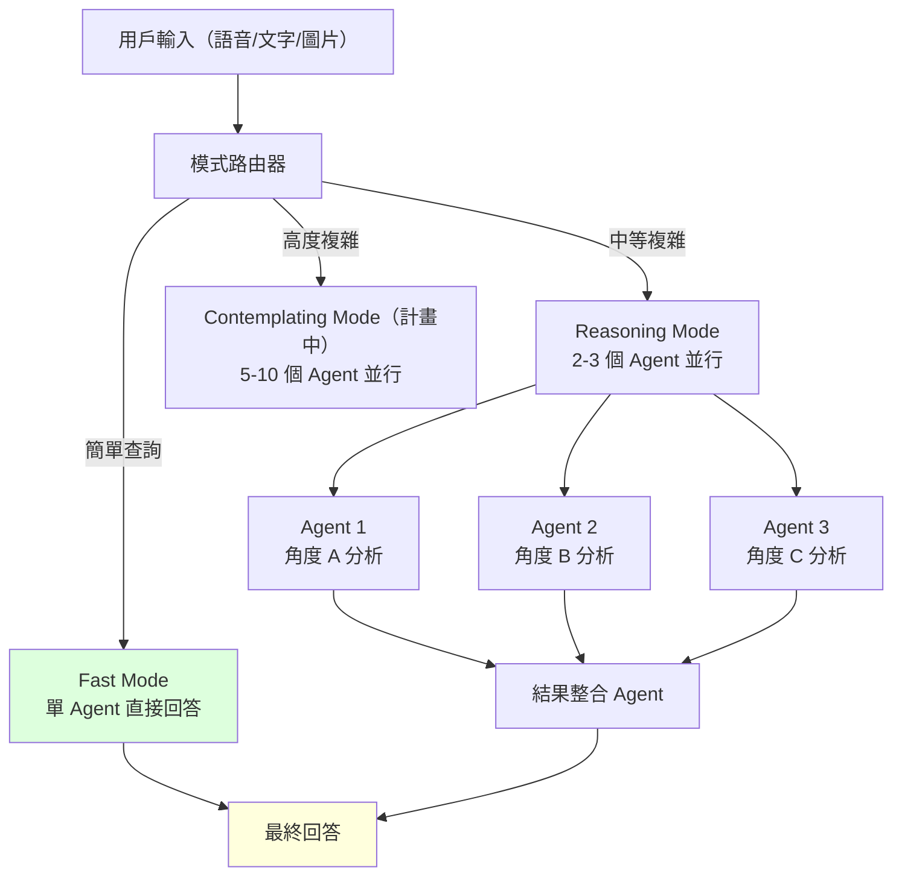

> [!abstract] 一句話理解
> 這是一個用來「讓多個 AI Agent 同時分析同一個複雜問題，再整合答案」的大型語言模型，特別之處在於它透過並行 Agent 協作而非單一超大模型，在速度和複雜度之間取得平衡，同時藉助 Scale AI 的高品質資料飛輪打造後訓練優勢。

## 🎯 為什麼重要

**它解決了什麼問題？**

現代大型語言模型面臨一個核心矛盾：**複雜問題需要深度推理（慢），但用戶希望快速得到答案**。

主流的解決方案是「推理模型（Reasoning Model）」——如 OpenAI o3、Anthropic Claude 3.7——讓模型在回答前先做「內部思考」（Chain-of-Thought）。但內部思考是串行的，想得越深，等待越久。

**既有解法的不足**：

- **提升單模型規模**：更大的模型不一定更快，反而更慢，成本指數增加
- **串行推理（Sequential CoT）**：思考鏈越長，用戶等待越久；且單一模型的「思考角度」可能存在系統性偏差
- **模型集成（Ensemble）**：傳統的集成學習用多個模型投票，但通常在推理後集成，而非在推理過程中並行

**Muse Spark 的改變**：

Muse Spark 採用「**多 Agent 同時思考**」的架構——系統同時啟動多個 Agent，讓它們從不同角度並行分析同一問題，再把結果整合。這就像一個問題不是交給一個人獨自思考，而是同時交給五個人分組討論，最後整合各組的發現。結果是：複雜問題可以更快獲得更全面的答案。

## 🧠 入門解說（用類比理解）

**用「麥肯錫顧問項目室」理解 Muse Spark 的架構**

想象你在一家頂級顧問公司的項目室：

**傳統 LLM（如 GPT-4）**：一個很聰明的顧問獨自研究你的問題。他思路縝密，但受限於一個人的視角，可能遺漏某些角度；而且他需要一步一步思考，你要等他把完整報告寫完才能看到結果。

**推理模型（如 o3）**：同一個顧問，但這次讓他有更多時間「在草稿紙上想清楚再回答」。答案更好，但等待更久。

**Muse Spark 的多 Agent 架構**：
- **Fast Mode（快速模式）**：就像顧問直接回答你的簡單問題，快速直接
- **Reasoning Mode（推理模式）**：問題分給 2-3 個顧問並行研究不同面向，互相對照後給你答案
- **Contemplating Mode（沉思模式，計畫中）**：啟動整個項目室——5-10 個顧問同時從財務、市場、競爭、風險等各個角度深入分析，再由主顧問整合一份完整報告

**關鍵洞見**：並行化讓「深度」和「速度」不再是零和遊戲。多個小型推理線程並行，總時間可以遠小於一個大型串行推理線程，但覆蓋的問題面向更廣。

同時，Muse Spark 背後有一個重要的資料優勢：Meta 收購 Scale AI 49% 股份，把全球最頂尖的人類回饋資料標注能力直接注入後訓練（post-training）流程——讓 Muse Spark 的「價值觀對齊」和「輸出品質」比依賴有限 RLHF 數據的競爭對手更可靠。

## 🔑 重點原理

1. **多模式設計（Multi-Mode Design）**：Muse Spark 設計了三個明確的模式，對應不同複雜度的任務。Fast Mode 追求低延遲，Reasoning Mode 追求準確度，計畫中的 Contemplating Mode 追求深度分析。這讓一個模型可以在不同場景下都有最優性能，而非一刀切。

2. **多 Agent 並行（Multi-Agent Parallelism）**：對於複雜問題，系統同時啟動多個 Agent（而非一個模型做多輪思考）。這些 Agent 可以分別從不同角度分析，或分別嘗試不同的解題路徑。並行化帶來速度提升，多角度帶來更全面的分析。

3. **結果整合（Result Synthesis）**：多個並行 Agent 的輸出需要被整合成一個連貫的回答。整合策略是 Muse Spark 架構中的關鍵但尚未公開的技術細節——可能包括投票機制、置信度加權，或一個專門的「整合 Agent」。

4. **Scale AI 資料飛輪（Data Flywheel）**：Muse Spark 的核心競爭優勢不只在架構，更在後訓練資料品質。Meta 通過 Scale AI 的資料標注能力，獲得了比競爭對手更高品質的 RLHF（Reinforcement Learning from Human Feedback）訓練數據，讓模型在遵循指令、避免有害輸出和生成高品質文本上表現更優異。

5. **多模態輸入（Multimodal Input）**：Muse Spark 接受語音、文字和圖片三種輸入，但目前只輸出文字。這是 2026 年頂尖模型的標準配置，但初版先確保文字輸出品質，避免過早擴展。

6. **從頭訓練策略（Ground-Up Training）**：Muse Spark 不是 Llama 4 的微調版，而是從頭訓練的新模型，意味著在架構和訓練數據選擇上有完整的自由度，不受舊架構技術債的限制。

## 📊 視覺化說明

### Muse Spark 多 Agent 並行推理架構

### Muse Spark vs. 競爭模型比較

| 維度 | GPT-4o（OpenAI） | Claude 3.7（Anthropic） | Llama 4（Meta 前代） | **Muse Spark** |
|------|----------------|----------------------|-------------------|--------------|
| **推理架構** | 單模型串行 CoT | 單模型串行 CoT | 單模型 | **多 Agent 並行** |
| **模式靈活性** | 快速/深度兩模式 | 標準/推理兩模式 | 單模式 | **三模式（Fast/推理/Contemplating）** |
| **輸入** | 文字/圖片/語音 | 文字/圖片 | 文字/圖片 | **文字/圖片/語音** |
| **輸出** | 文字/圖片/音頻 | 純文字 | 純文字 | **純文字（初版）** |
| **資料優勢** | OpenAI RLHF | Anthropic 憲法 AI | Meta 內部 | **Scale AI 49% 股份資料飛輪** |
| **平台觸達** | ChatGPT（5億月活） | Claude.ai | Meta AI（受限） | **FB/IG/WhatsApp（30億+潛在用戶）** |

## 🔍 與既有技術的差異

**vs. 推理模型（Reasoning Models，如 o3、Claude 3.7）**

推理模型的「深度思考」是一個模型在內部做多步驟推理（Chain-of-Thought），本質上是串行的。Muse Spark 的多 Agent 並行是在模型推理架構層面就實現並行，而非讓一個模型串行思考更久。理論上，並行化在相同時間內可以探索更多可能的解題路徑。

**vs. 多模型集成（Ensemble Methods）**

傳統集成通常是：讓 N 個模型各自回答，然後用投票或平均決定最終答案（在輸出層集成）。Muse Spark 的並行 Agent 更像是在推理過程中協作——Agent 之間可以共享中間結果、分工處理不同子問題，而非完全獨立然後投票。

**vs. Llama 4（Meta 前代開源模型）**

Llama 4 是開源的、面向研究社群的基礎模型。Muse Spark 是閉源的、面向終端用戶和 API 用戶的旗艦產品。兩者的訓練策略、後訓練數據和產品定位完全不同。Meta 同時保留兩條路線，形成「開源生態建設 + 閉源直接競爭」雙軌策略。

## 📚 關鍵詞對照表

| 中文 | 英文 | 簡短解釋 |
|------|------|---------|
| 多 Agent 並行 | Multi-Agent Parallelism | 多個 AI Agent 同時分析同一問題，再整合結果的架構 |
| 思考鏈 | Chain-of-Thought (CoT) | 讓模型在回答前一步步展示推理過程的技術 |
| 後訓練 | Post-Training | 基礎模型訓練完成後，通過 RLHF、SFT 等方式針對特定目標調整的過程 |
| 人類回饋強化學習 | RLHF | 通過人類對模型輸出打分，訓練模型生成更符合人類偏好的輸出 |
| 資料飛輪 | Data Flywheel | 更多用戶 → 更多數據 → 更好模型 → 更多用戶的正向循環 |
| 結果整合 | Result Synthesis | 把多個並行推理結果整合成一個連貫回答的過程 |
| Forward Deployed Engineer | Forward Deployed Engineer (FDE) | 常駐客戶現場的工程師，直接協助客戶實施技術解決方案（如 Palantir 模式） |
| 指令遵循 | Instruction Following | 模型按照用戶指令精確執行任務的能力 |
| 接地氣（沉思）模式 | Contemplating Mode | Muse Spark 計畫推出的深度推理模式，用多 Agent 處理最複雜問題 |
| 模型集成 | Model Ensemble | 組合多個模型輸出以提升整體性能的傳統機器學習技術 |

## 🛠️ 可能的應用場景

1. **複雜多步驟分析**：財務盡職調查、法律合約分析、技術架構評估——這些任務需要從多個角度深入分析，並行 Agent 可以分別處理不同面向後整合。

2. **即時消費者服務（Meta 平台 30 億用戶）**：Facebook、Instagram、WhatsApp 的日常對話場景需要快速回應（Fast Mode），複雜問題則啟用並行推理。Meta 的用戶規模是 Muse Spark 最大的商業護城河。

3. **創意內容協作**：多個 Agent 可以同時從不同風格、不同角度生成創意選項，用戶從多個選項中選擇或讓 Muse Spark 整合最佳元素。

4. **代碼生成與偵錯**：多個 Agent 同時嘗試不同的解題方案，再對比和整合最優解，特別適合複雜算法問題的並行探索。

5. **研究輔助**：針對一個研究問題，多個 Agent 同時搜索和分析不同面向的資訊，快速建立多角度的研究概覽——類似 Recursive Superintelligence 的科學研究自動化方向。

## 📖 學習路徑建議

1. **先讀**：Transformer 基礎（自注意力、多頭注意力）
2. **先讀**：RLHF 基礎（InstructGPT 論文）——理解後訓練的重要性
3. **再讀**：Chain-of-Thought Prompting 論文（Wei et al. 2022）——理解串行推理的現狀
4. **再讀**：Tree of Thoughts（Yao et al. 2023）——多路徑推理的早期探索
5. **再讀**：Muse Spark 相關報導（TechCrunch, Axios, Fortune 的深度報導）
6. **進階**：多 Agent 強化學習（MARL）理論——理解並行 Agent 協作的理論基礎
7. **進階**：Scale AI 的資料標注方法論和 RLHF 資料品質對模型性能的影響研究

## 🔗 延伸閱讀
- 原文連結：[TechCrunch: Meta Muse Spark](https://techcrunch.com/2026/04/08/meta-debuts-the-muse-spark-model-in-a-ground-up-overhaul-of-its-ai/)
- 對應新聞筆記：[[2026-05-21-Meta Muse Spark 超智能實驗室首款模型]]
- [Axios: Meta debuts Muse Spark](https://www.axios.com/2026/04/08/meta-muse-alexandr-wang)
- [CNBC: Meta debuts new AI model](https://www.cnbc.com/2026/04/08/meta-debuts-first-major-ai-model-since-14-billion-deal-to-bring-in-alexandr-wang.html)
- 相關學習：Scale AI 資料標注方法論、RLHF 訓練策略

---
*由 Claude 自動整理於 2026-05-21*
