# Tool-DC：用「翻書找答案的學生」理解分治式 LLM 工具呼叫

> [!abstract] 一句話理解
> 這是一個用來「在海量 API 工具清單中準確找到並呼叫正確工具」的框架，特別之處在於把工具清單切成小批次分別評估（分治），並讓模型自我檢查初步方案再修正（Try-Check-Retry），讓 7B 小模型達到 o3 等頂尖閉源模型的工具呼叫水準。

## 🎯 為什麼重要

**它解決了什麼問題？**

AI Agent 的核心能力之一是「工具呼叫（Tool Calling）」——讓 LLM 在執行任務時呼叫外部 API（搜尋引擎、資料庫、計算器、企業系統等）。學術研究通常用「從 10-20 個工具中選一個」來測試，但真實企業環境往往有數百個 API：

- 一家中型企業的 IT 系統可能有 200-500 個 API 端點
- 功能相似但參數不同的工具並存（舊版、新版、特殊版）
- 命名不一致（三個部門各自命名了類似功能的 API）

**長上下文工具呼叫（Long-context Tool Calling）的困難**：把 500 個工具的描述全部塞進 LLM 的 context，光描述文字就可能超過 10 萬 tokens。此時模型面臨「大海撈針」——在巨量雜訊中找到正確工具，錯誤率急劇上升。

**既有解法的不足**：RAG（向量相似度檢索）只能找「語義相似」的工具，不能推理「哪個工具組合能完成這個複雜任務」。ReAct / ReWoo 等 Agent 框架沒有針對「工具雜訊過多」的場景做優化，仍把所有工具塞進 context。

**Tool-DC 的改變**：用「分治（Divide-and-Conquer）+ 自我修正（Self-Reflection）」的組合，系統性地降低工具雜訊、提高決策精度。

## 🧠 入門解說（用類比理解）

**用「閉卷 vs 開卷考試」理解工具呼叫困難**

想像你要回答一道需要查手冊才能完成的技術題：

**舊方法（把所有工具一次塞入）**：考試時把 20 本技術手冊全部打開攤在桌上，試圖在所有書中同時找答案——頁面太多，你很容易看漏關鍵內容，或看到相似但錯誤的條目。

**Tool-DC 的做法**（用「Try-Check-Retry + 分治」）：

1. **Divide（分冊）**：把 20 本手冊分成 5 組，一次只看 4 本。
2. **Try（嘗試）**：看第一組 4 本，試著找可能相關的工具，寫下初步的解法。
3. **Check（自我檢查）**：翻回去看自己寫的解法，問自己：「這個解法有沒有漏洞？工具的參數填對了嗎？邏輯有沒有矛盾？」
4. **Retry（修正）**：如果找到問題，修正後再看下一組手冊。
5. **Conquer（整合）**：把各組找到的候選工具整合，選出全局最優的組合。

**為什麼這樣有效**？

- 每次只看少量工具，決策雜訊大幅降低
- 自我檢查能在最後輸出前「攔截」大部分低階錯誤（參數錯、邏輯矛盾）
- 整合階段能做跨批次的全局優化

類比升級版：把 LLM 想像成「可以自己閱讀指令並找出錯誤的學生」——Tool-DC 就是給這個學生一套「高效做題流程」，而不是讓他在一片混亂中瞎找。

## 🔑 重點原理

1. **分治（Divide-and-Conquer）工具處理**：把工具目錄切分為多個小批次（batch），每批只包含少量候選工具。每次呼叫 LLM 時，context 中只有當前批次的工具，而非全部工具。這將「大海撈針」問題轉化為多個「小池塘撈針」問題。

2. **Try（嘗試）階段**：對每批工具，讓 LLM 嘗試：識別哪些工具與當前任務相關、初步生成工具呼叫方案（工具名稱 + 參數）。

3. **Check（自我反思檢查）階段**：這是 Tool-DC 最關鍵的創新。利用 LLM 自身的 **Self-Reflection（自我反思）** 能力，要求模型扮演「檢查員」角色，審查自己剛才的工具呼叫方案：參數是否正確填寫？工具功能是否真的匹配任務需求？是否存在邏輯矛盾？

4. **Retry（反饋修正）階段**：若 Checker 發現問題，將診斷反饋注入下一次 Try，讓模型基於具體錯誤說明進行修正，而非盲目重試。

5. **Tool-DC TF（免訓練版）vs TB（訓練增強版）**：TF 版本完全基於 Prompting，即插即用；TB 版本對基礎模型（Qwen2.5-7B）針對 Try-Check-Retry 模式做 SFT 訓練，性能更強、推理更高效，讓小模型達到大模型水準。

## 📊 視覺化說明

### Tool-DC 的 Try-Check-Retry 執行流程

```mermaid
graph TD
    A[收到任務 + 工具目錄] --> B[Divide：工具分批]
    B --> C[Batch 1: 工具 1-50]
    B --> D[Batch 2: 工具 51-100]
    B --> E[Batch N: ...]

    C --> F[Try：初步工具選擇方案]
    F --> G{Check：自我反思}
    G -->|發現問題| H[Retry：基於反饋修正]
    H --> G
    G -->|通過| I[批次結果：候選工具集合]

    D --> J[Try → Check → Retry]
    J --> K[批次結果]

    I --> L[Conquer：整合所有批次結果]
    K --> L
    L --> M[最終工具呼叫決策]

    style G fill:#ffd
    style M fill:#dfd
```

### Tool-DC vs 其他工具呼叫方法比較

| 方法 | 需要訓練 | 工具雜訊處理 | 自我修正 | 7B 模型性能 |
|------|---------|------------|---------|------------|
| 直接 Prompting | 否 | 差（全部塞入） | 無 | 低 |
| RAG 工具檢索 | 部分 | 中（向量相似） | 無 | 中 |
| ReAct Agent | 否 | 差 | 有限 | 中 |
| **Tool-DC (TF)** | **否** | **強（批次分治）** | **有（Try-Check-Retry）** | **高** |
| **Tool-DC (TB)** | **是** | **最強** | **最強** | **達 o3 水準** |

## 🔍 與既有技術的差異

**vs. RAG（Retrieval-Augmented Generation）工具檢索**

RAG 用向量相似度預先過濾工具，只把「最相似的 K 個工具」放入 context。問題在於向量相似度是語義相似，不是「功能相關性」——任務描述和工具描述的語義相似，不代表這個工具真的能完成任務。Tool-DC 用 LLM 推理而非向量距離判斷工具相關性，能處理更複雜的語義理解。

**vs. ReAct（Reasoning + Acting）Agent**

ReAct 讓 LLM 交替思考（Reasoning）和行動（Acting），可以多步驟工具呼叫。但 ReAct 沒有針對「海量候選工具」的分治設計，當工具數量多時，同樣面臨長上下文雜訊問題。Tool-DC 的分治架構可以和 ReAct 結合——在每個 ReAct 步驟中，用 Tool-DC 處理工具選擇。

**vs. Tree-of-Thought / 其他推理增強方法**

這些方法提升 LLM 的通用推理能力，而 Tool-DC 是專門針對「工具呼叫」場景設計的工程框架。兩者互補，不互斥。

## 📚 關鍵詞對照表

| 中文 | 英文 | 簡短解釋 |
|------|------|---------|
| 工具呼叫 | Tool Calling / Function Calling | LLM 呼叫外部 API 或函數的能力 |
| 分治演算法 | Divide-and-Conquer | 把大問題切成小問題分別解決再整合 |
| 自我反思 | Self-Reflection | LLM 評估和批評自己輸出的能力 |
| 長上下文 | Long Context | 超過標準訓練長度的 context window 使用場景 |
| 免訓練 | Training-Free | 不需要微調模型，只在推理時應用的方法 |
| BFCL | Berkeley Function Calling Leaderboard | 工具呼叫能力的主流學術評估基準 |
| ACEBench | ACEBench | 另一個工具呼叫評估基準，更強調現實複雜度 |
| SFT | Supervised Fine-Tuning | 監督式微調，用帶標籤數據訓練模型 |
| 提示工程 | Prompt Engineering | 通過設計輸入提示改善模型輸出的技術 |
| 批次處理 | Batch Processing | 把大量輸入分批次分別處理的策略 |

## 🛠️ 可能的應用場景

1. **企業 AI Agent 系統**：大型企業的 AI Copilot 需要訪問數百個內部 API（ERP、CRM、HR、財務）——Tool-DC TF 可直接套用，無需重新訓練，提升 Agent 在複雜 API 環境中的準確率。

2. **API 整合平台**：Zapier、Make（原 Integromat）等自動化平台有數千個第三方 API 連接器——Tool-DC 可幫助 AI 在這個生態中更精準地選擇正確連接器和參數。

3. **DevOps AI Agent**：軟體開發環境有大量工具（Git、Docker、Kubernetes、CI/CD 工具、各種 CLI）——Tool-DC TB 訓練一個專門的 DevOps Agent，可在複雜工具環境中可靠地執行自動化任務。

4. **法律與財務合規 Agent**：法規資料庫有數千條規定，Tool-DC 可幫助合規 Agent 準確找到適用的規定（而非所有相似的規定）。

5. **醫療 EMR 整合**：電子病歷系統的 API 複雜（HL7 FHIR 有數百個 Resource 類型），Tool-DC 可提升醫療 AI Agent 在 EMR 操作中的準確率。

## 📖 學習路徑建議

1. **先讀**：Function Calling / Tool Use 基礎（OpenAI Function Calling 文件是很好的入門）
2. **先讀**：ReAct 框架（Yao et al. 2022，理解「推理 + 行動」範式）
3. **再讀**：分治演算法基礎概念（若不熟悉演算法設計）
4. **再讀**：Self-Reflection in LLMs（Reflexion 論文，Shinn et al. 2023）
5. **再讀**：Tool-DC 本論文（arXiv 2603.11495）
6. **進階**：Tool-Augmented LLM 的完整演化史（Tool Former → ToolLLM → Tool-DC）

## 🔗 延伸閱讀
- 原文連結：[Tool-DC arXiv 2603.11495](https://arxiv.org/abs/2603.11495)
- 對應新聞筆記：[[2026-05-21-Tool-DC 分治框架提升 LLM 工具呼叫]]
- Reflexion 自我反思論文（Shinn et al. 2023）：arXiv 2303.11366
- BFCL 基準測試排行榜：[gorilla.cs.berkeley.edu](https://gorilla.cs.berkeley.edu)
- ReAct 論文（Yao et al. 2022）：arXiv 2210.03629

---
*由 Claude 自動整理於 2026-05-21*
