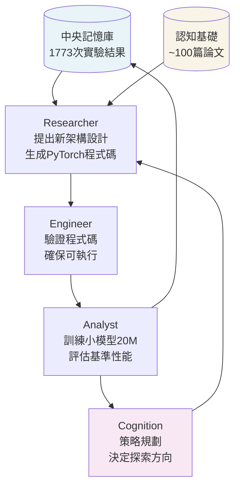

# ASI-ARCH：用「讓機器人自己設計更好機器人的工廠」理解 AI 自主架構發現

> [!abstract] 一句話理解
> 這是一個用來「讓 AI 系統自主探索並發現比人類設計更好的神經網路架構」的多 Agent 閉環系統，特別之處在於 AI 在完全無人介入的情況下完成了 1,773 次實驗、發現 106 個新架構，並揭示了「算力投入越多、架構突破越多」的科學發現擴展定律。

## 🎯 為什麼重要

**它解決了什麼問題？**

設計神經網路架構（Neural Architecture Design）一直是 AI 研究中最依賴「人類直覺和創意」的領域之一。一個好的架構（如 Transformer、Mamba）可能讓整個 AI 領域的效能提升一個量級。

**傳統架構設計的瓶頸**：

研究人員的工作流程是：閱讀 200 篇論文（數月）→ 提出新架構假設 → 實作 PyTorch 程式碼（數週）→ 訓練（數天）→ 評估性能 → 修改再試 → 最終可能只產生 1-2 個有效改進。整個過程耗時且依賴個人直覺，無法大規模並行。

**線性注意力的特殊挑戰**：

標準 Transformer 的注意力機制計算複雜度是 O(n²)——文本越長，算力消耗呈平方成長。線性注意力（Linear Attention）把複雜度降到 O(n)，但通常以犧牲性能為代價。如何在效率和性能之間找到最佳平衡，是數百個小架構決策的組合優化問題——人類窮舉不完。

**ASI-ARCH 的突破**：用機器的速度和規模做人類做不到的架構探索。

## 🧠 入門解說（用類比理解）

**用「讓機器人設計更好機器人的工廠」來理解**

想像一間完全自動化的機器人設計工廠：

**傳統方式**：人類工程師每天設計 1 個機器人方案 → 測試 → 得到反饋 → 修改。一年設計 200-300 個方案，選出 5 個最好的。

**ASI-ARCH 的方式**：

1. **研究員 Agent（Research Worker）**：閱讀所有過往實驗數據和 100 篇論文，提出新的「機器人設計藍圖」，生成可執行的程式碼。

2. **工程師 Agent（Engineer）**：把藍圖轉換成真實可測試的機器人，確認程式碼能跑起來。

3. **分析師 Agent（Analyst）**：讓機器人參加性能測試，記錄詳細的評估數據。

4. **認知 Agent（Cognition）**：分析所有測試結果，決定下一步要往哪個方向探索。

這四個 Agent 形成一個**閉環（Closed Loop）**，自動不停地循環，一天可以完成數十個設計→測試→分析週期。在 20,000 GPU 小時內，跑完 1,773 輪這樣的循環，發現了 106 個全新且有效的架構。

**為什麼叫「AlphaGo 時刻」？**

AlphaGo 是 AI 在圍棋上超越人類的里程碑。ASI-ARCH 的「AlphaGo 時刻」意指：**AI 在「設計 AI 架構」這件事上，已能超越人類研究者的探索能力**。這是 AI 自我改進的一個關鍵起點。

## 🔑 重點原理

1. **四模組多 Agent 閉環**：Researcher（提出設計）→ Engineer（實作測試）→ Analyst（評估性能）→ Cognition（策略規劃）→ 回到 Researcher。每個模組各司其職，形成一個不需要人類介入的完整研究週期。

2. **中央記憶庫（Central Memory）**：所有 1,773 次實驗的結果都儲存在共享記憶庫中。Researcher 在提出新設計時，會查詢所有過去的實驗，確保新設計不重複舊路徑，並能借鑑已知的成功模式——這是「知識積累」的關鍵機制。

3. **兩階段探索策略**：
   - **第一階段（廣度探索）**：用 20M 參數的小模型快速測試大量設計候選，以低成本篩選有潛力的方向
   - **第二階段（深度驗證）**：用 340M 參數的大模型精確驗證最佳候選，確認泛化能力
   這個「粗篩→精選」策略大幅提升了算力效率。

4. **科學發現計算擴展定律（Scaling Law for Discovery）**：ASI-ARCH 揭示：投入計算量（GPU 小時）越多，每單位時間發現的有效新架構數量越多，且關係接近線性。這意味著「花更多算力 = 發現更多突破」，科學研究本身可以用算力換速度。

5. **線性注意力架構空間**：ASI-ARCH 發現的架構都在「線性注意力」這個技術家族內——包含門控機制（Gating）、路徑分治（Path Decoupling）、溫度控制（Temperature Scaling）等設計元素的不同組合。106 個架構代表了這個空間中人類未曾探索過的 106 個有效角落。

## 📊 視覺化說明

### ASI-ARCH 閉環流程圖

### 兩階段探索策略

| 階段 | 模型規模 | 目標 | 效果 |
|------|---------|------|------|
| 第一階段（廣度） | 20M 參數 | 快速篩選候選架構 | 低成本淘汰差的設計 |
| 第二階段（深度） | 340M 參數 | 精確驗證最佳架構 | 確認泛化能力 |

### 性能比較

| 架構 | 設計者 | 在常識推理基準的表現 |
|------|--------|-------------------|
| Mamba2 | 人類研究者 | 基準線 |
| Gated DeltaNet | 人類研究者 | 基準線 |
| DeltaNet | 人類研究者 | 基準線 |
| **ASI-ARCH 前 5 名** | **AI 自主發現** | **全面勝出（系統性超越上述三個）** |

## 🔍 與既有技術的差異

**vs. 傳統 NAS（Neural Architecture Search）**

傳統 NAS（如 DARTS、EfficientNet 的搜尋方法）通常是在一個預定義的「架構搜尋空間」中做梯度優化或進化演算法，搜尋空間由人類預先設定好。ASI-ARCH 沒有固定搜尋空間——Researcher Agent 可以提出人類未曾想到的全新設計概念。

**vs. 現有 AutoML 工具（H2O.ai、Auto-sklearn 等）**

AutoML 工具自動化的是「模型超參數調整和算法選擇」，但基礎架構仍是人類設計的現有算法。ASI-ARCH 是在更底層的「架構本身」進行創新，而非只調整現有架構的參數。

**vs. 其他 AI Scientist 系統**

2025-2026 年已有多個「AI 科學家」系統（如 AI2 的 AI Scientist），但大多聚焦在「自動寫論文」或「自動做實驗」的特定環節。ASI-ARCH 的完整閉環（從假設到驗證到策略調整）在架構發現領域是更全面的實現。

## 📚 關鍵詞對照表

| 中文 | 英文 | 簡短解釋 |
|------|------|---------|
| 線性注意力 | Linear Attention | 計算複雜度 O(n) 的注意力機制，比標準 Transformer O(n²) 更高效 |
| 神經架構搜尋 | Neural Architecture Search（NAS） | 自動化搜尋最優神經網路架構的技術 |
| 擴展定律 | Scaling Law | 模型或系統的某個能力隨資源投入（算力、數據）的變化規律 |
| 閉環系統 | Closed-loop System | 輸出反饋回輸入的自我調節循環系統 |
| 多 Agent 系統 | Multi-Agent System（MAS） | 多個 AI 代理協同完成任務的系統架構 |
| 門控機制 | Gating Mechanism | 動態控制資訊流量的神經網路組件，如 LSTM 的遺忘門 |
| 路徑解耦 | Path Decoupling | 在神經網路中分離不同資訊流路徑的設計方式 |
| 認知基礎 | Cognition Base | ASI-ARCH 中由論文知識構成的結構化知識庫 |
| 基準測試 | Benchmark | 評估 AI 系統性能的標準化測試集合 |
| 參數量 | Parameter Count | 神經網路的可學習參數總數，衡量模型規模 |

## 🛠️ 可能的應用場景

1. **AI 晶片架構優化**：晶片設計也是一個巨大的組合搜尋問題（電路拓撲、記憶體層次、計算單元配置）。ASI-ARCH 的框架可以遷移到硬體架構自動設計。

2. **特定任務的客製化架構**：金融時序預測、醫療影像分析等垂直應用，可能需要針對其數據特性設計的專屬架構。ASI-ARCH 類型的系統可以為每個垂直應用自動搜尋最優架構。

3. **加速 AI 研究實驗室的探索效率**：學術實驗室可用類似 ASI-ARCH 的系統快速探索研究方向，讓研究人員聚焦在「決定探索哪個方向」（策略），而非「執行每個實驗」（戰術）。

4. **藥物分子架構探索**：藥物分子設計同樣是一個巨大的組合搜尋問題（原子連接方式）。「自主實驗→分析→迭代」的框架可以遷移到生物化學領域。

5. **軟體工程：自動代碼架構設計**：未來可能出現「給定需求，AI 自主設計最優軟體架構」的系統，ASI-ARCH 的多 Agent 閉環方法提供了一個可參考的框架。

## 📖 學習路徑建議

1. **先讀**：Transformer 架構基礎（Attention is All You Need，Vaswani et al. 2017）
2. **先讀**：線性 Attention 的基礎概念（Linearized Attention, Katharopoulos et al. 2020）
3. **再讀**：Mamba 架構（State Space Models，理解 ASI-ARCH 的評比基準）
4. **再讀**：ASI-ARCH 論文（arXiv 2507.18074）
5. **進階**：Scaling Laws（Kaplan et al. 2020，理解擴展定律的基礎概念）
6. **進階**：AI Scientist 相關研究（Wang et al.，AI 自主研究的前沿）

## 🔗 延伸閱讀
- 原文連結：[ASI-ARCH 論文（arXiv 2507.18074）](https://arxiv.org/abs/2507.18074)
- 對應新聞筆記：[[2026-05-22-ASI-ARCH AI自主神經架構發現AlphaGo時刻]]
- [GitHub：GAIR-NLP/ASI-Arch](https://github.com/GAIR-NLP/ASI-Arch)
- [EmergentMind 詳細分析](https://www.emergentmind.com/papers/2507.18074)
- 相關論文：ASI-Evolve（arXiv 2603.29640）

---
*由 Claude 自動整理於 2026-05-22*
