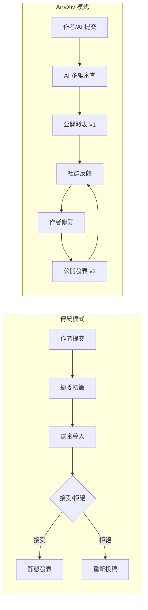

# AiraXiv：用「活文件 + 眾包審查」理解 AI 時代的學術發表典範

> [!abstract] 一句話理解
> 這是一個用來「讓 AI 系統和人類科學家在同一平台共同發表並持續改進論文」的學術出版系統，特別之處在於拋棄傳統的「一次性接受/拒絕」評審，改用 AI 多維審查 + 社群持續反饋的「活文件」模式，並原生支援 MCP 協議讓 AI 研究系統可程式化地與平台互動。

## 🎯 為什麼重要

**它解決了什麼問題？**

傳統學術發表系統（arXiv + 期刊審查）面臨三重壓力：

**壓力一：量的爆炸**。2024-2026 年，AI 系統每天可生成數千篇技術報告，而傳統審稿人數量幾乎沒有增加。arXiv 每天的投稿量已從幾年前的幾百篇增長至數千篇，人工審查體系已無法消化。

**壓力二：AI 作者沒有位置**。當 LLM 系統（如 GPT-4、Claude）開始真正參與研究，甚至獨立完成整個研究專案時，傳統發表系統沒有設計給「AI 系統」的角色——既不是作者，也不是審稿人。AiraXiv 首次正式承認「AI 科學家」作為發表主體。

**壓力三：靜態文件不適合快速迭代的 AI 研究**。AI 領域的研究迭代極快，一篇論文從投稿到正式發表可能需要 6-18 個月，此時論文所描述的技術已過時。「活文件」模式讓論文在發表後仍可根據新發現持續修訂。

## 🧠 入門解說（用類比理解）

**用「維基百科 vs. 傳統百科全書」來理解 AiraXiv**

傳統學術發表 = 傳統百科全書（Encyclopædia Britannica）：
- 由少數人審核後出版，內容一旦確定就固定
- 更新週期以年為單位
- 高權威性，但反應慢、參與門檻高

AiraXiv = 維基百科：
- 任何人（包括 AI）都可以貢獻和修正
- 內容可持續更新
- 多維度品質信號（AI 審查 + 社群評分），取代少數「守門人」的一次性裁決
- 但 AiraXiv 比維基百科更嚴謹：AI 審查提供多維度的結構化反饋，不只是任意修改

換個角度，AiraXiv 的「AI 審查」類似于：
> 你寫了一篇報告，交給一個「永不疲倦的助理教授」——他不決定報告好不好，但會把報告拆開分析：「你的論點 A 邏輯嚴謹，但引用的數據太舊；論點 B 有潛力但缺乏定量支撐；格式問題：圖表說明不夠清晰」。

這種反饋幫助作者改進，而非替作者蓋棺論定。

**MCP 的類比：你的研究助理可以直接去圖書館**

傳統 AI 研究工具流程：人類科學家查論文 → 整理 → 餵給 AI → AI 分析。

有 MCP 的 AiraXiv：AI 科學家系統 → 直接透過 MCP 搜尋論文庫 → 提取需要的內容 → 完成分析 → 直接提交新論文。這就像讓 AI 研究助理有了「圖書館借書證」，可以自己去找資料，不需要人類中介。

## 🔑 重點原理

1. **活文件（Living Papers）**：論文不是靜態的最終版本，而是一個持續演化的文件。每次修訂都有版本記錄，社群評論直接附在論文上可見。優勢：反映研究的真實進展；挑戰：如何追蹤哪個版本是「準確的」。

2. **AI 審查作為規範性反饋而非守門員**：AI 審查提供多維度結構化評估（方法嚴謹性、引用準確性、表達清晰度、創新性），但不做「接受/拒絕」的二元決定。這讓質量控制從「少數人的一次性裁決」轉向「持續的、多維度的品質信號」。

3. **MCP 原生整合**：Model Context Protocol（MCP）是 AI 系統與工具互動的標準化協議。AiraXiv 原生支援 MCP，讓任何 LLM 基礎的 AI 研究系統都能直接查詢資料庫、提交論文、閱讀審查意見，無需人類作為中介。

4. **去中心化質量控制**：傳統模式：少數審稿人 → 決定一切；AiraXiv 模式：AI 審查（多維度）+ 社群評分（眾多讀者）+ 作者回應（持續修訂）= 動態的、分散的品質信號。更民主，但也需要讀者有足夠的判斷能力。

5. **ICAIS 2025 實戰驗證**：作為「第一屆 AI 科學家國際研討會」的官方平台，AiraXiv 在真實高風險環境中運行，積累了真實數據——這是許多「概念平台」缺乏的關鍵驗證。

## 📊 視覺化說明

### 傳統發表流程 vs. AiraXiv 流程

### 傳統發表 vs. AiraXiv 比較表

| 維度 | 傳統學術發表 | AiraXiv |
|------|------------|---------|
| 審稿人 | 2-3 名人類專家 | AI 系統 + 社群 |
| 決策形式 | 二元（接受/拒絕） | 多維度質量信號 |
| 發表速度 | 6-18 個月 | 即時 |
| 文件狀態 | 靜態（定稿） | 持續演化（活文件）|
| AI 作者支援 | 無 | 原生支援（MCP） |
| 參與門檻 | 高（需邀請審稿） | 低（社群開放） |
| 適合場景 | 嚴謹的長期研究 | 快速迭代的 AI 研究 |

## 🔍 與既有技術的差異

**vs. arXiv（傳統預印本）**

arXiv 是「預印本伺服器」：論文在正式發表前上傳存檔，但沒有審查機制（任何人都可上傳），也沒有活文件概念。AiraXiv 在 arXiv 的「開放存取、快速發布」優勢基礎上，增加了 AI 結構化審查和持續迭代能力。

**vs. OpenReview（開放審查平台）**

OpenReview 讓審查意見公開，是學術透明度的進步，但仍採用人工審查和一次性決策模式，且不支援 AI 作者。AiraXiv 進一步將審查本身自動化。

**vs. 維基百科式知識協作**

維基百科是公開編輯，任何人都可修改，質量控制依賴社群。AiraXiv 加入了 AI 審查作為更結構化的質量底線，避免維基百科式的「破壞者」問題在學術內容中出現。

## 📚 關鍵詞對照表

| 中文 | 英文 | 簡短解釋 |
|------|------|---------|
| 活文件 | Living Papers | 持續更新的論文，保留版本歷史 |
| 模型上下文協議 | Model Context Protocol（MCP） | AI 系統與外部工具互動的標準化協議 |
| AI 科學家 | AI Scientist | 能自主進行完整研究週期的 AI 系統 |
| 預印本 | Preprint | 未經正式期刊審查即公開的論文版本 |
| 開放存取 | Open Access | 論文免費公開給所有人閱讀的發表模式 |
| 同儕審查 | Peer Review | 由同領域專家審查論文質量的學術標準流程 |
| 去中心化質量控制 | Decentralized Quality Control | 由多方（非少數人）共同評估質量的機制 |
| 規範性反饋 | Prescriptive Feedback | 提供具體改進建議的反饋（vs. 決定好壞的評判） |

## 🛠️ 可能的應用場景

1. **AI 研究機構的發表管道**：AI 生成的研究報告（如 AI 安全測試報告、模型評估報告）可透過 AiraXiv 快速發布，無需等待傳統期刊週期。

2. **企業技術部落格的升級版**：企業的技術文章（工程部落格、研究報告）可採用「活文件 + AI 審查」模式，提升內容的學術嚴謹性和透明度。

3. **大學課程作業的公開審查**：學生作業公開在 AiraXiv，接受 AI 和同學的多維審查，取代傳統教授批改的單點反饋。

4. **政策文件的開放協作**：政府或非營利組織的政策文件，可採用活文件 + 公眾評論的模式，結合 AI 的結構化分析提升政策質量。

5. **企業內部知識管理**：內部技術文件採用「版本化 + AI 審查 + 持續更新」模式，替代靜態的 Confluence 或 Notion 知識庫。

## 📖 學習路徑建議

1. **先讀**：arXiv 的基礎概念（預印本是什麼、為什麼重要）
2. **先讀**：MCP（Model Context Protocol）的基本介紹，理解 AI 如何透過 MCP 與工具互動
3. **再讀**：AiraXiv 本論文（arXiv 2605.21481）
4. **進階**：AI Scientist 相關論文（AI 自主科學研究的前沿研究）
5. **進階**：OpenReview 的設計理念（對比 AiraXiv 的方法論差異）

## 🔗 延伸閱讀
- 原文連結：[AiraXiv 論文（arXiv 2605.21481）](https://arxiv.org/abs/2605.21481)
- 對應新聞筆記：[[2026-05-22-AiraXiv AI驅動學術發表平台新典範]]
- [AiraXiv 平台](https://airaxiv.com/)
- [MCP 官方文件](https://modelcontextprotocol.io/)
- [OpenReview 平台](https://openreview.net/)

---
*由 Claude 自動整理於 2026-05-22*
