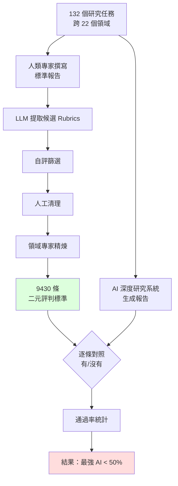

# DeepResearch Bench II：用「讓學生寫報告，再用教授的評分標準打分」理解 AI 深度研究評測

> [!abstract] 一句話理解
> 這是一個用來「客觀評估 AI 深度研究代理生成報告品質」的評測基準，特別之處在於從人類專家撰寫的真實研究報告中提取了 9,430 條細粒度評判標準（rubrics），讓 AI 報告可以被像「人類教授評分一樣」系統性地評估，而發現即使最強的 AI 系統也只能達到專家水準的不到 50%。

## 🎯 為什麼重要

**它解決了什麼問題？**

**深度研究代理（Deep Research Agents）是什麼？**

2025 年底開始，OpenAI、Google、Perplexity 等公司推出了「深度研究」功能：讓 AI 自主規劃搜尋策略、執行多輪網路搜尋、整合跨來源資訊，最終生成一份有引用的長篇研究報告，整個過程可以完全自動化。這類系統被稱為「Deep Research Agents（DRS）」或「Deep Research Systems（DRS）」。

**評測它們的根本困難**：

傳統 AI 評測很簡單，因為有明確答案（對/錯，通過/失敗）。但如何評估一篇「研究報告」的品質？

- 這篇報告是否涵蓋了所有重要事實？（答案因人而異）
- 分析深度是否足夠？（主觀判斷）
- 引用是否準確？（需要領域知識驗證）

這三個問題在 22 個不同的學術領域（從物理到法律到藝術史）都需要不同的專業知識判斷。沒有標準化評測，就無法知道哪個 AI 深度研究系統真的更好，也無法知道它們距離「人類專家水準」有多遠。

DeepResearch Bench II 的核心貢獻：建立了一套**以人類專家標準為黃金基準**的自動化評測體系。

## 🧠 入門解說（用類比理解）

**用「讓學生寫報告，再拿教授的評分標準打分」來理解**

想像你是大學教授，要評估 AI 系統和人類學生誰的研究報告更好：

**舊方法（沒有標準化評測）**：
你讓老師憑印象給分——「感覺 A 比 B 好」，但不同老師的標準不一樣，也說不清楚為什麼。這就是過去 AI 深度研究系統的評測現狀。

**DeepResearch Bench II 的方法**：

1. **先找到「最佳學生」**：找一批人類領域專家，讓他們針對 132 個研究問題，各自撰寫標準的高品質研究報告。

2. **把「評分標準」拆解出來**：用 AI 系統分析這些專家報告，提取出 9,430 條具體的評分標準，例如：
   - 「報告中是否提到了 X 事件對 Y 的影響？」
   - 「是否從定量角度分析了 Z？」
   - 「文獻引用是否涵蓋了 2010 年後的研究？」

3. **用這些標準給 AI 系統打分**：把同樣的 132 個問題交給各個 AI 深度研究系統，生成報告後，用 9,430 條評判標準逐一核對——每條標準是「有/沒有」的二元判斷。

4. **結果**：即使最強的 AI 系統，通過率也不到 50%。

這就像：一位學生（AI）和頂尖同學（人類專家）同時被出 132 道題，按頂尖同學的答案標準打分，最強的 AI 只答對了一半。

## 🔑 重點原理

1. **「從專家報告提取 Rubrics」的創新方法**：傳統評測是人工設計評判標準，費時且受設計者偏見影響。DRB2 用 AI 從真實專家報告中自動提取標準，更能反映領域專家真正看重的東西，且可擴展到 22 個領域的所有細節。

2. **四階段提取與精煉流程**：
   - **LLM 初步提取**：用語言模型自動識別報告中的知識點
   - **自評篩選**：LLM 自我評估哪些知識點值得成為評判標準
   - **人工清理**：研究人員審查和修正
   - **領域專家精煉**：各領域專家最終確認
   這確保了標準的準確性和領域相關性。

3. **三維度評估**：
   - **資訊回收（Recall）**：AI 是否涵蓋了所有重要事實？（寬度）
   - **分析深度（Analysis）**：AI 能否超越羅列事實，提出洞察？（深度）
   - **呈現方式（Presentation）**：報告結構、引用、論述邏輯是否達標？（品質）
   三個維度分別衡量，揭示 AI 的強弱分佈。

4. **二元評判（Binary Rubrics）的優點**：每條評判標準是「有/沒有」的是非題，不是主觀的分數。這讓評測結果客觀、可重現、跨系統可比較。

5. **「50% 上限」的意涵**：即使最強 AI 只達到 50% 通過率，意味著另外 50% 的關鍵內容被遺漏或分析不足。AI 更容易在「呈現方式」（格式好看、引用存在）上得分，但在「分析深度」（為什麼這樣？有什麼意涵？）上差距最大。

## 📊 視覺化說明

### DeepResearch Bench II 評測流程

### AI 深度研究代理的三維度評估

| 評估維度 | 評測重點 | AI 典型表現 |
|---------|---------|------------|
| 資訊回收（Recall） | 是否涵蓋所有重要事實和數據 | 中等——常遺漏邊緣但重要的資訊 |
| 分析深度（Analysis） | 是否整合資訊提出洞察和解釋 | 最差——容易羅列事實，缺乏深度分析 |
| 呈現方式（Presentation） | 結構、引用、論述邏輯 | 最好——格式整齊，引用存在（但未必準確） |

### DRB2 vs. 其他深度研究評測基準

| 基準 | 任務數 | 評判方式 | 評判來源 | 多模態 |
|------|--------|---------|---------|--------|
| DeepResearch Bench I | 100 | 引用準確率 + 人工 | 人工設計 | 部分 |
| **DeepResearch Bench II** | **132** | **9430 條 rubrics** | **從專家報告提取** | **✓** |
| LiveResearchBench | 動態 | 用戶評分 | 真實用戶 | 部分 |
| IDRBench | 可互動 | 多輪評估 | 人工設計 | 否 |

## 🔍 與既有技術的差異

**vs. 傳統 QA 基準（MMLU、TriviaQA 等）**

傳統問答基準有明確答案（選項 A/B/C/D，或特定事實）。深度研究評測的根本不同在於輸出是「開放式長篇報告」，沒有唯一正確答案，但可以有好壞之分。DRB2 的 Rubric 方法填補了這個評測空白。

**vs. 人工評估（Human Evaluation）**

人工評估（讓真人評分員讀報告打分）是最直觀的方法，但成本高、速度慢、評分者間一致性難以保證（不同人標準不同）。DRB2 的 Rubric 方法保留了人類專家的判斷標準（因為 Rubrics 來自人類專家報告），但執行評測時可以全自動，大幅降低成本和時間。

**vs. 引用準確率（Citation Accuracy）**

早期評測重點是「AI 引用的文獻是否真實存在、是否說了引用聲稱的內容」。這只評測了「不造假」，沒有評測「是否涵蓋重要內容」和「分析是否深刻」。DRB2 的三維度評測更全面。

## 📚 關鍵詞對照表

| 中文 | 英文 | 簡短解釋 |
|------|------|---------|
| 深度研究代理 | Deep Research System / Agent | 可自主完成多步網路搜尋並生成研究報告的 AI 系統 |
| 評判標準 | Rubric | 評估作品品質的具體、細粒度的評分標準 |
| 二元評判 | Binary Rubric | 每條標準只有「有/沒有」兩種答案，非主觀評分 |
| 資訊回收率 | Information Recall | 報告涵蓋了多少比例的重要資訊 |
| 引用準確率 | Citation Accuracy | 引用文獻是否真實存在且內容符合引用描述 |
| 基準測試 | Benchmark | 標準化的 AI 能力評測集合 |
| 領域專家 | Domain Expert | 特定學術或專業領域的資深人士 |
| 自評篩選 | Self-evaluation Filtering | 讓模型自己評估哪些輸出是高品質的篩選技術 |

## 🛠️ 可能的應用場景

1. **AI 工具採購決策**：企業在選擇 AI 深度研究工具時，可參考 DRB2 評測結果，而非只靠供應商的宣傳材料或模糊的「感覺」。

2. **企業 AI 輸出品質監控**：使用 AI 生成研究報告的諮詢公司、投資機構，可借鑑 DRB2 的 Rubric 方法，建立自己的「AI 輸出品質評分表」，系統化地評估每份 AI 生成報告的可靠性。

3. **學術研究評估工具**：學術機構可用類似方法評估學生或研究助理的報告品質，提供更一致的評分標準。

4. **AI 訓練數據篩選**：在訓練 AI 研究代理時，可用 DRB2 類型的 Rubric 方法篩選高品質的訓練樣本，確保模型學到「好的研究報告是什麼樣子」。

5. **人機協作流程設計**：如果知道 AI 在「分析深度」上最弱，可以設計工作流程讓 AI 負責「資訊蒐集整理」（它最強的部分），人類負責「分析解讀」（AI 最弱的部分）。

## 📖 學習路徑建議

1. **先讀**：LLM 基礎評測概念（MMLU、HellaSwag 等傳統基準是什麼、如何評測）
2. **先讀**：RAG（Retrieval-Augmented Generation）基礎，理解 AI 如何搜尋和整合資訊
3. **再讀**：DeepResearch Bench I（arXiv 2506.11763），了解 DRB2 的前身和演進
4. **再讀**：DeepResearch Bench II 本論文（arXiv 2601.08536）
5. **進階**：Reflexion（自我反思評估，Shinn et al. 2023）——AI 如何自我評估輸出品質

## 🔗 延伸閱讀
- 原文連結：[DeepResearch Bench II（arXiv 2601.08536）](https://arxiv.org/abs/2601.08536)
- 對應新聞筆記：[[2026-05-22-DeepResearch Bench II深度研究評測基準]]
- [DeepResearch Bench I（arXiv 2506.11763）](https://arxiv.org/abs/2506.11763)
- [GitHub：DeepResearch Bench II](https://github.com/imlrz/DeepResearch-Bench-II)
- [FutureSearch AI 深度研究基準排行榜](https://futuresearch.ai/deep-research-bench/)

---
*由 Claude 自動整理於 2026-05-22*
