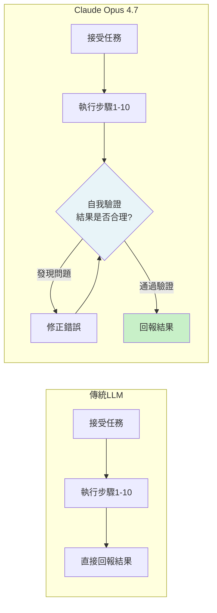

# Claude Opus 4.7 自我驗證與高解析視覺：用「先交卷前自我批改考卷的頂尖考生」理解

> [!abstract] 一句話理解
> 這是一個用來「在執行長程自主任務時主動在回報前驗證自身輸出品質、同時支援高解析度多模態輸入」的頂尖 LLM，特別之處在於它將「先自我批改再交卷」的機制（Self-verification）內建到模型行為中，試圖降低 AI Agent 在自主任務中「靜默犯錯而不自知」的風險。

## 🎯 為什麼重要

**它解決了什麼問題？**

隨著 LLM 被用於越來越長、越來越複雜的自主任務（Agentic Tasks），一個核心安全問題浮現：**「靜默錯誤（Silent Failure）」——模型完成了任務，自信地回報結果，但結果是錯的**。

**傳統 LLM 的問題**：
- 模型生成一個回答
- 模型以同樣的「自信語氣」回報，不管回答是否正確
- 在長程任務（多步驟、多工具）中，早期的小錯誤會被後續步驟放大
- 用戶（或下游系統）看到「任務完成」，不知道結果是否可信

**高解析度視覺的重要性**：
- 現實世界中大量重要資訊以「圖像」而非「純文字」形式存在
- 財務報表截圖、工程圖紙、醫療影像、密密麻麻的表格——這些需要高解析度才能正確識別
- 前代 Claude（1.15MP）已足夠日常圖片，但在「細節密集文件」上有識別盲點

## 🧠 入門解說（用類比理解）

**用「頂尖考生的應試策略」來理解自我驗證**

想像一個非常認真的考生（代表 Opus 4.7）：

**普通學生（傳統 LLM）**：
1. 認真作答每一題
2. 寫完最後一題，**直接交卷**
3. 交卷前不回頭檢查
4. 結果：可能有計算錯誤、格式錯誤、遺漏條件

**頂尖考生（Claude Opus 4.7）**：
1. 認真作答每一題
2. 完成所有題目後，**先不交卷**
3. **主動回頭逐題批改自己的答案**：
   - 重新計算數學推導
   - 確認答案符合題目條件
   - 找出明顯的邏輯漏洞
4. 修正錯誤後，**才交卷**
5. 結果：錯誤率顯著降低

在 AI Agent 場景中，這意味著：Opus 4.7 完成一段複雜代碼後，會「主動運行一遍心理測試」確認邏輯正確，才回報「任務完成」。

**高解析度視覺的類比：「更清晰的放大鏡」**

把前代 Claude 的視覺能力想像成一個 5 倍放大鏡（1.15MP），Opus 4.7 升級為一個 16 倍放大鏡（3.75MP）。當你需要識別一張「財務報表截圖」上密密麻麻的小數字時，前者可能把 8 和 3 搞混，後者能清晰識別每一個字符。

## 🔑 重點原理

1. **自我驗證（Self-verification）的機制**：在模型生成最終回答前，Anthropic 通過訓練讓 Opus 4.7 學會「先評估自己的輸出」。具體可能包含：
   - 邏輯一致性檢查（我的步驟 1 是否和步驟 3 矛盾？）
   - 格式符合性（我生成的 JSON 是否符合規定格式？）
   - 邊界條件驗證（我的代碼是否處理了 null 輸入？）
   這不是「模型調用自己」，而是模型在生成過程中的內建批評機制。

2. **高解析度圖像的技術升級**：
   - 前代：最大 1568px × 1568px（約 1.15MP）
   - Opus 4.7：最大 2576px × 2576px（約 3.75MP）
   - 提升比例：解析度約 3.3 倍，細節識別能力指數級提升
   - 實際影響：財務表格數字識別、工程圖紙標注識別、醫療影像關鍵特徵識別

3. **自適應思考（Adaptive Thinking）的搭配**：Opus 4.7 保留了延伸思考（Extended Thinking）模式，允許模型在複雜問題上「多想一步」。自我驗證 + 自適應思考的組合：前者提高「執行品質」，後者提高「推理深度」，共同解決 Agentic 任務的準確性問題。

4. **網路安全垂直應用的雙重策略**：Anthropic 同時啟用了「自動封鎖高風險網路安全請求」和「提供 Cyber Verification Program 給合法研究者」。這反映了一個重要的設計哲學：**邊界控制（Block by default）+ 受控開放（Verified Access）**，而非全開或全關。

5. **1M Token + 自我驗證的組合效應**：長上下文讓模型能「看見整個任務的全貌」，自我驗證讓模型能「對全貌中的關鍵環節進行二次確認」。兩者組合，使 Opus 4.7 特別適合「輸入複雜（長文件、多工具結果）+ 輸出要求高準確度」的企業場景。

## 📊 視覺化說明

### 傳統 LLM vs Claude Opus 4.7 任務完成流程

### Claude Opus 系列視覺能力比較

| 版本 | 最大解析度 | 像素數 | 適用場景 |
|------|-----------|-------|---------|
| Claude 3 系列 | 1092px | ~0.56MP | 日常圖片、簡單圖表 |
| Claude Opus 4.6 | 1568px | 1.15MP | 一般文件、基本表格 |
| **Claude Opus 4.7** | **2576px** | **3.75MP** | **高密度財務表格、工程圖、醫療影像** |

## 🔍 與既有技術的差異

**vs. Claude Opus 4.6**

Opus 4.6 和 4.7 的主要差異：
1. **視覺**：3.75MP vs 1.15MP（4.7 提升 3.3 倍）
2. **自我驗證**：4.7 內建，4.6 沒有明確的內建自驗機制
3. **代碼任務**：4.7 在「最困難的任務」上有明顯提升（用戶回饋）
4. **安全**：4.7 加入網路安全專用保護機制

**vs. GPT-5.5（OpenAI）**

GPT-5.5 和 Claude Opus 4.7 在「旗艦模型對比」中各有側重：GPT-5.5 在代碼生成 Benchmark（HumanEval）分數更高，而 Claude Opus 4.7 在長程任務一致性和遵循指令精確度上被更多企業用戶推薦。

**vs. Gemini 3.5 Flash**

Gemini 3.5 Flash 是「速度和工具可靠度」導向，定價 $1.50/$9.00 每百萬 Token。Claude Opus 4.7 是「推理深度和任務完成品質」導向，定價 $5/$25。前者適合大量並行 Agent 場景，後者適合「需要高可信度單次輸出」的場景。

## 📚 關鍵詞對照表

| 中文 | 英文 | 簡短解釋 |
|------|------|---------|
| 自我驗證 | Self-verification | 模型在回報結果前自動檢查輸出品質的機制 |
| 靜默錯誤 | Silent Failure | 任務「完成」但結果有誤，且模型未提示的失敗模式 |
| 自主任務 | Agentic Task | AI 自主規劃並執行多步驟操作的任務類型 |
| 延伸思考 | Extended Thinking / Adaptive Thinking | 讓模型在回答前進行更長時間推理的機制 |
| 高解析度圖像 | High-resolution Image | 像素密度更高的圖像，用於識別細小文字或細節 |
| 網路安全驗證計畫 | Cyber Verification Program | Anthropic 為合法安全研究者提供的使用授權機制 |
| Constitutional AI | Constitutional AI（CAI）| Anthropic 的 AI 訓練方法，讓模型根據原則自我評估和修正 |

## 🛠️ 可能的應用場景

1. **財務報告自動分析**：高解析度視覺讓 Opus 4.7 能直接讀取掃描版財務報告中密密麻麻的數字表格，自我驗證確保計算結果正確，適合審計輔助工具。

2. **代碼 Review 自動化**：讓 Opus 4.7 審查代碼、找出 Bug 並自動提交修復 PR。自我驗證機制確保它提交的修復不引入新 Bug。

3. **法律文書摘要與核查**：在長上下文（1M Token）下讀取整套合約文書，提取關鍵條款，自我驗證確保沒有遺漏重要術語。

4. **工程圖紙識別**：3.75MP 解析度讓 Opus 4.7 能識別複雜電路圖、建築藍圖、機械工程圖上的標注和尺寸，適合工業數位化場景。

5. **醫療輔助決策**：高解析度視覺結合自我驗證，可初步分析醫療影像（X 光、CT）並輸出結構化分析報告，供醫師參考（非診斷，需醫師最終判斷）。

## 📖 學習路徑建議

1. **先讀**：[Anthropic Claude Opus 4.7 官方發布公告](https://www.anthropic.com/news/claude-opus-4-7)
2. **先讀**：Constitutional AI 論文（Bai et al., 2022）——理解 Anthropic 訓練模型「自我評估」的基礎方法
3. **再讀**：[Anthropic Responsible Scaling Policy](https://www.anthropic.com/responsible-scaling-policy)——理解 Anthropic 在模型能力和安全之間的設計哲學
4. **動手**：使用 Anthropic API 測試 Opus 4.7 的 High-resolution 圖像功能，和前代對比識別密集文字的差異
5. **進階**：閱讀「自我一致性（Self-consistency）」和「批評與反思（Critique & Revision）」相關論文，理解「AI 自我評估」的技術基礎

## 🔗 延伸閱讀
- 原文連結：[Introducing Claude Opus 4.7（Anthropic）](https://www.anthropic.com/news/claude-opus-4-7)
- 對應新聞筆記：[[2026-05-23-Claude Opus 4.7 高分辨率視覺旗艦模型]]
- [AWS Bedrock：Claude Opus 4.7 部署指南](https://aws.amazon.com/blogs/aws/introducing-anthropics-claude-opus-4-7-model-in-amazon-bedrock/)
- [Axios：Opus 4.7 與 Mythos 的關係](https://www.axios.com/2026/04/16/anthropic-claude-opus-model-mythos)
- 相關學習：[[2026-05-21-學習-Anthropic Dreaming AI Agent 記憶鞏固]]（Anthropic 安全研究方向）

---
*由 Claude 自動整理於 2026-05-23*
