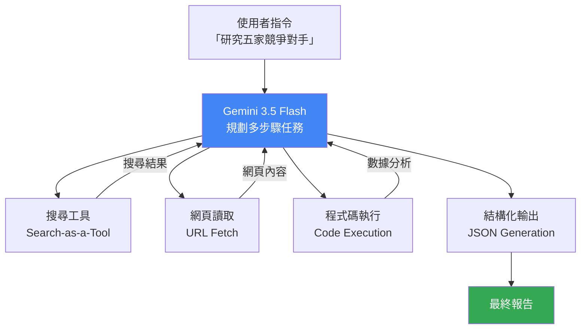

# Google Gemini 3.5 Flash：用「行動優先的高速特工」理解 Agent 優先模型設計

> [!abstract] 一句話理解
> 這是一個用來「以前沿推理能力驅動多步驟工具呼叫和 Agent 工作流程」的多模態 LLM，特別之處在於它以比其他前沿模型快 4 倍的速度、同時提供超高的工具使用可靠度（MCP Atlas 83.6%），並且比前代旗艦模型便宜 25%。

## 🎯 為什麼重要

**它解決了什麼問題？**

在 AI Agent 時代，「快速、可靠地呼叫工具並完成多步驟任務」是比「回答單一問題更準確」更關鍵的能力。許多現有前沿模型（GPT-5.5、Claude Opus 4.7 等）雖然推理能力強，但：
- **速度瓶頸**：Agent 需要多輪工具呼叫，每輪等待時間累積成明顯延遲
- **工具可靠度問題**：模型在複雜的多工具工作流程中，容易「調錯 API」或「遺忘前面的任務步驟」
- **成本問題**：Agent 任務消耗的 Token 量是普通對話的數倍，高推理成本使大規模 Agent 部署不可行

Gemini 3.5 Flash 的定位是：**在保持前沿推理品質的同時，以 4 倍速度、1/5 成本優化，並以架構設計確保工具呼叫的可靠性**。

## 🧠 入門解說（用類比理解）

**用「行動優先的高速特工」來理解**

想像你是一個需要完成複雜任務的特工，需要：查地圖、打電話、查資料、分析情報、做決策——這正是 AI Agent 的工作方式。

**老牌智囊型模型**（如傳統強推理模型）：
- 非常聰明，能分析複雜情境
- 但行動很慢——每個步驟都要「仔細思考再行動」
- 而且很貴——每次出任務費用高昂

**Gemini 3.5 Flash（行動優先特工）**：
- 同樣聰明，但預先訓練「如何快速執行工具」
- **4 倍速度**：接到任務馬上行動，不磨蹭
- **MCP Atlas 83.6%**：在複雜工具呼叫環境中，能持續正確調用正確的工具，不出錯
- **較低費用**：適合高頻、大量出任務

**一個 Agent 場景的比喻**：
假設你讓 AI Agent 「研究這五家競爭對手的最新動態並給出分析報告」。這個任務需要：搜尋（5次）→ 讀取網頁（10+次）→ 提取資訊（5次）→ 比較分析（1次）→ 撰寫報告（1次）。傳統模型在第三四步可能已經「迷路」（工具呼叫出錯或跳過步驟），而 Gemini 3.5 Flash 的高工具可靠度讓它能更穩定地走完全程，同時速度更快讓等待感降低。

## 🔑 重點原理

1. **「行動（Action）」作為第一等公民**：Gemini 3.5 Flash 的設計哲學是「Frontier Intelligence with Action」。傳統模型設計以「推理準確性」為第一優先，行動能力（工具呼叫）是後加的。Gemini 3.5 Flash 在訓練階段就把「工具呼叫可靠性」作為核心優化目標之一，這體現在 MCP Atlas 83.6% 的業界頂尖分數。

2. **MCP Atlas 基準的意義**：MCP（Model Context Protocol）是 Anthropic 開發、業界廣泛採用的工具呼叫協議標準。MCP Atlas 基準測試模型在「多工具、複雜工作流程」下的可靠度——不只是「會呼叫工具」，而是「在 100 步的複雜任務中能保持正確呼叫」。83.6% 代表高可靠度（相比之下，能過 80% 的模型不多）。

3. **速度優化：架構效率 + 訓練創新**：4 倍速度的提升來自兩個方向：
   - **架構效率（Architectural Efficiency）**：更精簡的注意力機制，減少不必要的計算步驟
   - **訓練創新（Training Innovations）**：在不增加大量參數的情況下，通過訓練方式讓模型在推理時更「直覺」，減少不必要的思考迂迴
   兩者合力，讓模型在「每 Token 所需計算量」上大幅降低。

4. **多模態原生設計**：文字、圖片、音訊、影片、PDF 的多模態能力不是後加的，而是從模型架構根源就整合的。這意味著 Agent 可以「看懂」網頁截圖、「分析」影片內容、「讀取」掃描文件，這些都在同一個模型呼叫中完成，無需調用多個專用模型。

5. **「Search-as-a-Tool」內建**：Google Search 能力被直接封裝成標準工具呼叫，Agent 可以無縫使用，不需要額外的搜尋 API 整合。這對於「需要即時獲取最新資訊」的 Agent 任務（如市場研究、新聞追蹤）是顯著優勢。

## 📊 視覺化說明

### Gemini 3.5 Flash Agent 工作流程

### 前沿模型比較（2026 年 5 月）

| 模型 | 輸出速度 | MCP Atlas（工具使用）| 輸入成本 / 百萬 Token | 輸出成本 / 百萬 Token |
|------|---------|---------------------|----------------------|----------------------|
| **Gemini 3.5 Flash** | **4x（最快）** | **83.6%** | **$1.50** | **$9.00** |
| Gemini 3.1 Pro | 基準 | ~75% | ~$2.00 | ~$12.00 |
| Claude Opus 4.7 | 中等 | 高 | $5.00 | $25.00 |
| GPT-5.5 | 中等 | 中高 | ~$4.00 | ~$20.00 |

注：成本和速度為近似值，以公開資訊為基準。

## 🔍 與既有技術的差異

**vs. 傳統「推理優先」模型**

傳統模型的設計哲學：讓模型「思考更深更準」，工具呼叫作為附加能力。Gemini 3.5 Flash 的哲學：讓模型「行動更快更可靠」，深度推理作為基礎。兩者並非對立，而是設計重心不同。

**vs. Flash / Lite 系列前代**

Gemini 3.1 Flash 是 3.1 Pro 的「精簡低成本版」，能力有明顯縮水。而 3.5 Flash 的革命性在於：**它不是 3.5 Pro 的縮水版，而是在 Agent 能力上超越了 3.1 Pro**（Agentic benchmark 全面勝出）。「Flash」在 3.5 系列中不再代表「犧牲能力換低價」，而是「以架構效率實現同等或更強能力+更低成本」。

**vs. Anthropic Claude Agent 系列**

Claude Opus 4.7 的自我驗證機制（Self-verification）更注重「任務完成品質」，適合需要高準確度的專業場景（如法律、醫療）。Gemini 3.5 Flash 更注重「任務完成速度和吞吐量」，適合需要大量並行 Agent 操作的場景（如監控、批量研究）。

## 📚 關鍵詞對照表

| 中文 | 英文 | 簡短解釋 |
|------|------|---------|
| 代理（智能體）| Agent | 能自主規劃並執行多步驟任務的 AI 系統 |
| 工具呼叫 | Tool Use / Function Calling | AI 模型呼叫外部工具（搜尋、計算、API）的能力 |
| MCP Atlas | MCP Atlas Benchmark | 測量模型在複雜多工具工作流程中可靠度的基準 |
| 次二次方速度 | Subquadratic Speed | 推理計算複雜度低於 O(n²) 的高效架構 |
| 多模態 | Multimodal | 能同時處理文字、圖片、音訊、影片等多種類型輸入 |
| 搜尋即工具 | Search-as-a-Tool | 將網路搜尋能力封裝成可呼叫的標準工具 |
| 推理效率 | Inference Efficiency | 每單位算力輸出的推理品質，影響速度和成本 |
| 結構化輸出 | Structured Output | 以 JSON 等格式返回機器可讀的結構化結果 |

## 🛠️ 可能的應用場景

1. **大規模研究自動化**：自動收集、閱讀、分析大量網頁和文件，每天生成市場情報報告。Gemini 3.5 Flash 的 4 倍速度讓批量處理更可行。

2. **客戶服務 AI Agent**：需要即時回應客戶、查詢多個後端系統並提供解答的場景，高速度和高工具可靠度是關鍵。

3. **多媒體內容分析**：同時分析影片、圖片、PDF 和文字的混合工作流程，如媒體監控、醫療影像初步分析。

4. **代碼審查 + 搜尋整合 Agent**：讀取代碼庫（長上下文）、搜尋文件、執行測試代碼、生成修改建議的完整 DevOps Agent。

5. **競爭情報自動化**：每日自動追蹤競爭對手網站、新聞、社交媒體，提取關鍵變化並生成結構化報告。

## 📖 學習路徑建議

1. **先讀**：[Attention is All You Need](https://arxiv.org/abs/1706.03762)——理解 Transformer 基礎，才能理解「效率優化」的背景
2. **先讀**：MCP（Model Context Protocol）規範——理解工具呼叫的標準協議
3. **再讀**：[Google I/O 2026 Gemini 3.5 Flash 官方公告](https://www.marktechpost.com/2026/05/20/google-introduces-gemini-3-5-flash-at-i-o-2026-a-faster-and-cheaper-model-for-ai-agents-and-coding/)
4. **動手**：嘗試用 Gemini 3.5 Flash API 構建一個簡單的多工具 Agent（搜尋 + 摘要）
5. **進階**：閱讀關於 Agentic 基準設計的論文，如 GAIA、AgentBench 的設計方法

## 🔗 延伸閱讀
- 原文連結：[Google Introduces Gemini 3.5 Flash at I/O 2026](https://www.marktechpost.com/2026/05/20/google-introduces-gemini-3-5-flash-at-i-o-2026-a-faster-and-cheaper-model-for-ai-agents-and-coding/)
- 對應新聞筆記：[[2026-05-23-Google Gemini 3.5 Flash IO 2026 發布]]
- [Simon Willison 的獨立分析](https://simonwillison.net/2026/May/19/gemini-35-flash/)
- [Build Fast With AI：I/O 2026 全覽](https://www.buildfastwithai.com/blogs/google-io-2026-gemini-3-5-flash-announcements)

---
*由 Claude 自動整理於 2026-05-23*
