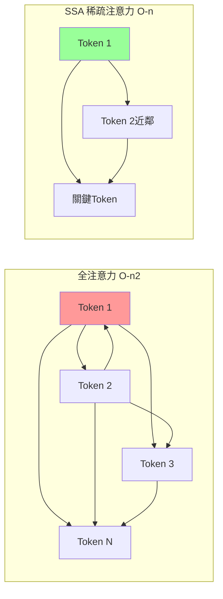

# SubQ 次二次方稀疏注意力（SSA）：用「只看重要鄰居的廣場對話」理解線性注意力突破

> [!abstract] 一句話理解
> 這是一個用來「以線性計算複雜度（O(n)）處理超長文本上下文的新型注意力機制」的 LLM 架構創新，特別之處在於它不同於標準 Transformer 的 O(n²) 全注意力，而是透過「稀疏化」注意力計算，使 1200 萬 Token 的超長上下文在算力上成為現實。

## 🎯 為什麼重要

**它解決了什麼問題？**

標準 Transformer 注意力機制的計算複雜度是 **O(n²)**——意思是上下文長度每增加 2 倍，計算量增加 4 倍。這在以下場景形成嚴重瓶頸：

**問題 1：超長文本處理的成本爆炸**
- 1 萬 Token（約 10 頁文字）：正常可處理
- 10 萬 Token（約 100 頁）：算力 100 倍增加
- 100 萬 Token（約 1000 頁）：算力 10,000 倍增加
- **1200 萬 Token**（整本法律條文、大型代碼庫）：**算力 14.4 億倍增加**——不可能

**問題 2：現有解法的取捨**
- **RAG（向量檢索）**：把長文件切成小塊，用相似度搜尋取出相關段落。但這會遺漏「不在最相似段落但仍重要」的資訊，且需要複雜的索引和檢索管線。
- **FlashAttention**：優化標準注意力的記憶體存取效率，但複雜度仍是 O(n²)，只是常數倍縮小。
- **Mamba / 線性 RNN**：O(n) 複雜度，但犧牲「任意位置間的直接注意力」，影響長程依賴捕捉。

**SubQ / SSA 的目標**：在 O(n) 的計算複雜度下，保持足夠高品質的「選擇性注意力」，讓 12M Token 上下文在算力上可行。

## 🧠 入門解說（用類比理解）

**用「大廣場上的千人對話」來理解注意力機制**

想像一個廣場上有 1000 個人，每個人都需要和其他人交換資訊以做決策：

**全注意力（標準 Transformer）**：
- 每個人必須和廣場上「所有其他 999 人」對話並考慮他們的意見
- 廣場從 1000 人增加到 2000 人：每人需要對話的次數增加到 3998 次（幾乎 4 倍）
- 廣場有 1200 萬人：每人要和 1200 萬人對話——**完全不可行**

**次二次方稀疏注意力（SSA）**：
- 聰明的策略：每個人只和「離自己最近的幾個鄰居」以及「被系統選出的少數關鍵人物」對話
- 廣場從 1000 人增加到 2000 人：每人對話次數只是線性增加
- 廣場有 1200 萬人：每人的對話量仍然可管理——**可行！**

**關鍵問題**：「稀疏」了之後，資訊品質會下降嗎？SSA 的核心主張是：**透過更聰明的「誰應該和誰說話」選擇策略，可以在大幅減少計算的同時，保留最重要的資訊流動**。

**為什麼叫「次二次方（Subquadratic）」？**
- 二次方（Quadratic）= O(n²)
- 次（Sub-）= 低於
- 次二次方（Subquadratic）= 複雜度低於 O(n²) 但高於 O(1) 的任意複雜度
- 當 SSA 實現線性（O(n)）時，是次二次方的最好情況

## 🔑 重點原理

1. **稀疏化（Sparsification）的核心策略**：SSA 不計算所有 Token 對之間的注意力，而是只計算「被認為最重要」的 Token 對。這個「被認為最重要」的判斷本身需要輕量級機制完成（否則判斷本身就又增加複雜度）。SubQ 的具體稀疏化策略尚未完全公開，但核心思路是：局部窗口注意力（處理近鄰關係）+ 全局關鍵 Token 選擇（處理長程依賴）。

2. **線性複雜度 O(n) 的意義**：當上下文長度從 1M Token 增加到 12M Token（12 倍），計算量只增加 12 倍而非 144 倍。這是 12M Token 上下文在商業上可行的根本原因。

3. **12M Token 上下文的實際應用場景**：
   - 完整代碼庫：Python 包含所有文件（如 Django 框架~50 萬行）約 200-300 萬 Token
   - 法律文書庫：一個公司的全部合約~500-1000 萬 Token
   - 長篇小說集：全部哈利波特系列~100 萬 Token
   - 整年會議記錄：一家中型公司的全部會議逐字稿~200-500 萬 Token

4. **與 FlashAttention 的差異**：FlashAttention 是「優化標準 Transformer 的記憶體讀寫」，但計算量（Flops）沒有減少，複雜度仍是 O(n²)。SSA 是「從根本改變計算什麼」，複雜度降至 O(n)，兩者是不同層面的優化。

5. **「尚未獨立驗證」的重要性**：SubQ 的 52 倍速度和千倍成本優勢是廠商自報數據。在 AI 架構聲明中，這種「單次測試、對比非最新版本」的廠商數據常被高估。真正有參考價值的是在 MMLU、RULER（長上下文 Benchmark）等標準基準上與 Claude、GPT 的直接比較。

## 📊 視覺化說明

### 注意力機制複雜度比較

### 上下文長度 vs 計算量

| 上下文長度 | 全注意力 O(n²) | SSA 線性 O(n) | 差距倍數 |
|-----------|--------------|--------------|---------|
| 10K Token | 1 億次計算 | 1 萬次計算 | 10,000x |
| 100K Token | 100 億次 | 10 萬次 | 100,000x |
| 1M Token | 1 兆次 | 100 萬次 | **1,000,000x** |
| 12M Token | **144 兆次（不可行）** | **1200 萬次（可行）** | **12,000,000x** |

注：計算量為示意近似值，實際視實作細節而定。

## 🔍 與既有技術的差異

**vs. FlashAttention**
FlashAttention 優化的是「計算 O(n²) 注意力時的記憶體讀寫效率」，對 GPU SRAM 的使用更聰明，速度可提升 2-4 倍。但複雜度仍是 O(n²)。SubQ 的 SSA 在「計算什麼」這一步就做了改變，理論複雜度降至 O(n)。

**vs. Mamba / 線性 RNN（Linear Recurrence）**
Mamba 等選擇性狀態空間模型（SSM）也實現了 O(n) 複雜度，但通過「順序遞迴」的方式——每個 Token 只知道「它之前所有 Token 的壓縮摘要」，缺乏對過去特定位置的直接存取能力。SSA 通過稀疏注意力保留了「可以直接關注任意重要位置」的能力。

**vs. ASI-ARCH 發現的線性注意力架構**
ASI-ARCH 發現的 PathGateFusionNet 等架構和 SubQ 的 SSA 走的是同一條賽道（線性注意力），但方法論不同：ASI-ARCH 是 AI 自主探索架構空間，SubQ 是人類研究者手工設計 + 驗證。兩條路徑殊途同歸。

## 📚 關鍵詞對照表

| 中文 | 英文 | 簡短解釋 |
|------|------|---------|
| 次二次方 | Subquadratic | 計算複雜度低於 O(n²) 的算法 |
| 稀疏注意力 | Sparse Attention | 只計算部分 Token 對之間注意力的優化方法 |
| 線性複雜度 | Linear Complexity O(n) | 計算量與輸入大小呈線性比例增長 |
| 二次複雜度 | Quadratic Complexity O(n²) | 計算量與輸入大小的平方成比例增長 |
| 上下文視窗 | Context Window | LLM 一次能「看到」的最大文本長度 |
| Flash Attention | FlashAttention | 優化標準注意力記憶體存取效率的算法（Dao et al.）|
| RAG | Retrieval Augmented Generation | 用向量搜尋從外部文件庫中取出相關段落的方法 |
| 選擇性狀態空間 | Selective State Space Model（Mamba）| O(n) 複雜度的序列模型，通過遞迴而非注意力 |

## 🛠️ 可能的應用場景

1. **全代碼庫理解（Code Intelligence）**：把整個大型軟體項目的所有代碼放入 12M Token 上下文，讓 AI 理解跨文件依賴、找出架構問題、生成整體性的修改建議。

2. **超長法律文書分析**：一次輸入整套合約文書、法律法規和判例，讓 AI 進行全文交叉引用分析，不錯過隱藏在任意位置的相關條款。

3. **大規模 RAG 替代方案**：對於文件規模在 100 萬 Token 以內的企業知識庫，可以直接放入上下文，省去 RAG 的索引建置、嵌入更新、召回不準等複雜問題。

4. **長程對話歷史**：客服、心理諮詢、長期教學等場景，保存數月甚至數年的對話歷史，讓 AI 真正理解用戶的長期脈絡。

5. **全書分析**：一次輸入整個知識庫（如整套百科全書、某領域所有論文）進行跨文件分析和知識整合。

## 📖 學習路徑建議

1. **先讀**：[Attention is All You Need](https://arxiv.org/abs/1706.03762)——理解標準 O(n²) 注意力機制
2. **先讀**：[FlashAttention 論文](https://arxiv.org/abs/2205.14135)——理解「優化計算效率」vs「改變計算複雜度」的差異
3. **再讀**：[Mamba 論文](https://arxiv.org/abs/2312.00752)——理解 O(n) 線性遞迴的另一條路
4. **再讀**：SubQ / SSA 官方說明（subq.ai），了解 SSA 的具體架構
5. **進階**：[ASI-ARCH 論文（arXiv 2507.18074）](https://arxiv.org/abs/2507.18074)——了解 AI 自主探索線性注意力架構的最新進展
6. **批判性閱讀**：[RULER Benchmark](https://arxiv.org/abs/2404.06654)——理解長上下文評估的標準，用來驗證 SubQ 的真實效能

## 🔗 延伸閱讀
- 原文連結：[Subquadratic Launches SubQ（SiliconANGLE）](https://siliconangle.com/2026/05/05/subquadratic-launches-29m-bring-12m-token-context-windows-ai/)
- 對應新聞筆記：[[2026-05-23-SubQ 次二次方 LLM 12M Token 上下文]]
- [The New Stack：12M Token 上下文視窗的突破意義](https://thenewstack.io/subquadratic-12-million-context-window/)
- 相關技術：[[2026-05-22-學習-ASI-ARCH AI自主架構發現擴展定律]]（同類線性注意力架構研究方向）

---
*由 Claude 自動整理於 2026-05-23*
