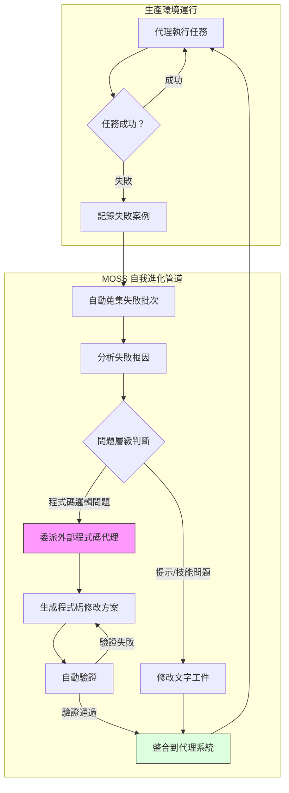

# MOSS：原始碼層級自我進化代理架構

> [!abstract] 一句話理解
> 這是一個用來「讓 AI 代理系統在部署後能夠根據失敗經驗自動修改自身底層程式碼」的框架，特別之處在於它是首個突破「只能修改提示或技能文件」限制、能夠在原始碼層級進行確定性自我改寫的代理自進化系統。

## 🎯 為什麼重要

**它解決了什麼問題？**

自主代理系統（AI Agent）在企業環境中部署後，面臨一個根本性的「固化問題」：**系統在部署後是靜態的，無法從使用過程中的失敗學習並修復自身**。

想像一下：你部署了一個 AI 代理幫助處理客服工單。它每週都犯同樣的錯誤——在特定類型的問題上總是誤判優先級。但系統本身沒有機制自動修復這個問題；你需要等待下一次人工更新版本。

**既有自我進化方案的「天花板」**：

2025-2026 年出現了很多「自我進化代理」的研究，但它們全都有同一個限制：只能修改「文字可修改工件（text-mutable artifacts）」：
- 提示（Prompt）內容
- 技能文件（Skill Files）中的描述
- 記憶綱要（Memory Schema）
- 工作流程圖（Workflow Graphs）

這些修改都在「文字層」——它們不碰代理系統的底層程式碼邏輯。問題是：很多重複失敗的根本原因**嵌在程式碼邏輯中**，例如：
- 錯誤的條件判斷邏輯
- 不合理的優先順序算法
- 缺失的錯誤處理分支
- 工具調用方式的結構性問題

這些問題透過修改提示或技能文件是**根本解決不了的**。

**MOSS 的改變**：

MOSS 突破了這個天花板，讓代理系統能夠直接修改自身的底層程式碼，從根本上解決結構性失敗問題——不需要等待人工介入。

## 🧠 入門解說（用類比理解）

**用「工廠自動品管系統」理解 MOSS**

想像一家電子工廠的品管流程：

**傳統品管（現有 AI 代理）**：品管員（AI）每天都用同一份「品管手冊」（系統提示）檢查產品。手冊說「焊點不夠圓就退件」，他就執行。但如果工廠引進了新型焊接機器，焊點形狀本身改變了，手冊沒更新，品管員就永遠用舊標準做錯誤判斷——直到工廠人員手動更新手冊。

**MOSS 的品管（有原始碼自我改寫能力）**：這個品管系統不只有「手冊」，它還有完整的「品管邏輯程式碼」。當它連續三天因同一個錯誤退件但後來被工程師推翻，它會：
1. 自動蒐集這些「失敗案例」
2. 分析失敗的共同原因（是程式碼中的判斷條件有問題）
3. 調用外部「程式碼改寫工具」，修改底層判斷邏輯
4. 測試新邏輯是否有效
5. 整合到自身系統

**核心洞見**：能夠修改「手冊內容」和能夠修改「品管程式邏輯」，是兩個根本不同層級的自我改進能力。MOSS 實現的是後者。

## 🔑 重點原理

1. **原始碼層級的圖靈完備性（Turing-Completeness at Source Level）**：在理論上，任何「文字可修改」的範疇（提示、技能、記憶），都是原始碼可修改範疇的一個子集。原始碼層級改寫是圖靈完備的——任何可計算的行為修改都可以表達。這從理論上證明了 MOSS 的方法是「根本性更通用」的。

2. **失敗證據驅動（Production-Failure Evidence Driven）**：MOSS 不是隨機改寫程式碼，而是錨定在「生產失敗批次（batch of production-failure evidence）」——即從實際部署環境中自動蒐集的失敗案例。這確保了改寫有目標，且改寫的優先級由實際問題嚴重程度決定，而非人工判斷。

3. **確定性多階段管道（Deterministic Multi-Stage Pipeline）**：MOSS 的改寫過程是確定性的（deterministic），而非基於概率的。每個階段（蒐集失敗→分析原因→委派改寫→驗證→整合）的輸出是確定的，不依賴底層模型的「合規程度」。這使得改寫過程可預測、可稽核。

4. **委派式程式碼修改（Delegated Code Modification）**：MOSS 自身不直接生成程式碼，而是委派給「可插拔的外部程式碼代理 CLI（pluggable external coding-agent CLI）」。MOSS 控制「做什麼」，外部工具控制「怎麼做」。這種關注點分離（Separation of Concerns）讓 MOSS 可以整合不同的程式碼生成工具（如 Cursor、Copilot Workspace 等），而無需重新設計核心架構。

5. **確定性生效 vs. 合規依賴（Deterministic vs. Compliance-Dependent Effect）**：傳統的提示修改依賴底層模型「是否遵守」新提示，存在「合規失效（compliance drift）」的風險（尤其在長對話中，模型可能逐漸偏離系統提示）。原始碼修改確定性地改變系統行為，不存在這種風險。

## 📊 視覺化說明

### MOSS 自我進化流程

### 各代自我進化方案比較

| 維度 | 無自我進化 | 文字層自我進化（提示/技能）| **MOSS（原始碼層）** |
|---|---|---|---|
| **改進範圍** | 無 | 文字可修改工件 | 任意可計算行為 |
| **理論完備性** | — | 非圖靈完備 | **圖靈完備** |
| **確定性** | — | 依賴模型合規 | **確定性生效** |
| **抵抗長 context 漂移** | — | ❌ 可能漂移 | ✅ 程式碼不漂移 |
| **能解決結構性程式碼缺陷** | ❌ | ❌ | ✅ |
| **實驗評分（OpenClaw）** | — | 不適用 | **0.25 → 0.61** |
| **風險等級** | 低 | 低-中 | **中-高** |
| **人工監督需求** | 完全依賴 | 部分依賴 | **需要嚴格護欄** |

## 🔍 與既有技術的差異

**vs. MemGPT / 記憶增強型代理**

MemGPT 等系統關注的是「跨 session 記憶」問題——讓代理記住過去的互動和學習。MOSS 關注的是「底層邏輯修復」問題——讓代理能夠修復自身的結構性缺陷。兩者不衝突，理論上可以組合。

**vs. RLHF / 強化學習微調**

強化學習（RLHF）通過持續的人類反饋信號更新模型權重，是一種「訓練時」的自我改進。MOSS 是「部署後」的自我改進，不修改模型本身，只修改代理的行為邏輯程式碼。MOSS 更快（無需重新訓練）、更可逆（刪除程式碼修改即可復原），但改進深度不如改變模型權重深層。

**vs. Anthropic Dreaming（記憶鞏固機制）**

Dreaming 關注的是「跨 session 工作偏好和錯誤模式的記憶萃取」，是在記憶層面的自我改進。MOSS 是在程式碼層面的自我改進。類比：Dreaming 讓醫生「記住以前的診斷經驗」，MOSS 讓醫院「重寫診斷流程指南」——前者是知識積累，後者是流程改革。

## 📚 關鍵詞對照表

| 中文 | 英文 | 簡短解釋 |
|---|---|---|
| 原始碼層級自我改寫 | Source-Level Self-Rewriting | 直接修改系統底層程式碼的自我改進方式，區別於文字層修改 |
| 文字可修改工件 | Text-Mutable Artifacts | 可以用自然語言描述修改的系統組件，如提示、技能文件、工作流 |
| 確定性管道 | Deterministic Pipeline | 每個階段輸出確定、可重現的處理流程，不依賴隨機性 |
| 生產失敗證據 | Production-Failure Evidence | 從實際部署環境中收集的失敗案例，作為改寫依據 |
| 可插拔外部程式碼代理 | Pluggable External Coding-Agent CLI | 可替換的程式碼生成工具接口，MOSS 通過此接口委派程式碼修改 |
| 代理外殼 | Agent Harness | 代理系統的底層程式碼框架，現有方案的改寫「盲區」 |
| 合規漂移 | Compliance Drift | 模型在長對話中逐漸偏離系統提示的現象 |
| 圖靈完備 | Turing-Complete | 能夠表達任何可計算函數的計算能力，程式碼的理論特性 |
| 護欄 | Guardrails | 防止 AI 系統產生有害或錯誤行為的安全機制 |
| 角色分離 | Separation of Concerns | 系統設計原則，不同組件只關注自身職責 |

## 🛠️ 可能的應用場景

1. **企業客服代理持續優化**：客服 AI 代理可以根據被人工推翻的處理決定，自動識別底層邏輯缺陷並修復，降低人工介入頻率

2. **金融風控自動更新**：風控代理系統根據實際的誤判案例（假陽性、假陰性），自動調整判斷邏輯，無需等待季度性人工複查

3. **代碼審查代理自我改進**：用於程式碼審查的 AI 代理，根據開發者接受/拒絕建議的記錄，修復自身的審查邏輯缺陷

4. **IT 運維代理故障修復**：IT 自動化代理根據解決工單的成功/失敗記錄，自動更新底層的故障排除邏輯

5. **科學研究代理**：在自動化科學研究管線（如 AiraXiv 等 AI 科學家系統）中，用於持續優化實驗設計和數據分析邏輯

## 📖 學習路徑建議

1. **先讀**：AI Agent 基礎概念（LLM + 工具使用 + 多步驟推理的基本架構）
2. **先讀**：Self-Refine、Reflexion 等早期代理自我反思論文——了解文字層自我改進的現有技術
3. **先讀**：Anthropic Dreaming 記憶鞏固機制——理解「記憶層」自我改進方案的代表
4. **再讀**：MOSS 原論文（arXiv:2605.22794）——閱讀完整的方法和實驗
5. **進階**：AI 安全文獻（關於「允許 AI 修改自身行為的安全邊界」的研究），如 Anthropic 的 Constitutional AI 系列

## 🔗 延伸閱讀
- 原文連結：[MOSS arXiv 2605.22794](https://arxiv.org/abs/2605.22794)
- 對應新聞筆記：[[2026-05-24-MOSS 自主代理原始碼層級自我進化]]
- 相關技術：[Anthropic Dreaming 記憶鞏固](https://venturebeat.com/technology/anthropic-introduces-dreaming-a-system-that-lets-ai-agents-learn-from-their-own-mistakes)
- 相關論文：Reflexion (2023)——早期代理自我反思框架
- 相關論文：MemGPT——記憶增強代理框架

---
*由 Claude 自動整理於 2026-05-24*
