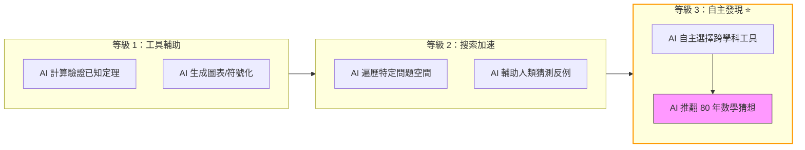

# OpenAI 推理模型自主破解 Erdős 幾何猜想：AI 數學推理新里程碑

> [!abstract] 一句話理解
> 這是一個用來「讓 AI 模型進行長鏈條多步驟數學推理」的通用推理能力，特別之處在於 OpenAI 的模型不靠特殊訓練，自主運用跨學科代數工具（Golod-Shafarevich 理論），推翻了困擾數學界 80 年的 Erdős 平面單位距離猜想——首次展示 AI 在數學發現中的主動創造力。

## 🎯 為什麼重要

**它解決了什麼問題？**

在這個突破之前，「AI 能做數學」被界定為：
- 幫助人類數學家驗證已有想法
- 解決有固定算法路徑的競賽題目
- 在專門訓練下解決特定類型的問題

OpenAI 的這個結果挑戰了所有這些界定——一個**通用推理模型**，在**沒有針對這道題目特別訓練**的情況下，**自主**發現了連人類頂尖數學家 80 年都沒找到的反例。

**既有嘗試的不足**：

平面單位距離問題自 1946 年 Erdős 提出以來，之所以被視為「極難」，原因是：
- 問題陳述極簡單，但答案需要跨越多個數學分支（幾何 + 代數數論）
- 大量計算實驗支持「正方形網格最優」，強化了這一猜想的可信度
- 解題所需的工具（Golod-Shafarevich 理論）在直觀上與幾何問題「風馬牛不相及」——需要非常規的創意跳躍

AI 模型之所以能突破，部分原因可能是：**它沒有「正方形網格應該是最優的」這種先入之見**，而是在廣泛的數學知識空間中自由探索。

## 🧠 入門解說（用類比理解）

**用「鑰匙和鎖」理解跨學科數學突破**

想像你的家門鎖了，你手上有各種工具：螺絲刀（初等幾何）、鎚子（組合數學）、撬棒（拓撲學）……

正常的數學家嘗試所有「看起來對的工具」：這道題是幾何題，所以先用幾何工具；不行再試組合數學；80 年過去，試了很多看似相關的工具，都沒成功。

然後有一天，OpenAI 的 AI 模型帶著所有它讀過的數學文獻，看到這把鎖說：「等等，這個鎖的結構讓我想到了代數數論裡的一個模式——Golod-Shafarevich 理論。」這個工具在抽屜的最底層，沒人覺得用得上，但 AI 嘗試了——然後鎖開了。

**關鍵洞見**：人類數學家的直覺是由「這道題應該用什麼工具」的經驗塑造的，這既是優勢（快速定位方向），也是限制（可能過早排除非常規工具）。AI 模型的優勢是：**它沒有這種限制，可以在更廣泛的工具空間中嘗試**。

## 🔑 重點原理

1. **平面單位距離問題（Planar Unit Distance Problem）**：在平面上放 n 個點，距離恰好為 1 的點對最多有幾對？Erdős 在 1946 年猜想正方形網格基本上是最優解（上界約為 n^(1+1/loglogn)）。OpenAI 的模型發現了可達 n^(1+δ)（δ>0）的構型，在多項式意義上超越了猜想上界，從而推翻了猜想。

2. **Golod-Shafarevich 理論（Golod-Shafarevich Theory）**：代數數論中的深層工具，原本用於研究 p-群的結構和類群的增長性質。OpenAI 模型的突破在於：把這個工具「遷移」應用到離散幾何問題，發現了幾何構型與類域結構之間的隱藏聯繫。這是人類數學家 80 年來未曾嘗試的路徑。

3. **無限類域塔（Infinite Class Field Towers）**：類域塔是一種建立在代數數域基礎上的代數結構，用於研究域的擴張序列。模型利用無限類域塔生成了一族幾何點集，這些點集具有超乎尋常豐富的單位距離結構——超過了正方形網格能達到的密度。

4. **通用推理模型（General-Purpose Reasoning Model）的能力範疇**：OpenAI 強調使用的是通用推理模型，而非：(a) 針對數學特別微調的模型；(b) 設計有特定搜索策略的腳手架系統；(c) 以這道題為目標的特化系統。這意味著「解決開放數學問題」的能力是通用推理能力的一個自然湧現（emergent capability），而非特別工程化的結果。

5. **數學發現的可驗證性（Verifiability of Mathematical Discovery）**：數學的優點是結論可以被嚴格驗證。普林斯頓大學數學家 Will Sawin 獨立驗證了 OpenAI 的結果，並進一步精化 δ = 0.014。這種可驗證性確保了 AI 的「發現」不是幻覺（hallucination），而是真實的數學進步。

## 📊 視覺化說明

### AI 數學突破的類型比較

### Erdős 猜想的推翻：關鍵數字

| 指標 | 舊猜想（正方形網格）| OpenAI 模型結果 |
|---|---|---|
| 單位距離對數上界 | ~n^(1+1/loglogn) | n^(1+δ), δ>0 |
| δ 的精確值 | — | **0.014**（Sawin 精化）|
| 是否推翻猜想 | — | **是** |
| 使用的核心工具 | — | Golod-Shafarevich 理論 |
| 結論類型 | — | 無限族構型（infinite family）|
| 獨立驗證 | — | Princeton Will Sawin ✅ |

## 🔍 與既有技術的差異

**vs. AlphaProof / 數學專用 AI**

Google DeepMind 的 AlphaProof 等系統是針對形式化數學（Formal Mathematics）設計的——它們依賴 Lean、Coq 等定理驗證語言，在有限的形式化空間中搜索證明。這類系統能力強但範圍窄。OpenAI 的突破使用的是自然語言推理，在非形式化的數學概念空間中探索，代表不同的技術路線。

**vs. 計算機輔助證明（Computer-Assisted Proofs）**

四色定理（1976）、克卜勒猜想（1998）等歷史性數學突破依靠計算機的「枚舉驗算」能力。Erdős 猜想的這個突破不是窮舉，而是 AI 生成了一個優雅的代數構型族——更接近「數學家式的創造力」，而非計算機式的暴力枚舉。

**vs. 現有 LLM 數學能力**

現有 LLM 在數學競賽題（MATH benchmark、AMC/AIME 等）的表現已達很高水準，但那些是「有已知解法的題目」。Erdős 猜想是**真正的開放問題**，沒有已知解法、沒有訓練數據中的答案可以學習，AI 必須真正「發明」解法。

## 📚 關鍵詞對照表

| 中文 | 英文 | 簡短解釋 |
|---|---|---|
| 平面單位距離問題 | Planar Unit Distance Problem | Erdős 1946 年提出：平面 n 點最多有幾對距離為 1 的點對 |
| 離散幾何 | Discrete Geometry | 研究幾何物件的組合性質（計數、排列、優化），而非連續分析 |
| 代數數論 | Algebraic Number Theory | 研究數域的代數結構，是現代數論的核心分支 |
| Golod-Shafarevich 理論 | Golod-Shafarevich Theory | 代數數論工具，研究 p-群的有限性，被 MOSS 跨領域應用到幾何 |
| 無限類域塔 | Infinite Class Field Tower | 代數結構，域的無限擴張序列，具有特定的代數性質 |
| 通用推理模型 | General-Purpose Reasoning Model | 沒有領域特化訓練的 AI 模型，通過大規模預訓練獲得廣泛推理能力 |
| 湧現能力 | Emergent Capability | 大模型在規模達到閾值後突然出現、未被明確訓練的能力 |
| 可驗證性 | Verifiability | 數學結論可通過形式化手段嚴格驗證的特性，是數學可信度的保障 |
| 跨學科遷移 | Cross-Domain Transfer | 將一個領域的方法應用到另一個領域的能力 |

## 🛠️ 可能的應用場景

1. **藥物研發**：AI 使用類似的跨學科推理，將分子生物學以外的物理/化學工具應用到藥物結構發現，加速罕見病藥物研究

2. **密碼學**：AI 探索數論的新結果，有潛力幫助發現新的密碼原語（cryptographic primitives）

3. **材料科學**：AI 將物理、化學、數學的工具跨領域組合，發現新型材料的性質

4. **AI 安全研究**：更強大的數學推理 AI，可以用來正式驗證 AI 系統的安全性質（formal verification of AI systems）

5. **教育**：AI 數學教師能夠生成「非常規解法」，幫助學生看到不同的思維路徑，培養創造性數學思維

## 📖 學習路徑建議

1. **先讀**：Erdős 平面單位距離問題的基礎介紹（Wikipedia 或相關數學科普）——理解問題本身
2. **先讀**：離散幾何的基本概念（組合幾何入門）——建立背景知識
3. **再讀**：OpenAI 官方公告全文——了解 AI 突破的細節
4. **再讀**：Golod-Shafarevich 理論的科普介紹——理解關鍵工具（不需深入，只需直覺）
5. **進階**：OpenAI 推理模型（o3/o4 系列）的技術報告——理解「鏈式思考（Chain-of-Thought）推理」如何實現長步驟數學推理

## 🔗 延伸閱讀
- 原文連結：[OpenAI 官方公告](https://openai.com/index/model-disproves-discrete-geometry-conjecture/)
- 對應新聞筆記：[[2026-05-24-OpenAI AI解決80年Erdős幾何猜想]]
- 延伸報導：[Interesting Engineering 深度分析](https://interestingengineering.com/ai-robotics/openai-paul-erdos-geometry-problem-cracked)
- 延伸報導：[ExplainX 技術解析](https://explainx.ai/blog/openai-planar-unit-distance-erdos-problem-solved-2026)
- 相關技術：AlphaProof（DeepMind 形式化數學 AI）

---
*由 Claude 自動整理於 2026-05-24*
