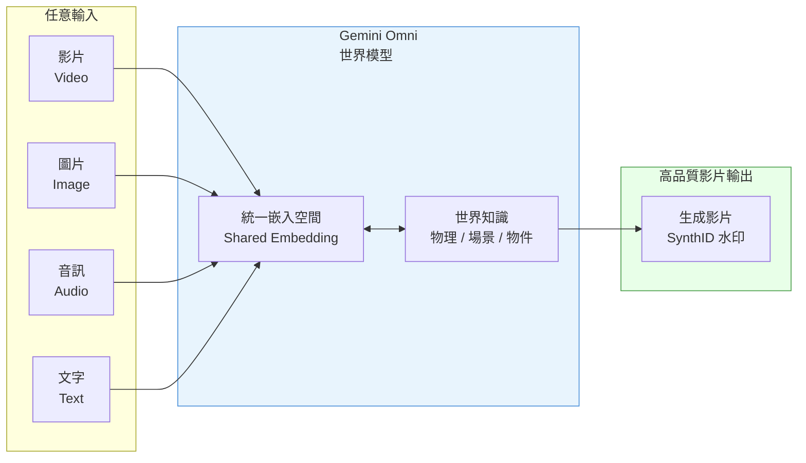

# Google Gemini Omni：多模態影片生成架構入門

> [!abstract] 一句話理解
> 這是一個用來「從任何模態的輸入（影片/圖片/音訊/文字）生成高品質影片」的 AI 模型，特別之處在於它是首個以影片為輸出核心的「全模態輸入輸出（Omni）」設計，並內建對真實世界物理規律的理解，讓生成影片保持場景一致性。

## 🎯 為什麼重要

**它解決了什麼問題？**

在 Gemini Omni 之前，影片生成 AI 存在幾個主要限制：

**第一個問題：輸入形式受限。** 大多數影片生成模型只接受「文字描述」作為輸入，你需要用語言精確描述想要的內容，但語言天生有歧義。如果你有一段影片想要修改，或者有一張圖片想要「動起來」，就需要額外工具組合，非常繁瑣。

**第二個問題：場景連貫性差。** 早期的影片生成模型，每次生成都是獨立的，難以進行「對話式編輯」——你說「幫主角換件衣服」，它會重新生成整段影片，角色樣貌、背景等往往發生漂移，整個影片失去一致性。

**第三個問題：生成內容的溯源困難。** 深度偽造（Deepfake）的問題持續困擾社會，缺乏有效的「這段影片是 AI 生成的」標記機制。

Gemini Omni 試圖解決以上三個問題：
1. **任意輸入**：影片、圖片、音訊、文字都可以作為輸入
2. **場景記憶**：每條指令在前一條的基礎上疊加，角色、物理、場景保持一致
3. **SynthID 水印**：所有生成影片自動嵌入不可見的溯源水印

## 🧠 入門解說（用類比理解）

**把 Gemini Omni 想像成一個「記憶力超強的影片剪輯師」**

假設你要拍一支廣告，你找了一個助理導演：

**傳統影片生成 AI（記憶力差的助理）**：
- 你說「幫我生成一個在海灘上跑步的女生」，他生成了。
- 你說「現在讓她穿紅色衣服」，他重新生成了一段，但女生的臉型變了，海灘也不一樣了。
- 你每改一個細節，他都「全部重來」，完全不記得你之前的要求。

**Gemini Omni（記憶力超強的助理）**：
- 你說「我有這張照片（上傳圖片），幫我生成她在海灘跑步的影片」，他生成了。
- 你說「讓她換成紅色衣服」，他只改了衣服，臉型、海灘、動作風格全部一樣。
- 你說「鏡頭拉遠，加上夕陽」，他加了，而且和之前的場景完全連貫。

**為什麼 Omni 能做到？** 因為它「記得」整個場景的上下文，而且以 Google 對真實世界物理的理解為基礎——知道如果一個人在跑步，她的頭髮應該飄動，影子應該隨陽光方向改變。這不是純粹的圖像匹配，而是對世界的「理解」。

## 🔑 重點原理

1. **全模態輸入（Omni-Modal Input）**：Omni 接受影片、圖片、音訊、文字的任意組合作為輸入。這需要一個能夠在統一空間中表示不同模態的「共同嵌入空間（shared embedding space）」——不同類型的輸入都被轉換成模型可以統一處理的向量表示。

2. **以影片為核心的世界模型（Video-Centric World Model）**：Omni 的特別之處是以「影片」（而非靜態圖片或文字）作為核心輸出模態，並且聲稱輸出是「以 Gemini 對真實世界知識為基礎」的——這意味著模型學習了物理定律、物件一致性、場景邏輯等，而非只是圖像風格匹配。

3. **上下文感知的連續編輯（Context-Aware Sequential Editing）**：每條指令都在前一條的基礎上疊加效果，模型保持角色、物理、場景的跨指令一致性。技術上，這需要模型在每次生成時「記住」前一個狀態，並只修改被指定改變的部分。

4. **SynthID 不可見水印（Imperceptible Watermark）**：Google 在所有 Omni 生成的影片中嵌入 SynthID 水印，這是一個「感知不到但機器可讀」的信號，可用於驗證影片是否為 AI 生成。SynthID 是 Google DeepMind 開發的技術，最初用於圖片，現在延伸到影片。

5. **漸進式安全推出（Staged Safety Rollout）**：Google 保留了 Omni 最高風險的功能，尚未公開上線。這反映了「先推可接受的功能，再謹慎開放高風險能力」的產品安全策略，類似 Anthropic 對 Claude Mythos 的限制存取做法。

## 📊 視覺化說明

### Gemini Omni 的輸入輸出架構

### Gemini Omni vs 前代模型比較

| 維度 | 舊版影片生成模型 | Gemini Omni |
|---|---|---|
| **支援輸入** | 主要是文字 | 影片 + 圖片 + 音訊 + 文字 |
| **場景一致性** | 弱（重新生成常有漂移） | 強（跨指令記憶場景狀態） |
| **編輯方式** | 重新描述全部 | 自然語言增量指令 |
| **溯源機制** | 無 | SynthID 強制水印 |
| **世界理解** | 圖像風格匹配 | 物理定律 + 場景邏輯 |
| **可用途徑** | 通常限開發者 API | 消費者訂閱 + YouTube 免費 |

## 🔍 與既有技術的差異

**vs. Sora（OpenAI）**

Sora 是 OpenAI 的文字到影片模型，同樣強調「世界模型」和物理理解。兩者的主要差別：
- Sora 主要接受文字輸入；Omni 接受任意模態輸入（包括影片）
- Sora 的發布較謹慎（主要面向創作者）；Omni 更廣泛推出（消費者訂閱 + YouTube 免費）
- Omni 強調「連續編輯」的對話式體驗，Sora 更像「單次生成」

**vs. Runway Gen-3 / Kling**

Runway 和快手的 Kling 是目前專業影片生成工具的代表。Gemini Omni 的差異在於：
- Omni 有 Google 的真實世界知識作為基礎；Runway/Kling 更多是純粹的生成模型
- Omni 整合在 Google 生態（YouTube、Workspace）；Runway/Kling 是獨立工具
- Google 的分發網絡（YouTube 用戶基數）可能讓 Omni 快速達到龐大的使用者規模

## 📚 關鍵詞對照表

| 中文 | 英文 | 簡短解釋 |
|---|---|---|
| 全模態 | Omni-modal | 能處理並生成所有主要模態（文字、圖片、音訊、影片）的 AI 系統 |
| 共同嵌入空間 | Shared Embedding Space | 將不同形式的輸入統一轉換為模型可處理的向量表示的空間 |
| 世界模型 | World Model | AI 對真實世界物理規律、物件行為、場景邏輯的內部表示 |
| 上下文感知編輯 | Context-Aware Editing | 在保留前一狀態記憶的前提下進行增量修改 |
| SynthID | SynthID | Google DeepMind 開發的 AI 生成內容不可見數位水印技術 |
| 深度偽造 | Deepfake | 使用 AI 技術偽造的高度逼真的影片或圖片 |
| 漸進安全推出 | Staged Safety Rollout | 逐步開放 AI 功能，先推低風險能力再謹慎開放高風險功能的策略 |

## 🛠️ 可能的應用場景

1. **內容創作與廣告製作**：品牌可以上傳產品照片，用自然語言指令生成廣告影片，大幅降低影片製作成本
2. **教育與培訓**：教師可以將靜態圖表或教材轉化為動態解說影片，提升學習效果
3. **社群媒體創作**：YouTube Shorts 和 Instagram Reels 創作者可以快速生成高品質短影片，降低創作門檻
4. **產品展示**：電商平台可以從產品圖片生成 360 度展示影片，改善購物體驗
5. **歷史影像復原**：可以將老照片「活化」，生成動態影片，用於歷史教育和記憶保存

## 📖 學習路徑建議

1. **先讀**：多模態 AI 基礎概念（什麼是嵌入向量、不同模態如何統一表示）
2. **先讀**：Gemini 1.5 / Gemini 3.5 的技術文章——理解 Gemini 系列的基礎架構
3. **再讀**：Gemini Omni 官方介紹（[Google Blog](https://blog.google/innovation-and-ai/models-and-research/gemini-models/gemini-omni/)）
4. **進階**：Google 的 SynthID 技術論文——了解 AI 生成內容溯源的技術原理
5. **進階**：與 OpenAI Sora 的技術對比分析——理解「影片世界模型」的不同實現路徑

## 🔗 延伸閱讀
- 原文連結：[Google Blog - Introducing Gemini Omni](https://blog.google/innovation-and-ai/models-and-research/gemini-models/gemini-omni/)
- 對應新聞筆記：[[2026-05-25-Google Gemini Omni 多模態影片生成模型]]
- 相關：[Google I/O 2026 全部公告](https://blog.google/innovation-and-ai/technology/ai/google-io-2026-all-our-announcements/)
- 相關：[Cybernews：Google I/O 2026 Gemini Omni 分析](https://cybernews.com/ai-news/google-io-2026-gemini-omni-antigravity-agentic-ai/)

---
*由 Claude 自動整理於 2026-05-25*
