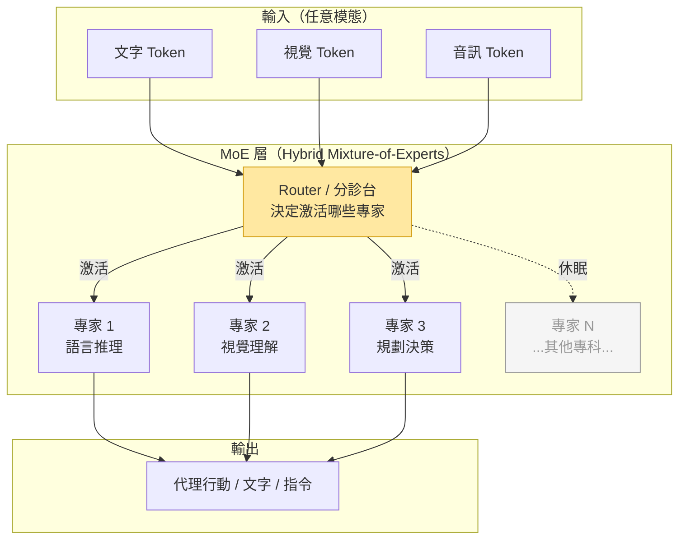

# NVIDIA Nemotron 3：混合專家架構代理模型入門

> [!abstract] 一句話理解
> 這是一個用來「以最少的計算資源運行最強代理 AI 能力」的開源模型家族，特別之處在於它採用混合專家（Mixture-of-Experts）架構讓模型「總參數大但每次只激活少數」，並是首個同時釋出完整訓練資料集與強化學習環境的代理 AI 開源生態系統。

## 🎯 為什麼重要

**它解決了什麼問題？**

建構高效的代理 AI（Agentic AI）面臨兩個根本矛盾：

**矛盾一：能力 vs 效率的拉鋸**

強大的 AI 代理需要複雜的推理能力，這通常需要大型模型。但大型模型消耗大量計算資源，在推論時速度慢、成本高——尤其是當多個代理並行協作時，這個問題被放大。Nemotron 3 的混合專家架構試圖打破這個拉鋸：一個 300 億參數的模型，每次推論只激活 30 億，在維持高能力的同時大幅提升效率。

**矛盾二：模型 vs 訓練生態的缺口**

過去，開源模型的發布通常只包含模型權重（weights），但要真正訓練一個高性能代理 AI，還需要：高品質的訓練資料、與代理任務相匹配的強化學習環境、以及相應的 RL 函式庫。NVIDIA Nemotron 3 首次以完整套件形式提供這三樣——打破了「有模型但沒有訓練基礎設施」的開源困境。

**為什麼 NVIDIA 做這個？**

NVIDIA 是 GPU 晶片的最大供應商。開源一個完整的代理 AI 訓練生態，意味著所有想要訓練、微調 Nemotron 3 的開發者，都需要大量 NVIDIA GPU——這是一個「生態系統鎖定（ecosystem lock-in）」的戰略，類似 Android 的開源策略。

## 🧠 入門解說（用類比理解）

**混合專家（MoE）架構：用「醫院分診制度」理解**

想像一家醫院有 300 位醫生，各有不同的專科（心臟科、神經科、骨科等）。

**傳統大型語言模型（Dense Model）**：
每次有病人來，所有 300 位醫生都要起來，一起討論診斷。資源浪費且效率低下。

**混合專家模型（MoE，如 Nemotron 3 Nano Omni）**：
醫院有一個「分診台（Routing Mechanism）」。病人來了，分診台快速判斷這個病人需要哪幾位專科醫生（比如 3 位），只叫這 3 位起來診療。其他醫生繼續休息。結果：同樣 300 位醫生的醫院，服務效率提升 4 倍。

Nemotron 3 Nano Omni 就是這個邏輯：
- 300 億參數 = 300 位醫生（完整的知識庫）
- 每次激活 30 億 = 只叫 3-4 位相關專科醫生（高效計算）
- 分診台 = Router 機制（決定這個 token 應該由哪些「專家」處理）

**多模態統一（Omni）：用「全科翻譯官」理解**

普通翻譯官只能翻一種語言。Nemotron 3 Nano Omni 是一個「全科翻譯官」：他同時懂視覺語言（看圖）、聽覺語言（聽音訊）、自然語言（讀文字），能無縫在這三種語言之間切換和整合，輸出統一的理解和行動指令。

## 🔑 重點原理

1. **混合專家架構（Mixture-of-Experts, MoE）**：模型由許多「專家子網絡（expert sub-networks）」組成，每個 token 在推論時只激活一小部分專家。NVIDIA 的版本是「混合式」MoE（Hybrid MoE），結合了稠密層（dense layers）和稀疏 MoE 層，在效率和能力之間取得平衡。Nemotron 3 Nano Omni 的 300B/30B 比例（10:1）顯示了這種架構的核心特性：參數量大但計算量低。

2. **多模態統一（Multimodal Unification）**：將視覺、音訊、語言三個模態整合到單一模型中，而非用三個獨立模型再做融合。這需要設計一個能夠跨模態對齊的訓練目標，通常通過大規模多模態資料的預訓練實現。

3. **代理優先設計（Agent-First Design）**：Nemotron 3 的訓練目標不是「生成文字」，而是「在複雜多步驟代理任務中做出正確決策和行動」。這意味著訓練資料和 RL 環境都針對代理場景（工具使用、多步驟規劃、錯誤恢復）進行了優化。

4. **完整開源生態（Full Open-Source Ecosystem）**：NVIDIA 同時釋出模型權重 + 訓練資料集 + RL 環境 + RL 函式庫。訓練資料集專為代理任務設計（包含工具調用軌跡、多步驟推理過程等）；RL 環境提供了代理訓練的模擬器；RL 函式庫提供現成的 RLVR/PPO 等訓練工具。

5. **NVIDIA 硬體深度優化（Hardware-Specific Optimization）**：Nemotron 3 對 NVIDIA RTX PC 和 DGX Sparks 等硬體進行了深度優化，確保在這些硬體上的最優性能。這不只是模型設計，還包括 CUDA 核心、NVLink、高頻寬記憶體等底層優化。

## 📊 視覺化說明

### 混合專家（MoE）架構流程

### Nemotron 3 家族比較

| 維度 | Nano Omni | Super | Ultra |
|---|---|---|---|
| **總參數** | 300 億 | 1,200 億 | 未公布 |
| **激活參數** | 30 億 | 120 億 | 未公布 |
| **激活比例** | 10% | 10% | — |
| **吞吐量提升** | 4x（vs Nano 2） | 5x（vs 前代） | 最高 |
| **多模態** | ✅（視覺+音訊+語言） | ❓ | ❓ |
| **部署場景** | 邊緣端（RTX PC）| 資料中心 | 資料中心 |
| **核心優勢** | 效率 + 多模態 | 吞吐量 + 推理 | 最高精度 |

## 🔍 與既有技術的差異

**vs. Meta LLaMA 3.2 / Llama 4**

LLaMA 是目前最廣泛部署的開源 LLM，但：
- LLaMA 主要是密集（Dense）架構；Nemotron 3 採用 MoE，在相同性能下計算更高效
- LLaMA 開源了模型權重；Nemotron 3 額外釋出訓練資料集和 RL 環境
- LLaMA 是通用模型；Nemotron 3 是代理任務專門優化

**vs. Mistral Mixtral（MoE 開源先驅）**

Mistral 的 Mixtral 系列是開源 MoE 的先行者。差別在於：
- Mixtral 是語言模型；Nemotron 3 Nano Omni 是多模態模型
- Mistral 更側重推理效率；Nemotron 3 更側重代理任務
- Nemotron 3 針對 NVIDIA 硬體深度優化；Mixtral 是硬體無關的

**vs. Google Gemma 3（另一開源多模態模型）**

Google 的 Gemma 3 也是開源多模態模型。差別在於：
- Gemma 3 是 Google 生態的開源延伸；Nemotron 3 是 NVIDIA 生態的核心產品
- 訓練生態的完整度：NVIDIA 提供更完整的代理訓練套件

## 📚 關鍵詞對照表

| 中文 | 英文 | 簡短解釋 |
|---|---|---|
| 混合專家 | Mixture-of-Experts (MoE) | 每個 token 只激活部分「專家子網絡」的稀疏架構，提高計算效率 |
| 激活參數 | Active Parameters | 每次推論時實際計算的參數量（MoE 中遠少於總參數量） |
| 稀疏架構 | Sparse Architecture | 對於每個輸入只激活部分網絡的模型設計，對比每次都用全部參數的稠密架構 |
| 路由機制 | Router / Routing Mechanism | MoE 中決定每個 token 由哪些「專家」處理的組件 |
| 視覺-語言-動作模型 | VLA Model | 整合視覺感知、語言理解和動作輸出的多模態代理模型 |
| 代理優先設計 | Agent-First Design | 以代理任務（多步驟規劃、工具使用）為核心訓練目標的模型設計理念 |
| 強化學習環境 | RL Environment | 用於訓練代理 AI 的模擬環境，代理在其中執行任務並獲得獎勵反饋 |
| 邊緣部署 | Edge Deployment | 在本地設備（如個人電腦）而非雲端伺服器上運行 AI 模型 |

## 🛠️ 可能的應用場景

1. **本地端 AI 代理（RTX PC）**：在個人電腦上運行具備視覺和語言能力的自主代理，不需依賴雲端 API，適合對隱私有要求的企業或個人
2. **工業機器人控制**：Nano Omni 的多模態能力（視覺+語言）可用於工業機器人的感知-推理-行動鏈路，在製造業自動化中扮演「通用感知大腦」的角色
3. **企業私有代理系統**：使用完整的開源生態，企業可以在自己的資料中心部署並微調 Nemotron 3，建構完全掌控的私有代理系統
4. **多代理協作研究**：Nemotron 3 的 RL 環境可用於研究多個 AI 代理如何協作完成複雜任務，是學術研究的重要基礎設施
5. **AI PC 應用開發**：針對 NVIDIA RTX PC 優化的特性，讓應用開發者可以構建在消費級硬體上流暢運行的 AI 代理應用

## 📖 學習路徑建議

1. **先讀**：Transformer 基礎（注意力機制、自回歸生成）——理解現代 LLM 的底層架構
2. **先讀**：Mixture-of-Experts 入門（推薦：Switch Transformer 論文或相關教學）——理解稀疏計算的核心概念
3. **再讀**：Nemotron 3 技術報告（NVIDIA Research）——了解具體實現細節
4. **進階**：RLHF / RLVR 訓練方法——理解如何用強化學習讓模型學習代理行為
5. **進階**：多代理系統框架（如 AutoGen、CrewAI）——了解如何用 Nemotron 3 建構多代理系統

## 🔗 延伸閱讀
- 原文連結：[NVIDIA Newsroom - Nemotron 3 發布](https://nvidianews.nvidia.com/news/nvidia-debuts-nemotron-3-family-of-open-models)
- 對應新聞筆記：[[2026-05-25-NVIDIA Nemotron 3 開源多模態代理模型發布]]
- 相關論文：Switch Transformer (2021) — MoE 在 LLM 中的早期應用
- 相關論文：Mixtral of Experts (2024) — 開源 MoE 的重要里程碑
- 相關教學：[NVIDIA Nemotron 研究頁面](https://research.nvidia.com/labs/nemotron/Nemotron-3/)

---
*由 Claude 自動整理於 2026-05-25*
