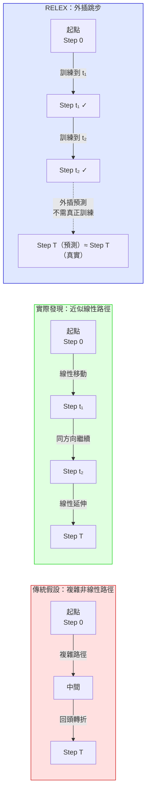

# RLVR 訓練線性特徵與 RELEX 外插方法

> [!abstract] 一句話理解
> 這是一個關於「LLM 在強化學習訓練中如何演化」的重要發現：LLM 在 RLVR 訓練中呈現出驚人的線性演化規律（模型參數沿固定方向線性移動），特別之處在於這個發現衍生出 RELEX 方法，可以用外插跳過大量「非資訊性」訓練步驟，以大幅降低訓練成本同時維持相當的模型性能。

## 🎯 為什麼重要

**它解決了什麼問題？**

訓練高性能 AI 模型的成本極為昂貴。以數學推理為例，訓練一個能解答競賽數學題的 LLM（如 DeepSeek-R1）需要大量的 GPU 小時與電力。RLVR 訓練——用可驗證的獎勵訊號（如答案是否正確）進行強化學習——是提升推理能力最有效的方法之一，但也非常昂貴。

**現有的理解問題**：

我們知道 RLVR 訓練「有效」，但我們一直不清楚它「為什麼有效」，以及訓練過程中模型到底在做什麼。這個「黑盒子」問題導致了幾個實際困難：

1. **計算浪費**：不知道哪些訓練步驟是關鍵的，哪些是「跑完但沒貢獻」的——只能全部跑完
2. **超參數調整困難**：不知道訓練動態，很難判斷什麼時候停止訓練（早停 vs 過度訓練）
3. **可解釋性缺失**：無法向客戶或監管者解釋「模型為什麼在這個訓練步驟之後變得更好」

這篇論文的核心貢獻就是**打開了 RLVR 訓練的黑盒子**：揭示了訓練動態的線性結構，並利用這個結構設計了更高效的訓練方法（RELEX）。

## 🧠 入門解說（用類比理解）

**用「爬山路線」理解 RLVR 訓練線性特徵**

想像 LLM 訓練是在一座高維山脈中爬山，目標是找到「最高點」（最佳模型性能）。

**傳統假設（我們之前的想像）**：
爬山的路徑會非常複雜——左轉右彎、有時候往回走，有時候爬上去再滑下來，整體路徑是曲折的三維迷宮。在這種情況下，你必須每一步都小心走，因為你不知道下一步往哪邊走最好。

**實際發現（論文的核心）**：
RLVR 訓練的爬山路徑，其實是一條**近乎直線的斜坡**。從起點到終點，模型參數幾乎沿著同一個方向線性移動，沒有複雜的回頭和迂迴。

**RELEX 的比喻**：
如果路徑是直線，你只需要：
1. 在直線上找幾個「里程碑」點（早期的訓練檢查點）
2. 用這幾個點的位置和方向，**預測**哪裡是 100 步後的位置
3. 直接跳到那裡，不需要走完每一步

這就是 RELEX 的核心邏輯——利用線性規律，從早期訓練狀態**外插**（extrapolate）出未來的模型狀態，跳過大量中間步驟。

## 🔑 重點原理

1. **RLVR（可驗證獎勵強化學習）的基本概念**：在訓練 LLM 進行數學推理時，我們無法用「人工評分」每個答案（太慢太貴），但可以用「程式自動驗算答案是否正確」作為獎勵信號。RLVR 就是這個想法的實現：模型嘗試解題 → 自動驗算 → 答對得正獎勵、答錯得負獎勵 → 模型調整參數 → 循環。

2. **線性演化特徵（Linear Evolution）**：論文的核心發現：在 RLVR 訓練過程中，模型的演化是「強線性的（strongly linear）」——無論是模型權重的變化，還是模型對各個 token 的輸出機率（log-probability）的變化，都與訓練步驟數呈高度線性相關。換句話說，第 T 步的模型狀態 ≈ 第 0 步模型狀態 + T × 固定方向向量。

3. **低秩特徵（Low-Rank Property）**：線性演化發生在一個低維子空間中。這意味著雖然 LLM 有數十億個參數，但 RLVR 訓練實際上只在一個低維的「方向」上移動，大部分的參數維度幾乎不動。這個低秩性質與 LoRA（低秩適應微調）的成功有深層的理論呼應。

4. **非資訊性步驟（Non-Informative Steps）**：論文標題「Not All Steps are Informative」揭示：在線性演化的框架下，很多訓練步驟的「信息量」極低——它們只是讓模型在已知方向上移動了微小一步。識別並跳過這些步驟，是 RELEX 方法的核心。

5. **RELEX 外插方法（REinforcement Learning EXtrapolation）**：基於線性演化，RELEX 用幾個早期訓練檢查點擬合線性趨勢，然後外插出未來的模型狀態。技術上類似「線性預測（linear prediction）」或「動量法（momentum method）」，但應用場景是 RL 訓練的跳步加速。

## 📊 視覺化說明

### RLVR 訓練線性特徵的直觀展示

### RLVR vs RLHF vs 其他訓練方法比較

| 維度 | 監督微調（SFT） | RLHF | RLVR |
|---|---|---|---|
| **獎勵來源** | 標準答案 | 人類評分 | 自動驗算（程式/形式驗證） |
| **適用場景** | 通用能力 | 語言品質/安全性 | 數學/程式碼/形式推理 |
| **擴展性** | 需大量標注資料 | 需大量人工評分 | 可自動化擴展 |
| **訓練成本** | 中 | 高（人工成本） | 中-高（GPU 時間） |
| **線性演化特徵** | 無系統性研究 | 無系統性研究 | **本論文發現有！** |
| **RELEX 適用** | 未知 | 未知 | **已驗證可加速** |

## 🔍 與既有技術的差異

**vs. LoRA（低秩適應微調）**

LoRA 是一種高效微調技術，核心假設是「模型更新矩陣具有低秩特性」。本論文的發現在某種程度上是 LoRA 假設的 RLVR 版本驗證：不只是微調，連強化學習訓練的動態也表現出低秩線性特徵。兩者的連接是：如果 RLVR 訓練在低秩子空間中線性演化，那麼 LoRA 可能是 RLVR 訓練的一個高效代替或加速器。

**vs. 課程學習（Curriculum Learning）**

課程學習通過精心設計訓練資料的難度順序來提升效率。RELEX 的思路不同：不是改變訓練順序，而是「跳過」已知不重要的步驟。兩者可以組合使用。

**vs. 知識蒸餾（Knowledge Distillation）**

知識蒸餾用大模型的輸出訓練小模型，是模型壓縮的主流方法。RELEX 不壓縮模型，而是壓縮訓練過程。如果 RELEX 可以大幅減少到達某一性能水準所需的訓練步驟，它本質上是「訓練效率的知識蒸餾」——用早期檢查點的知識，「提前」獲得後期模型的能力。

## 📚 關鍵詞對照表

| 中文 | 英文 | 簡短解釋 |
|---|---|---|
| 可驗證獎勵強化學習 | RLVR (Reinforcement Learning with Verifiable Rewards) | 用自動驗算系統（而非人工評分）作為獎勵訊號的 LLM 強化學習方法 |
| 線性演化 | Linear Evolution | 模型在訓練過程中沿固定方向線性移動的動態特性 |
| 低秩特徵 | Low-Rank Property | 訓練更新集中在參數空間的低維子空間中的特性 |
| 非資訊性步驟 | Non-Informative Steps | 對模型性能提升貢獻極小的訓練步驟，是計算浪費的主要來源 |
| 外插 | Extrapolation | 用已知趨勢預測未知點的方法，在 RELEX 中用早期訓練點預測未來模型狀態 |
| 訓練檢查點 | Training Checkpoint | 訓練過程中保存的模型狀態快照，RELEX 從這些點進行外插 |
| 參數軌跡 | Parameter Trajectory | 模型參數在整個訓練過程中的變化路徑 |
| 結果驗證強化學習 | Outcome-only RL | 只在最終結果正確時給予獎勵的 RL 變體，RLVR 的常見實作方式 |

## 🛠️ 可能的應用場景

1. **降低小公司/學術機構的 RLVR 訓練門檻**：RELEX 如果能顯著減少計算步驟，將使中小型組織也能負擔得起 RLVR 訓練，而不只是 OpenAI、Google 等資源豐富的機構
2. **快速實驗迭代**：研究者可以用 RELEX 快速預測「如果繼續訓練 N 步，模型會是什麼水準」，大幅加速超參數和架構的探索
3. **訓練監控和早停優化**：線性演化特徵可用於更精準的訓練監控——偏離線性趨勢可能是過度訓練或訓練異常的信號
4. **模型版本插值**：如果知道兩個訓練檢查點之間是線性演化，可以在不實際訓練的情況下生成中間版本的模型
5. **強化學習訓練理論研究**：這個發現為 LLM RL 訓練動態的理論研究開啟了新方向，可能導致對 RLHF 等其他 RL 方法的類似分析

## 📖 學習路徑建議

1. **先讀**：強化學習基礎（Q-learning、策略梯度、PPO）——理解 RL 的基本概念和訓練流程
2. **先讀**：InstructGPT 論文（RLHF 的標誌性工作）——了解 RL 在 LLM 中的最早大規模應用
3. **先讀**：DeepSeek-R1 或 OpenAI o1 的技術報告——理解 RLVR 在實際強大推理模型中的角色
4. **再讀**：本論文（arXiv 2601.04537）——閱讀線性演化發現和 RELEX 方法的完整描述
5. **進階**：LoRA 論文（Low-Rank Adaptation）——深入理解 LLM 更新的低秩本質，與本論文發現的理論聯繫

## 🔗 延伸閱讀
- 原文連結：[arXiv 2601.04537 - Not All Steps are Informative](https://arxiv.org/pdf/2601.04537)
- 對應新聞筆記：[[2026-05-25-RLVR訓練線性特徵LLM強化學習新發現]]
- 相關論文：[RLVR 與安全性（arXiv 2511.21050）](https://arxiv.org/pdf/2511.21050)
- 相關論文：[強化學習激勵正確推理（OpenReview）](https://openreview.net/forum?id=jGbRWwIidy)
- 相關概念：LoRA（Low-Rank Adaptation for LLMs）— Hu et al., 2021

---
*由 Claude 自動整理於 2026-05-25*
