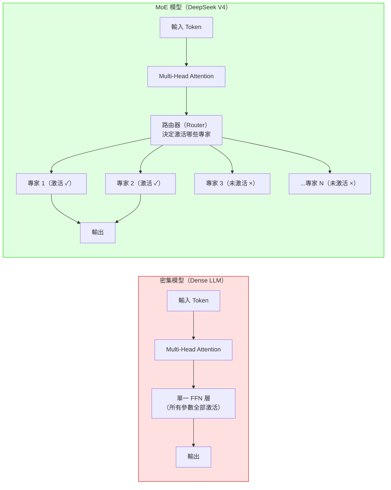

# DeepSeek V4 MoE 架構與 CAISI 評測方法

> [!abstract] 一句話理解
> 這是一個關於「如何同時讓大型語言模型更強大、更省錢」的架構——DeepSeek V4 使用 MoE（混合專家）架構讓 1.6 兆參數的超大模型在推理時只激活 490 億個參數，特別之處在於它讓「超大模型的實力」與「小模型的推理成本」在同一個系統中並存，使中國開源模型首次在數學競賽領域達到接近美國前沿的水準，同時在成本效益上超越大多數美國同等模型。

## 🎯 為什麼重要

**它解決了什麼問題？**

訓練和運行超大型語言模型（LLM）面臨一個基本矛盾：模型越大越聰明，但推理成本也越高。如果一個 1.6 兆參數的模型在回答每個問題時都必須全部激活，那麼每次 API 調用的計算成本將是天文數字，大多數企業根本用不起。

**舊的解法不夠好**：
- 用小模型：成本低，但能力差，無法完成複雜任務
- 用密集大模型（如 GPT-5.5）：能力強，但成本高，且必須完全托管在大公司雲端
- 蒸餾：用大模型教小模型，但蒸餾過的小模型能力仍有限

**MoE 的突破**：
MoE（Mixture of Experts，混合專家）讓一個「名義上的大模型」在每次推理時只調用其中一小部分「專家」（子網路），既保留了大模型的整體知識容量，又將實際推理計算成本壓縮到小模型的水準。DeepSeek V4 Pro 就是這個思路的極端應用：1.6 兆總參數，但每次推理只激活 490 億個參數（約 3%）。

NIST CAISI 的評測使這個選擇的效果有了可信的第三方驗證：DeepSeek V4 在性能上接近 GPT-5（8 個月前的美國前沿），但在成本效益上超越大多數美國競品——這正是 MoE 架構期望達到的目標。

## 🧠 入門解說（用類比理解）

**用「醫院分診制度」理解 MoE**

想像一間有 1,000 位醫生的超大型醫院，每位醫生都是不同領域的專家。

**傳統密集模型（Dense Model）的比喻**：
每個病人來了，所有 1,000 位醫生都要參與會診。這樣每個病人都能得到最全面的意見，但醫院幾乎無法同時看診，且成本極高。

**MoE 架構的比喻**：
醫院設有一個「分診專家系統」，每個病人進來，系統根據症狀快速判斷，只召集最相關的 3-5 位專家會診。大多數時候，這 3-5 位專家就足夠解決問題；面對罕見複雜病症時，系統會召集更多專家。

醫院的整體「知識儲量」（1,000 位醫生的總知識）並沒有減少，但每次看診的實際成本大幅降低。

**DeepSeek V4 Pro 的 MoE 數字**：
- 「醫院總醫生數（Specialist）」= 1.6 兆參數（知識容量）
- 「每次看診召集人數（Active Parameters）」= 490 億參數（實際推理成本）
- 激活比例 ≈ 3%

這意味著 DeepSeek V4 Pro 的推理計算量，約等於一個 490 億參數的「普通」密集模型——而不是 1.6 兆的超大模型。

## 🔑 重點原理

1. **MoE（混合專家）架構的核心**：MoE 模型在 Transformer 的 FFN 層（前饋神經網路）中，用多個平行的「專家子網路（Expert Networks）」取代傳統的單一 FFN 層。每次前向傳播，一個小型「路由器（Router）」根據輸入決定激活哪些專家（通常 2-8 個）。未被激活的專家的參數在本次計算中完全不參與，因此計算量大幅降低。

2. **稀疏性（Sparsity）帶來效率**：因為大多數參數在任何給定的前向傳播中都不激活，MoE 模型的推理算力（FLOPs）比同參數量的密集模型低得多。DeepSeek V4 Pro 的 1.6T/490B 比例（約 3.06% 激活率）是業界少見的極致稀疏設計，換來的是極低的推理成本。

3. **DeepSeek V4 的兩個版本差異**：V4 Pro（1.6T 總 / 49B 激活）適合高精度任務；V4 Flash（284B 總 / 13B 激活）以更低成本提供更快速的回應，適合高吞吐量場景。兩者均支援 1M Token 上下文視窗，這對處理大型程式碼庫或長文件有重要意義。

4. **CAISI 評測的特殊性**：NIST 的 CAISI（AI 標準與創新中心）使用了「非公開 benchmark」進行評測——這些測試題目不在模型的可能訓練集中，因此能更真實地反映模型的泛化能力，而非記憶能力。這是 CAISI 評測比一般公開排行榜更具公信力的關鍵原因。

5. **中美差距的「分科目地圖」**：8 個月的整體落差掩蓋了一個更細緻的事實：差距在不同科目中分布非常不均。網路安全（32% vs 71%）和代理推理（44% vs 78%）差距最大；而數學競賽（96-97%）幾乎與美國前沿持平。這意味著特定用途（數學、STEM 計算、成本敏感應用）選擇 DeepSeek V4 是合理的，但在需要自主推理和網路安全判斷的場景仍應謹慎。

## 📊 視覺化說明

### MoE 架構 vs 密集架構對比

### DeepSeek V4 Pro CAISI 評測結果比較

| 評測領域 | DeepSeek V4 Pro | GPT-5.5（美國前沿） | 差距 | 解讀 |
|---|---|---|---|---|
| 網路安全（Cyber） | 32% | 71% | -39% | 差距最大，不適用高安全場景 |
| 抽象推理 | 46% | 79% | -33% | 複雜推理仍顯不足 |
| 代理軟體工程 | 44% | 78% | -34% | 自主編程能力有限 |
| 數學（AIME-2025） | 97% | ~97-99% | ≈0% | 幾乎持平 |
| 數學（PUMaC 2024） | 96% | — | 接近頂尖 | 競賽數學強項 |
| 成本效益（vs GPT-5.4 mini） | 5/7 基準勝出 | — | 優 | 性價比出色 |

## 🔍 與既有技術的差異

**vs. 傳統密集 LLM（GPT-4、Claude 3 Opus 等）**
密集模型每次推理激活所有參數，成本與模型規模成正比。MoE 讓「知識容量」和「推理成本」解耦，在相近的推理成本下，MoE 模型可以儲存更多知識（更大的名義參數量），理論上能解決更複雜的問題。

**vs. LoRA 微調的低秩特性**
LoRA（低秩適應）和 MoE 的目標不同：LoRA 是在微調時減少更新的參數量（訓練效率），MoE 是在推理時減少激活的參數量（推理效率）。但兩者都利用了「LLM 的工作並不需要全部參數同時參與」這一個共同洞察。

**vs. 模型蒸餾（Knowledge Distillation）**
蒸餾是用大模型訓練一個真正更小的模型；MoE 是讓大模型在推理時「表現得像」小模型。蒸餾後的小模型知識有損失；MoE 的知識完整儲存在所有專家中，只是每次只動用部分。

## 📚 關鍵詞對照表

| 中文 | 英文 | 簡短解釋 |
|---|---|---|
| 混合專家 | Mixture of Experts (MoE) | 用多個並行子網路替代單一 FFN 層，每次只激活部分 |
| 路由器 | Router / Gating Network | 決定哪些專家被激活的小型分類網路 |
| 激活參數 | Active Parameters | 每次推理時真正參與計算的參數數量 |
| 稀疏激活 | Sparse Activation | MoE 的核心特性：大多數參數在任意推理中不被使用 |
| 密集模型 | Dense Model | 傳統 LLM，所有參數每次都參與計算 |
| CAISI | Center for AI Standards and Innovation | NIST 旗下 AI 評測中心，使用含非公開基準的評測方法 |
| 非公開基準 | Non-Public Benchmarks | 不對外公開、難以被訓練集污染的評測題目 |
| 計算飛翔次數 | FLOPs (Floating Point Operations) | 衡量模型計算量的標準指標，MoE 的推理 FLOPs 遠低於同規模密集模型 |

## 🛠️ 可能的應用場景

1. **成本敏感型 API 服務**：企業構建需要大量 LLM API 調用的應用（如客服、文件處理），DeepSeek V4 Flash 的低成本特性可大幅降低運營費用
2. **數學、STEM 計算輔助**：研究機構、教育平台、工程計算場景中，DeepSeek V4 的數學推理能力接近頂尖，且成本遠低於 GPT-5.5
3. **本地部署私有化**：DeepSeek V4 作為開源模型可以自行部署，適合有強烈資料隱私需求、不願將資料傳至外部 API 的企業
4. **中美 AI 技術對比研究**：CAISI 的分科目評測框架為研究中美 AI 差距的研究者提供了一個細緻的分析框架，而非粗略的「總分差距」
5. **AI 評測方法研究**：CAISI 使用非公開 benchmark 的做法為更可靠的 LLM 評測方法提供了參考——如何設計難以被訓練集污染的測試是評測研究的核心問題

## 📖 學習路徑建議

1. **先讀**：Transformer 基礎架構（Attention Is All You Need, Vaswani et al.）——理解 FFN 層在 Transformer 中的角色，才能理解 MoE 對哪個部分做了替換
2. **先讀**：Switch Transformer 論文（Fedus et al., Google, 2021）——第一個大規模 MoE LLM，奠定現代 MoE LLM 的基礎設計原則
3. **再讀**：DeepSeek-V2 技術報告——了解 DeepSeek V4 的前身在 MoE 設計上的演進
4. **再讀**：本次 NIST CAISI 評測報告——理解如何用分科目評測框架系統性分析 LLM 能力差距
5. **進階**：Mixtral（Mistral AI）和 Qwen MoE 系列——比較不同 MoE 實現的設計選擇差異

## 🔗 延伸閱讀
- 原文連結：[NIST CAISI DeepSeek V4 Pro 評測](https://www.nist.gov/news-events/news/2026/05/caisi-evaluation-deepseek-v4-pro)
- 對應新聞筆記：[[2026-05-26-DeepSeek V4 Pro NIST CAISI評測落後美國前沿八個月]]
- Switch Transformer 論文（MoE LLM 的奠基之作）：https://arxiv.org/abs/2101.03961
- DeepSeek 技術部落格：https://www.deepseek.com/
- Artificial Analysis DeepSeek V4 性能分析：https://artificialanalysis.ai/models/deepseek-v4-pro

---
*由 Claude 自動整理於 2026-05-26*
