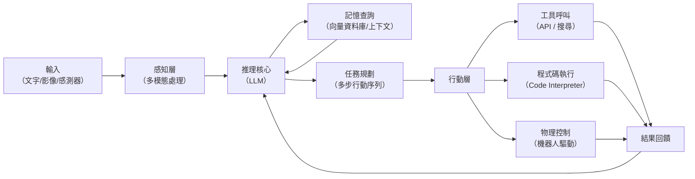

# LLM 代理系統分類框架與工業應用

> [!abstract] 一句話理解
> 這是一個用來「讓 AI 不只是回答問題，而是主動執行任務」的系統框架，特別之處在於以 LLM 作為「大腦」取代傳統規則和程式，使代理系統得以在不預先設計每個場景的情況下，靈活應對客服、編程、製造、醫療等六大工業場景中的複雜任務。

## 🎯 為什麼重要

**它解決了什麼問題？**

傳統的「AI 自動化」系統（如工業機器人、聊天機器人、推薦系統）有一個根本限制：它們必須被明確編程，每種情境都需要工程師提前設計規則。當遇到「規則沒有覆蓋到的情況」時，系統就失效或需要人工介入。

**舊方法的三個核心不足**：
1. **僵硬性**：新情境需要重新設計規則，維護成本高
2. **缺乏跨域能力**：處理客服的 AI 無法同時做資料分析
3. **自然語言壁壘**：大多數系統無法真正理解人類的自然語言指令

**LLM 代理系統的突破**：
當 LLM 作為代理系統的「推理核心」時，它帶來了：
- 對任意自然語言指令的理解能力
- 跨域泛化：同一個基礎模型可以被引導去做完全不同的任務
- 計劃與多步推理：「先做 A，根據 A 的結果再決定做 B 還是 C」
- 工具調用：LLM 可以呼叫外部 API、資料庫、程式碼執行器

論文的貢獻是系統性地整理了這個轉變帶來的新分類框架，以及六大工業場景的具體落地模式。

## 🧠 入門解說（用類比理解）

**用「萬能助理 vs. 工廠機器人」理解 LLM 代理**

**傳統規則型 AI** 像是一台程式化的工廠機器人：
- 它只能做被設計好的動作（焊接 A 點、鑽孔 B 位置）
- 如果工件擺放位置偏了 2 公分，它可能失敗
- 你不能用自然語言告訴它「等一下，先把那個大零件挪開再做」
- 每個新任務都需要重新編程

**LLM 代理** 像是一位有豐富知識、能聽懂指令的人類助理：
- 你說「幫我安排下週的出差行程」，它能自主查航班、訂酒店、加行事曆
- 如果你臨時說「改成搭高鐵」，它能立刻調整計劃
- 同一位助理既能幫你整理文件，也能幫你分析財報
- 它在遇到新情況時，會用常識和知識推理出合適的做法

論文的三類分類框架就是在描述「這位 LLM 助理」可以在哪些環境下工作：純數位世界（軟體型）、真實物理世界（物理型）、或兩者混合（混合型）。

## 🔑 重點原理

1. **LLM 代理的四個核心組件**：現代 LLM 代理系統通常由四個部分組成：**感知層**（接收輸入：文字、影像、感測器資料）、**推理核心**（LLM 負責理解情境和決定下一步行動）、**記憶機制**（短期對話上下文 + 長期向量資料庫）、**行動層**（工具調用：API、搜尋引擎、程式碼執行、機器人驅動）。缺少任何一個組件，代理就無法完成「自主執行複雜任務」的目標。

2. **軟體型代理（Software-Based Agents）**：在純數字環境中運作，是目前最成熟的類型。典型例子：GitHub Copilot Agent（自主完成程式碼功能）、AI 客服代理（自主解決客戶問題）、Perplexity/搜尋代理（自主搜尋和摘要）。關鍵特點是：失敗的代價低（最多輸出錯誤回答），可以快速迭代。

3. **物理型代理（Physical Agents）**：直接操控真實世界物體，安全性要求極高。例子：工廠機械臂（LLM 判斷抓取策略，指令驅動物理動作）、自動駕駛（感知路況，推理決策）。關鍵挑戰：LLM 的推理延遲（通常 0.5-2 秒）可能在即時安全場景中不夠快；幻覺風險在物理場景中可能造成真實損壞。

4. **多模態整合的意義**：LLM 代理的能力邊界取決於它能「感知」什麼類型的輸入。純文字 LLM 只能處理文字資訊；加入視覺後，代理能分析攝影機畫面（製造業品質檢測）、醫療影像（輔助診斷）、使用者介面截圖（自動化測試）；加入結構化表格理解後，代理能直接操作資料庫和財務報表。多模態是擴大代理「感知邊界」的關鍵。

5. **六大工業場景的落地程度差異**：編程（最成熟）→ 客服（成熟）→ 企業搜尋（成熟）→ 法律文件（中等）→ 製造自動化（早期）→ 醫療（嚴格監管，進展謹慎）。這個梯度反映了「任務可驗證性 + 失敗代價 + 監管嚴格程度」的綜合影響。

## 📊 視覺化說明

### LLM 代理系統的工作流程

### 三類代理與六大場景對應

| 代理類型 | 環境 | 典型場景 | 失敗代價 | 成熟度 |
|---|---|---|---|---|
| 軟體型 | 數位空間 | 編程、客服、搜尋、法律文件 | 低（輸出錯誤） | 高 |
| 物理型 | 真實世界 | 製造機器人、倉儲分揀、自動駕駛 | 高（物理損壞） | 低-中 |
| 混合型 | 兩者結合 | 智能工廠（數字孿生+控制）、醫療診斷+輔助手術 | 中-高 | 低 |

## 🔍 與既有技術的差異

**vs. 傳統 RPA（機器人流程自動化）**
RPA 工具（如 UiPath、Automation Anywhere）按照固定腳本執行操作，無法處理「這個按鈕今天變成紅色了，但我還是要點它」這類情境變化。LLM 代理可以「看」介面並推理出正確操作，對介面變化的適應性遠超 RPA。

**vs. 傳統機器學習 Pipeline**
傳統 ML Pipeline（如分類模型、推薦系統）是「訓練好了就固定」的，想做新任務要重新訓練新模型。LLM 代理通過 Prompt 引導可以在無需重新訓練的情況下完成新任務，「少樣本學習（Few-Shot Learning）」讓它能快速適應。

**vs. 單一 LLM 問答（如 ChatGPT 對話）**
單純的 LLM 對話是「單步問答」，你問它回答，它沒有記憶、沒有工具、沒有行動能力。LLM 代理加入了持久記憶、工具調用、多步規劃，讓 LLM 從「顧問」升級為「能幫你做事的助手」。

## 📚 關鍵詞對照表

| 中文 | 英文 | 簡短解釋 |
|---|---|---|
| 大型語言模型代理 | LLM Agent | 以 LLM 為推理核心、能自主執行多步任務的 AI 系統 |
| 工具調用 | Tool Use / Function Calling | LLM 在推理過程中調用外部程式、API 或資料庫 |
| 多模態 | Multi-modal | 同時處理文字、影像、音訊等多種資料類型的能力 |
| 閉環控制 | Closed-Loop Control | 代理執行動作後接收環境反饋，動態調整下一步行動 |
| 幻覺 | Hallucination | LLM 生成聽起來合理但實際上不正確的資訊 |
| 提示注入 | Prompt Injection | 惡意輸入試圖覆蓋 LLM 的原始指令，是代理系統的主要安全威脅 |
| 自適應混合型 | Adaptive Hybrid System | 能在軟體推理模式和物理操作模式之間動態切換的代理系統 |
| 計劃與推理 | Planning and Reasoning | 代理將複雜目標分解為多個子步驟並依次執行的能力 |

## 🛠️ 可能的應用場景

1. **企業客服自動化**：LLM 代理接入 CRM 系統和訂單資料庫，能自主查詢訂單、處理退款、回答複雜問題，而無需人工介入
2. **AI 輔助軟體開發**：代理自主讀取程式碼庫、分析 Bug、撰寫修復程式碼、運行測試、提交 PR，Claude Code 和 GitHub Copilot Agent 已在此場景大規模部署
3. **製造業品質檢測**：多模態代理透過攝影機影像即時識別產品缺陷，並自主判斷是否需要停線或啟動返工流程
4. **智能財務分析**：代理自主讀取財務報表、對照市場資料、生成投資分析報告，無需分析師手動整理資料
5. **個人化學習助理**：教育代理根據學生的測驗結果動態調整出題難度、選擇教學素材、追蹤學習弱點，提供真正個人化的學習體驗

## 📖 學習路徑建議

1. **先讀**：OpenAI 的 Function Calling 官方文件——理解 LLM 如何調用外部工具，是理解代理架構的基礎
2. **先讀**：ReAct 論文（Reasoning + Acting, 2022）——第一個系統性提出 LLM 代理「推理-行動交替」框架的論文，是代理研究的重要里程碑
3. **再讀**：本論文（arXiv 2505.16120）——通讀六大工業應用場景的分析，對照自己的產業尋找最相關的案例
4. **進階**：AutoGPT / BabyAGI 的開源實作——透過真實代碼理解代理系統的技術實作細節
5. **進階**：Anthropic 的 MCP（Model Context Protocol）技術文件——了解當前最受企業採用的代理標準化接口協議

## 🔗 延伸閱讀
- 原文連結：[arXiv 2505.16120 - LLM-Powered AI Agent Systems](https://arxiv.org/abs/2505.16120)
- 對應新聞筆記：[[2026-05-26-LLM驅動AI代理系統工業應用綜述論文]]
- ReAct 論文（推理+行動框架）：https://arxiv.org/abs/2210.03629
- Anthropic MCP 協議文件：https://www.anthropic.com/research/model-context-protocol
- LangChain 代理文件（實作框架）：https://python.langchain.com/docs/how_to/agent_executor/

---
*由 Claude 自動整理於 2026-05-26*
