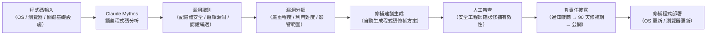

# Claude Mythos 零日漏洞識別與 AI 資安能力

> [!abstract] 一句話理解
> 這是一個用來「讓 AI 自動掃描程式碼中的安全漏洞」的能力突破，特別之處在於 Claude Mythos 能夠透過語義推理理解複雜的多層次安全漏洞（而非只做關鍵字匹配），使其能在幾週內發現人類安全研究員可能要花費數年才能找到的 10,000+ 個零日漏洞。

## 🎯 為什麼重要

**它解決了什麼問題？**

全球軟體的安全漏洞數量遠超人類安全研究員的處理能力。根據業界估算，在全球使用中的所有軟體裡，未被發現的安全漏洞可能多達數百萬個。傳統的軟體安全測試方式有以下根本限制：

**舊方法的三個核心不足：**
1. **人力瓶頸**：頂尖的安全研究員（稱為「Security Researcher」）數量稀缺，且每人每週能深度分析的程式碼量有限
2. **規則匹配的盲點**：傳統靜態分析工具（如 Semgrep、CodeQL）依賴預先定義的漏洞模式（Pattern），只能找到「已知類型」的漏洞，無法識別新型的邏輯漏洞
3. **跨組件理解缺失**：現代軟體漏洞往往跨越多個模組、多個系統調用鏈，傳統工具很難追蹤這種「多步驟」的漏洞路徑

**Claude Mythos 的突破：**
Claude Mythos 作為前沿語言模型，具備對程式碼語義的深層理解能力——它不只是「看到程式碼」，而是「理解程式碼在做什麼以及為什麼這樣做」。這讓它能夠識別那些需要理解業務邏輯和跨組件交互才能發現的複雜漏洞。

## 🧠 入門解說（用類比理解）

**用「建築安全督察 vs AI 安全掃描」理解**

想像一棟 100 層的大樓（等同於一個大型軟體系統）：

**傳統安全審計（人類安全研究員）**：
- 就像派出 3 個人工安全督察，每人負責檢查 33 層樓
- 他們每天只能仔細檢查 1-2 個房間，找出隱藏的結構問題
- 優點：發現的問題通常很精準；缺點：速度極慢，可能錯過其他樓層的問題

**傳統掃描工具（Semgrep/CodeQL）**：
- 就像安裝了一套「已知問題檢查清單」的自動巡邏機器人
- 只要是清單上的問題（如「門鎖品牌 X 有已知漏洞」）它立刻找到
- 優點：速度快；缺點：只找「已知問題」，對清單上沒有的新型問題視而不見

**Claude Mythos（AI 安全分析）**：
- 就像一位具備建築工程師知識的 AI，能理解每個房間的設計目的和結構邏輯
- 它看到「這裡的承重牆設計在地震時可能以特定方式倒塌」這類需要推理才能發現的問題
- 能在幾週內掃描整棟 100 層大樓，同時保持對每個細節的語義理解

## 🔑 重點原理

1. **語義式程式碼分析（Semantic Code Analysis）**：與傳統靜態分析工具不同，Claude Mythos 不是在做「模式匹配」（Pattern Matching），而是在「理解程式碼的意圖」。這意味著它能夠識別那些語法上看起來正確，但在特定執行環境或特定輸入組合下會產生漏洞的程式碼——這類「邏輯漏洞（Logic Vulnerabilities）」是傳統工具最難捕捉的。

2. **零日漏洞（Zero-Day Vulnerability）的定義**：所謂「零日漏洞」是指軟體開發者尚未意識到、因此沒有發布修補程式的安全漏洞。「零日」指的是「開發者有零天的時間準備防禦」。Mythos 發現的 10,000+ 漏洞大部分都是零日——也就是說，這些是從未被人類發現或公開的新漏洞。

3. **跨系統漏洞追蹤（Cross-System Vulnerability Tracing）**：現代安全漏洞往往需要跨越多個系統才能被利用，例如：攻擊者先利用 OS 的一個記憶體問題 → 獲得更高權限 → 再利用瀏覽器的一個渲染問題 → 執行惡意程式碼。Claude Mythos 能夠在長上下文視窗中追蹤這種多步驟的漏洞利用路徑，識別出需要多個組件協同才能觸發的複雜漏洞。

4. **負責任披露（Responsible Disclosure）**：當 AI 工具識別出零日漏洞後，如何處理這些資訊是關鍵的倫理問題。Anthropic 採用「負責任披露」標準：先通知受影響的軟體廠商，提供固定的修補時間（通常 90 天），修補完成後才公開漏洞細節。這與傳統安全研究員的做法一致，但規模遠超人力所能達到的範圍。

5. **AI 資安軍備競賽（AI Security Arms Race）**：Project Glasswing 揭示了一個令人不安的現實：如果 Claude Mythos 能找到這些漏洞，惡意行為者（國家級駭客組織、犯罪集團）使用類似能力的 AI 可能也在做同樣的事。這使得「用 AI 修補漏洞」和「用 AI 發現並利用漏洞」的軍備競賽成為 2026 年最重要的資安議題之一。

## 📊 視覺化說明

### AI 輔助漏洞識別的工作流程

### AI 資安分析方法比較

| 方法 | 覆蓋率 | 精準度 | 速度 | 新型漏洞識別 | 成本 |
|---|---|---|---|---|---|
| 人工 Penetration Test | 低（採樣） | 很高 | 慢 | 強 | 很高 |
| 傳統靜態分析（Semgrep） | 高 | 中（誤報多） | 快 | 弱（只找已知） | 低 |
| 模糊測試（Fuzzing） | 中 | 中 | 中 | 中 | 中 |
| **Claude Mythos AI 分析** | 高 | 高 | 快 | 強 | 中-高 |

## 🔍 與既有技術的差異

**vs. GitHub Copilot 安全建議**
GitHub Copilot 在撰寫程式碼時提供即時的安全警告，但功能聚焦於「防止開發者寫出不安全的程式碼」，而不是「在已存在的龐大程式碼庫中發現深藏的漏洞」。兩者是互補而非競爭的關係。

**vs. Snyk、Veracode 等安全掃描服務**
商業靜態分析服務（如 Snyk）主要依賴已知漏洞資料庫（CVE database）進行比對，對零日漏洞幾乎無能為力。Claude Mythos 的語義推理能力使其能夠識別不在任何漏洞資料庫中的全新漏洞類型。

**vs. 傳統的「Bug Bounty 計劃」**
Bug Bounty 是企業邀請外部白帽駭客找漏洞、付費獎勵的模式。Claude Mythos 代表著「AI 可以自動化大部分的漏洞發現工作」，未來 Bug Bounty 的角色可能轉向「驗證 AI 識別的漏洞是否真的可被利用」。

## 📚 關鍵詞對照表

| 中文 | 英文 | 簡短解釋 |
|---|---|---|
| 零日漏洞 | Zero-Day Vulnerability | 軟體開發者尚未知曉、無修補程式的安全缺陷 |
| 靜態分析 | Static Analysis | 不執行程式碼而直接分析原始碼以找出問題的方法 |
| 語義分析 | Semantic Analysis | 理解程式碼「意圖和含義」而非只分析語法 |
| 滲透測試 | Penetration Testing | 模擬攻擊者行為，主動尋找系統安全漏洞 |
| 負責任披露 | Responsible Disclosure | 先通知廠商修補再公開漏洞的倫理準則 |
| 模式匹配 | Pattern Matching | 通過已知漏洞樣式識別問題（只能找已知類型） |
| 邏輯漏洞 | Logic Vulnerability | 程式碼語法正確，但業務邏輯有安全缺陷 |
| AI 資安軍備競賽 | AI Security Arms Race | AI 用於防禦和攻擊的能力同步提升的競爭態勢 |

## 🛠️ 可能的應用場景

1. **企業程式碼庫安全審計**：大型企業的遺留程式碼（Legacy Code）往往存在大量未被發現的漏洞，AI 掃描可以在不增加安全團隊規模的情況下，快速識別高危問題
2. **開源軟體安全加固**：全球基礎設施依賴 Linux、OpenSSL 等開源軟體，但這些軟體的安全審計資源嚴重不足，AI 輔助可以彌補這一缺口（這正是 Project Glasswing 的核心目標）
3. **雲端服務商安全驗證**：AWS、Azure、GCP 等雲端服務商可以使用 AI 工具持續掃描其平台程式碼，在漏洞被惡意利用前完成修補
4. **金融機構核心系統審計**：銀行的核心交易系統往往年代久遠、程式碼複雜，AI 安全掃描可以幫助識別那些只有在特定條件下才會觸發的高危邏輯漏洞
5. **DevSecOps 整合**：在軟體開發流水線（CI/CD Pipeline）中嵌入 AI 安全掃描，實現「每次程式碼合併都自動進行安全審查」的左移安全（Shift-Left Security）實踐

## 📖 學習路徑建議

1. **先讀**：了解常見的軟體安全漏洞類型（OWASP Top 10 是最佳入門清單），建立對安全漏洞的基本概念
2. **再讀**：閱讀 Anthropic Project Glasswing 更新報告（新聞筆記），了解 Claude Mythos 的實際應用規模和合作夥伴生態
3. **延伸**：了解 GitHub Advanced Security 和 Snyk 的工作原理，理解傳統靜態分析的能力邊界
4. **進階**：閱讀 Google Project Zero 的研究部落格，了解頂尖人類安全研究員如何發現零日漏洞，再對比 AI 的方法

## 🔗 延伸閱讀
- 原文連結：[SiliconANGLE Claude Security 公開測試版](https://siliconangle.com/2026/04/30/anthropic-announces-claude-security-public-beta-find-fix-software-vulnerabilities/)
- 對應新聞筆記：[[2026-05-27-Anthropic Project Glasswing更新Claude Mythos發現萬個零日漏洞]]
- Anthropic Project Glasswing 官方頁面：https://www.anthropic.com/glasswing
- OWASP Top 10（軟體安全漏洞分類）：https://owasp.org/www-project-top-ten/
- Google Project Zero（人類安全研究員的零日研究）：https://googleprojectzero.blogspot.com

---
*由 Claude 自動整理於 2026-05-27*
