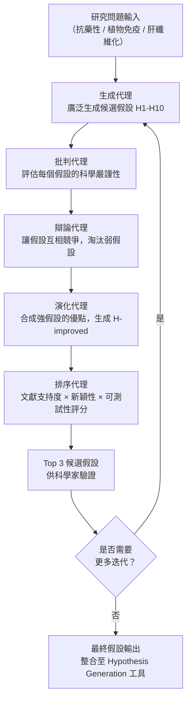

# Google DeepMind Co-Scientist 多代理假設生成架構

> [!abstract] 一句話理解
> 這是一個用來「模擬科學研究團隊集體討論」的多代理 AI 系統，特別之處在於用五種不同角色的 AI 代理（生成、批判、辯論、演化、排序）互相競爭與改進假設，讓 AI 從「單一答案機器」升級為「能提出真正新穎科學想法的思考系統」。

## 🎯 為什麼重要

**它解決了什麼問題？**

科學研究的最大瓶頸之一，是「假設生成（Hypothesis Generation）」——在龐大的現有文獻中，識別真正有價值的、尚未被探索的研究方向。傳統上，這需要頂尖科學家花費數月甚至數年閱讀文獻、建立直覺、再提出假設。

**舊方法的三個核心不足：**
1. **速度瓶頸**：人類科學家每天能深讀的論文有限，跨領域綜合的廣度受限
2. **確認偏誤（Confirmation Bias）**：科學家傾向於提出符合自身既有知識框架的假設，真正突破性的「異類想法」往往被過濾掉
3. **單點失敗**：單一語言模型（如直接問 ChatGPT「給我一個新假設」）容易受到提示詞偏見和模型過度自信的影響，輸出看起來合理但實際上很平庸的假設

**Co-Scientist 的突破：**
透過多代理辯論機制，讓不同角色的 AI 代理互相挑戰彼此的假設，強迫系統輸出能夠「通過批判」的候選假設，而不僅僅是「看起來合理」的假設。這個設計讓 Co-Scientist 能夠跨越現有文獻的邊界，提出真正有新穎性的科學方向。

## 🧠 入門解說（用類比理解）

**用「論文答辯委員會」理解 Co-Scientist**

想像你正在博士論文答辯：

- **你（研究生）** = 生成代理：提出你的研究假設
- **答辯委員 A（方法論專家）** = 批判代理：指出你的研究設計漏洞
- **答辯委員 B（領域專家）** = 辯論代理：用競爭性的假設挑戰你的理論
- **答辯委員 C（綜合者）** = 演化代理：整合不同委員的意見，提出更強的版本
- **委員會主席** = 排序代理：根據所有討論的結果，評判哪個方向最有研究價值

Co-Scientist 就是把這個「人類答辯委員會」的過程，以 AI 代理模擬出來，在幾小時內完成原本需要數月的假設生成和篩選過程。

重要的是：答辯過程本身就是在強化假設的品質——能通過嚴格辯論的假設，才值得進入實驗驗證階段。

## 🔑 重點原理

1. **五代理聯盟架構（Agent Coalition Architecture）**：Co-Scientist 不是一個「聰明的 LLM」，而是由五種角色代理組成的協作系統：生成代理（Generators）廣泛生成候選假設；批判代理（Critics）從科學嚴謹性評估每個假設；辯論代理（Debaters）讓假設互相競爭；演化代理（Evolvers）合成改進版本；排序代理（Rankers）依文獻支持度和可行性給出最終排名。每個代理在同一個 Gemini 模型基礎上，通過不同的提示詞設計和角色框架實現分化。

2. **迭代假設演化（Iterative Hypothesis Evolution）**：Co-Scientist 不是一次性輸出一個假設就結束，而是讓假設在多輪代理互動中不斷被強化。一個初始假設可能在第一輪辯論後被批判代理指出三個弱點，演化代理將其改進後進入第二輪評估，最終得到的假設已經是多輪「自然選擇」的倖存者，品質遠高於單次生成的結果。

3. **對抗式評估（Adversarial Evaluation）**：這是 Co-Scientist 區別於一般 AI 助理的核心機制。辯論代理的設計目的就是「主動找漏洞」——它不試圖支持假設，而是試圖推翻它。這種對抗性設計有效降低了 AI 的過度自信偏見，讓系統只保留真正能抵禦批判的假設。類比於人類科學社群的「同行評審（Peer Review）」制度，但速度快了數千倍。

4. **科學文獻接地（Literature Grounding）**：Co-Scientist 的每個假設都需要與現有科學文獻進行比對驗證，確保假設是「基於現有知識的合理延伸」而非脫離現實的空想。排序代理在評估假設時，會同時考量文獻支持度（有多少現有研究支持相關機制）、新穎性（假設與現有文獻的距離）和可測試性（能否設計實驗驗證）。

5. **領域無關性（Domain Agnosticism）**：Co-Scientist 的架構設計是領域無關的——雖然目前的案例主要集中在生物醫學領域，但相同的多代理框架可以應用於材料科學、藥物設計、氣候科學等任何需要假設生成的研究領域。這是 Gemini 作為基礎模型的跨域知識所賦予的彈性。

## 📊 視覺化說明

### Co-Scientist 的假設生成流程

### Co-Scientist vs 傳統假設生成方式

| 維度 | 人類研究員 | 單一 LLM | Co-Scientist 多代理 |
|---|---|---|---|
| 速度 | 數月 | 數分鐘 | 數小時 |
| 廣度 | 受個人知識範圍限制 | 廣泛但無深度 | 廣泛且有批判深度 |
| 新穎性 | 高（有直覺） | 低（傾向已有框架） | 中-高（對抗式篩選） |
| 可靠性 | 高（有領域直覺） | 低（過度自信） | 中（批判機制降低偏見） |
| 可擴展性 | 低 | 高 | 高 |
| 費用 | 極高（科學家薪資） | 低 | 中（多代理算力） |

## 🔍 與既有技術的差異

**vs. 傳統 AI 文獻助理（如 ResearchRabbit、Semantic Scholar）**
傳統 AI 文獻工具專注於「找到相關論文」，而不是「生成新的研究方向」。Co-Scientist 的目標是跨越現有文獻的邊界，提出文獻中尚未探索的假設——這是兩種完全不同的功能。

**vs. 單一 LLM 問答（如直接詢問 GPT-5.5「給我一個假設」）**
單一 LLM 生成假設的最大問題是「過度自信」和「確認偏誤」——模型傾向於輸出聽起來合理但實際上過度依賴現有框架的假設。Co-Scientist 的多代理辯論機制強迫假設通過對抗式批判，大幅提升假設的真正新穎性。

**vs. AlphaFold（DeepMind 的前代科學 AI）**
AlphaFold 是「解決已知問題（蛋白質結構預測）」的 AI 工具，輸入一個問題、輸出一個答案。Co-Scientist 是「生成新問題（假設）」的 AI 系統，代表 AI 在科學研究中的角色從「執行者」升級為「思考夥伴」。

## 📚 關鍵詞對照表

| 中文 | 英文 | 簡短解釋 |
|---|---|---|
| 假設生成 | Hypothesis Generation | 在科學研究中提出可驗證的新理論或研究方向 |
| 多代理系統 | Multi-Agent System | 多個 AI 代理協作完成單一代理無法高效完成的任務 |
| 確認偏誤 | Confirmation Bias | 傾向於尋找支持自身既有觀點的證據 |
| 對抗式評估 | Adversarial Evaluation | 主動試圖推翻假設以測試其穩健性 |
| 同行評審 | Peer Review | 科學社群對研究成果的集體審查機制 |
| 迭代演化 | Iterative Evolution | 假設在多輪批判-改進循環中逐漸強化的過程 |
| 文獻接地 | Literature Grounding | 確保 AI 生成的假設有現有科學文獻的支持基礎 |

## 🛠️ 可能的應用場景

1. **製藥研發**：在藥物靶點識別階段，Co-Scientist 可以在已知蛋白質-疾病關聯圖譜中，提出尚未探索的新型靶點假設，加速早期藥物發現
2. **材料科學**：生成關於新型電池電解質、高溫超導材料或新型催化劑的結構假設，供材料科學家進行計算模擬驗證
3. **氣候科學**：整合海洋、大氣、生態系統的交叉研究，提出可能影響氣候反饋迴路的新機制假設
4. **企業研發（R&D）部門**：大型製造企業或科技公司可使用類似工具加速內部技術研究，在競爭對手發現前識別新的技術方向
5. **教育與研究訓練**：研究生可以用 Co-Scientist 類型的工具，在確定研究方向時廣泛探索可能性，減少因資訊不足導致的「研究方向誤判」

## 📖 學習路徑建議

1. **先讀**：理解「多代理系統（Multi-Agent Systems）」的基礎概念——可閱讀 AutoGPT 或 LangGraph 的入門文件，了解多個 AI 代理如何協作
2. **再讀**：閱讀 Co-Scientist 的 Nature 原始論文（或 Google DeepMind 部落格的摘要版本），理解五代理框架的具體設計
3. **延伸**：了解 AlphaFold 的發展歷程，理解 DeepMind 如何從「蛋白質結構預測」拓展到「科學假設生成」的戰略路徑
4. **進階**：閱讀「Rethinking the AI Scientist」（arXiv 2601.12542）——更深入討論 AI 作為科學研究夥伴的多代理工作流架構

## 🔗 延伸閱讀
- 原文連結：[Google DeepMind Co-Scientist Blog](https://deepmind.google/blog/co-scientist-a-multi-agent-ai-partner-to-accelerate-research/)
- 對應新聞筆記：[[2026-05-27-Google DeepMind Co-Scientist多代理科研AI登Nature]]
- Rethinking the AI Scientist（相關 arXiv 論文）：https://arxiv.org/pdf/2601.12542
- Google Gemini for Science（工具入口）：https://gemini.google.com/science

---
*由 Claude 自動整理於 2026-05-27*
