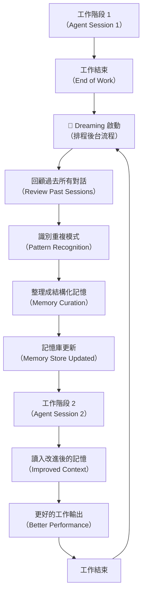

# Claude Opus 4.7 視覺強化與 Dreaming 記憶整合機制

> [!abstract] 一句話理解
> 這是一個用來「讓 AI 代理在工作之間自動學習並改進自己」的機制，特別之處在於模仿人類睡眠期間的記憶鞏固過程，讓 AI 不再每次從零開始，而是能跨工作階段積累洞察——同時配備了更強的視覺能力和多代理協作框架。

## 🎯 為什麼重要

**它解決了什麼問題？**

AI 代理長期以來有一個根本性限制：**「每次工作完成，一切歸零」**。即使一個 AI 代理在某個項目中犯了錯誤、學到了教訓，下次啟動時仍需重新開始，無法利用過去的經驗。

**舊方法的三個核心不足：**

1. **記憶碎片化**：即使有記憶系統，AI 代理也只能記住最近幾輪的對話，無法整合跨工作階段的模式和洞察
2. **無法自我改進**：AI 代理的性能只能通過人工微調（fine-tuning）或提示詞調整來改善，而不是代理自身的「經驗積累」
3. **視覺能力受限**：早期多模態模型的圖像理解受解析度限制，在圖表、UI 截圖、文件掃描等場景中理解精度不足

**Claude Opus 4.7 + Dreaming 的突破：**

Dreaming 機制讓代理在工作間隙執行「排程自我回顧」，系統性地整合過去的經驗，生成更高品質的記憶；而高解析度視覺能力讓代理能更準確地理解圖像中的細節信息，擴大了可處理的任務範圍。

## 🧠 入門解說（用類比理解）

**用「老師批改作文後的反思日記」理解 Dreaming 機制**

想像一位家教老師每天幫學生批改作文：

- **傳統 AI 代理** = 每天都換一個新老師，沒有任何交接。新老師不知道學生常犯哪些錯誤，要重新摸索。
- **Dreaming 機制的代理** = 老師在每天工作結束後，會花時間回顧今天的批改記錄，整理出「這個學生有什麼系統性的寫作弱點」，並把這些觀察整理成一份持續更新的「學生學習檔案」。明天再來，老師直接參考這份檔案，知道應該重點關注哪些問題。

Dreaming 就是這個「晚間反思與整理」的過程，讓 AI 代理能跨工作階段積累知識，而不是每次都從「第一次見面」開始。

**高解析度視覺 = 從「遠視」到「正常視力」**

低解析度視覺的 AI 就像一個遠視的人，看圖表時只能看到大致輪廓，看不清細節數字。Claude Opus 4.7 的視覺升級相當於戴上了正確度數的眼鏡——同樣一張財務報表截圖，現在能清楚看到每一個數字。

## 🔑 重點原理

1. **Dreaming 排程機制（Scheduled Reflection Process）**：Dreaming 是一個在 AI 代理「閒置期」自動觸發的排程流程。代理系統在每次工作階段結束後，啟動一個後台流程，審查過去所有代理工作對話，識別跨工作階段的重複模式（如「用戶偏好特定的程式碼風格」、「某類任務有常見錯誤點」），並將這些洞察整理成結構化記憶，在下次代理啟動時作為上下文提供。這個過程完全自動、無需人工介入，模擬了人類睡眠期間的記憶鞏固（Memory Consolidation）過程。

2. **高解析度圖像理解（Higher-Resolution Image Understanding）**：Claude Opus 4.7 在視覺處理管道上進行了升級，能夠在更高解析度下處理和理解圖像。在實際應用中，這意味著能更準確地：(a) 讀取圖表中的精細數據；(b) 理解 UI 截圖中的界面元素；(c) 解析掃描文件中的手寫或印刷文字；(d) 識別圖像中的細小細節（如電路圖、醫療影像注釋）。

3. **多代理協作架構（Multiagent Orchestration）**：新的協作模式讓一個「主代理（Lead Agent）」能夠將任務分解並委派給多個「子代理（Subagents）」，這些子代理可以在共享檔案系統上並行工作。每個子代理可以配置：(a) 獨立的基礎模型（如不同能力的 Claude 版本）；(b) 專屬的系統提示詞（System Prompt）；(c) 特定的工具集合。這種架構讓複雜任務能被分解為可並行處理的子任務，大幅提升整體執行效率。

4. **自托管沙箱（Self-hosted Sandboxes）**：這是 Claude Managed Agents 的企業安全功能，解決「能力 vs 資安」的長期矛盾。敏感的企業資產（程式碼、文件、資料庫）留在企業自己的基礎設施中，而 AI 代理的「思考和執行循環（Agent Loop）」仍運行在 Anthropic 的基礎設施上。代理透過安全的 API 接觸企業資產，但不直接存取，形成安全隔離層。

5. **Claude Design 的多模態輸出能力**：Claude Opus 4.7 配套的 Claude Design 工具代表 Anthropic 首次進入「視覺輸出」領域。過去 Claude 主要生成文字和程式碼，而 Claude Design 讓 Claude 能夠生成設計稿、原型和視覺文件，是視覺-語言-程式碼三位一體能力的重要補充。

## 📊 視覺化說明

### Dreaming 機制的運作流程

### Claude Opus 4.7 vs 前代功能對比

| 能力維度 | Claude Opus 4.6 | Claude Opus 4.7 |
|---|---|---|
| 視覺解析度 | 標準解析度 | 高解析度（Higher Resolution） |
| 記憶機制 | 工作階段內記憶 | Dreaming 跨工作階段記憶整合 |
| 多代理協作 | 基本 | Multiagent Orchestration（主從代理架構） |
| 企業部署 | 雲端 | 雲端 + 自托管沙箱（Self-hosted Sandboxes） |
| 定價 | $5/$25 per MTok | $5/$25 per MTok（不變） |
| 程式碼能力 | 強 | 更強（軟體工程與長任務） |

## 🔍 與既有技術的差異

**vs. 傳統 RAG（Retrieval-Augmented Generation）**

RAG 是透過「每次查詢時從外部資料庫檢索相關資訊」來擴展模型知識。Dreaming 不同：它是「代理自己整理並更新自身的記憶庫」，知識整合發生在工作結束時，而不是每次查詢時。Dreaming 更接近「長期記憶形成」，RAG 更接近「短期查詢記憶」。

**vs. 傳統 Fine-tuning（微調）**

Fine-tuning 透過更新模型權重來改善性能，但需要大量標記資料和計算資源，且無法針對特定用戶個人化。Dreaming 不更新模型權重，而是在上下文層面（context level）動態整合個人化洞察，速度更快、成本更低、個人化程度更高。

**vs. 傳統單代理系統**

單代理系統中，所有任務由同一個代理序列執行，複雜任務容易超出上下文窗口，也無法並行處理。Multiagent Orchestration 讓任務可被分解並行，且每個子代理可以針對特定任務類型進行優化（如程式碼子代理 vs 搜尋子代理 vs 文件生成子代理）。

## 📚 關鍵詞對照表

| 中文 | 英文 | 簡短解釋 |
|---|---|---|
| 記憶鞏固 | Memory Consolidation | 將短期記憶整合為長期記憶的過程，類似人類睡眠期間的記憶整理 |
| 排程記憶整合 | Dreaming | Anthropic 為 Claude Managed Agents 設計的跨工作階段自動記憶整合機制 |
| 多代理協作 | Multiagent Orchestration | 主代理將任務分解並委派給多個並行子代理執行的架構 |
| 自托管沙箱 | Self-hosted Sandboxes | 企業敏感資料留在自身基礎設施、代理計算運行在服務商端的混合部署模式 |
| 視覺推理 | Visual Reasoning | AI 模型理解和分析圖像內容以輔助決策的能力 |
| 年化速率限制 | Rate Limits | 每單位時間內 API 請求的最大數量限制 |
| 代理循環 | Agent Loop | AI 代理持續感知-思考-行動的執行循環 |

## 🛠️ 可能的應用場景

1. **客戶服務 AI 代理的持續改進**：部署 Dreaming 機制後，客服代理能自動識別哪類問題最常造成誤解，並在下次對話中預先提供更清晰的說明
2. **程式碼審查代理的個人化**：代理能「記住」特定工程師或代碼庫的偏好和常見問題，提供更精準的程式碼審查建議
3. **高解析度文件分析**：法律、財務、醫療領域需要精確讀取文件細節（如合約條款、醫療影像標注），高解析度視覺能力直接提升準確性
4. **跨部門多代理工作流**：企業 ERP 整合場景中，主代理協調財務子代理、供應鏈子代理、HR 子代理並行處理不同面向的業務數據
5. **安全敏感環境的 AI 部署**：金融和醫療機構透過自托管沙箱，將 Claude 的能力引入最敏感的業務環境，同時維持資料安全合規

## 📖 學習路徑建議

1. **先讀**：了解「AI 代理的記憶機制」基礎——特別是短期記憶（Context Window）vs 長期記憶（外部儲存/向量資料庫）的差異，可閱讀 Langchain 或 LlamaIndex 的記憶模組文件
2. **再讀**：閱讀 Anthropic 官方的 Claude Managed Agents 文件，理解 Dreaming 在整體代理架構中的位置
3. **進階**：深入研究人類記憶鞏固的神經科學機制（如 Sharp-wave Ripple Consolidation），理解 Dreaming 命名背後的生物學啟發；閱讀 MemGPT 論文（arXiv:2310.08560）了解 LLM 記憶管理的學術前沿
4. **實作**：使用 Anthropic API 的 Memory 功能建立一個簡單的跨工作階段代理，觀察記憶整合對代理性能的實際影響

## 🔗 延伸閱讀
- 原文連結：[Anthropic Claude May 2026 Release Notes](https://releasebot.io/updates/anthropic/claude)
- 對應新聞筆記：[[2026-05-28-Claude Opus 4.7正式發布視覺與程式碼強化]]
- MemGPT 論文（AI 代理記憶管理）：https://arxiv.org/abs/2310.08560
- Anthropic Claude Managed Agents 文件：https://platform.claude.com/docs

---
*由 Claude 自動整理於 2026-05-28*
