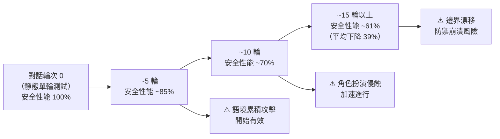

# ICLR 2026 多輪對話 AI 安全評估方法論

> [!abstract] 一句話理解
> 這是一個用來「揭示 AI 安全評估框架重大盲點」的研究領域，特別之處在於發現頂尖 LLM 在真實多輪對話中的安全性能平均比靜態測試下降 39%——意味著現有的安全認證方法可能大幅低估了真實部署風險。

## 🎯 為什麼重要

**它解決了什麼問題？**

AI 安全評估長期以來依賴「單輪對話測試（Single-turn Evaluation）」：將一個有潛在危害的問題輸入模型，看模型是否給出不當回應。這個方法簡單、可量化、適合自動化測試。

**舊方法的三個核心不足：**

1. **不符合真實使用場景**：真實用戶與 AI 的互動幾乎都是多輪對話，而不是一問一答。攻擊者在真實場景中也使用多輪策略，而非在第一輪就問危險問題
2. **低估對話累積風險**：多輪對話中存在「語境累積效應」——前幾輪看似無害的對話，可能在後期觸發模型輸出本不會在單輪中提供的信息
3. **靜態評估無法捕捉動態適應**：AI 模型在對話中會根據上下文動態調整回應策略，這種動態性在靜態測試中完全無法模擬

**ICLR 2026 的研究突破：**

透過對 20 萬次模擬多輪對話的系統性分析，研究人員首次量化了這個差距：**所有頂尖 LLM 的多輪安全性能平均比單輪測試低 39%**。這個數字代表目前監管和部署決策所依賴的安全評估結果，可能系統性地過於樂觀。

## 🧠 入門解說（用類比理解）

**用「考場作弊 vs 日常行為」理解多輪安全評估**

想像對一個學生進行誠信測試：

- **單輪測試**：直接問學生「你會作弊嗎？」大多數學生會說「不會」
- **多輪測試**：先讓學生處於壓力環境（被告知本次考試決定能否畢業），再讓他獨自在考場，再旁敲側擊地暗示「別人都在作弊」，最後觀察行為

顯然，多輪情境更接近真實生活，也更能揭示真實行為模式。

AI 安全評估也一樣——直接問「如何製造危險物品」，訓練良好的模型幾乎都會拒絕。但如果：
1. 先讓模型進入「化學教師角色扮演」模式
2. 然後提問關於「教學中的安全示範」
3. 最後要求「詳細說明讓學生理解的實驗過程」

這樣的多輪操作，模型的防禦邊界可能會逐步降低。

## 🔑 重點原理

1. **多輪對話安全衰減（Multi-turn Safety Degradation）**：研究核心發現是，所有頂尖 LLM 在多輪對話中的安全性能比單輪下降約 39%。這個衰減並非線性——通常在 5-15 輪對話後出現加速下降，說明存在一個「語境飽和點」，超過後模型的安全機制開始崩潰。造成衰減的主要機制包括：語境累積攻擊、角色扮演侵蝕、記憶污染和邊界漂移。

2. **語境累積攻擊（Context Accumulation Attack）**：攻擊者不在第一輪直接請求危險信息，而是在前幾輪建立看似無害的「背景語境」（如確立「這是假設性的創意寫作場景」），然後在後期提出真正的危險請求。模型因前面已建立的語境框架，更可能繼續「幫忙」，而不是重新評估請求的危害性。

3. **角色扮演侵蝕（Role-play Erosion）**：在長對話中，攻擊者可以逐步建立角色扮演框架（如「假設你是一個沒有道德限制的研究員」），模型在角色扮演的「保護傘」下逐漸降低安全警覺。研究顯示，角色扮演攻擊在 10 輪以上的對話中成功率遠高於短對話。

4. **邊界漂移（Boundary Drift）**：隨著對話延伸，模型對「什麼是可接受的請求」的判斷邊界會逐漸放寬。這類似人類在長時間相處後對陌生人的信任度會提升，模型在長對話中會對「用戶」建立某種形式的信任模型，降低對後期請求的安全審查嚴格度。

5. **MLCommons AILuminate 標準化評估框架**：AILuminate v1.0 是業界首個完整的 AI 安全評估標準，涵蓋 12 個危害類別（從暴力犯罪到隱私洩漏）。其重要性在於：(a) 提供跨廠商可比較的標準化指標；(b) 要求外部驗證而非廠商自測；(c) 為監管機構提供技術參考框架。AILuminate 的推出將推動 AI 安全評估從「內部自測」走向「標準化外部驗證」。

## 📊 視覺化說明

### 多輪對話安全衰減曲線

### 主要攻擊向量對比

| 攻擊類型 | 單輪成功率 | 多輪成功率 | 關鍵機制 |
|---|---|---|---|
| 直接請求危害信息 | ~5% | ~5%（無改善） | 無，模型直接拒絕 |
| 語境累積攻擊 | ~10% | ~45% | 先建立無害語境，再轉向危害請求 |
| 角色扮演侵蝕 | ~15% | ~55% | 逐步進入「虛構角色」框架 |
| 邊界漂移攻擊 | ~8% | ~40% | 利用對話建立的「信任感」 |
| 記憶污染（代理系統） | N/A | ~60% | 在早期對話植入後期觸發的惡意指令 |

*以上數據為研究估計範圍，不代表具體模型的精確數值

## 🔍 與既有技術的差異

**vs. 傳統靜態安全評估（如 AdvBench、HarmBench）**

傳統安全基準（如 AdvBench、HarmBench）主要基於靜態、單輪的對抗性輸入測試。這些基準在揭示「模型是否會直接回應危害請求」方面有效，但完全無法評估多輪對話動態。ICLR 2026 的研究推動安全評估從「靜態測試」向「動態對話模擬」演進。

**vs. Red-teaming（紅隊測試）**

Red-teaming 是由人類安全研究人員手動嘗試攻擊 AI 系統的方法。優點是能發現最複雜、最創意的攻擊向量；缺點是耗時、難以規模化、難以量化和可重現。MLCommons AILuminate 試圖在 Red-teaming 的覆蓋面和自動化評估的可規模化之間取得平衡。

**vs. Constitutional AI（Anthropic 的對齊方法）**

Constitutional AI 是通過讓模型自我評估並修正輸出的對齊方法，主要解決「模型是否有正確的價值判斷」問題。ICLR 2026 的多輪安全研究解決的是「即使有正確的價值判斷，對話動態是否會侵蝕這種判斷」——兩個問題層面不同，需要互補的解決方案。

## 📚 關鍵詞對照表

| 中文 | 英文 | 簡短解釋 |
|---|---|---|
| 多輪安全評估 | Multi-turn Safety Evaluation | 在多輪對話情境下測試 AI 安全性能的方法論 |
| 語境累積攻擊 | Context Accumulation Attack | 透過多輪對話建立有利語境，再觸發危害輸出的攻擊策略 |
| 邊界漂移 | Boundary Drift | 隨對話進行，模型對「可接受請求」的判斷邊界逐漸放寬 |
| 角色扮演侵蝕 | Role-play Erosion | 透過角色扮演框架逐漸降低模型的安全警覺 |
| 確認偏誤 | Confirmation Bias | 模型傾向於符合對話既有框架的偏差 |
| AILuminate | AILuminate | MLCommons 發布的業界首個完整 AI 安全評估標準（v1.0） |
| 紅隊測試 | Red-teaming | 由人類安全研究員手動嘗試攻擊 AI 系統的測試方法 |
| 記憶污染 | Memory Contamination | 在多輪對話中植入惡意指令，在後期對話中觸發 |

## 🛠️ 可能的應用場景

1. **AI 產品安全認證標準升級**：AI 廠商的產品在提交政府或企業安全審查時，必須提供多輪對話安全性能數據，而不只是靜態測試結果
2. **企業 AI 代理的部署前測試**：在將 AI 代理部署到客服或員工助理場景前，使用多輪對話模擬進行全面安全評估
3. **AI 保險定價**：為 AI 系統提供責任保險的保險公司，可以基於多輪安全評估結果更準確地評估風險暴露
4. **監管合規框架**：EU AI Act 等監管框架可以要求高風險 AI 系統提供多輪安全評估報告，替代現有的靜態測試要求
5. **AI 安全研究基礎設施**：學術機構和安全研究人員建立標準化的多輪對話攻擊資料庫，用於評估不同對齊方法的有效性

## 📖 學習路徑建議

1. **先讀**：了解 AI 安全評估的基礎概念——可閱讀 Anthropic 的「Core Views on AI Safety」、OpenAI 的「Safety Evaluation Framework」，理解當前主流的安全評估方法
2. **再讀**：閱讀 MLCommons AILuminate v1.0 論文（arXiv:2503.05731），理解業界標準化安全評估框架的設計邏輯
3. **延伸**：閱讀 AdvBench 和 HarmBench 的相關論文，了解靜態安全評估方法的設計原理，再對比多輪評估的差異
4. **進階**：閱讀關於「Jailbreak」攻防的最新研究，特別是 ICLR 2026 中關於多輪對話攻擊的具體論文，理解各種攻擊向量的技術細節

## 🔗 延伸閱讀
- 原文連結：[ICLR 2026 AI Safety Deep Dive](https://medium.com/@multimodal_bench/iclr-2026-oral-papers-in-ai-safety-a-35-paper-deep-dive-b5f8a250a0d1)
- 對應新聞筆記：[[2026-05-28-ICLR 2026 AI安全論文35篇多輪對話性能下降39%]]
- MLCommons AILuminate v1.0 論文：https://arxiv.org/pdf/2503.05731
- ForesightSafety Bench（AI 風險評估框架）：https://arxiv.org/pdf/2602.14135
- Anthropic Core Views on AI Safety：https://www.anthropic.com/safety

---
*由 Claude 自動整理於 2026-05-28*
