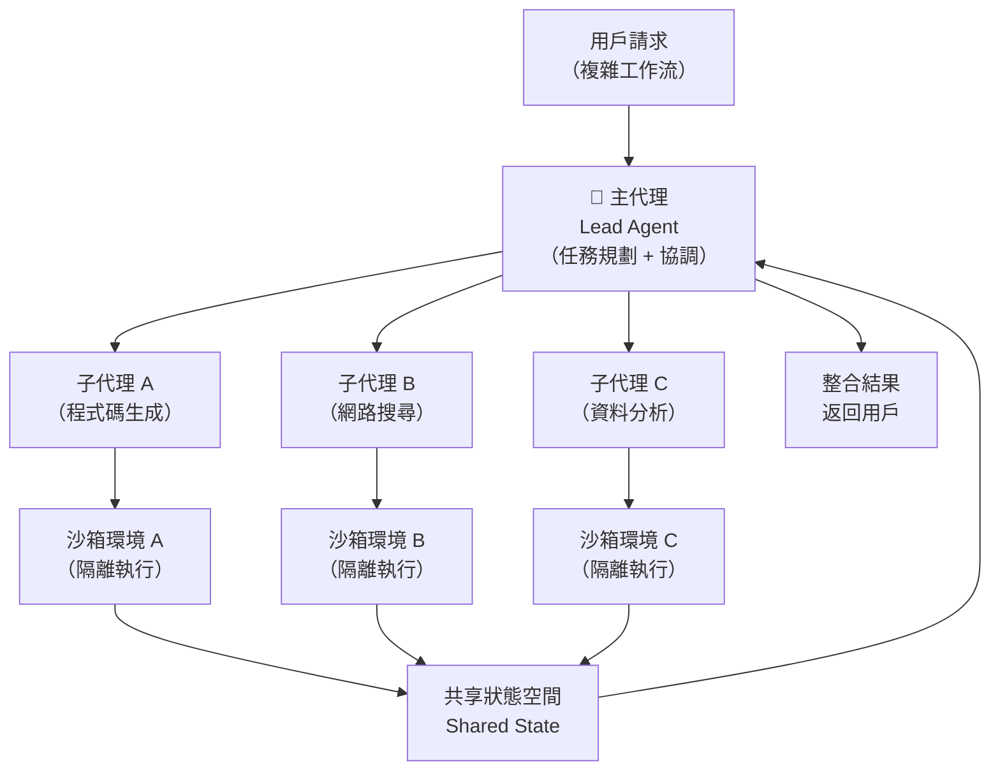

# Antigravity 代理框架與 WebMCP：讓 AI 代理安全行動於真實世界的兩個關鍵基礎設施

> [!abstract] 一句話理解
> 這是 Google 在 I/O 2026 推出的兩個互補的代理基礎設施，特別之處在於：Antigravity 解決了「如何讓多個 AI 代理安全協作執行複雜任務」，WebMCP 解決了「如何讓代理與任意網站/服務直接互動而無需人工定義操作方式」——合在一起，它們構成了 AI 代理從「展示性工具」走向「可靠生產系統」的關鍵技術棧。

## 🎯 為什麼重要

**它解決了什麼問題？**

AI 代理（AI Agent）已存在多年，但在 2026 年前，大多數「AI 代理」系統仍有三個根本性障礙，阻止它們在企業生產環境中可靠運行：

**問題 1：安全邊界模糊**

當 AI 代理可以執行終端命令、讀寫文件、呼叫 API 時，一個錯誤的動作（刪除重要文件、洩漏 API 金鑰）的代價是巨大的。現有框架缺乏系統性的安全隔離機制，使得企業對「讓 AI 代理在生產環境中行動」高度謹慎。

**問題 2：代理協作的協調複雜度**

單一代理難以處理複雜的多步驟任務（如「分析競爭對手、生成報告、更新 CRM、通知銷售團隊」）。多代理方案雖然有幫助，但各代理之間的狀態共享、任務分配和結果整合需要大量的客製化工程工作。

**問題 3：代理與網頁/服務的互動依賴人工定義**

現有代理若要操作一個網站，要麼靠視覺截圖分析（慢、不可靠），要麼靠預先人工編寫的操作腳本（高維護成本、網站改版就失效）。代理無法動態地「了解一個新網站能做什麼」。

**Antigravity + WebMCP 的回應：**

Antigravity 用跨平台沙箱和結構化的多代理協作框架解決問題 1 和 2；WebMCP 用開放的「工具聲明標準」解決問題 3。

## 🧠 入門解說（用類比理解）

**用「外包公司管理」理解 Antigravity 多代理協作**

想像一個大型顧問公司處理複雜客戶案子：

**沒有 Antigravity** = 所有事情由同一個人（單代理）處理，複雜到無法完成，或者每個子任務都要單獨建立一個完全獨立的小組，但小組之間無法共享資訊和協調。

**有 Antigravity** = 有一個「案子協調人（Lead Agent）」負責整體規劃，並把不同任務分派給有特定專長的「顧問（Subagents）」——財務分析師處理數字、法律顧問處理合規、設計師處理視覺，所有人在同一個安全的共享工作空間協作，案子協調人掌握整體進度並整合結果。跨平台沙箱則像是讓每個顧問都在隔離的、被監控的辦公室工作，避免他們意外接觸到不該碰的機密資訊。

**用「餐廳菜單 vs 陌生廚房」理解 WebMCP**

**沒有 WebMCP** = AI 代理想操作一個網站，就像到一個陌生廚房做菜，要自己摸索所有工具在哪裡、哪些食材可以用，每次都要重新探索，而且很容易「不小心打翻了什麼」。

**有 WebMCP** = 每個網站都提供一份「AI 可讀的菜單（工具清單）」，清楚告訴代理：「這裡有哪些功能（工具）、每個功能的輸入和輸出是什麼」。代理看一眼菜單就知道能做什麼、怎麼做，就像在有明確菜單的餐廳點菜——不需要親自去廚房摸索。

## 🔑 重點原理

1. **Antigravity 的跨平台終端沙箱（Cross-platform Terminal Sandboxing）**：沙箱是一種隔離執行環境，讓代理可以執行命令和操作文件，但所有動作都在受控邊界內進行。Antigravity 的沙箱具備三個安全機制：(a) 憑證遮蔽——代理在執行過程中接觸到的 API 金鑰、密碼等敏感資訊會自動被遮蔽，防止被記錄或外洩；(b) 強化 Git 政策——代理操作代碼庫時自動遵守預設的版本控制安全規則；(c) 跨平台設計——同一套沙箱機制在 Linux、macOS、Windows 上一致運行，簡化多平台部署。

2. **子代理協作模式（Specialized Subagent Orchestration）**：Antigravity 2.0 的核心架構是「主代理（Lead Agent）+ 專業子代理（Specialized Subagents）」的分層結構。主代理負責整體任務規劃、分解和結果整合；子代理各自專注於特定能力（如程式碼撰寫、網路搜尋、資料分析）。子代理可以並行執行不同的任務片段，顯著縮短複雜工作流的完成時間。所有代理共享一個統一的狀態空間（Shared State Space），確保跨代理的上下文一致性。

3. **Managed Agents API（一鍵全配備代理）**：傳統部署 AI 代理需要自行搭建沙箱、配置工具呼叫基礎設施、設計記憶體管理——通常需要數週的工程工作。Managed Agents API 讓開發者通過單一 API 呼叫獲得一個「開箱即用」的代理環境：遠端沙箱已預配置、工具呼叫管道已建立、記憶體管理自動處理，開發者只需關注業務邏輯而非基礎設施。

4. **WebMCP 標準（Web Model Context Protocol）**：WebMCP 是 Google 提出的開放網路標準，允許網站在 HTML 中宣告一組「AI 可呼叫的工具（Structured Tools）」。技術上，它類似一個「給 AI 看的 OpenAPI 文件」，但通過瀏覽器原生機制暴露：(a) 網站宣告工具（如 `搜尋商品(查詢關鍵字): 返回商品列表`）；(b) 瀏覽器中的 AI 代理可以發現和呼叫這些工具；(c) 代理不需要進行視覺截圖分析或人工定義的操作腳本。WebMCP 在 Chrome 149 開始 Origin Trial，若成為 W3C 標準，每個支援的網站都成為代理可以直接呼叫的服務端點。

5. **WebMCP 與 MCP（Model Context Protocol）的關係**：Anthropic 的 MCP 是一個讓 AI 客戶端（如 Claude Code）能夠連接本地或伺服器端工具的協議，已廣泛用於 IDE 整合和企業工具連接。WebMCP 是 Google 對這一概念的瀏覽器原生擴展——讓「任意網站」都能成為 MCP 風格的工具提供者，無需雙方預先建立私有整合。兩者的關係類似 REST API（私有整合）vs OpenAPI 標準（公開聲明）。

## 📊 視覺化說明

### Antigravity 多代理協作架構圖

### WebMCP 與傳統代理-網頁互動模式對比

| 維度 | 傳統視覺代理（截圖分析） | 傳統腳本代理（RPA） | WebMCP 代理 |
|------|----------------------|-------------------|-------------|
| 互動方式 | 截圖 → 視覺識別 → 模擬點擊 | 預設 XPath/CSS 選擇器 | 直接呼叫宣告的工具 |
| 速度 | 慢（每步需視覺推理） | 快（但脆弱） | 快（結構化呼叫） |
| 可靠性 | 低（UI 變更即失效） | 低（DOM 結構變更即失效） | 高（工具定義穩定） |
| 維護成本 | 高 | 非常高 | 低（網站自動維護） |
| 新網站適應 | 需重新測試 | 需重寫腳本 | 自動發現工具 |
| 安全性 | 中（無明確邊界） | 中 | 高（宣告式、可審計） |

## 🔍 與既有技術的差異

**vs. LangChain / LlamaIndex 等代理框架**

LangChain 和 LlamaIndex 是通用 AI 代理開發框架，提供豐富的工具整合和鏈式呼叫。Antigravity 的差異在於：(a) 原生整合 Google 的沙箱安全機制；(b) 與 Gemini 模型深度整合，工具呼叫格式和代理協作都針對 Gemini 優化；(c) Managed Agents API 大幅降低基礎設施建置門檻。但 Antigravity 的生態系目前仍主要限於 Google 生態，靈活性不如通用框架。

**vs. Anthropic MCP（Model Context Protocol）**

MCP 是一個讓開發者把外部工具暴露給 Claude 等 AI 客戶端的協議，需要開發者主動建立 MCP 伺服器。WebMCP 的目標是讓任意網站「自動成為 AI 代理的工具提供者」，無需特別開發 MCP 伺服器，是 MCP 概念向「開放網路」的延伸。

## 📚 關鍵詞對照表

| 中文 | 英文 | 簡短解釋 |
|------|------|---------|
| AI 代理框架 | AI Agent Framework | 提供工具整合、記憶體管理、代理協作能力的開發框架 |
| 沙箱 | Sandbox | 隔離執行環境，讓代理的動作在受控邊界內進行，防止意外影響外部系統 |
| 多代理協作 | Multi-Agent Orchestration | 多個 AI 代理分工協作完成複雜任務的架構模式 |
| 主代理 | Lead Agent | 負責任務分解、子代理調度和結果整合的中央協調代理 |
| 子代理 | Subagent | 被主代理委派負責特定任務片段的專業代理 |
| WebMCP | Web Model Context Protocol | Google 提出的瀏覽器原生 AI 工具聲明標準，讓網站可以暴露 AI 代理可呼叫的結構化工具 |
| 憑證遮蔽 | Credential Masking | 在代理執行過程中自動遮蔽敏感資訊（API 金鑰、密碼）的安全機制 |
| Origin Trial | Origin Trial | Chrome 的實驗性功能測試機制，允許開發者在限定範圍內測試新 Web 標準 |

## 🛠️ 可能的應用場景

1. **企業多步驟工作流自動化**：使用 Antigravity 的多代理框架，建立「財務報表自動生成」代理系統——資料收集子代理從 ERP 抓取數字、分析子代理計算指標、撰寫子代理生成敘述性報告、發送子代理自動郵件分發
2. **DevOps 自動化流水線**：以 Antigravity 沙箱運行程式碼審查代理（安全地分析生產代碼）、測試代理（在隔離環境自動運行測試套件）、部署代理（在授權範圍內觸發部署流程）
3. **消費者購物代理（WebMCP 應用）**：若主流電商平台支援 WebMCP，用戶的個人 AI 代理可以跨平台搜尋、比價和下單，無需每個平台都開發單獨的整合
4. **醫療資訊整合（WebMCP + Antigravity）**：醫院系統的代理可以通過 WebMCP 從藥物資料庫、檢驗報告平台、電子病歷系統等不同來源取得標準化資訊，由多個專業子代理（診斷代理、用藥代理）協作分析，提供統一建議
5. **政府服務自動化**：若政府網站支援 WebMCP，公民的 AI 代理可以自動完成稅務申報、補助申請等行政任務，不需要公民逐一操作不同政府網站

## 📖 學習路徑建議

1. **先讀**：了解 AI 代理的基礎概念——閱讀 LangChain 文件的「Agents」部分或 Anthropic 的「Building with Claude」指南，理解工具呼叫（Tool Calling）、ReAct 代理循環（Observe-Think-Act）的基本工作方式
2. **再讀**：了解 Anthropic MCP 的設計思路（https://modelcontextprotocol.io）和現有 MCP 生態系（IDE 整合、資料庫連接），這是理解 WebMCP 的最好前置背景
3. **進階**：閱讀 Google 的 Antigravity 技術文件（Google AI Studio），以及 WebMCP 的 Chrome Origin Trial 說明文件，理解兩者的具體 API 設計和使用限制
4. **實作**：使用 Gemini API 的 Managed Agents 功能建立一個簡單的多代理工作流，觀察主代理如何分配任務給子代理，並在沙箱環境中執行實際操作

## 🔗 延伸閱讀
- 原文連結：[Google Developers Blog - I/O 2026 開發者主題演講](https://developers.googleblog.com/all-the-news-from-the-google-io-2026-developer-keynote/)
- 對應新聞筆記：[[2026-05-29-Google IO 2026 Gemini 3.5與Antigravity代理框架]]
- Anthropic MCP 官網（WebMCP 的前置背景）：https://modelcontextprotocol.io
- LangChain Agents 文件（代理框架基礎）：https://python.langchain.com/docs/modules/agents/

---
*由 Claude 自動整理於 2026-05-29*
