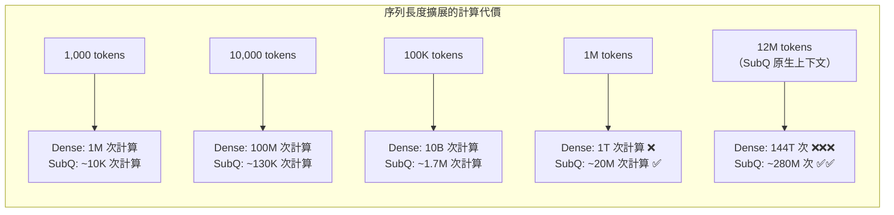

# SubQ：次二次方注意力架構與長上下文的根本性突破

> [!abstract] 一句話理解
> 這是一個用來「讓 AI 模型一次性理解比整本書更長的文本」的新型注意力架構，特別之處在於完全打破了 Transformer 自注意力的二次方計算複雜度瓶頸，讓 1,200 萬 Token 的超長上下文不再需要天文數字的算力——是自 2017 年 Transformer 架構以來，注意力機制最根本性的架構突破之一。

## 🎯 為什麼重要

**它解決了什麼問題？**

自注意力（Self-Attention）的計算複雜度是 O(n²)——序列長度翻倍，計算量增加四倍。這個特性讓「超長上下文 LLM」成為算力的惡夢：

- 處理 128K Token（約 10 萬字）的序列，計算量是 1K Token 的 16,384 倍
- 處理 1M Token 的序列，理論計算量是 1K Token 的 10¹² 倍（幾乎不可行）

這就是為什麼即使是最先進的 GPT-4、Claude 3.5 等，把上下文窗口從 32K 擴展到 128K，都需要付出巨大的算力代價；而超過 1M Token 的上下文在實際應用中幾乎不存在。

**既有解法的不足：**

1. **稀疏注意力（Sparse Attention）**：Flash Attention 等技術雖然提升了注意力的計算效率，但本質上仍是 O(n²) 的線性注意力近似，最終瓶頸依然存在
2. **狀態空間模型（SSM，如 Mamba）**：通過線性循環取代注意力，理論複雜度降低，但在局部和全局語意的捕捉靈活性上不如注意力機制
3. **分段處理（Chunking）**：RAG 等方法把長文件切成小片段分別處理，但喪失了跨段落的整體語意理解

**SubQ 的根本突破：**

SubQ 是目前已知第一個在整個模型架構「端對端（End-to-End）」採用次二次方（Subquadratic）注意力的量產 LLM，從根本上解決了長上下文的計算複雜度問題，讓 1,200 萬 Token 的原生上下文成為現實。

## 🧠 入門解說（用類比理解）

**用「圖書館管理員的不同找書策略」理解注意力複雜度**

假設一個圖書館有 N 本書，管理員需要找到哪些書之間是「相關的」：

**標準 Transformer 注意力 = O(n²)** = 管理員比較每兩本書的相關性。1000 本書需要比較 100 萬對；100 萬本書需要比較 1 兆對——永遠不可能完成。

**SubQ 的次二次方注意力** = 管理員先用一套「智能分類索引」快速排除明顯不相關的書，只精確比較「可能相關」的書對。比較的數量從 N² 降低到接近 N（或 N log N），讓管理員能在合理時間內完成整個圖書館的相關性分析。

**用「城市規劃的道路網絡」理解稀疏注意力圖**

若每個 token 都與所有其他 token 直接相連（Dense Attention），就像一個每兩個地點之間都有直達道路的城市——道路數量隨地點數量的平方增長，城市越大越不可維持。

SubQ 的稀疏注意力圖，就像一個有效的城市道路網絡——大部分地點通過幾條主幹道間接連接，只有真正需要直達的地點才有直達道路。網絡連接性幾乎不受影響，但道路數量從 N² 降到接近 N。

## 🔑 重點原理

1. **次二次方計算複雜度（Subquadratic Complexity）**：SubQ 的核心創新是讓注意力計算的時間和空間複雜度從 O(n²) 降低到 O(n·polylog(n)) 或接近 O(n)。這是通過「稀疏注意力圖（Sparse Attention Pattern）」實現的：每個 token 只與模型學習到的「最相關子集」計算注意力，而非與所有 token 計算。關鍵在於，SubQ 的稀疏模式是通過模型訓練學習得出的（而非人工預設），因此能自適應地捕捉不同任務所需的注意力結構。

2. **端對端架構設計（End-to-End Subquadratic Design）**：許多研究嘗試在 Transformer 的某些層或某些機制上引入次二次方近似，但 SubQ 是端對端設計——從第一層到最後一層，所有注意力計算都採用次二次方機制。這意味著長上下文的效率提升在整個前向傳播過程中都能實現，而非只在局部。這也是 SubQ 被稱為「第一個真正的次二次方 LLM」的原因。

3. **學習的稀疏注意力模式（Learned Sparse Attention Pattern）**：SubQ 的稀疏注意力圖不是固定的（如局部窗口注意力或 Longformer 的條帶狀圖）。模型在訓練過程中學習對每種任務和上下文類型最有效的稀疏連接模式，讓稀疏性不以犧牲表達力為代價。

4. **原生 1,200 萬 Token 上下文窗口**：由於計算複雜度的根本降低，SubQ 能夠原生支援 1,200 萬 Token 的上下文窗口——無需分段處理或向量資料庫輔助。這意味著：一個完整的大型軟體代碼庫（例如 Linux 核心的 3,000 萬行代碼）、一本百科全書（維基百科英文版約 40 億字）、或幾年的工作郵件往來，都可以一次性輸入模型進行全局推理。

5. **對 RAG 使用模式的潛在顛覆**：目前企業 AI 的主流部署模式依賴 RAG（檢索增強生成）——把長文件切成小片段，先用向量搜尋找到相關片段，再輸入 LLM。這個模式複雜、需要維護向量資料庫，且容易漏失跨段落的重要語意。SubQ 的超長上下文讓「全文直接輸入」成為可能，可能讓 RAG 對許多使用場景變得不再必要。

## 📊 視覺化說明

### 計算複雜度比較

### 長上下文解決方案比較

| 方法 | 上下文長度 | 計算複雜度 | 語意完整性 | 維護複雜度 |
|------|----------|-----------|-----------|-----------|
| 標準 Transformer | 4K-200K | O(n²) | 完整 | 低 |
| Flash Attention 優化 | 100K-1M | O(n²)（優化常數） | 完整 | 低 |
| RAG（分段檢索） | 無上限 | O(1)（每片段） | 片段化 | 高 |
| Mamba（SSM） | 數 M | O(n) | 局部為主 | 低 |
| **SubQ（次二次方）** | **1,200 萬** | **O(n·polylog n)** | **完整** | **低** |

## 🔍 與既有技術的差異

**vs. Flash Attention / Multi-Head Flash Attention**

Flash Attention 是目前最廣泛使用的注意力計算優化，通過改善記憶體訪問模式大幅降低 GPU 記憶體使用量，讓 128K-1M Token 的上下文在實踐中成為可能。但 Flash Attention 本質上仍是 O(n²) 複雜度——只是降低了常數係數。SubQ 是 O(n·polylog n) 或更低，在超長序列（>1M tokens）上的效率優勢是量級差異，而非常數差異。

**vs. Mamba 等狀態空間模型（SSM）**

Mamba 用線性循環取代注意力，理論複雜度 O(n)，在長序列處理上效率極高。但 SSM 的「選擇性狀態更新」機制在長程全局依賴的捕捉上有內在限制。SubQ 保留了注意力機制的全局依賴捕捉能力，同時把計算複雜度降到接近 SSM 水準，代表兩者優點的結合嘗試。

**vs. Longformer / BigBird（稀疏注意力前作）**

Longformer 和 BigBird 通過人工設計的稀疏注意力模式（局部窗口 + 全局 token）降低計算量，能處理 16K-64K Token。SubQ 的稀疏模式是學習得出的，不受固定窗口大小限制，也不需要預先指定「哪些 token 需要全局注意力」，靈活性和可擴展性更強。

## 📚 關鍵詞對照表

| 中文 | 英文 | 簡短解釋 |
|------|------|---------|
| 次二次方 | Subquadratic | 計算複雜度低於 O(n²) 的算法類別，如 O(n log n) 或 O(n) |
| 自注意力 | Self-Attention | Transformer 的核心機制，讓每個 token 可以關注序列中的其他 token |
| 稀疏注意力 | Sparse Attention | 每個 token 只與部分其他 token 計算注意力，而非全量計算 |
| 上下文窗口 | Context Window | 模型一次能處理的最大 token 數量 |
| 狀態空間模型 | State Space Model (SSM) | 用線性循環取代注意力的替代架構，代表：Mamba |
| 端對端次二次方 | End-to-End Subquadratic | 整個模型的每一層都採用次二次方計算，而非只在部分層優化 |
| 計算複雜度 | Computational Complexity | 用 O(n) 表示法描述算法計算量與輸入規模的關係 |
| 注意力圖 | Attention Pattern / Attention Map | 描述哪些 token 對之間計算注意力的連接結構 |

## 🛠️ 可能的應用場景

1. **全代碼庫理解**：大型軟體工程師可以把整個代碼庫（數百萬行代碼）輸入 SubQ，讓 AI 在理解整體架構的前提下回答「這個函數的副作用影響哪些模塊？」這類問題
2. **法律文件全集分析**：法律研究人員可以輸入整個案件的所有文件（合約、判決書、往來郵件）進行一致性檢查和全局分析，無需擔心文件被截斷
3. **科學文獻綜合**：研究人員可以輸入某個研究領域的大量論文，讓 AI 進行跨論文的知識整合和矛盾識別
4. **企業知識庫問答**：組織可以把所有內部文件（政策、SOP、歷史決策）輸入，建立能夠回答任何組織知識問題的 AI 系統，無需 RAG 的複雜檢索管道
5. **媒體和內容分析**：新聞機構可以輸入完整的長期新聞檔案（數年的報導），讓 AI 追蹤複雜事件的發展脈絡

## 📖 學習路徑建議

1. **先讀**：理解 Transformer 自注意力的基礎——"Attention Is All You Need"（2017）的核心部分，理解 Q/K/V 矩陣的計算方式和 O(n²) 複雜度的來源
2. **再讀**：了解現有長上下文優化技術，閱讀 Flash Attention 論文（arXiv:2205.14135）和 Longformer 論文（arXiv:2004.05150），理解當前最佳實踐和其限制
3. **進階**：閱讀 Mamba 論文（arXiv:2312.00752）理解 SSM 的替代路線，再對比閱讀 SubQ 的技術報告，理解「保留注意力 + 降低複雜度」vs「替換注意力」兩條路線的權衡
4. **實作**：使用 SubQ 的 API，設計一個「超長文件問答」任務（如整本書籍的問答），對比 RAG 方案和 SubQ 直接輸入方案在準確性和響應時間上的差異

## 🔗 延伸閱讀
- 原文連結：[WhatLLM - SubQ 模型介紹](https://whatllm.org/blog/new-ai-models-may-2026)
- 對應新聞筆記：[[2026-05-29-SubQ次二次方注意力模型1200萬Token原生上下文]]
- "Attention Is All You Need" 原論文：https://arxiv.org/abs/1706.03762
- Flash Attention 論文（現有最佳實踐）：https://arxiv.org/abs/2205.14135
- Longformer（稀疏注意力前作）：https://arxiv.org/abs/2004.05150

---
*由 Claude 自動整理於 2026-05-29*
