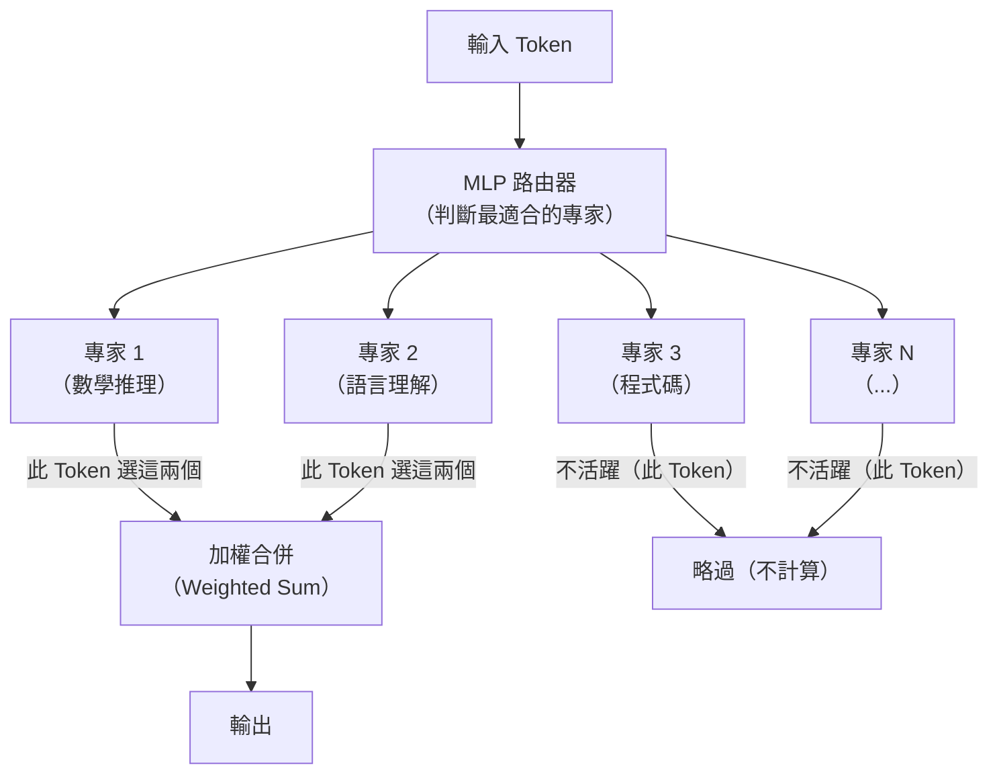

# ZAYA1-8B：MoE 智能密度最大化與壓縮卷積注意力架構

> [!abstract] 一句話理解
> 這是一個用來「以極少的計算代價達到最大推理能力」的 MoE 語言模型，特別之處在於透過壓縮卷積注意力（CCA）、MLP 路由器、學習殘差縮放三項創新，讓每個活躍參數的「智能產出」達到同類模型的兩倍，使 8B 名義參數的模型能夠超越數十倍大小的前沿模型。

## 🎯 為什麼重要

**它解決了什麼問題？**

AI 模型的規模競賽帶來了一個根本困境：更大的模型能力更強，但計算成本和部署難度也成倍增加。一個 100B 參數的模型在消費級硬體上根本無法運行；即使在雲端，每次推理的成本也讓許多應用望而卻步。

**舊方法的核心不足：**

1. **「大即是強」的線性思維**：傳統觀念認為要提升模型能力，就必須增加參數量，導致模型越來越大、越來越貴
2. **注意力機制的效率瓶頸**：標準 Transformer 的自注意力每個 token 都需要與所有其他 token 互動，計算量驚人，但大量計算其實並沒有貢獻到最終輸出
3. **MoE 路由不穩定**：現有 MoE 架構的線性路由器容易導致「專家崩潰」——少數專家被反覆使用，多數閒置，浪費了 MoE 的設計初衷

**ZAYA1-8B 的突破：**

透過三項架構創新的協同作用，ZAYA1-8B 實現了「每活躍參數智能密度是同類最佳開源推理模型約兩倍」——用更少的計算達到更好的結果，而非追求更大的規模。

## 🧠 入門解說（用類比理解）

**用「精英特種部隊 vs 大規模軍隊」理解 MoE**

想像兩種作戰方式：

**大規模密集模型（Dense Model）** = 每次任務都出動全軍，10 萬人中只有 100 人真正發揮作用，其餘 99,900 人耗費糧草卻站在旁邊

**混合專家模型（MoE）** = 維持一支各有專長的精英部隊，每次任務根據需求派出最適合的小分隊（專家）；ZAYA1-8B 進一步優化了「如何選派最佳小分隊」的決策機制（MLP 路由器），確保每次都精準選對人

**用「老花眼鏡 vs 漸進多焦眼鏡」理解 CCA（壓縮卷積注意力）**

普通注意力機制 = 老花眼鏡，看近（當前文字）和看遠（長程依賴）都用同樣的焦距，效果兩頭不討好

CCA = 漸進多焦眼鏡，智能地分配「看近」和「看遠」的資源，在維持整體視野的同時減少不必要的計算——同樣是看同一個世界，但需要的「眼力」消耗只有原來的一半

## 🔑 重點原理

1. **混合專家架構（Mixture of Experts, MoE）**：MoE 的基本思想是：在同一個模型中維護多個「專家網路（Expert Networks）」，每次處理輸入時，由路由器（Router）決定哪幾個專家負責處理這個特定的 token。ZAYA1-8B 有 8B 名義參數，但推理時只有約 7.6 億（760M）活躍參數——其餘「專家」在那次 token 處理中並不被激活，因此推理計算量遠低於 8B 的全密集模型。

2. **壓縮卷積注意力（Compressed Convolutional Attention, CCA）**：Zyphra 自研的注意力變體，透過卷積操作壓縮注意力計算的中間表示。標準 Self-Attention 的問題是：即使序列中某個 token 與另一個 token 相關性極低，仍然會計算它們之間的注意力分數。CCA 在計算注意力前先用卷積對序列做結構性壓縮，過濾掉「幾乎不相關」的 token 組合，大幅降低計算量，同時不顯著損失語意理解能力。

3. **MLP 路由器（MLP-based Expert Router）**：傳統 MoE 用線性變換決定「把這個 token 發給哪個專家」，而 ZAYA1-8B 改用多層感知器（MLP）作為路由器。好處是：MLP 路由器有更強的非線性表達能力，能更準確地判斷哪個專家最適合處理當前 token，減少路由錯誤；同時 MLP 路由器能維持更穩定的訓練，避免少數專家被過度使用的「專家崩潰（Expert Collapse）」問題。

4. **學習殘差縮放（Learned Residual Scaling）**：深層神經網路中，殘差連接（Residual Connection）是讓梯度流通的關鍵機制。但隨著層數加深，殘差向量的範數（norm）往往會爆炸性增長，導致訓練不穩定。學習殘差縮放在每個殘差連接處引入一個可學習的縮放係數（scalar），讓模型自動調節殘差強度，在幾乎不增加參數量的情況下顯著改善訓練穩定性和最終性能。

5. **AMD 原生訓練棧的戰略意義**：ZAYA1-8B 完全在 AMD Instinct MI300X 而非 NVIDIA GPU 上訓練。這在技術上驗證了 AMD 硬體對高品質 LLM 訓練的可行性，打破了「訓練前沿模型必須用 NVIDIA」的市場假設，對 AI 訓練的供應鏈多元化具有示範意義。

## 📊 視覺化說明

### MoE 路由機制流程圖

### ZAYA1-8B 三大技術組件比較

| 技術 | 解決的問題 | 與傳統方法的差異 | 效益 |
|------|----------|----------------|------|
| CCA（壓縮卷積注意力） | 注意力計算浪費 | 卷積預壓縮 vs 全量計算 | 計算量大幅降低 |
| MLP 路由器 | 專家崩潰 / 路由不穩 | 非線性 MLP vs 線性矩陣 | 更穩定的訓練和更準確的路由 |
| 學習殘差縮放 | 深層訓練不穩定 | 可學習縮放 vs 固定殘差 | 改善收斂，幾乎零額外成本 |

## 🔍 與既有技術的差異

**vs. 標準密集模型（Dense Transformer）**

Dense Transformer 每個 token 都會激活所有參數，計算量等於參數量的函數。ZAYA1-8B 作為 MoE 模型，只激活約 9.5% 的參數（760M / 8B），計算量大幅降低，但通過更好的路由機制確保這 9.5% 是「最有用的 9.5%」。

**vs. 標準 MoE（如 Mistral Mixtral）**

Mixtral 使用線性路由器，容易出現專家崩潰問題。ZAYA1-8B 的 MLP 路由器在路由穩定性上有顯著改善，配合 CCA 和學習殘差縮放，整體架構的協同效果讓「每活躍參數智能密度」達到 Mixtral 等同類模型的約兩倍。

**vs. Mamba 等狀態空間模型（SSM）**

Mamba 等 SSM 通過線性循環取代注意力，在長序列上效率更高，但犧牲了部分局部-全局注意力的靈活性。ZAYA1-8B 仍保留基於注意力的架構，但通過 CCA 大幅提升效率，是「改良注意力」而非「放棄注意力」的路線。

## 📚 關鍵詞對照表

| 中文 | 英文 | 簡短解釋 |
|------|------|---------|
| 混合專家 | Mixture of Experts (MoE) | 模型包含多個「專家子網路」，每次推理只激活部分專家 |
| 智能密度 | Intelligence Density | 每個活躍參數所貢獻的推理能力，ZAYA1-8B 的核心優化目標 |
| 壓縮卷積注意力 | Compressed Convolutional Attention (CCA) | 用卷積預壓縮降低注意力計算量的自研技術 |
| 路由器 | Router / Expert Router | MoE 中決定「哪個 token 交給哪個專家」的選擇機制 |
| 專家崩潰 | Expert Collapse | MoE 訓練問題：少數專家被反覆使用，多數專家幾乎閒置 |
| 殘差縮放 | Residual Scaling | 通過可學習係數控制殘差連接強度的訓練穩定技術 |
| 活躍參數 | Active Parameters | MoE 中每次推理實際被激活和計算的參數數量 |
| 推理吞吐量 | Inference Throughput | 模型每秒能處理的 token 數量，衡量推理效率的指標 |

## 🛠️ 可能的應用場景

1. **邊緣設備部署（Edge Deployment）**：ZAYA1-8B 的低活躍參數使其在相對較低規格的服務器甚至高端消費級設備上可以流暢運行，適合需要低延遲的本地 AI 推理場景
2. **高吞吐量 API 服務**：對需要每秒處理大量請求的 SaaS 服務，ZAYA1-8B 的計算效率可顯著降低每次推理的算力成本
3. **數學和程式碼推理**：基準測試顯示 ZAYA1-8B 在 AIME、HMMT（數學）和 LiveCodeBench（程式碼）表現突出，特別適合教育科技、金融模型計算、程式碼輔助等場景
4. **AMD 硬體生態建設**：Zyphra 的 AMD 原生訓練棧為想要基於 AMD GPU 建立 AI 基礎設施的企業提供了可行的技術路線
5. **開源研究基線（Research Baseline）**：ZAYA1-8B 已在 Hugging Face 開源，研究社群可以基於它測試新的 MoE 改良技術，推動更廣泛的架構創新

## 📖 學習路徑建議

1. **先讀**：了解基礎 Transformer 架構中的自注意力機制（Self-Attention）——閱讀 "Attention Is All You Need"（2017）論文摘要，理解 Q/K/V 矩陣的計算方式
2. **再讀**：學習 MoE 的基礎概念，可閱讀 Mixtral 的論文或 HuggingFace 的 MoE 解說部落格，理解路由器的角色和「稀疏激活（Sparse Activation）」的工作方式
3. **進階**：閱讀 ZAYA1-8B 的技術報告（Zyphra 官網），深入理解 CCA 的卷積壓縮機制和 MLP 路由器的訓練細節
4. **實作**：從 Hugging Face 下載 ZAYA1-8B 模型權重，在 Zyphra Cloud 或本地 AMD GPU 環境測試推理性能，與 Mixtral-8x7B 等同類 MoE 模型做對比實驗

## 🔗 延伸閱讀
- 原文連結：[VentureBeat - ZAYA1-8B 報導](https://venturebeat.com/technology/meet-zaya1-8b-a-super-efficient-open-reasoning-model-trained-on-amd-instinct-mi300-gpus)
- 對應新聞筆記：[[2026-05-29-Zyphra ZAYA1-8B MoE推理模型智能密度最大化]]
- Mixtral MoE 論文：https://arxiv.org/abs/2401.04088
- "Attention Is All You Need" 原論文：https://arxiv.org/abs/1706.03762

---
*由 Claude 自動整理於 2026-05-29*
