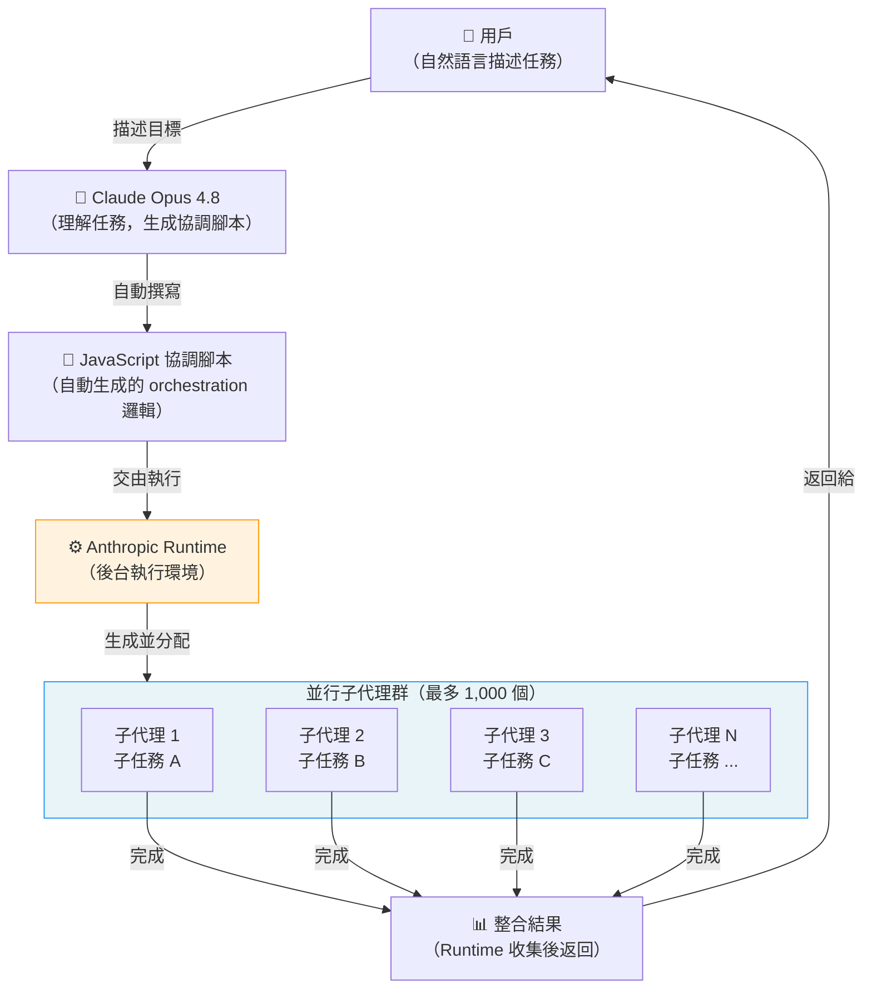

# Claude 動態工作流程與多代理協調架構入門

> [!abstract] 一句話理解
> 這是一個用來「讓一個 AI 工程師同時指揮最多 1,000 個 AI 助手並行工作」的系統，特別之處在於 Claude 本身會自動寫出協調腳本，用戶只需描述任務目標，不需要手動設計多代理架構。

## 🎯 為什麼重要

**它解決了什麼問題？**

在 Claude Opus 4.8 的動態工作流程出現之前，使用多個 AI 代理並行處理大型任務面臨三個根本困難：

**困難一：架構設計門檻高**
要讓多個 AI 代理並行工作，需要工程師手動設計任務分解邏輯、代理通訊協議、結果整合方式，每個項目都要從頭規劃，門檻高且耗時。

**困難二：並行規模受限**
現有的多代理框架（如 LangGraph、AutoGen）通常在少量代理（5-20 個）時運作良好，但擴展到數百個代理時，協調開銷和錯誤傳播問題會急劇增加。

**困難三：速度瓶頸**
單一代理按序處理任務，遇到大規模工作（如審查一個 100 萬行程式碼的倉庫）必須等待數小時，無法滿足實際工程需求。

動態工作流程透過讓 Claude「自己寫協調腳本」並在後台執行，一次解決了這三個問題：架構設計由 AI 完成，並行規模達 1,000 個代理，整體速度相當於 1,000 個 Claude 同時工作。

## 🧠 入門解說（用類比理解）

**類比：工地總工程師 vs 1,000 個建築工人**

想像你要蓋一棟 100 層的摩天大樓。

**傳統 AI 助理（單代理）**：
只有一個建築工人，他每天從地基開始，一層一層往上蓋。建完 100 層需要 100 天。

**舊版多代理框架**：
你有 5-10 個工人，但你自己要花很多時間規劃「誰去做哪件事」，而且如果工人之間配合出問題，你要親自去協調。

**Claude 動態工作流程**：
你告訴總工程師（Claude）：「我要蓋一棟 100 層的摩天大樓。」總工程師自動寫出施工計劃書（JavaScript orchestration 腳本），然後一次派出 1,000 個工人：
- 50 個工人去打地基
- 200 個工人同時蓋不同樓層
- 100 個工人負責水電
- 150 個工人做外牆裝修
- ...

原本需要 100 天的工程，現在可能在 1 天內完成。

**關鍵差別**：你不需要親自寫施工計劃書——Claude 自己完成了這一步。

## 🔑 重點原理

1. **任務描述 → 自動生成協調腳本**：用戶用自然語言描述任務目標，Claude 自動撰寫 JavaScript 編排腳本（orchestration script）。這個腳本定義了：如何分解任務、什麼時候啟動哪些子代理、如何整合各子代理的輸出。工程師不需要手動設計多代理架構，大幅降低了使用門檻。

2. **Runtime 後台執行**：生成的 JavaScript 腳本由 Anthropic 的 Runtime 在背景執行。用戶發起任務後可以繼續其他工作，Runtime 自動管理所有子代理的生命週期（啟動、監控、結果收集、錯誤處理）。

3. **最多 1,000 個並行子代理**：每個「運行（run）」最多可以同時生成並協調 1,000 個子代理。每個子代理本質上都是一個獨立的 Claude 實例，有自己的上下文視窗，可以獨立完成分配給它的子任務。這意味著一個動態工作流程的「有效吞吐量」等同於 1,000 個 Claude 的工作量。

4. **成本快速攀升的注意事項**：由於每個子代理都是一個獨立的 Claude API 調用，1,000 個子代理並行工作意味著費用是單一代理的最多 1,000 倍。Anthropic 明確警告用戶要「謹慎規劃」——動態工作流程適合 ROI 明確的高價值任務（如大型程式碼審查、複雜資料分析），而非日常簡單查詢。

5. **努力控制（Effort Control）的配合使用**：動態工作流程可以與努力控制功能組合使用。對於需要深度推理的子任務，可以設定 `xhigh` 或 `max` 努力等級；對於重複性較高的子任務，使用 `standard` 即可。這種細粒度控制讓成本管理更靈活。

## 📊 視覺化說明

### 動態工作流程架構流程圖

### 單代理 vs 動態工作流程比較

| 維度 | 傳統單代理 | 動態工作流程（1,000 代理）|
|---|---|---|
| **適用場景** | 日常對話、簡單任務 | 大規模程式碼審查、複雜分析 |
| **速度（相對）** | 1× | 最高 1,000×（並行） |
| **架構設計** | 無需設計 | Claude 自動生成 |
| **費用** | 1 個 API 調用 | 最多 1,000 個 API 調用 |
| **錯誤容忍** | 無（單點失敗即停止） | 高（其他代理繼續工作）|
| **最大任務規模** | 受上下文視窗限制 | 可無限分解子任務 |
| **進入門檻** | 極低 | 中（需了解費用結構）|

## 🔍 與既有技術的差異

**vs. LangGraph / AutoGen（傳統多代理框架）**

LangGraph 和 AutoGen 是 2024-2025 年間最流行的開源多代理框架。它們的核心差異：
- **架構設計**：LangGraph/AutoGen 需要工程師手動定義代理圖（agent graph）和節點關係；動態工作流程由 Claude 自動生成協調邏輯
- **規模**：LangGraph 通常適合 <50 個代理；動態工作流程原生支援 1,000 個
- **易用性**：LangGraph 是代碼框架；動態工作流程只需自然語言描述
- **整合度**：動態工作流程深度整合在 Claude Code CLI 中，無需額外安裝

**vs. OpenAI Swarm / Assistants API**

OpenAI 的 Swarm 框架和 Assistants API 也支援多代理，但：
- 沒有自動生成協調腳本的能力（仍需手動設計）
- 並行規模限制更嚴格
- 動態工作流程獨有的「1,000 子代理 + 自動協調腳本生成」組合尚無競品

## 📚 關鍵詞對照表

| 中文 | 英文 | 簡短解釋 |
|---|---|---|
| 動態工作流程 | Dynamic Workflows | Claude Opus 4.8 新功能，可自動生成協調腳本並並行執行最多 1,000 個子代理 |
| 子代理 | Subagent | 在動態工作流程中，由主協調腳本生成的獨立 Claude 實例，負責執行特定子任務 |
| 協調腳本 | Orchestration Script | 由 Claude 自動生成的 JavaScript 腳本，定義了多代理的任務分解和執行順序 |
| Runtime | Runtime（執行環境）| Anthropic 提供的後台執行環境，負責運行協調腳本和管理子代理生命週期 |
| 努力控制 | Effort Control | 指定 Claude 在回應中投入多少思考算力的設定，分 standard / xhigh / max |
| 快速模式 | Fast Mode | 以較低成本和較快速度運行的模式，適合不需要深度推理的任務 |
| 代理循環 | Agent Loop | AI 代理自主感知-推理-行動-觀察的循環執行過程 |

## 🛠️ 可能的應用場景

1. **大型程式碼庫全面審查**：將一個有 100 萬行程式碼的倉庫分割成 1,000 個區塊，每個子代理負責審查一個區塊，最後整合所有安全漏洞和程式碼品質問題報告
2. **自動化測試套件生成**：分析整個 API 文件，同時生成每個端點的單元測試、整合測試和邊界情況測試
3. **跨語言程式碼遷移**：將一個 Python 後端遷移到 TypeScript，1,000 個子代理同時翻譯不同的模組
4. **大規模資料提取與分析**：從大量文件（法律合約、財務報表、研究論文）中並行提取結構化資訊並生成摘要
5. **多維度 A/B 測試內容生成**：同時生成數百種不同的行銷文案、UI 文字或產品描述變體，用於 A/B 測試

## 📖 學習路徑建議

1. **先讀**：理解單代理工作流程（Claude Code 基本使用）——了解代理的感知-推理-行動基本循環
2. **先讀**：多代理系統基礎概念（AutoGen 文件或相關教程）——了解代理分工和通訊的基本思想
3. **再讀**：Claude Opus 4.8 官方發布說明——了解動態工作流程的具體參數和限制
4. **進階**：JavaScript 腳本生成模式分析（分析 Claude 自動生成的協調腳本結構）——了解如何影響和優化腳本設計
5. **進階**：多代理系統的成本與效益優化——學習如何在 1,000 個子代理的情境下進行成本控制

## 🔗 延伸閱讀
- 原文連結：[Anthropic 官方 Claude Opus 4.8 發布說明](https://www.anthropic.com/news/claude-opus-4-8)
- 對應新聞筆記：[[2026-05-30-Claude Opus 4.8 發布動態工作流程與快速模式]]
- 相關工具：[Claude Code 文件](https://docs.anthropic.com/claude-code)
- 相關框架：AutoGen（微軟開源多代理框架）、LangGraph（圖結構多代理框架）

---
*由 Claude 自動整理於 2026-05-30*
