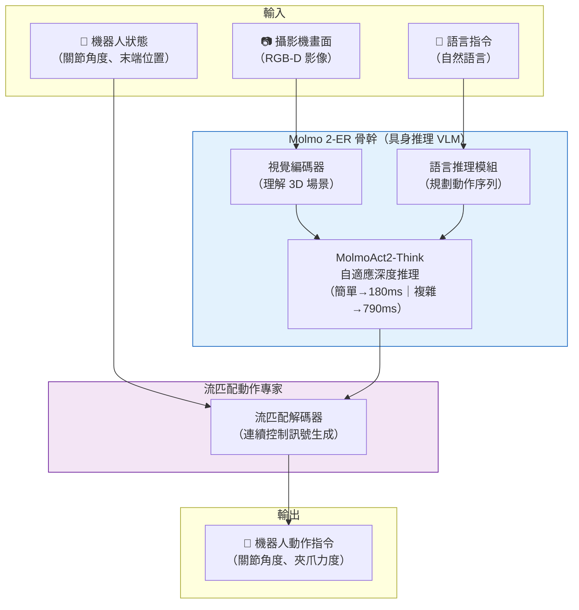

# MolmoAct2：視覺語言動作模型（VLA）架構入門

> [!abstract] 一句話理解
> 這是一個用來「讓機器人理解視覺場景、理解語言指令、然後輸出精確操控動作」的開源 AI 模型，特別之處在於它以 37 倍的速度提升達到即時控制所需的反應時間，同時在多項真實世界基準上超越了閉源競品 Physical Intelligence π0.5，並附帶迄今最大的開源雙臂操控示範資料集。

## 🎯 為什麼重要

**它解決了什麼問題？**

機器人 AI 的核心挑戰是「感知-推理-行動」的無縫整合：機器人必須看懂眼前的場景（感知），理解人類的語言指令（推理），並輸出精確的物理動作（行動）。在 MolmoAct2 之前，這個領域面臨三個交織在一起的難題：

**問題一：速度 vs 能力的兩難**

能力強的機器人 AI 模型通常推論速度很慢——前代 MolmoAct 每次動作調用需要 6,700 毫秒（約 6.7 秒）。這對需要即時反饋的機器人控制而言是致命的：機器人拿起物體後的 6.7 秒內，物體可能已經滑落或情況已經改變。要達到實用的即時控制，推論延遲需要在 200-500 毫秒以內。

**問題二：開源生態的缺口**

最強的機器人 VLA 模型（Physical Intelligence π0.5、Google π₀）都是閉源的。研究者和工業界無法在其基礎上微調或改進，每個團隊都必須從頭訓練自己的模型——這需要巨大的計算資源和大量的示範資料。開源替代方案在能力上與閉源差距顯著。

**問題三：高質量訓練資料稀缺**

機器人 AI 的訓練需要大量真實的機器人操控示範影片。收集這些資料既耗時（需要人類遙操作機器人）又昂貴，導致研究者各自為戰，資料難以共享。

MolmoAct2 同時解決了這三個問題：速度提升 37 倍達到即時控制標準、完全開源（模型+代碼+資料）、並發布迄今最大的開源雙臂操控示範資料集。

## 🧠 入門解說（用類比理解）

**用「廚師比喻」理解 VLA 模型的工作方式**

想像一個機器人廚師，需要接收「幫我把蘋果放到盤子上」的指令並完成任務：

**步驟一：看（視覺理解）**
機器人廚師用眼睛（攝影機）觀察廚房場景：蘋果在哪裡？盤子在哪裡？中間有什麼障礙物？蘋果是圓的，所以從哪個角度夾最穩？

傳統機器人視覺系統只能看 2D 畫面——就像只看照片，不理解深度。Molmo 2-ER 的視覺系統理解 3D 空間——知道蘋果在盤子前方 30 公分、高度差 15 公分，手臂要怎麼移動才能不碰翻其他東西。

**步驟二：想（語言推理）**
根據「把蘋果放到盤子上」的指令，結合觀察到的場景，規劃行動序列：
1. 移動到蘋果上方
2. 從頂部夾住蘋果（圓形物體的最佳抓握點）
3. 抬起並移動到盤子上方
4. 緩慢放下

**步驟三：動（動作輸出）**
把規劃好的行動序列轉化為機器人可以執行的精確控制訊號：每個關節在每個時間步驟應該轉動多少角度、夾爪應該施加多少力。

**MolmoAct2 的特別之處**：它把「看」和「想」整合進同一個模型（Molmo 2-ER VLM），然後用一個專門的「動作翻譯器」（流匹配動作專家）把思考結果轉化為精確動作。這比把三個獨立系統拼湊在一起效果好得多，因為視覺理解和語言推理是同步發生的，不是分步驟的。

**為什麼快 37 倍？**

MolmoAct2-Think 採用「自適應深度推理」：
- 簡單任務（如「把蘋果移到盤子旁邊」）：快速通過，不深度推理，~180ms
- 複雜任務（如「整理這 5 個物體，讓最重的在最底部」）：啟用深度推理，~790ms
- 前代 MolmoAct：不管簡單還是複雜都一樣慢，6,700ms

## 🔑 重點原理

1. **Molmo 2-ER 骨幹：具身推理專用 VLM**：MolmoAct2 的感知和推理核心是 Molmo 2-ER（Embodied Reasoning），這是 Ai2 Molmo 2 視覺語言模型的具身推理特化版本。它在 330 萬個具身推理樣本上進行了訓練，具備理解 3D 空間幾何、物體操控邏輯和多步驟規劃的能力。採用「先專門化再復習（specialize-then-rehearse）」訓練方案，確保獲得具身能力的同時保留通用 VLM 能力。

2. **流匹配動作專家（Flow-Matching Action Expert）**：VLM 骨幹負責感知和推理，動作輸出由一個獨立的流匹配連續動作專家模組負責。流匹配（Flow Matching）是一種生成模型訓練方法，相比擴散模型（Diffusion Model）計算效率更高，更適合機器人的即時控制需求。這種「VLM + 動作專家」雙組件設計使兩部分可以獨立優化和更新。

3. **MolmoAct2-Think 自適應深度感知**：為解決速度 vs 能力的矛盾，MolmoAct2 引入了自適應深度推理機制——根據任務複雜度動態決定投入多少推理步驟。簡單任務快速通過（~180ms），複雜場景啟動深度推理（~790ms），整體比前代快 8.5-37 倍。

4. **多體態支援（Multi-Embodiment）**：MolmoAct2 設計上支援多種不同的機器人硬體平台，不只是某一特定型號的機械臂。這意味著同一個模型可以部署在不同的硬體上（Franka 機械臂、SO100/101、雙臂機器人等），降低了跨硬體遷移的成本。

5. **720 小時開源雙臂示範資料集**：Ai2 同步發布 MolmoAct2-Bimanual YAM 資料集，包含超過 720 小時的遙操作雙臂操控示範，是迄今最大的開源雙臂桌面操控資料集。這對社群至關重要：模型開源了，但如果沒有高質量訓練資料，社群無法有效微調。

## 📊 視覺化說明

### MolmoAct2 架構流程圖

### MolmoAct2 vs 競品性能比較

| 指標 | MolmoAct2 | Physical Intelligence π0.5 | MolmoAct（前代）|
|---|---|---|---|
| **推論延遲（基本）** | 180 ms | 不公開 | 6,700 ms |
| **推論延遲（深度推理）** | 790 ms | 不公開 | 6,700 ms |
| **開源程度** | 模型+代碼+資料 ✅ | 閉源 ❌ | 模型+代碼 ✅ |
| **RoboEval 分數** | 0.443 | 0.405 | — |
| **蘋果放盤任務** | 100% | 未公開 | — |
| **具身推理基準（13項均）** | 63.8/100 | — | — |
| **訓練資料開源** | 720 小時雙臂資料集 | ❌ | 部分 |

## 🔍 與既有技術的差異

**vs. Physical Intelligence π0.5（最強閉源競品）**

π0.5 是 Physical Intelligence 2025 年發布的閉源機器人基礎模型，被認為是目前最強的商用機器人 VLA 模型。MolmoAct2 vs π0.5：
- 性能：MolmoAct2 在多個基準上達到或超越 π0.5（RoboEval 0.443 vs 0.405）
- 開源程度：MolmoAct2 完全開源；π0.5 閉源
- 商業模式：π0.5 需要付費授權；MolmoAct2 免費開源

**vs. Google π₀（Google DeepMind）**

Google 的 π₀ 是另一個強大的閉源機器人基礎模型，聚焦在靈巧操控任務。差別在於 Google 有更強的雲端基礎設施，但 MolmoAct2 的開源策略讓學術界可以直接參與迭代。

**vs. 前代 MolmoAct**

最直接的比較：MolmoAct2 是 MolmoAct 的全面重設計版本（非漸進改進）：
- 速度：37 倍提升（6,700ms → 180ms）
- 架構：使用了全新的 Molmo 2-ER 骨幹和流匹配動作專家
- 資料：發布了更大規模的開源訓練資料集

## 📚 關鍵詞對照表

| 中文 | 英文 | 簡短解釋 |
|---|---|---|
| 視覺語言動作模型 | Vision-Language-Action Model (VLA) | 同時整合視覺感知、語言理解和動作生成能力的機器人 AI 模型 |
| 具身推理 | Embodied Reasoning | 結合 3D 空間理解的推理能力，能理解物理世界中的深度、幾何和操控邏輯 |
| 流匹配 | Flow Matching | 一種生成式深度學習方法，比擴散模型更高效，適合機器人的連續動作生成 |
| 多體態 | Multi-Embodiment | 支援多種不同機器人硬體平台（如不同型號的機械臂）的模型設計 |
| 雙臂操控 | Bimanual Manipulation | 需要兩隻機械臂協作完成的任務，比單臂操控複雜度高出數倍 |
| 遙操作 | Teleoperation | 人類透過控制設備遠程控制機器人，用於收集示範資料 |
| 自適應深度推理 | Adaptive-Depth Reasoning | 根據任務複雜度動態調整推理深度的機制，在速度和能力之間取得平衡 |
| 動作專家 | Action Expert | 負責將 VLM 的推理輸出轉化為機器人控制訊號的專用模組 |

## 🛠️ 可能的應用場景

1. **工業品質控制與分揀**：在製造業生產線上，機器人需要視覺識別產品缺陷並執行分揀動作，MolmoAct2 的 3D 空間理解和即時動作生成能力適合此場景
2. **醫療實驗室自動化**：高精度的試管操作、樣本分揀、藥物配製等任務需要精確的視覺引導操控，MolmoAct2 的 86.7% 移液管任務成功率顯示了潛力
3. **倉儲物流自動化**：識別不同形狀大小的包裹並進行精確抓取、搬運、分揀，雙臂操控能力對處理複雜包裝形狀特別有用
4. **服務機器人**：在餐廳、酒店等場景中，機器人需要理解語言指令（「把這個杯子放到那個托盤上」）並在動態環境中執行動作
5. **研究與教育平台**：開源的模型和資料集使大學和研究機構可以在此基礎上進行機器人 AI 研究，大幅降低研究門檻

## 📖 學習路徑建議

1. **先讀**：視覺語言模型（VLM）基礎——了解視覺 Transformer（ViT）和多模態對齊的基本原理，推薦 CLIP 和 LLaVA 的入門材料
2. **先讀**：擴散模型基礎——流匹配是擴散模型的演進，理解擴散模型有助於理解流匹配的設計動機
3. **再讀**：MolmoAct2 論文（arXiv 2605.02881）和 Ai2 官方部落格
4. **進階**：機器人操控中的「模仿學習（Imitation Learning）」方法——了解如何用示範資料訓練機器人
5. **進階**：DeepMind π₀ 和 Physical Intelligence π0.5 的技術報告——對比閉源前沿模型的設計選擇

## 🔗 延伸閱讀
- 原文連結：[Ai2 官方 MolmoAct2 發布部落格](https://allenai.org/blog/molmoact2)
- 對應新聞筆記：[[2026-05-30-MolmoAct2 Ai2開源多體態機器人動作推理模型]]
- 相關論文：[arXiv 2605.02881 - MolmoAct2](https://arxiv.org/abs/2605.02881)
- GitHub 儲存庫：[allenai/molmoact2](https://github.com/allenai/molmoact2)
- 相關論文：[Flow Matching for Generative Modeling（流匹配原理）](https://arxiv.org/abs/2210.02747)

---
*由 Claude 自動整理於 2026-05-30*
