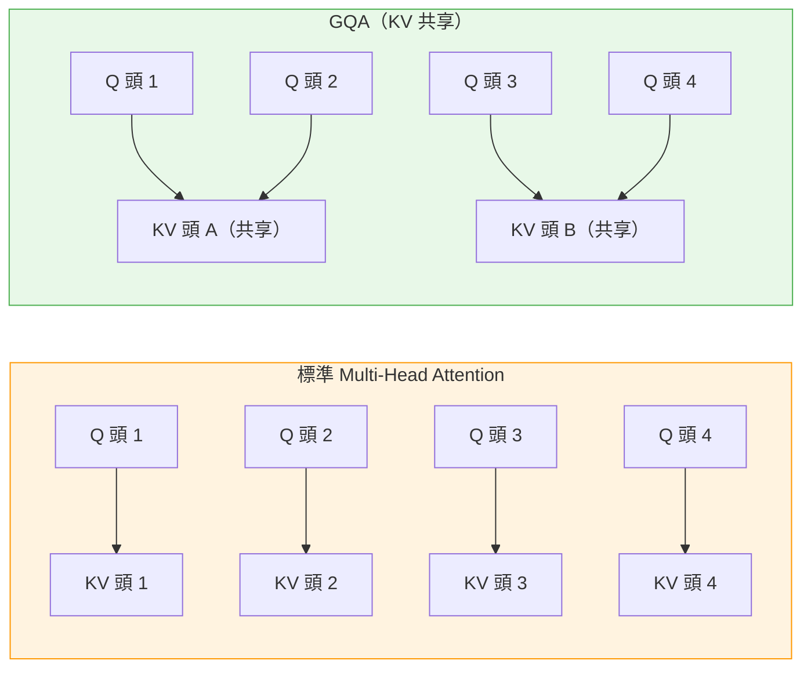

# LLM 長上下文效率架構：KV 共享、mHC 與壓縮注意力入門

> [!abstract] 一句話理解
> 這是一系列用來「讓 LLM 在超長上下文（100K+ tokens）下更省記憶體、更快推論」的架構技巧，特別之處在於它們通過共享、壓縮或分層分配注意力計算，讓模型在不犧牲能力的前提下大幅降低 KV 緩存的記憶體佔用。

## 🎯 為什麼重要

**它解決了什麼問題？**

標準 Transformer 的自注意力（self-attention）機制有一個根本性的計算複雜度問題：隨著輸入序列長度（context length）增加，計算量和記憶體需求以**二次方（O(n²)）**速度增長。

**舉個具體例子**：
- 1K tokens 的上下文 → 1M（百萬）個注意力運算
- 10K tokens 的上下文 → 100M（億）個注意力運算（**100 倍增加**）
- 100K tokens 的上下文 → 10B（百億）個注意力運算（**10,000 倍增加**）

在 2024 年之前，大多數應用的上下文在 4K-32K tokens 之間，這個問題勉強可以接受。但到了 2026 年：

**問題一：推理模型需要超長「思維鏈」**
Claude Opus 4.8、DeepSeek-R1 等推理模型在回答複雜問題時，需要在上下文中保留大量中間推理步驟（Chain-of-Thought），常態上下文超過 100K tokens。

**問題二：AI Agent 工作流程需要持久記憶**
長時間運作的 AI Agent 需要在整個任務期間（可能持續數小時）維持對話歷史和工具調用記錄，SubQ 等架構甚至支援 1,200 萬 tokens 的原生上下文。

**問題三：企業應用需要處理完整文件**
處理完整法律合約、財務報告、或掃描整個程式碼倉庫時，上下文需求可能達到數百萬 tokens。

KV 共享、mHC 和壓縮注意力正是為了解決這些「長上下文下的效率危機」而出現的架構創新。

## 🧠 入門解說（用類比理解）

**類比：辦公室的便利貼系統**

想像你在一個大型辦公室工作，每次有人跟你說話，你都需要把這段對話記在一張便利貼上，並貼在白板上，以便隨時查閱。

**標準 Transformer（原版）**：
- 每個人說的每句話，你為**每個記憶（注意力頭）**準備一套完整的便利貼
- 如果你有 8 個記憶系統（8 個注意力頭），每句話你寫 8 張不同的便利貼
- 對話越長，便利貼越多，最終白板塞滿了（記憶體耗盡），而且找便利貼也越來越慢

**KV 共享（GQA / Cross-layer Sharing）**：
- 你把 8 個記憶系統改成共享便利貼：3 套便利貼由 8 個記憶系統共用
- 白板使用量減少 60%，但找資料的速度幾乎沒有影響

**層級注意力預算**：
- 你發現：淺層記憶只需要記「最近說的話」，深層記憶才需要記「整個對話」
- 所以給淺層記憶一個「只看最近 1,000 字」的小白板，深層記憶才給大白板
- 大幅節省便利貼總量

**mHC（修改版超連接）**：
- 你在各層白板之間加了更智慧的連接線：每層都知道「我應該從上面哪些白板借來多少內容」
- 讓整個記憶網路更靈活，不再死板地只從上一層取信息

**壓縮注意力**：
- 對於「最近幾頁」以外的遠程記憶，你用一個壓縮摘要（而非原始便利貼）來替代
- 雖然細節少一點，但節省大量空間，而且遠程信息的摘要通常已經足夠

## 🔑 重點原理

1. **KV 緩存（KV Cache）是什麼**：在 Transformer 的推論過程中，每層注意力需要計算三個向量：查詢（Query, Q）、鍵（Key, K）、值（Value, V）。K 和 V 在生成每個新 token 時都需要用到之前所有 tokens 的結果，因此被快取（cache）起來避免重複計算。問題是 KV 緩存隨上下文長度線性增長，在超長上下文下可能佔用數十 GB 記憶體。

2. **KV 共享（KV Sharing / GQA）**：Grouped Query Attention（GQA）讓多個「查詢頭」共享少數幾個「KV 頭」。例如 8 個 Query 頭共享 2 個 KV 頭，KV 緩存大小降為原來的 1/4，而模型能力損失極小。Gemma 4 進一步探索了跨層 KV 共享（cross-layer sharing），讓相鄰層共用部分 KV 緩存，進一步壓縮記憶體。

3. **層級注意力預算（Layer-wise Attention Budgeting）**：並非每一層都需要「全域注意力」（關注輸入序列中所有位置）。Laguna XS.2 讓淺層只使用局部注意力（Sliding Window Attention，只看最近 N 個 token），深層才使用完整的全域注意力。每層的注意力「視窗大小」可以在訓練中學習，或根據層深度預先設定。

4. **壓縮捲積注意力（Compressed Convolutional Attention）**：ZAYA1-8B 的設計用捲積（convolution）替代部分注意力層。捲積的計算複雜度是 O(n)（線性），而不是注意力的 O(n²)（二次方）。捲積核在局部視窗內高效整合信息，與稀疏注意力或線性注意力結合，在超長序列下保持計算可行性。

5. **mHC（修改版超連接）**：傳統殘差連接（residual connection）讓每層的輸出直接加上輸入，形成：`輸出 = 新計算結果 + 上層輸入`。超連接（Hyper-Connection）改為：`輸出 = 新計算結果 × α + 上層輸入 × β`，其中 α 和 β 是可學習的參數，讓每層可以自適應地決定從上層繼承多少信息。mHC 進一步允許跨多層的動態連接，在 MoE（Mixture of Experts）架構中尤其有效。

6. **per-layer 嵌入（Per-layer Embeddings）**：在使用跨層 KV 共享時，不同層的語義含義不同（淺層處理語法，深層處理語意）。Per-layer 嵌入為每層的 KV 緩存加入層特有的位置信息（position-aware embedding），讓模型在共享 KV 的同時仍能分辨「這個緩存是來自哪一層的」。

## 📊 視覺化說明

### 標準 Transformer vs 現代長上下文架構對比

### 各技術特性比較表

| 技術 | 解決的問題 | 代表模型 | 記憶體節省 | 能力影響 |
|---|---|---|---|---|
| **GQA（KV 共享）** | KV 緩存過大 | Llama 3、Gemma 4 | 50-75% | 極小 |
| **跨層 KV 共享** | KV 緩存跨層冗餘 | Gemma 4 | 額外 10-30% | 小 |
| **層級注意力預算** | 所有層都做全局注意力的浪費 | Laguna XS.2 | 20-40% 計算 | 小 |
| **壓縮捲積注意力** | O(n²) 注意力複雜度 | ZAYA1-8B | 計算從 O(n²) 降至 O(n) | 中（局部信息犧牲）|
| **mHC** | 殘差連接不夠靈活 | DeepSeek V4 | 間接（更高效使用參數）| 提升性能 |
| **per-layer 嵌入** | 跨層 KV 共享的語意混淆 | Gemma 4 | 輔助性 | 提升精度 |

## 🔍 與既有技術的差異

**vs. Flash Attention（2022-2023 年的主流優化）**

Flash Attention 通過重新排列計算順序（tiling）和利用 GPU SRAM 快取，大幅降低了注意力的 IO 開銷，但計算複雜度仍是 O(n²)。KV 共享、壓縮注意力等技術則更進一步，改變了注意力的計算規模本身（O(n²) → O(n) 或 O(n² / k)）。

**vs. 線性注意力（Linear Attention）**

線性注意力通過核函數（kernel function）近似將複雜度降至 O(n)，但在長距離依賴捕獲上有所犧牲。ZAYA1-8B 的壓縮捲積注意力是線性注意力的一種現代實作，但結合了局部注意力窗口來保留短距離精度。

**vs. Mamba / SSM（State Space Models）**

Mamba 等狀態空間模型完全迴避了注意力機制，以遞迴結構（linear time complexity）替代，理論上是 O(n)。但在實際的「選擇性記憶」和特定推理任務上，混合架構（注意力 + SSM）往往比純 SSM 更強。

## 📚 關鍵詞對照表

| 中文 | 英文 | 簡短解釋 |
|---|---|---|
| KV 緩存 | KV Cache | 推論時儲存所有已生成 token 的 Key 和 Value 向量，避免重複計算的記憶體結構 |
| 分組查詢注意力 | GQA (Grouped Query Attention) | 讓多個 Query 頭共享少數 KV 頭，降低 KV 緩存大小的技術 |
| 滑動視窗注意力 | SWA (Sliding Window Attention) | 每個 token 只關注最近 W 個 token 的局部注意力模式 |
| 超連接 | Hyper-Connection | 殘差連接的強化版，加入可學習的動態權重控制信息傳遞比例 |
| 修改版超連接 | mHC (Modified Hyper-Connection) | DeepSeek V4 採用的超連接改進版，支援跨多層動態連接 |
| 壓縮注意力 | Compressed Attention | 用更低計算成本的方式（捲積、核函數）近似全注意力的技術 |
| 混合專家 | MoE (Mixture of Experts) | 每個 token 只激活部分「專家」網路的稀疏架構，降低計算量 |
| 旋轉位置嵌入 | RoPE (Rotary Position Embedding) | 主流的相對位置編碼方法，通過旋轉矩陣編碼相對位置信息 |

## 🛠️ 可能的應用場景

1. **法律文件全文分析**：用長上下文 LLM 分析整份合約（可能 50K+ tokens），找出條款衝突和風險點，而不必切割文件。
2. **大型程式碼庫理解**：讓 AI 在同一個上下文中「讀完」整個 GitHub 倉庫，提供跨文件的程式碼審查和重構建議。
3. **長期 AI Agent 任務**：讓 AI Agent 在跨越數小時的複雜任務中維持對整個任務歷史和中間結果的完整記憶。
4. **書籍或長篇報告摘要**：在單一推論呼叫中讀取完整書籍（100K-1M tokens），生成高質量摘要而非分段處理。
5. **多輪深度技術諮詢**：客戶服務或技術支援 Bot 記住整個客戶歷史（可能跨越數月），提供有上下文的個性化建議。

## 📖 學習路徑建議

1. **先讀**：理解標準 Transformer 的 Multi-Head Attention 機制，特別是 Q、K、V 的計算流程和 KV 緩存的概念（Andrej Karpathy 的「Let's build GPT」是最好的入門材料）
2. **再讀**：GQA（Grouped Query Attention）原始論文，理解 KV 共享如何在實作上降低緩存大小
3. **再讀**：本篇文章——從 GQA 到 mHC 的架構演進全景
4. **進階**：Flash Attention 原始論文，理解注意力計算的 IO 優化層次
5. **進階**：ZAYA1-8B 技術報告，深入了解壓縮捲積注意力的具體實作
6. **進階**：DeepSeek V4 技術報告，了解 mHC 在 MoE 架構中的完整應用

## 🔗 延伸閱讀
- 原文連結：[Sebastian Raschka - Recent LLM Architecture Developments](https://magazine.sebastianraschka.com/p/recent-developments-in-llm-architectures)
- 對應新聞筆記：[[2026-05-31-LLM架構演進KV共享mHC壓縮注意力技術解析]]
- 延伸：[Sebastian Raschka 的 LLM Architecture Gallery](https://sebastianraschka.com/llm-architecture-gallery/mla/)
- 延伸：[GQA 原始論文（Ainslie et al., 2023）](https://arxiv.org/abs/2305.13245)
- 延伸：[Flash Attention 官方實作](https://github.com/Dao-AILab/flash-attention)

---
*由 Claude 自動整理於 2026-05-31*
